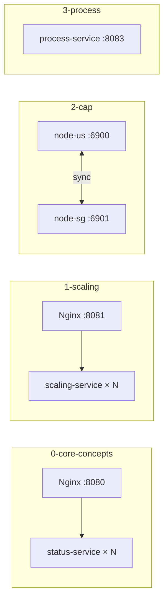

# Module 1 — Fundamentals of System Design

## Kiến trúc tổng quan (VI)

Module này xây dựng **nền tảng tư duy System Design** qua bốn lesson độc lập. Mỗi lesson có repo NestJS nhỏ + (khi cần) `compose.yaml` trong `.docker/`. Không có một hệ thống monolith xuyên suốt — học viên chạy từng stack để thấy một khái niệm cụ thể.

| Lesson | Repo path | Kiến trúc demo | Demo để làm gì |
|--------|-----------|----------------|----------------|
| `0-core-concepts-and-metrics` | `status-service` | Nginx LB → N replicas `status-service` (round-robin) | Chứng minh **horizontal scaling**: mỗi request trả `servedBy` = hostname container khác nhau khi `--scale status-service=5`. |
| `1-scaling-strategies` | `scaling-service` | Nginx LB → replicas + **giới hạn CPU/RAM** trong Compose (`deploy.resources`) | So sánh **vertical vs horizontal**: task CPU-heavy chạy chậm hơn khi giới hạn 0.5 CPU; scale replica để tăng throughput. |
| `2-cap-theorem-and-tradeoffs` | `cap-service` × 2 node (US / SG) | Hai “database node” đồng bộ qua HTTP nội bộ (`PEERS`) | Minh họa **CAP**: chế độ **CP** (partition → từ chối ghi) vs **AP** (`MODE=AP` → ghi local, sync nền). |
| `3-system-design-process` | `process-service` | Một API Node (mock pipeline) | Mô phỏng **quy trình thiết kế** URL shortener: clarify → estimate QPS/storage → high-level design → deep dive. |



### Cấu hình & code (áp dụng chung module)

- Mỗi service: `src/config/` (`app.config.ts` + domain), `.env` sẵn cạnh `package.json`, `ConfigModule` global.
- `.briefs/` trong từng service mirror `src/**` — mục đích **từng file**; tài liệu này mô tả **cả module**.

### Lệnh gợi ý

```bash
# Lesson 0 — scale workers
cd .repo/system-design-mastery-module-1-fundamentals-of-system-design/0-core-concepts-and-metrics/.docker
docker compose up -d --scale status-service=5

# Lesson 2 — AP mode
cd ../2-cap-theorem-and-tradeoffs/.docker
MODE=AP docker compose up -d
```

---

## Module overview (EN)

Module 1 builds **system design fundamentals** through four standalone lessons. Each lesson ships a small NestJS service and (where relevant) a `compose.yaml` under `.docker/`. There is no single monolithic system across lessons—learners run one stack at a time to isolate one idea.

| Lesson | Service | Architecture | Why the demo exists |
|--------|---------|--------------|---------------------|
| `0-core-concepts-and-metrics` | `status-service` | Nginx → N replicas | Shows **horizontal scaling** via different `servedBy` hostnames when scaling replicas. |
| `1-scaling-strategies` | `scaling-service` | Nginx → replicas with **CPU/RAM limits** | Contrasts **vertical limits** (slow CPU-heavy work) vs **horizontal scale** (more replicas). |
| `2-cap-theorem-and-tradeoffs` | `cap-service` (US + SG) | Two nodes syncing over HTTP | Demonstrates **CAP**: **CP** aborts writes on partition; **AP** writes locally with eventual sync. |
| `3-system-design-process` | `process-service` | Single API teaching pipeline | Walks through a **system design interview flow** for a URL shortener (requirements → estimates → HLD). |

Shared conventions: `src/config/`, committed `.env`, per-service `.briefs/` mirroring source files.
