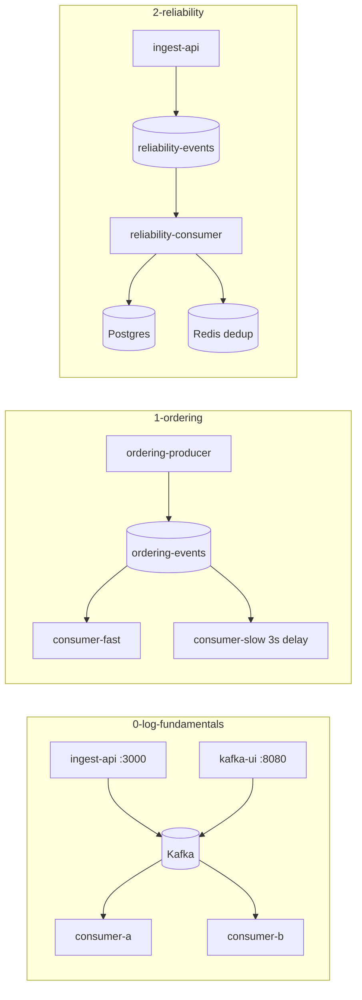

# Module 10 — Kafka Streaming & Reliability (Big Tech Patterns)

## Kiến trúc tổng quan (VI)

Module **không dùng WebSocket/chat**. Tập trung **Kafka-style log**: producer HTTP → topic phân vùng → consumer group, rồi ordering, lag, idempotent consumer + dedup.

**Repo:** `system-design-mastery-module-10-kafka-streaming-and-reliability`

| Lesson | Services | Kiến trúc demo | Demo để làm gì |
|--------|----------|----------------|----------------|
| `0-log-based-messaging-fundamentals` | `ingest-api`, `consumer-a`, `consumer-b` + Kafka + Kafka UI | Topic `platform-events`; cùng group `broker-lesson0-group` | Log bền vững; 2 consumer chia partition; xem offset/lag trên UI |
| `1-ordering-partitions-and-operations` | `ordering-producer`, `consumer-fast`, `consumer-slow` | Topic `ordering-events`; **bắt buộc `partitionKey`**; slow consumer delay 3s | Thứ tự trong partition; quan sát **lag** khi một consumer chậm |
| `2-reliability-replay-and-deduplication` | `ingest-api`, `reliability-consumer` + Postgres + Redis | Topic `reliability-events`; dedup `clientMessageId` (SETNX); sequence INCR | **Idempotent consumer**; retry khi `simulateFailure`; DLQ topic cấu hình sẵn |



### API gợi ý

```bash
# Lesson 0 / 1 — produce event
curl -X POST http://localhost:3000/events \
  -H "Content-Type: application/json" \
  -d '{"type":"demo","partitionKey":"user-1","payload":{"msg":"hi"}}'

# Lesson 2 — idempotent key
curl -X POST http://localhost:3000/events \
  -H "Content-Type: application/json" \
  -d '{"clientMessageId":"msg-uuid-1","type":"payment","payload":{}}'
```

### Cấu hình

- Mỗi service: `src/config/` (`app`, `kafka`) + `.env` (`KAFKA_BROKERS`, `KAFKA_TOPIC`, `KAFKA_GROUP_ID`, …).
- Compose: `lesson/.docker/compose.yaml` — network name = tên lesson folder.

### Lệnh chạy lab

```bash
cd .repo/system-design-mastery-module-10-kafka-streaming-and-reliability/0-log-based-messaging-fundamentals/.docker
docker compose up -d
# Kafka UI http://localhost:8080
```

---

## Module overview (EN)

Module 10 teaches **advanced log-based messaging** (Kafka patterns): not WebSockets.

| Lesson | Focus |
|--------|--------|
| `0-log-based-messaging-fundamentals` | Topics, partitions, consumer groups |
| `1-ordering-partitions-and-operations` | Partition keys, lag, slow consumer |
| `2-reliability-replay-and-deduplication` | Idempotent consumption, dedup, retries |

**Repo path:** `system-design-mastery-module-10-kafka-streaming-and-reliability`
