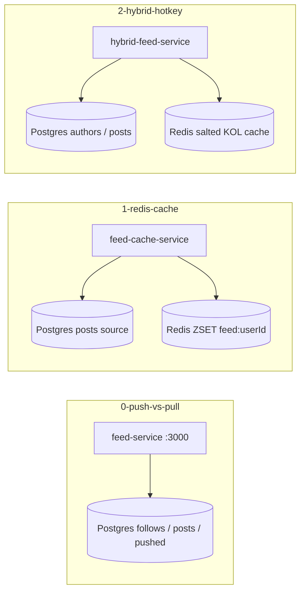

# Module 11 — News Feed: Fanout & Timeline Caching

## Kiến trúc tổng quan (VI)

Module mô phỏng **news feed / timeline**: từ **fanout-on-read vs fanout-on-write**, sang **cache timeline bằng Redis Sorted Set**, rồi **hybrid fanout** (user thường push, KOL pull) kèm **giảm hotkey** (key salting).

**Repo:** `system-design-mastery-module-11-news-feed-fanout-and-caching`

| Lesson | Service | Kiến trúc demo | Demo để làm gì |
|--------|---------|----------------|----------------|
| `0-push-vs-pull-models-fanout` | `feed-service` | **Postgres** follows + posts + `pushed_timeline`; seed `OnModuleInit` | So sánh **pull** (đọc lúc request, write rẻ) vs **push** (ghi sẵn timeline follower, read nhanh); `POST /post` mô phỏng fanout write. |
| `1-feed-caching-with-redis` | `feed-cache-service` | **Postgres** posts (source) → Redis **ZSET** `feed:{userId}` | Seed DB → `POST cache/seed` ZADD từ Postgres; `ZREVRANGE` đọc feed; trim ~500 — cache read path. |
| `2-hybrid-fanout-and-hotkey-mitigation` | `hybrid-feed-service` | **Postgres** authors/posts + Redis **key salting** | User thường → push từ DB; **KOL** → pull-at-read + salted cache tránh hotkey. |



### API gợi ý

**Lesson 0 — fanout**

```bash
# Pull model — aggregate posts từ authors đang follow lúc đọc
curl "http://localhost:3000/api/feed/pull?userId=usr_1"

# Push model — đọc timeline đã materialize sẵn
curl "http://localhost:3000/api/feed/push?userId=usr_1"

# Tạo post → fanout-on-write vào follower timelines
curl -X POST http://localhost:3000/api/feed/post \
  -H "Content-Type: application/json" \
  -d '{"authorId":"author_1","content":"Hello feed"}'
```

**Lesson 1 — Redis cache**

```bash
# Seed ZSET timeline (post_101..103 + scores)
curl -X POST "http://localhost:3000/api/feed/cache/seed?userId=usr_1"

# Đọc 20 post mới nhất từ cache
curl "http://localhost:3000/api/feed/cache?userId=usr_1"
```

**Lesson 2 — hybrid + hotkey**

```bash
# Timeline hybrid: push posts + merge KOL pull
curl "http://localhost:3000/api/feed/hybrid?userId=usr_1"

# Routing: author thường vs KOL (kol_1)
curl "http://localhost:3000/api/feed/hybrid/route?authorId=kol_1"
curl "http://localhost:3000/api/feed/hybrid/route?authorId=author_1"
```

### Luồng demo đáng chú ý

**Lesson 0** — Gọi `pull` và `push` cùng `userId` → so sánh `readCost` / `writeCost` trong JSON; tạo post mới → xem `fanoutWrites` tăng theo số follower trong demo graph (`author_1` → `usr_1`, `usr_2`).

**Lesson 1** — `seed` rồi `cache` → timeline trả về `redis-zset-feed-cache`, `readPattern` giải thích `ZREVRANGE`; có thể `redis-cli ZRANGE feed:usr_1 0 -1 WITHSCORES`.

**Lesson 2** — `hybrid/route?authorId=kol_1` → `pull-at-read-time`, `expectedWrites: 1`; `author_1` → `push-to-followers`. `hybrid?userId=usr_1` → `hotkeyMitigation.saltedKey` và lý do key salting trong response.

### Stack Docker (mỗi lesson)

| Lesson | Compose | Ghi chú |
|--------|---------|---------|
| 0 | `feed-service` + Postgres + Redis | **Postgres** graph demo + seed init; Redis trong stack lab |
| 1 | `feed-cache-service` + Postgres + Redis | **Postgres** nguồn post → **Redis** ZSET cache |
| 2 | `hybrid-feed-service` + Postgres + Redis | **Postgres** biz + **Redis** salting |

### Cấu hình dự kiến (khi duyệt brief → áp `coding-rules.md`)

- Mỗi service: `src/config/` (`app`, `database`, `redis`) + `.env` khớp `compose.yaml`.
- Biến lab: `PORT`, `POSTGRES_*`, `REDIS_*`; không `process.env` trong service (chuyển `registerAs` + `ConfigService`).
- `src/config/`, import barrel, JSDoc VI + `(EN:)`, `.briefs/` mirror `src/**`.
- Chạy: `node scratch/apply_coding_rules_system_design.mjs 11`

### Lệnh gợi ý

```bash
cd .repo/system-design-mastery-module-11-news-feed-fanout-and-caching/0-push-vs-pull-models-fanout/.docker
docker compose up -d
# API http://localhost:3000

cd ../../1-feed-caching-with-redis/.docker
docker compose up -d

cd ../../2-hybrid-fanout-and-hotkey-mitigation/.docker
docker compose up -d
```

---

## Module overview (EN)

Module 11 teaches **news feed** design: **fanout-on-read vs fanout-on-write**, **Redis Sorted Set timeline caching**, then **hybrid fanout** (regular users pushed, celebrities pulled) with **hotkey mitigation** via salted cache keys.

**Repo:** `system-design-mastery-module-11-news-feed-fanout-and-caching`

| Lesson | Service | Architecture | Why the demo exists |
|--------|---------|--------------|---------------------|
| `0-push-vs-pull-models-fanout` | feed-service | Postgres follow graph + materialized timelines | Compare pull (cheap write, heavier read) vs push (expensive write, fast read). |
| `1-feed-caching-with-redis` | feed-cache-service | Postgres source → Redis ZSET per user | Teach materialized timelines and newest-first reads with `ZREVRANGE`. |
| `2-hybrid-fanout-and-hotkey-mitigation` | hybrid-feed-service | Postgres authors/posts + salted Redis keys | Hybrid merge + KOL pull; avoid single hot Redis key on read. |

**Planned conventions (post-approval):** `src/config/`, committed `.env`, bilingual JSDoc, per-service `.briefs/` — same as modules 1–10 per `coding-rules.md`.

**Quick start:**

```bash
cd .repo/system-design-mastery-module-11-news-feed-fanout-and-caching/0-push-vs-pull-models-fanout/.docker
docker compose up -d
```
