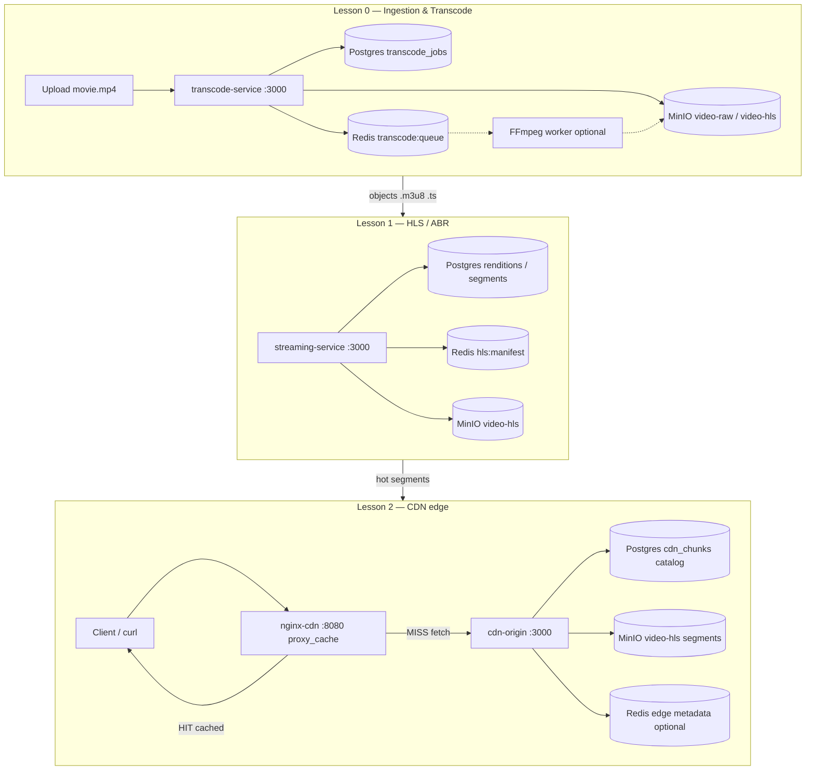

# Module 12 — Large-Scale Video Streaming Platform

## Kiến trúc tổng quan (VI)

Module dạy **pipeline video end-to-end**: upload/transcode → lưu segment trên **object storage (MinIO)** → phát **HLS/ABR** → phân phối qua **CDN edge (NGINX)** với origin shielding và HIT/MISS.

**Repo:** `system-design-mastery-module-12-large-scale-video-streaming-platform`

### Trạng thái triển khai

| Lesson | Stack trong repo | Ghi chú |
|--------|------------------|---------|
| 0 | Postgres + Redis + **MinIO** + **fluent-ffmpeg** / **ffmpeg-static** | Worker drain `transcode:queue` → HLS → upload `video-hls` |
| 1 | Postgres + Redis + **MinIO** | `index.m3u8` / `seg_001.ts` trả **bytes** từ MinIO |
| 2 | Postgres + **MinIO** + **NGINX** `:8080` | Origin `:3000` stream MinIO; edge **X-Cache** MISS/HIT qua NGINX |

Regenerate: `node scratch/apply_module_12_video_rules.mjs` rồi `node scratch/apply_module_12_phase2_minio_ffmpeg_nginx.mjs`

> MinIO Docker giống `.containers/minio.yaml` (fullstack): `quay.io/minio/minio`, `minioadmin` / `minioadmin123`, service `minio-init` (mc) seed bucket demo.

---

## Pipeline end-to-end (plan đầy đủ)



**Quy ước bucket MinIO (đề xuất thống nhất 3 lesson):**

| Bucket | Nội dung | Lesson dùng |
|--------|----------|-------------|
| `video-raw` | File gốc `movie.mp4` | 0 — ingest |
| `video-hls` | `movie/index.m3u8`, `movie/1080p/seg_001.ts`, … | 0 (output), 1, 2 |

---

## Plan chi tiết theo lesson (cho thầy)

### Lesson 0 — `0-video-ingestion-and-transcoding` / `transcode-service`

**Mục tiêu học**

- Transcode **ahead-of-time** (không on-demand lúc user bấm play).
- Tách **metadata job** (Postgres) khỏi **artifact** (MinIO).
- Queue worker qua Redis (chuẩn bị scale worker FFmpeg).

**Stack plan**

| Service | Port | Vai trò |
|---------|------|---------|
| `transcode-service` | 3000 | API tạo job, poll status |
| Postgres | 5432 | `transcode_jobs` — source of truth job |
| Redis | 6379 | `transcode:queue` — LPUSH job id |
| **MinIO** | 9000 (API), 9001 (console) | S3-compatible object storage |
| FFmpeg worker (optional) | — | Consume queue → ghi `video-hls` |

**Luồng demo (phase 2)**

1. `docker compose up` → seed `job_demo_movie` (Postgres) + object mẫu trên MinIO (script init bucket).
2. `POST /api/videos/transcode` → job mới + `LPUSH` queue + (plan) upload path `s3://video-raw/...`.
3. `GET /api/videos/transcode/:jobId` → status + `outputPrefix` trên MinIO (`video-hls/movie/`).
4. (Optional) Worker pop queue → cập nhật `status: completed` + list renditions trong response.

**API**

```bash
curl -X POST http://localhost:3000/api/videos/transcode \
  -H "Content-Type: application/json" \
  -d '{"videoKey":"movie.mp4"}'

curl http://localhost:3000/api/videos/transcode/job_demo_movie
```

**Điểm giảng**

- Vì sao không transcode khi user play? (CPU spike, latency).
- Postgres = **job ledger**; MinIO = **blob**; Redis = **hàng đợi** — database-per-concern trong một pipeline.

**Env bổ sung (plan):** `MINIO_ENDPOINT`, `MINIO_ACCESS_KEY`, `MINIO_SECRET_KEY`, `MINIO_BUCKET_RAW`, `MINIO_BUCKET_HLS`.

---

### Lesson 1 — `1-adaptive-bitrate-streaming-hls-dash` / `streaming-service`

**Mục tiêu học**

- Master playlist **ABR** (`EXT-X-STREAM-INF`) — client chọn bitrate.
- Manifest/segment lấy từ **object storage**, không build in-memory mỗi request.
- Cache manifest ngắn hạn (Redis) giảm đọc MinIO + DB.

**Stack plan**

| Service | Port | Vai trò |
|---------|------|---------|
| `streaming-service` | 3000 | Serve `/index.m3u8`, segment `.ts` |
| Postgres | 5432 | Catalog `video_renditions`, `video_segments` |
| Redis | 6379 | `hls:manifest:{videoId}` TTL ~300s |
| **MinIO** | 9000 | Đọc object `video-hls/{videoId}/...` |

**Luồng demo (phase 2)**

1. `GET .../index.m3u8` — lần 1: build từ DB + (plan) đọc template header từ MinIO hoặc generate + cache Redis; lần 2: `manifestSource: redis-cache`.
2. `GET .../seg_001.ts` — (plan) **stream bytes** từ MinIO `GetObject`, header `Content-Type: video/mp2t`; hiện tại có thể trả metadata JSON → thầy nói rõ đây là bước chuyển tiếp sang L2.
3. Giải thích: mỗi `.ts` là **một URL cacheable** — nền tảng cho CDN lesson 2.

**API**

```bash
curl http://localhost:3000/api/videos/stream/movie/index.m3u8
curl http://localhost:3000/api/videos/stream/movie/seg_001.ts
```

**Điểm giảng**

- HLS = nhiều HTTP GET nhỏ → CDN cache từng segment.
- Master playlist vs media playlist; mapping rendition DB → `BANDWIDTH` / `RESOLUTION`.

---

### Lesson 2 — `2-cdn-caching-and-edge-delivery` / `cdn-origin` + **NGINX**

**Mục tiêu học**

- **Edge** cache object HTTP (segment); **origin** = MinIO (+ catalog Postgres).
- **HIT/MISS** quan sát được trên client (`X-Cache`, status 200 từ cache).
- **Origin shielding**: nhiều request cùng chunk lạnh → (concept) collapse về một lần fetch origin; NGINX `proxy_cache_lock` (plan).

**Stack plan**

| Service | Port | Vai trò |
|---------|------|---------|
| **nginx-cdn** | **8080** | Edge: `proxy_cache`, `proxy_pass` → origin |
| `cdn-origin` | 3000 | Origin app: MISS → `GetObject` MinIO; trả body + headers |
| Postgres | 5432 | `cdn_chunks` — catalog hợp lệ (`videoId`, `chunkName`, `objectKey`) |
| Redis | 6379 | (Tuỳ chọn) mirror HIT/MISS cho lab API debug; hoặc bỏ khi NGINX đủ |
| **MinIO** | 9000 | Byte thật `video-hls/movie/chunk_1.ts` |

**Luồng demo (plan — thầy dùng cổng 8080)**

```text
curl :8080/...  →  NGINX edge
   ├─ HIT  → trả từ proxy_cache (không gọi cdn-origin)
   └─ MISS → proxy_pass cdn-origin:3000 → MinIO GetObject → cache → client

curl :3000/...  →  trực tiếp origin (bỏ qua edge — so sánh)
```

**API — qua NGINX edge (khuyến nghị lớp)**

```bash
# Lần 1 — MISS (upstream fetch + X-Cache: MISS)
curl -i http://localhost:8080/cdn/video/movie/chunk_1.ts

# Lần 2 — HIT (X-Cache: HIT)
curl -i http://localhost:8080/cdn/video/movie/chunk_1.ts

# Debug origin (không qua edge)
curl -i http://localhost:3000/api/cdn/video/movie/chunk_1.ts
curl http://localhost:3000/api/cdn/cache-status
```

**Cấu hình NGINX (sketch plan — file `.docker/nginx/nginx.conf`)**

- `proxy_cache_path` → volume `nginx_cache`
- `proxy_cache_valid 200 1h`
- `proxy_cache_lock on` — gợi ý origin shielding
- `add_header X-Cache $upstream_cache_status`
- `location /cdn/` → `proxy_pass http://api:3000/api/cdn/`

**Điểm giảng — trả lời “liên quan CDN thế nào?”**

| Khái niệm CDN | Trong lab |
|---------------|-----------|
| Edge POP | Container `nginx-cdn` |
| Origin | `cdn-origin` + **MinIO** |
| Cache key | URL path `/cdn/video/{id}/{chunk}` |
| HIT/MISS | Header `X-Cache` / `$upstream_cache_status` |
| Giảm tải origin | Lần 2+ không `GetObject` MinIO nếu NGINX HIT |
| Segment HLS | `chunk_1.ts` = một object cacheable (nối lesson 1) |

---

## Bảng tổng hợp lesson (đã implement)

| Lesson | Service | Kiến trúc mục tiêu | Demo để làm gì |
|--------|---------|---------------------|----------------|
| 0 | `transcode-service` | Postgres jobs + Redis queue + **MinIO** | Job + queue; output path trên bucket HLS |
| 1 | `streaming-service` | Postgres catalog + Redis manifest + **MinIO** | `index.m3u8` + segment bytes từ object storage |
| 2 | `cdn-origin` + **nginx-cdn** | **NGINX** edge cache + MinIO origin + Postgres catalog | `curl :8080` 2 lần → MISS/HIT; so sánh `:3000` origin |

---

## Stack Docker (plan)

| Lesson | Compose services | Ports host |
|--------|-------------------|------------|
| 0 | api, db, redis, **minio**, (worker) | 3000, 5432, 6379, **9000**, 9001 |
| 1 | api, db, redis, **minio** | 3000, 5432, 6379, **9000** |
| 2 | **nginx-cdn**, api, db, redis, **minio** | **8080**, 3000, 5432, 6379, **9000** |

**MinIO init (plan):** service `minio-init` hoặc entrypoint script tạo bucket + upload file demo `movie/chunk_1.ts`, `chunk_2.ts` (vài KB fake TS).

---

**Biến môi trường MinIO (đã có trong `.env` + compose):**

```env
MINIO_ENDPOINT=minio
MINIO_PORT=9000
MINIO_ACCESS_KEY=minioadmin
MINIO_SECRET_KEY=minioadmin
MINIO_BUCKET_HLS=video-hls
MINIO_USE_SSL=false
```

---

## Quy ước code (`coding-rules.md`)

- `src/config/`: `app`, `database`, `redis`, **`minio`** (plan) + barrel.
- Entity: `src/entities/postgresql/primary/`.
- Biz demo: Postgres seed `OnModuleInit` (§6.4); **byte video** trên MinIO, không `Map` in-memory.
- JSDoc VI + Logic/Code; `compose.yaml` comment song ngữ.
- Regenerate: `node scratch/apply_module_12_video_rules.mjs` + `node scratch/apply_module_12_phase2_minio_ffmpeg_nginx.mjs`

---

## Lệnh chạy lab

```bash
cd .repo/system-design-mastery-module-12-large-scale-video-streaming-platform/0-video-ingestion-and-transcoding/.docker
docker compose up -d --build

cd ../../1-adaptive-bitrate-streaming-hls-dash/.docker
docker compose up -d --build

cd ../../2-cdn-caching-and-edge-delivery/.docker
docker compose up -d --build

# CDN edge — NGINX HIT/MISS
curl -i http://localhost:8080/cdn/video/movie/chunk_1.ts
curl -i http://localhost:8080/cdn/video/movie/chunk_1.ts

# Transcode (lesson 0) — poll GET job sau ~2–10s
curl -X POST http://localhost:3000/api/videos/transcode \
  -H "Content-Type: application/json" \
  -d '{"videoKey":"movie.mp4"}'
```

---

## Câu hỏi phỏng vấn (gợi ý theo lesson)

| Lesson | Câu hỏi | Ý chính |
|--------|---------|---------|
| 0 | Vì sao tách job DB và object storage? | ACID metadata vs blob scale; independent scaling |
| 0 | FFmpeg chạy đâu? | Worker async, không block API |
| 1 | ABR hoạt động thế nào? | Client đọc master → chọn variant → tải segment |
| 1 | Cache manifest ở Redis? | Giảm latency playlist; segment vẫn cache CDN |
| 2 | Edge vs Origin? | NGINX gần user; MinIO + origin app xa user |
| 2 | Origin shielding? | `proxy_cache_lock` / collapse concurrent MISS |
| 2 | Redis vs NGINX cache? | Redis lab = 1 POP logic; NGINX = HTTP cache thật |

---

## Module overview (EN)

Module 12 teaches an **end-to-end video pipeline**: offline **transcoding** with artifacts in **MinIO**, **HLS/ABR** serving from object storage, and **CDN edge delivery** via **NGINX** (`proxy_cache`) in front of an **origin** service that reads segments from MinIO.

**Repo:** `system-design-mastery-module-12-large-scale-video-streaming-platform`

**Implementation status:** MinIO (Docker + mc init), fluent-ffmpeg/ffmpeg-static (lesson 0), NGINX edge (lesson 2) are in repo.

| Lesson | Target architecture | Teaching goal |
|--------|---------------------|---------------|
| 0 | Postgres jobs + Redis queue + MinIO | Ahead-of-time transcoding; blobs vs metadata |
| 1 | Postgres catalog + Redis manifest cache + MinIO | HLS master playlist and segment objects |
| 2 | NGINX edge + origin service + MinIO + Postgres catalog | Real HTTP HIT/MISS and origin shielding |

**Quick start (phase 1):**

```bash
cd .repo/system-design-mastery-module-12-large-scale-video-streaming-platform/0-video-ingestion-and-transcoding/.docker
docker compose up -d
```
