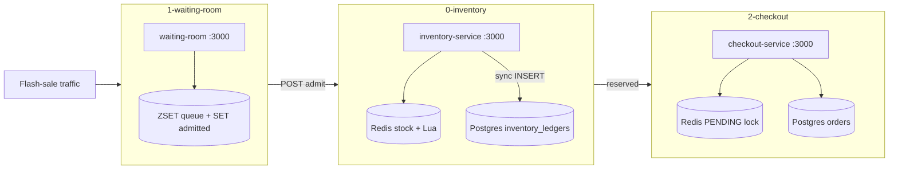

# Module 13 — Flash Sale at Scale: Inventory, Queues & Idempotent Checkout


## Kiến trúc tổng quan (VI)


Module mô phỏng **flash sale** theo ba lớp: **trừ kho nguyên tử Redis (Lua)** → **INSERT ledger Postgres đồng bộ** (không worker/Kafka), **phòng chờ ảo (ZSET + admit thủ công)**, **checkout idempotent** (`PENDING` lock Redis + orders ACID).


**Repo:** `system-design-mastery-module-13-flash-sale-at-scale`


| Lesson | Service | Kiến trúc demo | Demo để làm gì |

|--------|---------|----------------|----------------|

| `0-high-concurrency-inventory-management` | `inventory-service` | **Redis** `stock:{sku}` + Lua; **Postgres** `inventory_items` (seed) + `inventory_ledgers` | `POST decrement/redis` → Lua OK → INSERT ledger; `decrement/db` so sánh lock chậm; `GET stock/:sku` Redis vs ledger. |

| `1-virtual-waiting-room-and-queuing` | `waiting-room` | **ZSET** `waitingroom:queue` + **SET** `waitingroom:admitted` (TTL 5 phút) | `GET token` / `position` / `status`; `POST admit` bốc top N ra khỏi queue → admitted. |

| `2-idempotency-and-concurrency-control` | `checkout-service` | **Redis** `idempotency:{key}` — `PENDING` (NX, 30s) rồi kết quả; **Postgres** `orders` | Double-click nhanh → 409 "đang xử lý"; retry sau khi xong → cùng `orderId`. |





### API gợi ý


**Lesson 0 — inventory**


```bash

curl -X POST http://localhost:3000/api/inventory/decrement/redis \

  -H "Content-Type: application/json" \

  -d '{"productSku":"IPHONE15","quantity":1}'


curl -X POST http://localhost:3000/api/inventory/decrement/db \

  -H "Content-Type: application/json" \

  -d '{"productSku":"IPHONE15","quantity":1}'


curl http://localhost:3000/api/inventory/stock/IPHONE15

```


**Lesson 1 — waiting room**


```bash

curl "http://localhost:3000/api/waitingroom/token?userId=usr_a"

curl "http://localhost:3000/api/waitingroom/status?userId=usr_a"


# Giảng viên "xả hàng đợi" — admit 50 user đầu hàng

curl -X POST http://localhost:3000/api/waitingroom/admit \

  -H "Content-Type: application/json" \

  -d '{"count":50}'


# Admit 1 user (demo 2 tab: usr_a vào, usr_b vẫn waiting)

curl -X POST http://localhost:3000/api/waitingroom/admit \

  -H "Content-Type: application/json" \

  -d '{"count":1}'

```


**Lesson 2 — checkout**


```bash

curl -X POST http://localhost:3000/api/checkout/order \

  -H "Content-Type: application/json" \

  -H "Idempotency-Key: key_test_100" \

  -d '{"userId":"usr_99","productSku":"IPHONE15","quantity":1}'


# Gửi lại ngay khi request 1 còn PENDING → 409

# Gửi lại sau khi xong → duplicate: true, cùng orderId

```


### Luồng demo đáng chú ý


**Lesson 0 — Redis chặn, DB ghi ledger đồng bộ**


1. Seed `IPHONE15` stock 100 trên Redis; `inventory_items` giữ baseline.

2. `decrement/redis` thành công → `remaining` giảm; **INSERT** `inventory_ledgers` (`quantity_changed: -1`) ngay trong request (không worker).

3. Hết hàng → `soldOut: true` từ Lua (`remaining < 0`) — Postgres không nhận flood trừ kho thừa.

4. `decrement/db` — pessimistic lock, so sánh áp lực pool.

5. `GET stock/:sku` — `redisStock` vs `ledgerRowCount` / `ledgerNetChange`.


**Lesson 1 — Admit thủ công**


1. Bơm nhiều user (`token`) → `status` = `waiting`.

2. `POST admit` `{"count":1}` → user đầu hàng: `admitted` + `checkoutToken`; user thứ hai vẫn `waiting`.

3. `POST admit` `{"count":50}` — batch admit cho lớp.


**Lesson 2 — PENDING chống double-click**


1. Request 1: `SET idempotency:key PENDING NX EX 30` → xử lý đơn (~1.5s demo delay) → ghi kết quả JSON.

2. Request 2 song song: key đã `PENDING` → **409** `"Đơn hàng của bạn đang được xử lý..."`.

3. Request 2 sau khi xong → `duplicate: true`, cùng `orderId`.


### Stack Docker (mỗi lesson)


| Lesson | Compose | Ghi chú |

|--------|---------|---------|

| 0 | `api` + Postgres + Redis | DB `inventory_service` |

| 1 | `api` + Redis | Không Postgres |

| 2 | `api` + Postgres + Redis | DB `checkout_service` |


### Quy ước code (`coding-rules.md`)


- `src/config/`: `app`, `database` (nếu có PG), `redis` + barrel.

- Entity: `src/entities/postgresql/primary/`.

- Biz demo: Postgres seed `OnModuleInit` (lesson 0); JSDoc VI + Logic/Code.

- Regenerate: `node scratch/apply_module_13_flash_sale_rules.mjs`


### Lệnh chạy lab


```bash

cd .repo/system-design-mastery-module-13-flash-sale-at-scale/0-high-concurrency-inventory-management/.docker

docker compose up -d --build


cd ../../1-virtual-waiting-room-and-queuing/.docker

docker compose up -d --build


cd ../../2-idempotency-and-concurrency-control/.docker

docker compose up -d --build

```


---


## Module overview (EN)


Module 13 teaches **flash sale at scale**: **Redis Lua pre-decrement** with **synchronous Postgres ledger inserts**, a **virtual waiting room** with **manual batch admit**, and **idempotent checkout** using a **PENDING** Redis lock before persisting orders.


**Repo:** `system-design-mastery-module-13-flash-sale-at-scale`


| Lesson | Service | Architecture | Why the demo exists |

|--------|---------|--------------|---------------------|

| `0-high-concurrency-inventory-management` | inventory-service | Redis Lua + `inventory_ledgers` sync INSERT | Fast gate at Redis; durable audit per sale without async workers. |

| `1-virtual-waiting-room-and-queuing` | waiting-room | ZSET queue + SET admitted (TTL) | Visualize controlled admission via `POST admit`. |

| `2-idempotency-and-concurrency-control` | checkout-service | Redis PENDING NX + Postgres orders | Block parallel double-clicks; safe retries after completion. |


**Quick start:**


```bash

cd .repo/system-design-mastery-module-13-flash-sale-at-scale/0-high-concurrency-inventory-management/.docker

docker compose up -d --build

```

