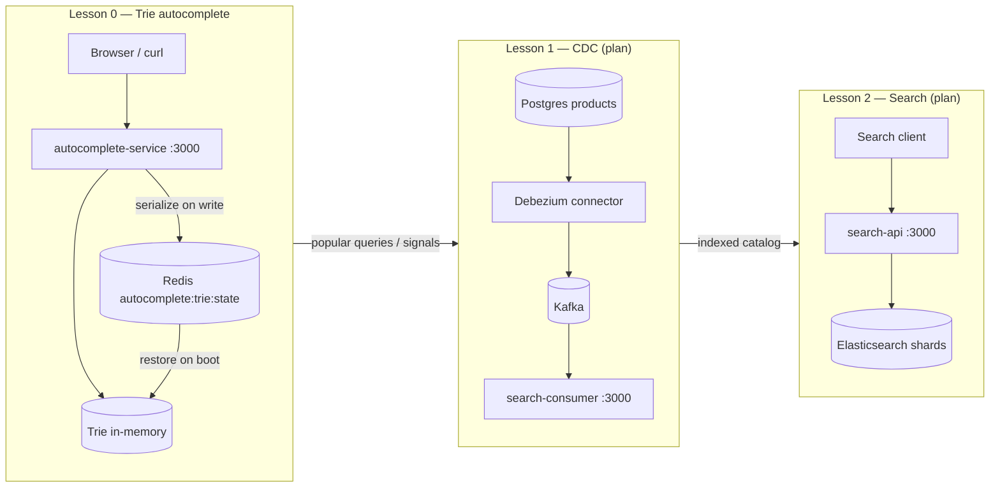

# Module 15 — Distributed Search & Autocomplete System

## Kiến trúc tổng quan (VI)

Module dạy **pipeline tìm kiếm gợi ý → đồng bộ catalog → full-text search phân tán**: **Trie in-memory** (prefix + tần suất) → **CDC Debezium** (OLTP → search index) → **query đa shard + relevance** (Elasticsearch / mock shard).

**Repo (thư mục):** `system-design-mastery-module-15-distributed-search-and-autocomplete`  
**Số module khóa học:** 14 (`14-distributed-search-autocomplete-system` trong `scratch/generate_all.js`) — tên folder repo dùng prefix `module-15-` (lệch 1 so với idx curriculum, giống module 13).

### Trạng thái triển khai trong repo

| Lesson | Thư mục | Service | Trong repo hiện tại |
|--------|---------|---------|---------------------|
| 0 | `0-trie-data-structure-for-autocomplete` | `autocomplete-service` | **Có** — Trie + Redis `autocomplete:trie:state` |
| 1 | `1-change-data-capture-cdc-with-debezium` | `search-consumer` | **Có** — `GET /api/cdc/events` + Postgres trong compose |
| 2 | `2-distributed-search-sharding-relevance` | `search-api` | **Có** — `GET /api/search?q=` mock 3 shard |

Regenerate toàn module: `node scratch/apply_module_15_search_rules.mjs`

---

## Pipeline end-to-end (cho thầy)



**Thông điệp lớp:** Lesson 0 giải quyết **latency từng keystroke** (không `LIKE %term%` trên Postgres). Lesson 1 giải quyết **drift** giữa DB và search index (CDC thay dual-write). Lesson 2 giải quyết **scale đọc** và **xếp hạng** trên corpus lớn.

---

## Lesson 0 — `0-trie-data-structure-for-autocomplete` / `autocomplete-service`

**Mục tiêu học**

- Vì sao autocomplete cần **prefix structure** (Trie), không quét full table.
- **Ranking** theo tần suất (`frequency`) khi user gõ và khi `POST search` ghi nhận query mới.
- **Persistence nhẹ**: serialize cả cây Trie vào Redis key `autocomplete:trie:state` (fallback in-memory nếu Redis lỗi).

**Stack**

| Service | Port | Vai trò |
|---------|------|---------|
| `autocomplete-service` | 3000 | API `suggest` + `recordSearch` |
| `redis` | 6379 | Lưu JSON Trie sau mỗi lần ghi |

**API thực tế (khớp code)**

| Method | Path | Mô tả |
|--------|------|--------|
| `GET` | `/api/autocomplete/suggest?prefix=app&limit=5` | Gợi ý theo prefix, sort `frequency` giảm dần |
| `POST` | `/api/autocomplete/search` | Body `{ "query": "nestjs" }` — insert/increment Trie + persist Redis |

**Seed mặc định** (khi Redis trống): `apple`, `application`, `app store`, `app`, `banana`, `bandwidth` với frequency khác nhau.

**Luồng demo trên lớp**

1. `docker compose up -d --build` trong `0-trie-data-structure-for-autocomplete/.docker`.
2. `GET suggest?prefix=app` → thấy `application` (15) trước `apple` (10) — **ranking by frequency**.
3. `POST search` `{ "query": "nestjs" }` → log Trie updated.
4. `GET suggest?prefix=nest` → có `nestjs`.
5. `docker compose restart autocomplete-service` → gợi ý vẫn còn (**restore từ Redis**).
6. (Tuỳ chọn) Tắt Redis → service seed lại in-memory, giải thích degraded mode.

**Điểm code nên mở khi giảng**

- `src/autocomplete/trie.ts` — `insert`, `suggest` (DFS + sort), `serialize` / `deserialize`.
- `src/autocomplete/autocomplete.service.ts` — `loadStateFromRedis`, `persistState`, `recordSearch`.

**Curl gợi ý**

```bash
cd .repo/system-design-mastery-module-15-distributed-search-and-autocomplete/0-trie-data-structure-for-autocomplete/.docker
docker compose up -d --build

curl "http://localhost:3000/api/autocomplete/suggest?prefix=app&limit=5"

curl -X POST http://localhost:3000/api/autocomplete/search \
  -H "Content-Type: application/json" \
  -d '{"query":"nestjs"}'

curl "http://localhost:3000/api/autocomplete/suggest?prefix=nest&limit=5"
```

**Câu hỏi phỏng vấn (từ curriculum)**

- Vì sao `LIKE '%term%'` tệ cho autocomplete? → Full scan, không tận dụng prefix, không scale keystroke traffic.
- Redis ở đây không thay Trie từng node — mà **snapshot** cả cây; production có thể shard Trie hoặc cache prefix hot.

> **Ghi chú compose:** file hiện dùng `build:` local và tên container `starci-*`; khi publish lab có thể chuẩn hoá theo `.cursor/rules/system-design-lesson-docker-naming.mdc` (`0-trie-data-structure-for-autocomplete-api`, image `starciacademy/...`).

---

## Lesson 1 — `1-change-data-capture-cdc-with-debezium` / `search-consumer`

**Mục tiêu học**

- **CDC**: đọc WAL Postgres → stream thay đổi (`c`/`u`/`d`) sang hàng đợi sự kiện.
- Tránh **dual-write** app → Postgres + ES (không atomic).
- Consumer `search-indexer` cập nhật search index **eventual consistent**.

**Stack plan**

| Service | Port | Vai trò |
|---------|------|---------|
| `search-consumer` | 3000 | API/lab xem snapshot event đã index |
| Postgres | 5432 | Nguồn thay đổi `products` |
| Kafka | 9092 | Bus CDC |
| Debezium | — | Connector `debezium-postgres-demo` |

**API**

```bash
cd .repo/system-design-mastery-module-15-distributed-search-and-autocomplete/1-change-data-capture-cdc-with-debezium/.docker
docker compose up -d --build

curl http://localhost:3000/api/cdc/events
```

Response: `connector`, `consumerGroup: search-indexer`, `lag`, `pipeline`, `events[]` (`table`, `op`, `key`, `indexed`).

**Luồng demo**

1. Giải thích diagram: transaction commit trên Postgres → Debezium → Kafka topic → consumer → index.
2. Gọi `GET /api/cdc/events` để học viên thấy **shape event** trước khi cắm ES thật.
3. So sánh với lesson 0: Trie nhận **query signals**; CDC nhận **catalog mutations**.

---

## Lesson 2 — `2-distributed-search-sharding-relevance` / `search-api`

**Mục tiêu học**

- **Sharding**: chia index `products-0`, `products-1`, …
- **Coordinate node** gom hit từ nhiều shard, sort theo **relevance** (BM25 / TF-IDF — giải thích khái niệm).
- API trả `tookMs`, `shards.total`, `hits[]` với `score`.

**Stack plan**

| Service | Port | Vai trò |
|---------|------|---------|
| `search-api` | 3000 | `GET /api/search?q=...` |
| Elasticsearch | 9200 | Cluster demo (hoặc mock trong service) |

**API**

```bash
cd .repo/system-design-mastery-module-15-distributed-search-and-autocomplete/2-distributed-search-sharding-relevance/.docker
docker compose up -d --build

curl "http://localhost:3000/api/search?q=laptop"
```

Response: `query`, `tookMs`, `shards`, `relevance: bm25-demo`, `hits[]` sort `score` desc.

**Luồng demo**

1. `q=laptop` → 3 document trên 3 shard, thứ tự theo `score`.
2. Giải thích broadcast query → merge top-K (không cần ES cluster đầy đủ nếu lab dùng mock).
3. Liên kết lesson 1: index đã được CDC feed mới có corpus để search.

---


## Quy ước code (`coding-rules.md`)

- NestJS + JSDoc song ngữ VI / EN trên service hiện có.
- Lesson 0: không Postgres; Redis optional với graceful fallback.
- Lesson 1–2 (khi generate): `src/config/` barrel, feature module theo pattern module 13.

---

## Module overview (EN)

Module 14 teaches a **search pipeline**: **in-memory Trie autocomplete** with Redis snapshot persistence, **CDC from Postgres via Debezium/Kafka** into a search indexer, and **sharded full-text search** with relevance-ranked hits.

**Repo folder:** `system-design-mastery-module-15-distributed-search-and-autocomplete` (course index **14**).

| Lesson | Service | Status | Teaching focus |
|--------|---------|--------|----------------|
| 0 | autocomplete-service | Implemented | Prefix Trie, frequency ranking, Redis state |
| 1 | search-consumer | Implemented | CDC event snapshot, Postgres in compose |
| 2 | search-api | Implemented | Multi-shard query + relevance scores |

**Quick start:**

```bash
cd .repo/system-design-mastery-module-15-distributed-search-and-autocomplete/0-trie-data-structure-for-autocomplete/.docker
docker compose up -d --build
curl "http://localhost:3000/api/autocomplete/suggest?prefix=app&limit=5"
```
