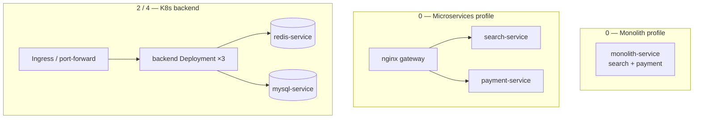

# Module 2 — Microservices & Kubernetes Fundamentals

## Kiến trúc tổng quan (VI)

Module chuyển từ **kiến trúc ứng dụng** (monolith vs microservices) sang **vận hành trên Kubernetes**: Pod, Service, Deployment, DNS nội cluster, Cache-Aside với Redis/MySQL, và triển khai trên cloud.

| Lesson | Repo / artifact | Kiến trúc demo | Demo để làm gì |
|--------|-----------------|----------------|----------------|
| `0-monolith-vs-microservices` | `monolith-service`, `search-service`, `payment-service` + gateway Nginx | **Profile monolith**: một container phục vụ `/api/search` + `/api/payment`. **Profile microservices**: gateway → 2 service tách biệt | So sánh **coupling / deploy / scale** khi gộp vs tách domain. |
| `1-introduction-to-kubernetes` | `status-service` + manifest K8s | Deployment replicas + `Service` ClusterIP; client gọi qua Service DNS | Học **Pod identity**: `servedBy` = tên Pod → kiểm tra load balancing giữa replica. |
| `2-kubernetes-core-concepts` | `backend` + `.kubernetes/*.yaml` | 3× `backend` Pod, `mysql-service`, `redis-service`; Cache-Aside | Thực hành **Deployment/Service**, **retry khi DB chưa sẵn sàng**, **cache hit/miss** và `podName` trên response. |
| `3-complex-applications-and-helm-charts` | Helm charts / manifests (lesson infra) | Chart tổng hợp nhiều workload | Giới thiệu **đóng gói & cài đặt** ứng dụng phức tạp bằng Helm (values, release) — không có Nest demo service riêng. |
| `4-kubernetes-on-cloud` | `backend` (cùng pattern lesson 2) | Giống 2 nhưng hướng **cloud provider** (image/manifest cho cluster managed) | Củng cố pattern K8s trước khi deploy lên cloud thật. |



### Backend K8s (lesson 2 & 4) — luồng demo

1. **Khởi động**: `onModuleInit` retry kết nối Redis/MySQL (race condition khi Pod lên trước DB).
2. **GET /items**: đọc cache `items_list` → miss thì MySQL → ghi cache TTL 60s; response có `source: cache|database` và `podName`.
3. **POST /items**: insert MySQL + invalidate cache.
4. **GET /health**: trạng thái kết nối + `podName` (từ `HOSTNAME` / `.env` local).

Cấu hình: `.env` khớp `.kubernetes/` (`mysql-service`, `redis-service`, `MYSQL_PASSWORD=password`, …). Logic đọc env **chỉ** qua `src/config/*.config.ts` + `ConfigService`.

### Cấu hình & code

- Lesson 0–1: chủ yếu `PORT` trong `.env`.
- Lesson 2 & 4: `app`, `database`, `redis` config; types trong `src/types/item.ts`.
- `.briefs/` per service = mục đích từng file; **file này** = map kiến trúc cả module.

### Lệnh gợi ý

```bash
# Monolith
cd .repo/system-design-mastery-module-2-microservices-kubernetes-fundamentals/0-monolith-vs-microservices/.docker
docker compose --profile monolith up -d

# Microservices
docker compose --profile microservices up -d

# K8s lesson 2 (sau khi apply manifest)
kubectl apply -f .repo/.../2-kubernetes-core-concepts/.kubernetes/
```

---

## Module overview (EN)

Module 2 moves from **application architecture** (monolith vs microservices) to **running on Kubernetes**: Pods, Services, Deployments, in-cluster DNS, Cache-Aside with Redis/MySQL, and cloud-oriented deployment.

| Lesson | Artifacts | Architecture | Purpose of the demo |
|--------|-----------|--------------|---------------------|
| `0-monolith-vs-microservices` | 3 Nest services + Nginx gateway | Monolith profile: one app serves search + payment routes. Microservices profile: gateway routes to split services | Compare **deployment independence** and **domain boundaries**. |
| `1-introduction-to-kubernetes` | `status-service` + K8s YAML | Replicated Deployment behind a Service | Prove **per-Pod identity** and **Service-level load balancing** via `servedBy`. |
| `2-kubernetes-core-concepts` | `backend` + `.kubernetes/` | 3 backend Pods, MySQL & Redis Services, Cache-Aside | Practice **K8s primitives**, **startup retries**, and **cache-aside** observability (`source`, `podName`). |
| `3-complex-applications-and-helm-charts` | Helm charts / infra lesson | Packaged multi-component release | Teach **Helm** as the packaging layer above raw YAML (no separate Nest demo service). |
| `4-kubernetes-on-cloud` | Same backend pattern as lesson 2 | Cloud-focused deployment path | Reinforce K8s patterns before a managed cluster. |

K8s backends load config from committed `.env` aligned with manifests; services use `ConfigService` only (no scattered `process.env` in business code).
