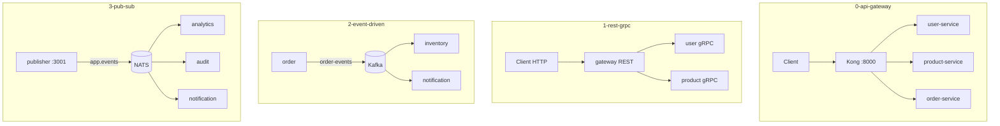

# Module 3 — Communication Patterns

## Kiến trúc tổng quan (VI)

Module tập trung **cách các microservice nói chuyện với nhau**: đồng bộ qua gateway/REST/gRPC, bất đồng bộ qua message broker (Kafka, NATS). Mỗi lesson là một stack Compose độc lập; học viên quan sát **luồng request/event** qua log và UI broker (Kafka UI, Kong Admin, NATS monitoring).

| Lesson | Services | Kiến trúc demo | Demo để làm gì |
|--------|----------|----------------|----------------|
| `0-api-gateway` | `user-service`, `product-service`, `order-service` + **Kong** + Postgres (Kong DB) | Client → Kong `:8000` → route tới từng backend Nest | Học **API Gateway**: một cổng vào, routing, tách client khỏi địa chỉ service nội bộ. |
| `1-synchronous-communication-rest-grpc` | `gateway` (REST), `user-service`, `product-service` (gRPC) | Client HTTP → gateway → gRPC nội bộ (`USER_GRPC_URL`, `PRODUCT_GRPC_URL`) | So sánh **REST ở edge** với **gRPC giữa service** (hiệu năng, contract protobuf). |
| `2-asynchronous-event-driven` | `order` (producer), `inventory`, `notification` (consumers) + **Kafka** KRaft + Kafka UI | `order` emit topic `order-events` → consumer xử lý song song | Minh họa **event-driven**: tách thời gian, giảm coupling; order không gọi trực tiếp inventory. |
| `3-publish-subscribe-pattern` | `publisher-service` + 3 subscriber (`analytics`, `audit`, `notification`) + **NATS** | `POST /publish` → NATS subject `app.events` → mọi subscriber nhận cùng event | So với Kafka lesson 2: **pub/sub fan-out** một phát nhiều nhận, fire-and-forget, đổi vai trò subscriber dễ. |



### Cấu hình & code

- Mỗi Nest service: `src/config/` + `.env` (ví dụ `NATS_URL`, `KAFKA_BROKER`, `PORT`, `USER_GRPC_URL`).
- Lesson 2–3 dùng `@nestjs/microservices` (`ClientKafka` / `ClientProxy` NATS).
- `.briefs/` trong từng service mirror `src/**`; file này mô tả **cả module**.

### Lệnh gợi ý

```bash
# API Gateway (Kong)
cd .repo/system-design-mastery-module-3-communication-patterns/0-api-gateway/.docker
docker compose up -d --build

# Pub/Sub NATS
cd ../3-publish-subscribe-pattern/.docker
docker compose up -d
docker compose logs -f subscriber-audit subscriber-analytics
```

---

## Module overview (EN)

Module 3 covers **inter-service communication**: synchronous (gateway, REST, gRPC) and asynchronous (Kafka, NATS). Each lesson is an isolated Compose stack—learners trace requests/events via logs and broker UIs.

| Lesson | Stack | Architecture | Why the demo exists |
|--------|-------|--------------|---------------------|
| `0-api-gateway` | Kong + 3 Nest backends | Single entry point → routed upstreams | Teach **API Gateway** patterns (routing, decoupling clients). |
| `1-synchronous-communication-rest-grpc` | REST gateway + gRPC services | HTTP edge, gRPC internally | Contrast **public REST** vs **internal gRPC** contracts. |
| `2-asynchronous-event-driven` | Kafka + order/inventory/notification | Producer topic `order-events`, multiple consumers | Show **event-driven decoupling** and parallel consumption. |
| `3-publish-subscribe-pattern` | NATS + 1 publisher, 3 subscribers | `app.events` broadcast | Demonstrate **pub/sub fan-out** and multiple independent reactions. |

Conventions: `src/config/`, committed `.env`, per-service `.briefs/` for file-level intent.
