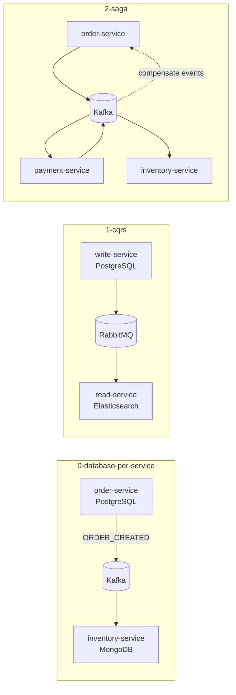

# Module 4 — Data & Consistency in Microservices

## Kiến trúc tổng quan (VI)

Module xử lý **dữ liệu phân tán**: mỗi service sở hữu DB riêng, đồng bộ qua event; sau đó nâng lên **CQRS** (tách read/write model) và **Saga** (chuỗi transaction phân tán + bù trừ khi lỗi). Các lesson dùng Kafka hoặc RabbitMQ làm “xương sống” event.

| Lesson | Services | Kiến trúc demo | Demo để làm gì |
|--------|----------|----------------|----------------|
| `0-database-per-service` | `order-service` (PostgreSQL + TypeORM), `inventory-service` (MongoDB + Mongoose) + **Kafka** | Order lưu PG → emit `ORDER_CREATED` / `order-events` → Inventory consumer cập nhật stock Mongo | Chứng minh **không share DB**: schema và công nghệ DB khác nhau; chỉ đồng bộ qua event. |
| `1-cqrs-pattern` | `write-service` (PostgreSQL write model), `read-service` (Elasticsearch read model) + **RabbitMQ** | Ghi command vào PG → publish event → read service index ES → API đọc từ ES | Học **CQRS**: tối ưu write path và read path riêng; eventual consistency giữa hai model. |
| `2-saga-pattern` | `order-service`, `payment-service`, `inventory-service` + **Kafka** | Choreography: `ORDER_CREATED` → payment → inventory; event lỗi kích hoạt **compensating** (rollback trạng thái) | Minh họa **distributed transaction** không dùng 2PC: chuỗi bước + bù trừ khi một bước fail. |



### Luồng demo đáng chú ý

**Lesson 0 — Database per service**

1. Tạo order qua API `order-service` → row trong PostgreSQL.
2. Kafka event → `inventory-service` trừ tồn kho trong MongoDB (collection riêng).
3. Không có JOIN cross-DB — chỉ correlation qua `orderId` trong payload event.

**Lesson 1 — CQRS**

1. **Write**: command tạo/cập nhật entity → PostgreSQL (source of truth cho ghi).
2. **Event**: RabbitMQ đưa thay đổi sang read side.
3. **Read**: `read-service` query Elasticsearch — model denormalized cho UI/search.

**Lesson 2 — Saga**

1. Order `PENDING` + emit `ORDER_CREATED`.
2. Payment xử lý → emit success/fail.
3. Inventory reserve stock hoặc fail → emit compensate → order/payment revert trạng thái.

### Cấu hình & code

- `src/config/` + `.env`: `POSTGRES_*`, `MONGODB_*`, `KAFKA_*`, `RABBITMQ_*`, `ELASTICSEARCH_*` (lab values sẵn; cloud key dùng `<nhập_key>` nếu có).
- Module 4 thường tách logic theo feature folder (`orders/`, `saga/`, `read/`) thay vì chỉ `app.service.ts`.
- `.briefs/` per service = mục đích từng file; **file này** = map kiến trúc module.

### Lệnh gợi ý

```bash
cd .repo/system-design-mastery-module-4-data-and-consistency-in-microservices/0-database-per-service/.docker
docker compose up -d
docker compose logs -f order-service inventory-service

cd ../2-saga-pattern/.docker
docker compose up -d
docker compose logs -f saga-order-service saga-payment-service saga-inventory-service
```

---

## Module overview (EN)

Module 4 teaches **distributed data patterns**: database-per-service, CQRS, and saga-based consistency. Events flow over Kafka or RabbitMQ depending on the lesson.

| Lesson | Services | Architecture | Why the demo exists |
|--------|----------|--------------|---------------------|
| `0-database-per-service` | Order (Postgres) + Inventory (Mongo) + Kafka | Private DB per service, sync via events | Prove **no shared database**—integration only through messages. |
| `1-cqrs-pattern` | Write (Postgres) + Read (Elasticsearch) + RabbitMQ | Separate models optimized for command vs query | Learn **CQRS** and **eventual consistency** between write and read stores. |
| `2-saga-pattern` | Order + Payment + Inventory + Kafka | Choreographed saga with compensating events | Show **distributed transactions** without 2PC—forward steps + rollback on failure. |

Shared conventions: `src/config/`, committed `.env`, feature-oriented folders, per-service `.briefs/` for file-level documentation.
