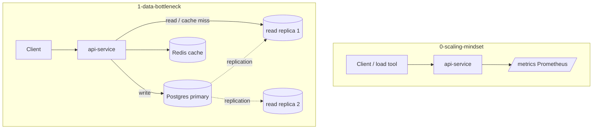

# Module 5 — Scalability & Performance

## Kiến trúc tổng quan (VI)

Module trả lời hai câu hỏi: **“Có cần scale không?”** (đo trước khi scale) và **“Nút thắt nằm ở đâu?”** (thường là data layer). Hai lesson bổ sung nhau: mindset + metrics, rồi giải pháp đọc/ghi tách tầng với replication và cache.

| Lesson | Service | Kiến trúc demo | Demo để làm gì |
|--------|---------|----------------|----------------|
| `0-the-scaling-mindset` | `api-service` (chạy độc lập / lab local) | API Nest + **Prometheus** (`prom-client`: counter, histogram, `/metrics`) | Dạy **đo lường trước khi scale**: RPS, latency p95, error rate — không scale mù. |
| `1-the-data-bottleneck` | `api-service` + Compose | **Postgres primary** + **2 read replicas** + **Redis** (Keyv/cache-manager) | Minh họa **read scaling**: ghi → primary; đọc → replica + **cache-aside**; `UsersService` dùng `QueryRunner("master")` cho write an toàn. |



### Luồng demo lesson 1 (data bottleneck)

1. **POST user** → INSERT chỉ qua **master** (TypeORM replication).
2. **GET user** → thử Redis `user:{id}` → miss thì SELECT từ **read pool** (replica).
3. Sau ghi → **invalidate** cache id để tránh stale read.
4. Endpoint replication/health (nếu có) giúp quan sát replica lag / host phục vụ request.

### Cấu hình & code

- `api-service`: `src/config/` + `.env` (`PORT`, `POSTGRES_*`, `REDIS_*`, host master/read).
- Lesson 0 tập trung `metrics/` (registry Prometheus), không stack Compose trong repo lesson.
- `.briefs/` per service mirror `src/**`; file này = map module.

### Lệnh gợi ý

```bash
# Lesson 1 — Postgres HA + Redis + API
cd .repo/system-design-mastery-module-5-scalability-and-performance/1-the-data-bottleneck/.docker
docker compose up -d --build
docker compose logs -f api-service

# Lesson 0 — scrape metrics (khi api đang chạy)
curl http://localhost:3000/metrics
```

---

## Module overview (EN)

Module 5 covers **when to scale** (metrics-first) and **where bottlenecks appear** (often the database). Lesson 0 instruments the API; lesson 1 adds replication and caching.

| Lesson | Service | Architecture | Why the demo exists |
|--------|---------|--------------|---------------------|
| `0-the-scaling-mindset` | `api-service` | Nest API + Prometheus metrics endpoint | Teach **measure before scaling** (throughput, latency, errors). |
| `1-the-data-bottleneck` | `api-service` + Compose | Postgres primary + 2 replicas + Redis cache-aside | Show **read path scaling** with safe writes to primary and cache invalidation. |

Conventions: `src/config/`, committed `.env`, per-service `.briefs/` for file-level intent.
