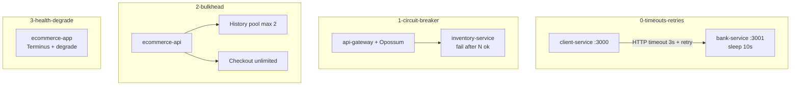

# Module 6 — Reliability & Resilience Patterns

## Kiến trúc tổng quan (VI)

Module tập trung **hành vi khi hệ thống lỗi hoặc chậm**: không để một dependency kéo sập toàn bộ. Bốn lesson đi từ **timeout/retry** → **circuit breaker** → **bulkhead** → **health check & graceful degradation**.

| Lesson | Services | Kiến trúc demo | Demo để làm gì |
|--------|----------|----------------|----------------|
| `0-timeouts-and-retries` | `client-service` → `bank-service` | Bank giả lập xử lý **10s**; client **timeout 3s** + **retry** (exponential backoff + jitter) | Cho thấy retry có ích nhưng cần **giới hạn**; timeout tránh treo thread vô hạn. |
| `1-circuit-breaker-pattern` | `api-gateway` → `inventory-service` | Gateway bọc HTTP bằng **Opossum**; inventory **fail từ request thứ 4** (`FAILURE_AFTER_SUCCESS_COUNT`) | Khi downstream lỗi liên tục → **mở circuit**, fail-fast, sau `resetTimeout` thử lại half-open. |
| `2-bulkhead-pattern` | `ecommerce-api` (một process) | Hai “khoang”: **History** giới hạn concurrency (ví dụ 2), **Checkout** không giới hạn | Một luồng chậm (history 5s) **không chiếm hết** worker — checkout vẫn phản hồi. |
| `3-health-checks-and-graceful-degradation` | `ecommerce-app` | **Terminus** health probes + API products **degrade** khi heap vượt ngưỡng | Load balancer biết instance **unhealthy**; UX vẫn có response rút gọn thay vì 500 toàn bộ. |



### Biến môi trường tiêu biểu (`.env` / compose)

| Lesson | Biến | Ý nghĩa demo |
|--------|------|----------------|
| 0 | `BANK_SERVICE_URL`, timeout/retry config | Địa chỉ bank + policy client |
| 1 | `INVENTORY_BASE_URL`, `CB_*`, `FAILURE_AFTER_SUCCESS_COUNT` | Ngưỡng Opossum + kịch bản lỗi inventory |
| 2 | `HISTORY_CONCURRENCY_LIMIT`, `HISTORY_PROCESSING_DELAY_MS` | Bulkhead + tác vụ chậm |
| 3 | `DEGRADE_HEAP_THRESHOLD_MB`, `DATABASE_HEALTH_STATUS` | Ngưỡng degrade + mock dependency health |

### Cấu hình & code

- Mỗi service: `src/config/` (`app.config`, `circuitBreaker.config`, `bulkhead.config`, …) + `.env` sẵn.
- Pattern resilience nằm trong service layer (`client.service`, `gateway.service`, `ecommerce.service`, `app.service` + Terminus).
- `.briefs/` per service mirror `src/**`; file này = map module.

### Lệnh gợi ý

```bash
# Timeout + Retry
cd .repo/system-design-mastery-module-6-reliability-and-resilience-patterns/0-timeouts-and-retries/.docker
docker compose up -d
curl http://localhost:3000/pay   # quan sát log retry

# Circuit Breaker
cd ../1-circuit-breaker-pattern/.docker
docker compose up -d
# Gọi gateway nhiều lần đến khi circuit OPEN

# Bulkhead — song song history + checkout
cd ../2-bulkhead-pattern/.docker
docker compose up -d
```

---

## Module overview (EN)

Module 6 teaches **failure handling**: bound latency, stop hammering broken dependencies, isolate resource pools, and expose health/degraded modes.

| Lesson | Services | Architecture | Why the demo exists |
|--------|----------|--------------|---------------------|
| `0-timeouts-and-retries` | client → bank (10s delay) | 3s timeout + exponential backoff retries | Show retries vs **timeouts** and thundering herds without limits. |
| `1-circuit-breaker-pattern` | gateway (Opossum) → inventory | Forced failures after N successes | Demonstrate **open/half-open/closed** circuit states. |
| `2-bulkhead-pattern` | single `ecommerce-api` | Separate concurrency caps per route class | Prove slow **history** traffic does not starve **checkout**. |
| `3-health-checks-and-graceful-degradation` | `ecommerce-app` | Terminus + heap-based product degradation | Combine **probe endpoints** with **reduced functionality** under pressure. |

Conventions: `src/config/`, committed `.env`, per-service `.briefs/` for file-level documentation.
