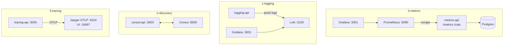

# Module 7 — Monitoring & Observability

## Kiến trúc tổng quan (VI)

Module dạy **ba trụ cột observability** (metrics, logs, traces) cộng **service discovery** — mỗi lesson là một stack Compose với công cụ industry-standard và một Nest API minh họa cách instrument.

| Lesson | Service | Kiến trúc demo | Demo để làm gì |
|--------|---------|----------------|----------------|
| `0-monitoring-and-observability` | `metrics-api` + **Prometheus** + **Grafana** + Postgres | App expose `/metrics` (Prometheus format) + CRUD `/cats`; Prometheus scrape `app:3000`; Grafana datasource sẵn | Học **metrics**: RED/USE cơ bản, scrape interval, dashboard — “đo được” trước khi tối ưu. |
| `1-centralized-logging` | `logging-api` + **Loki** + **Grafana** | Winston (hoặc tương đương) **push log** HTTP → Loki `:3100`; xem log tập trung trên Grafana `:3001` | Học **centralized logging**: không SSH vào từng pod để `tail -f`. |
| `2-service-discovery` | `consul-api` + **Consul** dev agent | API đăng ký / tra cứu service qua `CONSUL_BASE_URL` (`http://consul:8500`) | Minh họa **dynamic routing**: IP/port thay đổi khi scale, client lấy địa chỉ từ registry. |
| `3-distributed-tracing` | `tracing-api` + **Jaeger** (OTLP) | OpenTelemetry export span tới Jaeger; `GET /checkout` tạo span HTTP + span con `checkout.inventory_reserve` | Học **distributed tracing**: `traceId` xuyên request, tìm nút chậm trên Jaeger UI (`:16687`). |



### Luồng demo đáng chú ý

**Lesson 0** — Gọi vài request `GET/POST /cats` → mở Prometheus/Grafana thấy `http_requests_total`, histogram latency tăng.

**Lesson 3** — `curl http://localhost:3005/checkout` → copy `traceId` trong JSON → Jaeger UI tìm trace, xem span cha (HTTP) và span con (inventory).

### Cấu hình & code

- Mỗi `*-api`: `src/config/` + `.env` (`PORT`, `POSTGRES_*`, `CONSUL_BASE_URL`, `OTEL_EXPORTER_OTLP_TRACES_ENDPOINT`, …).
- Lesson 0 là **gold standard** metrics (TypeORM + `prom-client` / instrumentation).
- `.briefs/` per service mirror `src/**`; file này = map module.

### Lệnh gợi ý

```bash
cd .repo/system-design-mastery-module-7-monitoring-and-observability/0-monitoring-and-observability/.docker
docker compose up -d --build
# Prometheus http://localhost:9090  Grafana http://localhost:3001

cd ../3-distributed-tracing/.docker
docker compose up -d --build
curl http://localhost:3005/checkout
# Jaeger http://localhost:16687
```

---

## Module overview (EN)

Module 7 teaches **observability pillars** (metrics, logs, traces) plus **Consul-based discovery**. Each lesson is a Compose stack with one Nest demo API.

| Lesson | Stack | Architecture | Why the demo exists |
|--------|-------|--------------|---------------------|
| `0-monitoring-and-observability` | metrics-api + Prometheus + Grafana | Scrape `/metrics`, sample business traffic via `/cats` | Learn **metric collection and dashboards**. |
| `1-centralized-logging` | logging-api + Loki + Grafana | Push structured logs to Loki | Learn **aggregated log search** across instances. |
| `2-service-discovery` | consul-api + Consul agent | Register/lookup services via HTTP API | Show **dynamic endpoints** instead of hard-coded hosts. |
| `3-distributed-tracing` | tracing-api + Jaeger OTLP | Nested spans on `/checkout` | Learn **trace IDs** and latency breakdown in Jaeger. |

Conventions: `src/config/`, committed `.env`, per-service `.briefs/` for file-level intent.
