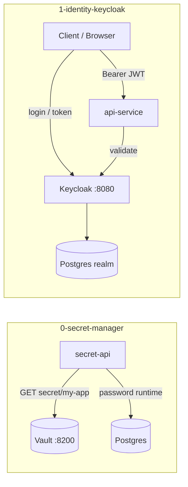

# Module 8 — Security & Identity Management

## Kiến trúc tổng quan (VI)

Module gồm hai mảng bảo mật vận hành: **quản lý secret** (không nhúng password vào image/env tĩnh) và **identity** (OIDC/OAuth2 qua Keycloak). Mỗi lesson một stack Compose; Nest API là “ứng dụng” cần bảo vệ.

| Lesson | Service | Kiến trúc demo | Demo để làm gì |
|--------|---------|----------------|----------------|
| `0-secret-manager` | `secret-api` + **HashiCorp Vault** (dev) + Postgres | App **khởi động** → gọi Vault KV `secret/my-app` lấy `DB_PASSWORD` → mới kết nối Postgres | Chứng minh **secret externalization**: rotate secret trên Vault không rebuild image; token lab `root` chỉ dùng dev. |
| `1-identity-keycloak` | `api-service` + **Keycloak** + Postgres (realm DB) | Keycloak import realm sẵn; API demo **public client** + **confidential client**, JWT/OAuth flows | Học **SSO / OIDC**: route protected bằng bearer token; phân quyền tập trung tại IdP. |



### Luồng demo lesson 0 (Vault)

1. `docker compose up -d vault postgres`
2. Seed secret: `docker exec vault vault kv put secret/my-app DB_PASSWORD=123456`
3. `docker compose up -d api-service` — log “Successfully retrieved DB_PASSWORD from Vault”
4. API dùng password runtime, **không** hard-code trong `.env` production-style (`.env` lab có `VAULT_TOKEN=root` cho dev).

### Luồng demo lesson 1 (Keycloak)

1. `docker compose up -d --build` — Keycloak Admin `http://localhost:8080` (admin/admin lab).
2. Lấy token từ realm import (password grant / client credentials tùy endpoint demo).
3. Gọi API protected với `Authorization: Bearer <token>` → 401 khi thiếu/sai token.

### Cấu hình & code

| Lesson | Biến `.env` tiêu biểu |
|--------|----------------------|
| 0 | `VAULT_ADDR`, `VAULT_TOKEN`, `DB_HOST`, `DB_USER`, `DB_NAME` — password **không** trong `.env` |
| 1 | `KEYCLOAK_URL`, `KEYCLOAK_REALM`, client id/secret — cloud IdP có thể dùng `<nhập_key>` cho client secret thật |

- `secret-api`: `VaultService.fetchDatabasePassword()` trước TypeORM connect.
- `api-service`: guards/strategy Keycloak (JWT validation).
- `.briefs/` per service mirror `src/**`; file này = map module.

### Lệnh gợi ý

```bash
cd .repo/system-design-mastery-module-8-security-and-identity-management/0-secret-manager/.docker
docker compose up -d vault postgres
docker exec vault vault kv put secret/my-app DB_PASSWORD=123456
docker compose up -d api-service --build

cd ../1-identity-keycloak/.docker
docker compose up -d --build
docker compose logs -f api-service
```

---

## Module overview (EN)

Module 8 covers **secrets management** and **identity (OIDC)** with two focused labs.

| Lesson | Stack | Architecture | Why the demo exists |
|--------|-------|--------------|---------------------|
| `0-secret-manager` | secret-api + Vault + Postgres | Bootstrap reads DB password from Vault KV | Teach **no secrets in images**; rotation at the secret store. |
| `1-identity-keycloak` | api-service + Keycloak + Postgres | Imported realm; public & confidential clients | Teach **centralized authN/authZ** and JWT-protected APIs. |

**Lesson 0 flow:** seed Vault → app fetches `DB_PASSWORD` at startup → connects to Postgres.

**Lesson 1 flow:** obtain token from Keycloak → call API with Bearer JWT.

Conventions: `src/config/`, committed `.env` (lab tokens only), per-service `.briefs/` for file-level documentation.
