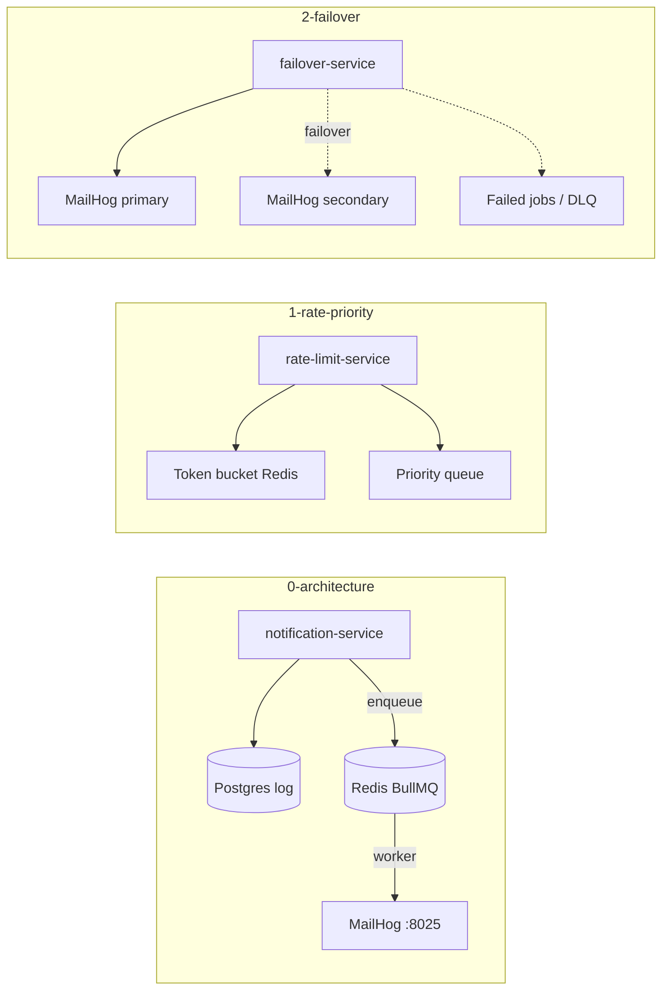

# Module 9 — High-Throughput Notification System

## Kiến trúc tổng quan (VI)

Module mô phỏng **hệ thống gửi thông báo đa kênh** (email lab qua MailHog) với throughput cao: API nhận request nhanh, xử lý nặng đẩy sang **hàng đợi BullMQ (Redis)**. Ba lesson lần lượt thêm **rate limit**, **priority queue**, rồi **failover + delivery guarantees**.

| Lesson | Service | Kiến trúc demo | Demo để làm gì |
|--------|---------|----------------|----------------|
| `0-notification-system-architecture` | `notification-service` | Postgres (log trạng thái) + Redis (BullMQ) + MailHog SMTP | Học **async pipeline**: `POST` → ghi `QUEUED` → worker gửi email → `SENT`/`FAILED`; API không block khi SMTP chậm. |
| `1-rate-limiting-and-priority-queues` | `rate-limit-service` | Cùng stack + **token bucket** trên Redis (`RATE_LIMIT_MAX` / window) + queue `notification-priority-queue` | **Rate limit** theo `userId`+`channel`; **OTP bypass**; job priority: OTP=1, Transactional=5, Marketing=10 (số nhỏ = ưu tiên cao). |
| `2-failover-and-delivery-guarantees` | `failover-service` | 2 MailHog (primary/secondary) + BullMQ retry + failed jobs (DLQ) | **SMTP failover** primary→secondary; retry exponential; khi hết retry → job failed (DLQ) — học **at-least-once** vs hiển thị trạng thái user. |



### Luồng demo đáng chú ý

**Lesson 0** — Gửi vài notification → xem MailHog UI `http://localhost:8025` → so sánh số job trong Redis/BullMQ với bản ghi Postgres.

**Lesson 1** — Spam request cùng `userId` → nhận 429/rate-limited; gửi OTP vẫn qua; so sánh thứ tự worker xử lý OTP trước Marketing.

**Lesson 2** — `docker stop` mailhog-primary → email vẫn tới secondary; cố tình làm cả hai down → quan sát retry và job chuyển failed.

### Cấu hình dự kiến (sau khi duyệt brief)

- Mỗi service: `src/config/` (`app`, `database`, `redis`, `smtp`, `rateLimit`, …) + `.env` sẵn khớp `compose.yaml`.
- Biến lab: `POSTGRES_*`, `REDIS_*`, `SMTP_*`, `RATE_LIMIT_*`; API key SMTP cloud (nếu có) → `<nhập_key>`.
- Pattern tham chiếu: `fullstack-mastery-module-7` (BullMQ) + rules `coding-rules.md` §6.

### Lệnh gợi ý

```bash
cd .repo/system-design-mastery-module-9-high-throughput-notification-system/0-notification-system-architecture/.docker
docker compose up -d
# API :3000  MailHog UI :8025

cd ../1-rate-limiting-and-priority-queues/.docker
docker compose up -d

cd ../2-failover-and-delivery-guarantees/.docker
docker compose up -d
# Dừng primary: docker stop 2-failover-mailhog-primary
```

---

## Module overview (EN)

Module 9 models a **high-throughput notification platform** (email via MailHog in lab): fast API, heavy work on **BullMQ (Redis)** workers, then rate limits, priorities, and SMTP failover.

| Lesson | Service | Architecture | Why the demo exists |
|--------|---------|--------------|---------------------|
| `0-notification-system-architecture` | notification-service | Postgres + Redis queue + MailHog | Teach **async send pipeline** and status tracking. |
| `1-rate-limiting-and-priority-queues` | rate-limit-service | Token bucket + priority BullMQ jobs | Teach **fairness** (rate limit) and **urgency** (OTP > marketing). |
| `2-failover-and-delivery-guarantees` | failover-service | Dual SMTP + retries + failed queue | Teach **delivery resilience** and operational visibility of failures. |

**Planned conventions (post-approval):** `src/config/`, committed `.env`, per-service `.briefs/` mirroring `src/**`.
