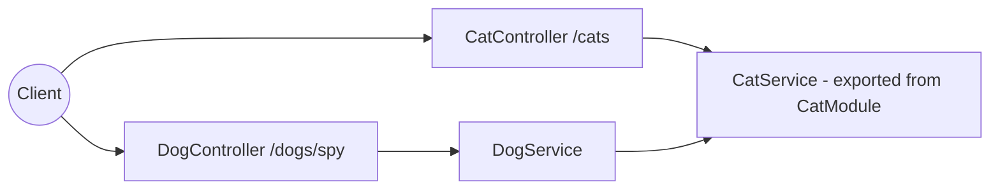
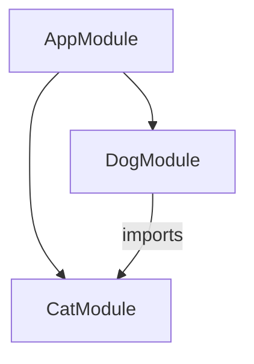

# title
Environment Setup and Mastering NestJS Core

# description
Set up a production-oriented NestJS learning environment, understand Module, Dependency Injection, IoC Container, and practice the Controller to Service to Cross-module Service flow through a demo source.

# body

## 1. Opening

"The project has 40 modules and over 200 endpoints — how would you organize the code to avoid cross-dependencies?" — a **Senior Engineer** asks during an architecture review. A **Mid-level Developer** answers: "I'd group APIs into a few large files and directly `new Service()` wherever needed for speed." The answer is valid for small project velocity, but still misses depth on **Dependency Injection** and **IoC Container**: as the system scales, manual `new` breaks testability, implementation swapping, and easily creates circular dependencies — issues that only surface in production when it is too late.

This lesson runs through two consecutive tracks:
- **Part 2.1**: **hands-on**, synchronized with the GitHub repository; the **stack** is pure **NestJS** (no Docker), with **two verification flows** (boot + routing; cross-module **DI**).
- **Part 2.2**: **theory** clarifying the nature of **Module**, **Provider**, **IoC Container** — definitions, simple examples, and typical **edge cases** such as **Circular Dependency**, missing `exports`, and **Provider Scope**.

## 2. Core concepts

The lesson structure follows **practice-led theory**. First, learners clone the source, run **NestJS** via `nest start --watch`, and call APIs to observe the actual **dependency flow**. Then the **theory** section systematizes **core concepts**, **architecture models**, and analyzes in-depth **edge cases** — mapping directly to what was observed in **part 2.1**.

### 2.1. Hands-on

#### 2.1.1. Prepare source code and environment

Goal: clone the demo source and run **NestJS** directly on your machine to verify **Module boundary** and cross-module **Dependency Injection**.

Source: [StarCi-Academy/fullstack-mastery-module-1-backend-environment-nestjs-introduction](https://github.com/StarCi-Academy/fullstack-mastery-module-1-backend-environment-nestjs-introduction) on GitHub — lesson directory: [`0-environment-setup-and-nestjs-core`](https://github.com/StarCi-Academy/fullstack-mastery-module-1-backend-environment-nestjs-introduction/tree/main/0-environment-setup-and-nestjs-core).

```bash
# Step 1: Clone the repository locally
git clone https://github.com/StarCi-Academy/fullstack-mastery-module-1-backend-environment-nestjs-introduction.git

# Step 2: Navigate to the lesson directory
cd fullstack-mastery-module-1-backend-environment-nestjs-introduction/0-environment-setup-and-nestjs-core
```

#### 2.1.2. Architecture / components (stack + flow)

- **NestJS App:** receives HTTP requests, routes to the corresponding **Controller**.
- **CatModule:** contains `CatController` (`GET /cats`), `CatService` (data + spy hint) — **exports** `CatService` for other modules.
- **DogModule:** contains `DogController` (`GET /dogs/spy`), `DogService` — **imports** `CatModule` to inject `CatService`.
- **IoC Container:** resolves dependencies via constructor injection, no `new` required.

| Component | File | Role |
| --- | --- | --- |
| **CatController** | `src/cat/cat.controller.ts` | Handles `GET /cats`, delegates to service |
| **CatService** | `src/cat/cat.service.ts` | Cat data + spy hint, exported cross-module |
| **CatModule** | `src/cat/cat.module.ts` | `exports: [CatService]` |
| **DogController** | `src/dog/dog.controller.ts` | Handles `GET /dogs/spy`, delegates to service |
| **DogService** | `src/dog/dog.service.ts` | Calls `CatService` via DI |
| **DogModule** | `src/dog/dog.module.ts` | `imports: [CatModule]` |



Figure 1: Runtime flow of requests through **Module boundary** and **Dependency Injection**.

#### 2.1.3. Prerequisites and startup

##### 2.1.3.1. Prerequisites

- **Node.js** LTS (recommended ≥ 18).
- **npm** or **pnpm**.
- **NestJS CLI**:

```bash
npm i -g @nestjs/cli
```

- **Windows:** API commands use **`Invoke-RestMethod`** (PowerShell). See parallel **`curl`** for macOS / Linux.

##### 2.1.3.2. Start

```bash
# Step 1: Install dependencies
npm install

# Step 2: Start in watch mode (hot-reload on code changes)
nest start --watch
```

After the command above: terminal logs show the app listening on **`http://localhost:3000`**.

#### 2.1.4. Verification

**2 flows** below verify two goals: **(1)** app boot + routing; **(2)** cross-module **DI**.

- **Flow 1:** Verify app boot and routing — `GET /cats`.
- **Flow 2:** Verify cross-module dependency — `GET /dogs/spy`.

##### 2.1.4.1. Flow 1 — Verify app boot and routing

- Step 1: call `GET /cats`.

  ```bash
  # Windows (PowerShell)
  Invoke-RestMethod -Uri http://localhost:3000/cats

  # macOS / Linux
  # → Paste cURL into Postman: Import → Raw text
  curl -s http://localhost:3000/cats
  ```

  Expected response (HTTP 200):

  ```json
  [
    { "id": 1, "name": "Milo" },
    { "id": 2, "name": "Luna" }
  ]
  ```

*If the response matches the JSON above:*

- *App booted successfully — no missing dependency errors during bootstrap.*
- *`GET /cats` route maps correctly to `CatController` → `CatService.getCats()` — returns static data.*

##### 2.1.4.2. Flow 2 — Verify cross-module dependency

- Step 1: call `GET /dogs/spy`.

  ```bash
  # Windows (PowerShell)
  Invoke-RestMethod -Uri http://localhost:3000/dogs/spy

  # macOS / Linux
  # → Paste cURL into Postman: Import → Raw text
  curl -s http://localhost:3000/dogs/spy
  ```

  Expected response (HTTP 200):

  ```json
  {
    "mission": "cross-module-dependency-check",
    "dependency": "cat-network-ready",
    "status": "ok"
  }
  ```

*If the response matches the JSON above:*

- *`CatModule` exports the provider correctly — via `exports: [CatService]` in module metadata.*
- *`DogModule` imports correctly — via `imports: [CatModule]`, granting access to exported providers.*
- *Cross-module DI works as expected — `DogService` successfully called `CatService.getSpyHint()` injected through its constructor without manual `new CatService()`.*

#### 2.1.5. Cleanup

This lesson does not use Docker, no resource cleanup is needed. Press `Ctrl+C` in the terminal to stop NestJS.

#### 2.1.6. Further reading

- **Module Metadata:** `@Module({ imports, providers, exports, controllers })` is the official entry point for **NestJS** to compile the dependency graph. If metadata is wrong or `exports` is missing, DI will fail at bootstrap. ([NestJS Docs](https://docs.nestjs.com/modules))
- **Constructor Injection:** Injecting via constructor is the standard pattern in **NestJS** for classes to declare dependencies explicitly. If you manually `new` a service inside a class, you break **IoC** and make testing hard to control. ([NestJS Docs](https://docs.nestjs.com/providers))
- **Provider Token:** Tokens (`string/symbol/class`) allow mapping multiple implementations to the same abstraction. If you hard-code specific classes everywhere, implementation refactoring spreads widely. ([NestJS Docs](https://docs.nestjs.com/fundamentals/custom-providers))
- **Module Export:** `exports` should only expose providers needed by other modules. If you export all providers, coupling increases quickly and module separation becomes difficult later. ([NestJS Docs](https://docs.nestjs.com/modules))
- **Forward Reference:** `forwardRef` is a rescue tool for circular dependencies, not an architectural default. If overused, architecture becomes hard to read and DI errors recur in chains. ([NestJS Docs](https://docs.nestjs.com/fundamentals/circular-dependency))
- **Testing Module:** `Test.createTestingModule()` allows building a test module close to real runtime while still controlling mocks. If tests skip module context, results can diverge from actual behavior. ([NestJS Docs](https://docs.nestjs.com/fundamentals/testing))

### 2.2. Theory — Module, DI, and IoC Container

#### 2.2.1. Module in NestJS

A **Module** is the organizational unit of code in **NestJS**. Each module encapsulates a **bounded context**: controllers, services, and entities belonging to the same domain. The `@Module()` decorator declares `imports` (dependent modules), `providers` (services), `controllers` (endpoint handlers), and `exports` (providers shared externally).



In this lesson, `AppModule` aggregates `CatModule` + `DogModule`. `DogModule` imports `CatModule` to use `CatService` — this is a clear **module boundary**.

#### 2.2.2. Dependency Injection and IoC Container

**Dependency Injection (DI)** is a pattern where a class does not create its own dependencies, but declares them via constructor — the **IoC Container** (Inversion of Control) automatically resolves and injects the appropriate instance.

```typescript
// DogService does not "new CatService()" — IoC container injects automatically.
constructor(private readonly catService: CatService) {}
```

Benefits:
- **Testability:** easily mock dependencies.
- **Loose coupling:** swap implementations without changing consumer code.
- **Lifecycle management:** container manages singleton/transient/request scope.

#### 2.2.3. Provider and Provider Token

A **Provider** is any class/value registered in a module's `providers`. **NestJS** uses a **token** (default: class reference) to map providers into the dependency graph. Custom providers allow:
- `useClass`: swap implementation.
- `useValue`: inject a fixed value.
- `useFactory`: inject based on runtime logic.

#### 2.2.4. Edge cases to internalize

- **Missing `exports`:** If `CatModule` does not `exports: [CatService]`, `DogModule` will error with `Nest can't resolve dependencies of DogService`. **Fix:** always export providers that need cross-module sharing.
- **Circular Dependency:** Module A imports Module B and vice versa → bootstrap fails. **Fix:** refactor shared logic into a third module, or use `forwardRef` temporarily.
- **Provider Scope (Singleton vs Transient vs Request):** Default provider scope is **singleton** — same instance for the entire app. Use `@Injectable({ scope: Scope.REQUEST })` when per-request state is needed (e.g., multi-tenant context). **Caveat:** request scope propagates up the entire dependency chain, affecting performance.
- **Dynamic Module:** When config needs runtime injection (DB connection string, API key), use `forRoot()` / `forRootAsync()` pattern instead of hard-coding in the module. **Fix:** refer to `ConfigModule.forRoot()` from **NestJS**.

## 3. Wrap-up

### 3.1. Common interview questions

- **Question 1:** Why can `DogService` call `CatService` without using `new`?
  - What interviewers want: **Dependency Injection** mechanism, `imports/exports`, role of **IoC Container**.
  - Sample short answer: Because `CatService` is exported from `CatModule`, and `DogModule` imports `CatModule`. **NestJS** resolves the dependency at the constructor through the **IoC Container** — no manual instantiation needed.

- **Question 2:** What happens if you remove `imports: [CatModule]` from `DogModule`?
  - What interviewers want: ability to locate runtime dependency errors.
  - Sample short answer: The app will throw `Nest can't resolve dependencies of DogService` because `CatService` is not in the current module context. You need to add back `imports: [CatModule]`.

- **Question 3:** When should you split into a new module instead of adding to an existing one?
  - What interviewers want: domain separation mindset, boundaries, coupling level.
  - Sample short answer: Split when the business capability is independent or needs its own lifecycle/testing. The goal is to keep boundaries clear, minimize exports, and avoid circular dependencies.

- **Question 4:** What is the default provider scope in **NestJS**? When should you change it?
  - What interviewers want: singleton vs request scope, performance implications.
  - Sample short answer: Default is **singleton** — same instance for the entire app. Switch to `Scope.REQUEST` when per-request state is needed (multi-tenant), but note that scope propagates and affects performance.

# references
## 0
### alias
NestJS First Steps
### url
https://docs.nestjs.com/first-steps
## 1
### alias
Providers in NestJS
### url
https://docs.nestjs.com/providers
## 2
### alias
Modules in NestJS
### url
https://docs.nestjs.com/modules
## 3
### alias
Custom Providers
### url
https://docs.nestjs.com/fundamentals/custom-providers

# minutesRead
20
