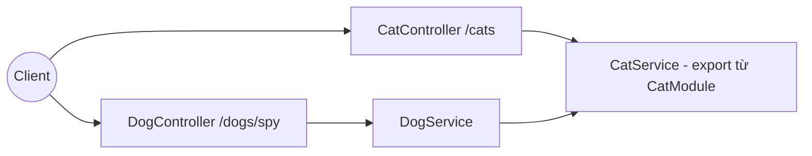
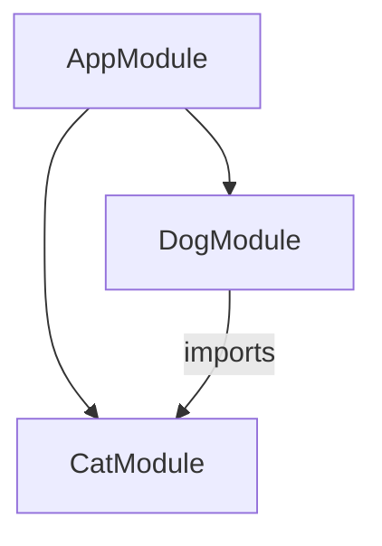

# title
Thiết lập môi trường và nắm vững NestJS Core

# description
Thiết lập môi trường học NestJS theo hướng production, hiểu rõ Module, Dependency Injection, IoC Container, và thực hành luồng Controller → Service → Cross-module Service qua source demo.

# body

## 1. Lời mở đầu

"Dự án có 40 module và hơn 200 endpoint — em sẽ tổ chức code ra sao để không bị phụ thuộc chéo?" — một **Senior Engineer** hỏi khi review kiến trúc backend. Một **Mid-level Developer** trả lời: "Em sẽ gom API vào vài file lớn, chỗ nào cần thì `new Service()` trực tiếp cho nhanh." Câu trả lời đúng về tốc độ triển khai ở project nhỏ, nhưng vẫn thiếu chiều sâu về **Dependency Injection** và **IoC Container**: khi hệ thống scale, `new` thủ công phá vỡ khả năng test, thay thế implementation, và dễ tạo dependency vòng — vấn đề chỉ lộ ra ở production khi đã muộn.

Bài này dẫn qua hai mạch liên tiếp:
- **Phần 2.1**: **thực hành** đồng bộ với repository trên GitHub; **stack** gồm **NestJS** thuần (không Docker), kèm **hai luồng** kiểm thử (boot + routing; cross-module **DI**).
- **Phần 2.2**: **lý thuyết** làm rõ bản chất **Module**, **Provider**, **IoC Container** — định nghĩa, ví dụ đơn giản, và các **edge case** điển hình như **Circular Dependency**, thiếu `exports`, **Provider Scope**.

## 2. Các khái niệm cốt lõi

Cấu trúc bài học áp dụng phương pháp **Thực hành dẫn dắt Lý thuyết**. Khởi đầu, học viên sẽ trực tiếp clone source, chạy **NestJS** bằng `nest start --watch` và gọi API để quan sát **luồng dependency** thực tế. Tiếp theo, **phần lý thuyết** sẽ hệ thống hóa **các khái niệm cốt lõi**, **mô hình kiến trúc** và phân tích các **edge cases** chuyên sâu — giúp đối chiếu và củng cố trực tiếp những kết quả vừa thực nghiệm tại **phần 2.1**.

### 2.1. Thực hành

#### 2.1.1. Chuẩn bị source code và môi trường

Mục đích: clone source demo và chạy **NestJS** trực tiếp trên máy để kiểm chứng **Module boundary** và **Dependency Injection** cross-module.

Source: [StarCi-Academy/fullstack-mastery-module-1-backend-environment-nestjs-introduction](https://github.com/StarCi-Academy/fullstack-mastery-module-1-backend-environment-nestjs-introduction) trên GitHub — thư mục bài học: [`0-environment-setup-and-nestjs-core`](https://github.com/StarCi-Academy/fullstack-mastery-module-1-backend-environment-nestjs-introduction/tree/main/0-environment-setup-and-nestjs-core).

```bash
# Bước 1: Clone repository về máy local
git clone https://github.com/StarCi-Academy/fullstack-mastery-module-1-backend-environment-nestjs-introduction.git

# Bước 2: Di chuyển vào đúng thư mục bài học
cd fullstack-mastery-module-1-backend-environment-nestjs-introduction/0-environment-setup-and-nestjs-core
```

#### 2.1.2. Kiến trúc/thành phần (stack + luồng)

- **NestJS App:** nhận request HTTP, route tới **Controller** tương ứng.
- **CatModule:** chứa `CatController` (`GET /cats`), `CatService` (data + spy hint) — **export** `CatService` cho module khác.
- **DogModule:** chứa `DogController` (`GET /dogs/spy`), `DogService` — **import** `CatModule` để inject `CatService`.
- **IoC Container:** resolve dependency qua constructor injection, không cần `new`.

| Thành phần | File | Vai trò |
| --- | --- | --- |
| **CatController** | `src/cat/cat.controller.ts` | Nhận `GET /cats`, delegate service |
| **CatService** | `src/cat/cat.service.ts` | Data mèo + spy hint, export cross-module |
| **CatModule** | `src/cat/cat.module.ts` | `exports: [CatService]` |
| **DogController** | `src/dog/dog.controller.ts` | Nhận `GET /dogs/spy`, delegate service |
| **DogService** | `src/dog/dog.service.ts` | Gọi `CatService` qua DI |
| **DogModule** | `src/dog/dog.module.ts` | `imports: [CatModule]` |



Hình 1: Luồng runtime của request qua **Module boundary** và **Dependency Injection**.

#### 2.1.3. Chuẩn bị & khởi chạy

##### 2.1.3.1. Điều kiện cần trước

- **Node.js** LTS (khuyến nghị ≥ 18).
- **npm** hoặc **pnpm**.
- **NestJS CLI**:

```bash
npm i -g @nestjs/cli
```

- **Windows:** các lệnh API dùng **`Invoke-RestMethod`** (PowerShell). Xem song song **`curl`** cho macOS / Linux.

##### 2.1.3.2. Khởi động

```bash
# Bước 1: Cài dependency
npm install

# Bước 2: Khởi chạy ở chế độ watch (hot-reload khi sửa code)
nest start --watch
```

Sau lệnh trên: terminal log hiển thị app đang lắng nghe tại **`http://localhost:3000`**.

#### 2.1.4. Kiểm thử

**2 luồng** dưới đây kiểm chứng hai mục tiêu: **(1)** app boot + routing; **(2)** **DI** cross-module.

- **Luồng 1:** Kiểm tra app boot và routing — `GET /cats`.
- **Luồng 2:** Kiểm tra cross-module dependency — `GET /dogs/spy`.

##### 2.1.4.1. Luồng 1 — Kiểm tra app boot và routing

- Bước 1: gọi `GET /cats`.

  ```bash
  # Windows (PowerShell)
  Invoke-RestMethod -Uri http://localhost:3000/cats

  # macOS / Linux
  # → Dán cURL vào Postman: Import → Raw text
  curl -s http://localhost:3000/cats
  ```

  Response phải trả về (HTTP 200):

  ```json
  [
    { "id": 1, "name": "Milo" },
    { "id": 2, "name": "Luna" }
  ]
  ```

*Kết luận: Nếu response khớp đúng JSON trên, hệ thống xác nhận:*

- *App boot thành công — không gặp lỗi thiếu dependency lúc bootstrap.*
- *Route `GET /cats` map đúng vào `CatController` → `CatService.getCats()` — trả về dữ liệu tĩnh.*

##### 2.1.4.2. Luồng 2 — Kiểm tra cross-module dependency

- Bước 1: gọi `GET /dogs/spy`.

  ```bash
  # Windows (PowerShell)
  Invoke-RestMethod -Uri http://localhost:3000/dogs/spy

  # macOS / Linux
  # → Dán cURL vào Postman: Import → Raw text
  curl -s http://localhost:3000/dogs/spy
  ```

  Response phải trả về (HTTP 200):

  ```json
  {
    "mission": "cross-module-dependency-check",
    "dependency": "cat-network-ready",
    "status": "ok"
  }
  ```

*Kết luận: Nếu response khớp đúng JSON trên, hệ thống xác nhận:*

- *`CatModule` export provider đúng — `exports: [CatService]` trong metadata module.*
- *`DogModule` import đúng — `imports: [CatModule]` để có quyền sử dụng provider được export.*
- *DI cross-module hoạt động đúng — `DogService` gọi thành công `CatService.getSpyHint()` được inject qua constructor mà không cần `new CatService()`.*

#### 2.1.5. Dọn tài nguyên

Bài này không sử dụng Docker, không cần dọn tài nguyên. Nhấn `Ctrl+C` trong terminal để dừng NestJS.

#### 2.1.6. Đọc thêm

- **Module Metadata:** `@Module({ imports, providers, exports, controllers })` là điểm vào chính thức để **NestJS** compile dependency graph. Nếu metadata sai hoặc thiếu `exports`, DI sẽ fail ngay lúc bootstrap. ([NestJS Docs](https://docs.nestjs.com/modules))
- **Constructor Injection:** Inject qua constructor là pattern chuẩn trong **NestJS** để class khai báo dependency rõ ràng. Nếu tự `new` service bên trong class, bạn phá vỡ **IoC** và làm test khó kiểm soát. ([NestJS Docs](https://docs.nestjs.com/providers))
- **Provider Token:** Token (`string/symbol/class`) cho phép ánh xạ nhiều implementation vào cùng abstraction. Nếu hard-code class cụ thể ở mọi nơi, refactor implementation sẽ lan rộng. ([NestJS Docs](https://docs.nestjs.com/fundamentals/custom-providers))
- **Module Export:** `exports` chỉ nên mở những provider cần chia sẻ cho module khác. Nếu export toàn bộ provider, coupling tăng nhanh và khó tách module về sau. ([NestJS Docs](https://docs.nestjs.com/modules))
- **Forward Reference:** `forwardRef` là công cụ cứu cánh cho circular dependency chứ không phải mặc định kiến trúc. Nếu lạm dụng, kiến trúc sẽ khó đọc và lỗi DI tái diễn theo chuỗi. ([NestJS Docs](https://docs.nestjs.com/fundamentals/circular-dependency))
- **Testing Module:** `Test.createTestingModule()` cho phép dựng module test gần runtime thật nhưng vẫn kiểm soát mock. Nếu test bỏ qua module context, kết quả dễ lệch hành vi thực tế. ([NestJS Docs](https://docs.nestjs.com/fundamentals/testing))

### 2.2. Lý thuyết — Module, DI và IoC Container

#### 2.2.1. Module trong NestJS

**Module** là đơn vị tổ chức code trong **NestJS**. Mỗi module đóng gói một **bounded context**: controller, service, entity thuộc cùng domain. `@Module()` decorator khai báo `imports` (module phụ thuộc), `providers` (service), `controllers` (endpoint handler), và `exports` (provider chia sẻ ra ngoài).



Trong bài học, `AppModule` gom `CatModule` + `DogModule`. `DogModule` import `CatModule` để dùng `CatService` — đây chính là **module boundary** rõ ràng.

#### 2.2.2. Dependency Injection và IoC Container

**Dependency Injection (DI)** là pattern trong đó class không tự tạo dependency, mà khai báo qua constructor — **IoC Container** (Inversion of Control) tự resolve và inject instance phù hợp.

```typescript
// DogService không "new CatService()" — IoC container tự inject.
constructor(private readonly catService: CatService) {}
```

Lợi ích:
- **Testability:** mock dependency dễ dàng.
- **Loose coupling:** thay implementation không đổi consumer code.
- **Lifecycle management:** container quản lý singleton/transient/request scope.

#### 2.2.3. Provider và Provider Token

**Provider** là bất kỳ class/value nào đăng ký trong `providers` của module. **NestJS** dùng **token** (mặc định là class reference) để map provider vào dependency graph. Custom provider cho phép:
- `useClass`: swap implementation.
- `useValue`: inject giá trị cố định.
- `useFactory`: inject dựa trên logic runtime.

#### 2.2.4. Các trường hợp biên (edge cases) cần lưu ý

- **Thiếu `exports`:** Nếu `CatModule` không `exports: [CatService]`, `DogModule` sẽ lỗi `Nest can't resolve dependencies of DogService`. **Giải pháp:** luôn export provider cần chia sẻ.
- **Circular Dependency:** Module A import Module B và ngược lại → bootstrap fail. **Giải pháp:** refactor để tách shared logic vào module thứ ba, hoặc dùng `forwardRef` tạm thời.
- **Provider Scope (Singleton vs Transient vs Request):** Mặc định provider là **singleton** — cùng instance cho toàn app. Nếu cần state riêng mỗi request (ví dụ: tenant context), dùng `@Injectable({ scope: Scope.REQUEST })`. **Lưu ý:** request scope lan truyền lên toàn dependency chain, ảnh hưởng performance.
- **Dynamic Module:** Khi config cần inject runtime (DB connection string, API key), dùng `forRoot()` / `forRootAsync()` pattern thay vì hard-code trong module. **Giải pháp:** tham khảo `ConfigModule.forRoot()` của **NestJS**.

## 3. Tổng kết

### 3.1. Các câu hỏi dễ bị phỏng vấn

- **Câu hỏi 1:** Vì sao `DogService` gọi được `CatService` mà không cần `new`?
  - Ý interviewer muốn nghe: cơ chế **Dependency Injection**, `imports/exports`, vai trò **IoC Container**.
  - Trả lời mẫu (ngắn): Vì `CatService` được export từ `CatModule`, còn `DogModule` import `CatModule`. **NestJS** resolve dependency ở constructor thông qua **IoC Container** — không cần instantiate thủ công.

- **Câu hỏi 2:** Nếu bỏ `imports: [CatModule]` trong `DogModule` thì chuyện gì xảy ra?
  - Ý interviewer muốn nghe: khả năng định vị lỗi dependency runtime.
  - Trả lời mẫu (ngắn): App sẽ báo lỗi `Nest can't resolve dependencies of DogService` vì `CatService` không nằm trong module context hiện tại. Phải thêm lại `imports: [CatModule]`.

- **Câu hỏi 3:** Khi nào nên tách module mới thay vì nhét thêm vào module cũ?
  - Ý interviewer muốn nghe: tư duy tách domain, boundary, mức độ coupling.
  - Trả lời mẫu (ngắn): Tách module khi business capability độc lập hoặc cần lifecycle/test riêng. Mục tiêu là giữ boundary rõ, export tối thiểu, tránh dependency vòng.

- **Câu hỏi 4:** Provider scope mặc định trong **NestJS** là gì? Khi nào cần thay đổi?
  - Ý interviewer muốn nghe: singleton vs request scope, ảnh hưởng performance.
  - Trả lời mẫu (ngắn): Mặc định là **singleton** — cùng instance cho toàn app. Chuyển sang `Scope.REQUEST` khi cần state riêng mỗi request (multi-tenant), nhưng lưu ý scope lan truyền và ảnh hưởng performance.

# references
## 0
### alias
NestJS First Steps
### url
https://docs.nestjs.com/first-steps
## 1
### alias
Providers in NestJS
### url
https://docs.nestjs.com/providers
## 2
### alias
Modules in NestJS
### url
https://docs.nestjs.com/modules
## 3
### alias
Custom Providers
### url
https://docs.nestjs.com/fundamentals/custom-providers

# minutesRead
20