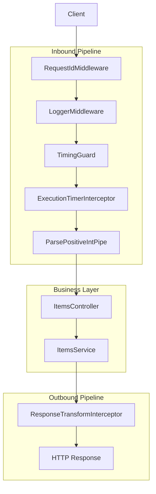
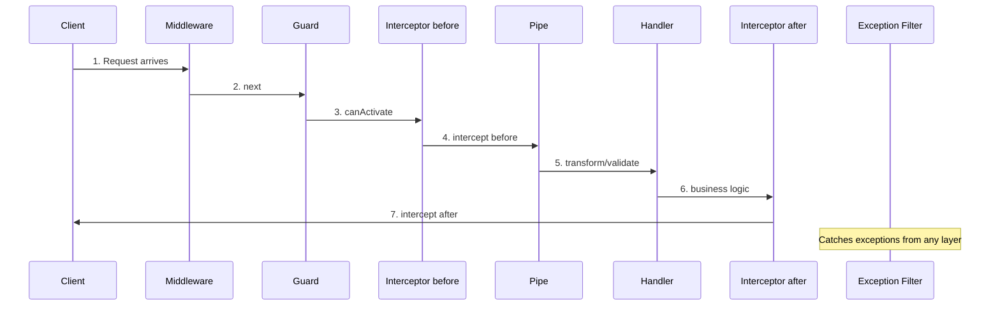

# title
Request Lifecycle in NestJS

# description
Hands-on walkthrough of an HTTP request through Middleware, Guard, Interceptor, Pipe, then into Controller/Service to understand the exact NestJS pipeline order.

# body

## 1. Opening

"Why does `GET /items/5` sometimes fail at validation, but other times fail in business logic?" — a **Senior Engineer** asks while debugging a production incident. A **Mid-level Developer** answers: "I'd put validation in a **Guard** or **Interceptor**, wherever it's convenient." The answer shows awareness of the components, but still misses depth on **pipeline order**: without understanding the fixed sequence **Middleware → Guard → Interceptor → Pipe → Handler**, it is easy to place logic in the wrong layer — causing "sometimes works, sometimes doesn't" bugs that are extremely hard to trace.

This lesson runs through two consecutive tracks:
- **Part 2.1**: **hands-on**, synchronized with the GitHub repository; the **stack** is pure **NestJS** (no Docker), with **two verification flows** (wrapper response; **Pipe** validation before **Controller**).
- **Part 2.2**: **theory** clarifying the nature of each layer in the **request pipeline** — responsibilities, ordering, and typical **edge cases** such as misplaced logic, **Exception Filter** scope, and **Interceptor** execution order.

## 2. Core concepts

The lesson structure follows **practice-led theory**. First, learners clone the source, run **NestJS** via `nest start --watch`, and call APIs to observe the **request flow** through each layer. Then the **theory** section systematizes **core concepts**, **pipeline models**, and analyzes in-depth **edge cases** — mapping directly to what was observed in **part 2.1**.

### 2.1. Hands-on

#### 2.1.1. Prepare source code and environment

Goal: clone the demo source and run **NestJS** directly on your machine to verify **pipeline order** and the responsibility of each request-handling layer.

Source: [StarCi-Academy/fullstack-mastery-module-1-backend-environment-nestjs-introduction](https://github.com/StarCi-Academy/fullstack-mastery-module-1-backend-environment-nestjs-introduction) on GitHub — lesson directory: [`1-request-lifecycle`](https://github.com/StarCi-Academy/fullstack-mastery-module-1-backend-environment-nestjs-introduction/tree/main/1-request-lifecycle).

```bash
# Step 1: Clone the repository locally
git clone https://github.com/StarCi-Academy/fullstack-mastery-module-1-backend-environment-nestjs-introduction.git

# Step 2: Navigate to the lesson directory
cd fullstack-mastery-module-1-backend-environment-nestjs-introduction/1-request-lifecycle
```

#### 2.1.2. Architecture / components (stack + flow)

- **RequestIdMiddleware:** attaches `x-request-id` for end-to-end request tracing.
- **LoggerMiddleware:** logs access early at request start.
- **TimingGuard:** records timing checkpoints into the pipeline.
- **ExecutionTimerInterceptor:** measures handler execution time.
- **ResponseTransformInterceptor:** standardizes response wrapper (`data`, `timestamp`, `requestId`, `executionMs`).
- **ParsePositiveIntPipe:** validates/transforms route param `id` into a positive integer.
- **ItemsController / ItemsService:** handles items business logic.

| Component | File | Role |
| --- | --- | --- |
| **RequestIdMiddleware** | `src/common/middleware/` | Attaches traceable `x-request-id` |
| **LoggerMiddleware** | `src/common/middleware/` | Early access log |
| **TimingGuard** | `src/common/guards/` | Records timing checkpoints |
| **ExecutionTimerInterceptor** | `src/common/interceptors/` | Measures execution time |
| **ResponseTransformInterceptor** | `src/common/interceptors/` | Standardizes response wrapper |
| **ParsePositiveIntPipe** | `src/common/pipes/` | Validates/transforms `id` param |
| **ItemsController** | `src/items/items.controller.ts` | Receives HTTP, delegates to service |
| **ItemsService** | `src/items/items.service.ts` | Items business logic |



Figure 1: Request pipeline from inbound to outbound.

#### 2.1.3. Prerequisites and startup

##### 2.1.3.1. Prerequisites

- **Node.js** LTS (recommended ≥ 18).
- **npm** or **pnpm**.
- **NestJS CLI**: `npm i -g @nestjs/cli`.
- **Windows:** API commands use **`Invoke-RestMethod`** (PowerShell). See parallel **`curl`** for macOS / Linux.

##### 2.1.3.2. Start

```bash
# Step 1: Install dependencies
npm install

# Step 2: Start in watch mode
nest start --watch
```

After the command above: terminal logs show the app listening on **`http://localhost:3000`**.

#### 2.1.4. Verification

**2 flows** below verify two goals: **(1)** response wrapper pipeline; **(2)** **Pipe** validation before **Controller**.

- **Flow 1:** Verify response wrapper — `GET /items`.
- **Flow 2:** Verify Pipe before Controller — `GET /items/5` and `GET /items/-1`.

##### 2.1.4.1. Flow 1 — Verify response wrapper

- Step 1: call `GET /items`.

  ```bash
  # Windows (PowerShell)
  Invoke-RestMethod -Uri http://localhost:3000/items

  # macOS / Linux
  # → Paste cURL into Postman: Import → Raw text
  curl -s http://localhost:3000/items
  ```

  Expected response (HTTP 200):

  ```json
  {
    "data": [
      { "id": 1, "name": "keyboard" },
      { "id": 2, "name": "mouse" }
    ],
    "timestamp": "<ISO-timestamp>",
    "requestId": "<uuid>",
    "executionMs": 1
  }
  ```

*If the response matches the format above:*

- *Output contract is standardized — `ResponseTransformInterceptor` wraps controller data into `data`, with `timestamp`, `requestId`, `executionMs`.*
- *Pipeline executed in correct order — middleware attached `x-request-id`, interceptor measured time and wrapped response.*

##### 2.1.4.2. Flow 2 — Verify Pipe before Controller

- Step 1: call `GET /items/5` (valid id).

  ```bash
  # Windows (PowerShell)
  Invoke-RestMethod -Uri http://localhost:3000/items/5

  # macOS / Linux
  # → Paste cURL into Postman: Import → Raw text
  curl -s http://localhost:3000/items/5
  ```

  Expected response (HTTP 200):

  ```json
  {
    "data": { "id": 5, "name": "item-5" },
    "timestamp": "<ISO-timestamp>",
    "requestId": "<uuid>",
    "executionMs": 1
  }
  ```

- Step 2: call `GET /items/-1` (invalid id).

  ```bash
  # Windows (PowerShell)
  Invoke-RestMethod -Uri http://localhost:3000/items/-1

  # macOS / Linux
  # → Paste cURL into Postman: Import → Raw text
  curl -s http://localhost:3000/items/-1
  ```

  Expected response (HTTP 400):

  ```json
  {
    "message": "id must be a positive integer",
    "error": "Bad Request",
    "statusCode": 400
  }
  ```

*If the responses match both cases above:*

- *Pipe runs before Controller — `ParsePositiveIntPipe` intercepted `-1` and threw HTTP 400 immediately, preventing the request from reaching `ItemsController`.*
- *Input data is sanitized — when valid `id=5` is provided, the pipe passes it through, ensuring the controller only delegates clean data to business logic.*

#### 2.1.5. Cleanup

This lesson does not use Docker, no resource cleanup is needed. Press `Ctrl+C` in the terminal to stop NestJS.

#### 2.1.6. Further reading

- **Pipeline Order:** **NestJS** executes the pipeline in a fixed sequence: middleware → guard → interceptor (before) → pipe → handler → interceptor (after). If order is misunderstood, behavior appears inconsistent. ([NestJS Docs](https://docs.nestjs.com/faq/request-lifecycle))
- **Pipe Transform:** **Pipes** validate and transform input before controller code executes. If omitted, service code receives dirty input. ([NestJS Docs](https://docs.nestjs.com/pipes))
- **Guard Purpose:** **Guards** should only decide whether a request can proceed. If business logic is embedded in guards, tests become brittle. ([NestJS Docs](https://docs.nestjs.com/guards))
- **Interceptor Use Case:** **Interceptors** are ideal for cross-cutting concerns like timing and response mapping. If used for domain workflows, control flow becomes opaque. ([NestJS Docs](https://docs.nestjs.com/interceptors))
- **Exception Filter:** **Exception filters** standardize how thrown errors are converted to HTTP responses. If error mapping is fragmented, frontend parsing branches per endpoint. ([NestJS Docs](https://docs.nestjs.com/exception-filters))
- **Route-Level Decorator:** `@UseGuards`, `@UseInterceptors`, `@Param` keep pipeline configuration close to endpoint code. ([NestJS Docs](https://docs.nestjs.com/controllers))

### 2.2. Theory — Request Pipeline in NestJS

#### 2.2.1. Pipeline Order

Every HTTP request entering **NestJS** passes through layers in a fixed, immutable sequence:



#### 2.2.2. Separation of Concerns

| Layer | Responsibility | Throws error if |
| --- | --- | --- |
| **Middleware** | Cross-cutting: logging, headers, CORS | Rarely |
| **Guard** | Decides if request can proceed | 401/403 |
| **Interceptor (before)** | Pre-handler: timing, caching | Depends on logic |
| **Pipe** | Validate + transform input | 400 Bad Request |
| **Handler** | Business logic (Controller → Service) | 404, 409, etc. |
| **Interceptor (after)** | Post-handler: wrap response | Depends on logic |
| **Exception Filter** | Catches all exceptions, standardizes error response | — |

**Key rule:** each layer does only its own job. If misplaced (e.g., validating input in a **Guard** instead of a **Pipe**), code becomes hard to test and edge cases are easily missed.

#### 2.2.3. Global vs Route-level Registration

- **Global:** registered via `app.useGlobalPipes()`, `app.useGlobalInterceptors()` — applies to all routes.
- **Route-level:** registered via `@UseGuards()`, `@UseInterceptors()`, `@UsePipes()` — applies to specific routes or controllers.
- In this lesson, `ResponseTransformInterceptor` is global (all routes get wrapped), while `ParsePositiveIntPipe` is route-level (only routes that need `id` validation).

#### 2.2.4. Edge cases to internalize

- **Misplaced logic:** Validating input in a **Guard** instead of a **Pipe** → guard lacks transform metadata access, causing validation to be bypassed on some routes. **Fix:** always use **Pipe** for validation/transform.
- **Exception Filter scope:** Global filters catch all exceptions, but route-level filters only catch exceptions within that route. Mixing both without understanding scope leads to inconsistent error responses. **Fix:** prefer global filters, use route-level only for special cases.
- **Interceptor execution order:** When registering multiple interceptors via `@UseInterceptors(A, B)`, order is A.before → B.before → handler → B.after → A.after (LIFO stack). If order is confused, timing or response wrapping will be wrong. **Fix:** verify order with console.log.
- **Pipe not running with WebSocket/Microservice:** **Pipes** only run in HTTP context by default. If using WebSocket gateways and expecting pipe validation, requests will bypass validation. **Fix:** register pipes separately per transport.

## 3. Wrap-up

### 3.1. Common interview questions

- **Question 1:** Why must `ParsePositiveIntPipe` run before `ItemsController.findOne()`?
  - What interviewers want: fail-fast mindset and validation/business separation.
  - Sample short answer: **Pipe** rejects invalid input at the boundary so controller/service only handle clean data with consistent 400 errors.

- **Question 2:** What happens if `ResponseTransformInterceptor` is removed?
  - What interviewers want: API contract consistency awareness.
  - Sample short answer: Response shapes vary per route, frontend complexity increases, and request tracing via `requestId` becomes impossible.

- **Question 3:** What is the pipeline execution order in **NestJS**?
  - What interviewers want: correct responsibility mapping by pipeline stage.
  - Sample short answer: Middleware → Guard → Interceptor (before) → Pipe → Handler → Interceptor (after) → Exception Filter. Each layer has its own responsibility and should not be mixed.

# references
## 0
### alias
NestJS Request Lifecycle
### url
https://docs.nestjs.com/faq/request-lifecycle
## 1
### alias
NestJS Pipes
### url
https://docs.nestjs.com/pipes
## 2
### alias
NestJS Interceptors
### url
https://docs.nestjs.com/interceptors

# minutesRead
18
