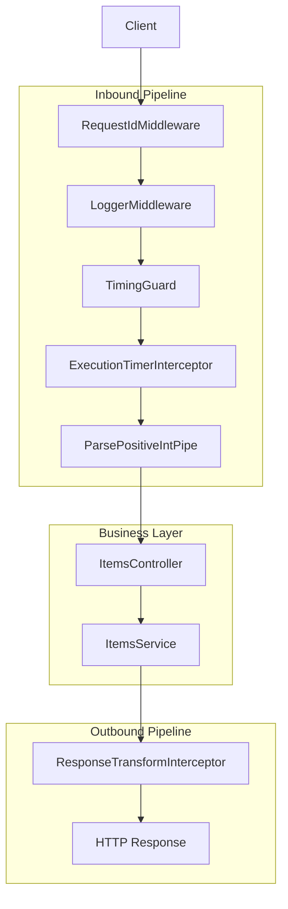
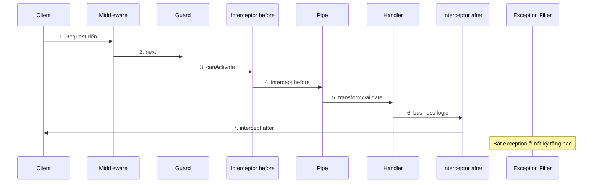

# title
Vòng đời Request trong NestJS

# description
Thực hành theo dõi hành trình của một HTTP request qua Middleware, Guard, Interceptor, Pipe, rồi vào Controller/Service để hiểu đúng thứ tự pipeline của NestJS.

# body

## 1. Lời mở đầu

"Tại sao cùng là request `GET /items/5` nhưng có lúc lỗi ở validation, có lúc lại lỗi ở business logic?" — một **Senior Engineer** hỏi khi debug production incident. Một **Mid-level Developer** trả lời: "Em sẽ đặt validation ở **Guard** hoặc **Interceptor**, chỗ nào tiện thì đặt." Câu trả lời cho thấy đúng nhận thức về các thành phần, nhưng vẫn thiếu chiều sâu về **pipeline order**: nếu không hiểu thứ tự cố định **Middleware → Guard → Interceptor → Pipe → Handler**, rất dễ đặt sai trách nhiệm giữa các tầng — gây bug "lúc chạy, lúc không" rất khó truy nguyên.

Bài này dẫn qua hai mạch liên tiếp:
- **Phần 2.1**: **thực hành** đồng bộ với repository trên GitHub; **stack** gồm **NestJS** thuần (không Docker), kèm **hai luồng** kiểm thử (wrapper response; **Pipe** validate trước **Controller**).
- **Phần 2.2**: **lý thuyết** làm rõ bản chất từng tầng trong **request pipeline** — trách nhiệm, thứ tự, và các **edge case** điển hình như đặt sai logic, **Exception Filter** scope, **Interceptor** execution order.

## 2. Các khái niệm cốt lõi

Cấu trúc bài học áp dụng phương pháp **Thực hành dẫn dắt Lý thuyết**. Khởi đầu, học viên sẽ trực tiếp clone source, chạy **NestJS** bằng `nest start --watch` và gọi API để quan sát **luồng request** đi qua từng tầng. Tiếp theo, **phần lý thuyết** sẽ hệ thống hóa **các khái niệm cốt lõi**, **mô hình pipeline** và phân tích các **edge cases** chuyên sâu — giúp đối chiếu và củng cố trực tiếp những kết quả vừa thực nghiệm tại **phần 2.1**.

### 2.1. Thực hành

#### 2.1.1. Chuẩn bị source code và môi trường

Mục đích: clone source demo và chạy **NestJS** trực tiếp trên máy để kiểm chứng **pipeline order** và trách nhiệm từng tầng xử lý request.

Source: [StarCi-Academy/fullstack-mastery-module-1-backend-environment-nestjs-introduction](https://github.com/StarCi-Academy/fullstack-mastery-module-1-backend-environment-nestjs-introduction) trên GitHub — thư mục bài học: [`1-request-lifecycle`](https://github.com/StarCi-Academy/fullstack-mastery-module-1-backend-environment-nestjs-introduction/tree/main/1-request-lifecycle).

```bash
# Bước 1: Clone repository về máy local
git clone https://github.com/StarCi-Academy/fullstack-mastery-module-1-backend-environment-nestjs-introduction.git

# Bước 2: Di chuyển vào đúng thư mục bài học
cd fullstack-mastery-module-1-backend-environment-nestjs-introduction/1-request-lifecycle
```

#### 2.1.2. Kiến trúc/thành phần (stack + luồng)

- **RequestIdMiddleware:** gắn `x-request-id` để truy vết request xuyên suốt pipeline.
- **LoggerMiddleware:** ghi access log sớm ở đầu request.
- **TimingGuard:** ghi nhận mốc thời gian vào pipeline.
- **ExecutionTimerInterceptor:** đo thời gian xử lý handler.
- **ResponseTransformInterceptor:** chuẩn hóa response wrapper (`data`, `timestamp`, `requestId`, `executionMs`).
- **ParsePositiveIntPipe:** validate/transform tham số `id` thành số nguyên dương.
- **ItemsController / ItemsService:** xử lý nghiệp vụ items.

| Thành phần | File | Vai trò |
| --- | --- | --- |
| **RequestIdMiddleware** | `src/common/middleware/` | Gắn `x-request-id` truy vết |
| **LoggerMiddleware** | `src/common/middleware/` | Access log sớm |
| **TimingGuard** | `src/common/guards/` | Ghi mốc thời gian |
| **ExecutionTimerInterceptor** | `src/common/interceptors/` | Đo execution time |
| **ResponseTransformInterceptor** | `src/common/interceptors/` | Chuẩn hóa response wrapper |
| **ParsePositiveIntPipe** | `src/common/pipes/` | Validate/transform `id` param |
| **ItemsController** | `src/items/items.controller.ts` | Nhận HTTP, delegate service |
| **ItemsService** | `src/items/items.service.ts` | Logic nghiệp vụ items |



Hình 1: Pipeline xử lý request từ inbound đến outbound.

#### 2.1.3. Chuẩn bị & khởi chạy

##### 2.1.3.1. Điều kiện cần trước

- **Node.js** LTS (khuyến nghị ≥ 18).
- **npm** hoặc **pnpm**.
- **NestJS CLI**: `npm i -g @nestjs/cli`.
- **Windows:** các lệnh API dùng **`Invoke-RestMethod`** (PowerShell). Xem song song **`curl`** cho macOS / Linux.

##### 2.1.3.2. Khởi động

```bash
# Bước 1: Cài dependency
npm install

# Bước 2: Khởi chạy ở chế độ watch
nest start --watch
```

Sau lệnh trên: terminal log hiển thị app đang lắng nghe tại **`http://localhost:3000`**.

#### 2.1.4. Kiểm thử

**2 luồng** dưới đây kiểm chứng hai mục tiêu: **(1)** wrapper response pipeline; **(2)** **Pipe** validate trước **Controller**.

- **Luồng 1:** Kiểm tra wrapper response — `GET /items`.
- **Luồng 2:** Kiểm tra Pipe trước Controller — `GET /items/5` và `GET /items/-1`.

##### 2.1.4.1. Luồng 1 — Kiểm tra wrapper response

- Bước 1: gọi `GET /items`.

  ```bash
  # Windows (PowerShell)
  Invoke-RestMethod -Uri http://localhost:3000/items

  # macOS / Linux
  # → Dán cURL vào Postman: Import → Raw text
  curl -s http://localhost:3000/items
  ```

  Response phải trả về (HTTP 200):

  ```json
  {
    "data": [
      { "id": 1, "name": "keyboard" },
      { "id": 2, "name": "mouse" }
    ],
    "timestamp": "<ISO-timestamp>",
    "requestId": "<uuid>",
    "executionMs": 1
  }
  ```

*Kết luận: Nếu response khớp format trên, hệ thống xác nhận:*

- *Contract output được chuẩn hóa — `ResponseTransformInterceptor` bọc dữ liệu controller vào `data`, kèm `timestamp`, `requestId`, `executionMs`.*
- *Pipeline hoạt động đúng thứ tự — middleware gắn `x-request-id`, interceptor đo thời gian và wrap response.*

##### 2.1.4.2. Luồng 2 — Kiểm tra Pipe trước Controller

- Bước 1: gọi `GET /items/5` (valid id).

  ```bash
  # Windows (PowerShell)
  Invoke-RestMethod -Uri http://localhost:3000/items/5

  # macOS / Linux
  # → Dán cURL vào Postman: Import → Raw text
  curl -s http://localhost:3000/items/5
  ```

  Response phải trả về (HTTP 200):

  ```json
  {
    "data": { "id": 5, "name": "item-5" },
    "timestamp": "<ISO-timestamp>",
    "requestId": "<uuid>",
    "executionMs": 1
  }
  ```

- Bước 2: gọi `GET /items/-1` (invalid id).

  ```bash
  # Windows (PowerShell)
  Invoke-RestMethod -Uri http://localhost:3000/items/-1

  # macOS / Linux
  # → Dán cURL vào Postman: Import → Raw text
  curl -s http://localhost:3000/items/-1
  ```

  Response phải trả về (HTTP 400):

  ```json
  {
    "message": "id must be a positive integer",
    "error": "Bad Request",
    "statusCode": 400
  }
  ```

*Kết luận: Nếu response khớp đúng 2 case trên, hệ thống xác nhận:*

- *Pipe chạy trước Controller — `ParsePositiveIntPipe` chặn `-1` và ném HTTP 400 ngay lập tức, không cho request vào `ItemsController`.*
- *Dữ liệu vào controller đảm bảo sạch — khi `id=5` hợp lệ, pipe pass và controller mới tiếp nhận.*

#### 2.1.5. Dọn tài nguyên

Bài này không sử dụng Docker, không cần dọn tài nguyên. Nhấn `Ctrl+C` trong terminal để dừng NestJS.

#### 2.1.6. Đọc thêm

- **Pipeline Order:** **NestJS** chạy pipeline theo thứ tự cố định: middleware → guard → interceptor (before) → pipe → handler → interceptor (after). Nếu hiểu nhầm thứ tự, bug sẽ khó truy nguyên. ([NestJS Docs](https://docs.nestjs.com/faq/request-lifecycle))
- **Pipe Transform:** **Pipe** validate và transform input trước khi vào controller. Nếu bỏ qua, service phải tự xử lý dữ liệu bẩn. ([NestJS Docs](https://docs.nestjs.com/pipes))
- **Guard Purpose:** **Guard** chỉ quyết định cho/không cho request đi tiếp. Nếu nhét nghiệp vụ vào guard, test sẽ khó viết. ([NestJS Docs](https://docs.nestjs.com/guards))
- **Interceptor Use Case:** **Interceptor** phù hợp cho cross-cutting concern (timing, response mapping). Nếu lạm dụng cho domain logic, flow khó dự đoán. ([NestJS Docs](https://docs.nestjs.com/interceptors))
- **Exception Filter:** **Exception filter** chuẩn hóa cách ánh xạ lỗi thành HTTP response. Nếu không có mapping thống nhất, frontend phải viết nhiều nhánh parse lỗi. ([NestJS Docs](https://docs.nestjs.com/exception-filters))
- **Route-Level Decorator:** `@UseGuards`, `@UseInterceptors`, `@Param` giúp cấu hình pipeline ngay tại route. ([NestJS Docs](https://docs.nestjs.com/controllers))

### 2.2. Lý thuyết — Request Pipeline trong NestJS

#### 2.2.1. Pipeline Order

Mỗi HTTP request đi vào **NestJS** sẽ tuần tự đi qua các tầng theo thứ tự cố định. Thứ tự này là **bất biến** — không thể thay đổi bằng code:



#### 2.2.2. Separation of Concerns

| Tầng | Trách nhiệm | Ném lỗi nếu |
| --- | --- | --- |
| **Middleware** | Cross-cutting: log, gắn header, CORS | Hiếm khi |
| **Guard** | Quyết định cho/không cho đi tiếp | 401/403 |
| **Interceptor (before)** | Can thiệp trước handler: timing, caching | Tùy logic |
| **Pipe** | Validate + transform input | 400 Bad Request |
| **Handler** | Xử lý nghiệp vụ (Controller → Service) | 404, 409, v.v. |
| **Interceptor (after)** | Can thiệp sau handler: wrap response | Tùy logic |
| **Exception Filter** | Bắt mọi exception, chuẩn hóa error response | — |

**Quy tắc then chốt:** mỗi tầng chỉ làm đúng trách nhiệm của mình. Nếu đặt sai (ví dụ: validate input trong **Guard** thay vì **Pipe**), code sẽ khó test và dễ bỏ sót edge case.

#### 2.2.3. Global vs Route-level Registration

- **Global:** đăng ký qua `app.useGlobalPipes()`, `app.useGlobalInterceptors()` — áp dụng cho mọi route.
- **Route-level:** đăng ký qua `@UseGuards()`, `@UseInterceptors()`, `@UsePipes()` — áp dụng cho route hoặc controller cụ thể.
- Trong bài học, `ResponseTransformInterceptor` đăng ký global (mọi route đều wrap response), còn `ParsePositiveIntPipe` đăng ký route-level (chỉ route cần validate `id`).

#### 2.2.4. Các trường hợp biên (edge cases) cần lưu ý

- **Đặt logic sai tầng:** Validate input trong **Guard** thay vì **Pipe** → guard không có access đến transform metadata, dẫn đến validation bị bypass ở một số route. **Giải pháp:** luôn dùng **Pipe** cho validation/transform.
- **Exception Filter scope:** Global filter bắt mọi exception, nhưng route-level filter chỉ bắt exception trong route đó. Nếu dùng lẫn lộn mà không hiểu scope, error response sẽ không nhất quán. **Giải pháp:** ưu tiên global filter, chỉ dùng route-level cho case đặc biệt.
- **Interceptor execution order:** Khi đăng ký nhiều interceptor, thứ tự `@UseInterceptors(A, B)` là A.before → B.before → handler → B.after → A.after (stack LIFO). Nếu nhầm thứ tự, timing hoặc response wrapping sẽ sai. **Giải pháp:** test thứ tự qua console.log.
- **Pipe không chạy với WebSocket/Microservice:** **Pipe** mặc định chỉ chạy với HTTP context. Nếu dùng WebSocket gateway mà expect pipe validate, request sẽ bypass validation. **Giải pháp:** đăng ký pipe riêng cho từng transport.

## 3. Tổng kết

### 3.1. Các câu hỏi dễ bị phỏng vấn

- **Câu hỏi 1:** Vì sao `ParsePositiveIntPipe` phải chạy trước `ItemsController.findOne()`?
  - Ý interviewer muốn nghe: tư duy fail-fast và tách validation khỏi business logic.
  - Trả lời mẫu (ngắn): **Pipe** chặn input sai ngay ở boundary, giúp controller/service chỉ xử lý dữ liệu sạch và trả lỗi 400 nhất quán.

- **Câu hỏi 2:** Nếu bỏ `ResponseTransformInterceptor`, frontend bị ảnh hưởng gì?
  - Ý interviewer muốn nghe: tính nhất quán API contract.
  - Trả lời mẫu (ngắn): Response giữa các route sẽ không đồng nhất, frontend phải xử lý nhiều shape dữ liệu khác nhau và khó truy vết theo `requestId`.

- **Câu hỏi 3:** Thứ tự thực thi pipeline trong **NestJS** là gì?
  - Ý interviewer muốn nghe: hiểu đúng trách nhiệm từng tầng.
  - Trả lời mẫu (ngắn): Middleware → Guard → Interceptor (before) → Pipe → Handler → Interceptor (after) → Exception Filter. Mỗi tầng có trách nhiệm riêng, không nên lẫn lộn.

# references
## 0
### alias
NestJS Request Lifecycle
### url
https://docs.nestjs.com/faq/request-lifecycle
## 1
### alias
NestJS Pipes
### url
https://docs.nestjs.com/pipes
## 2
### alias
NestJS Interceptors
### url
https://docs.nestjs.com/interceptors

# minutesRead
18
