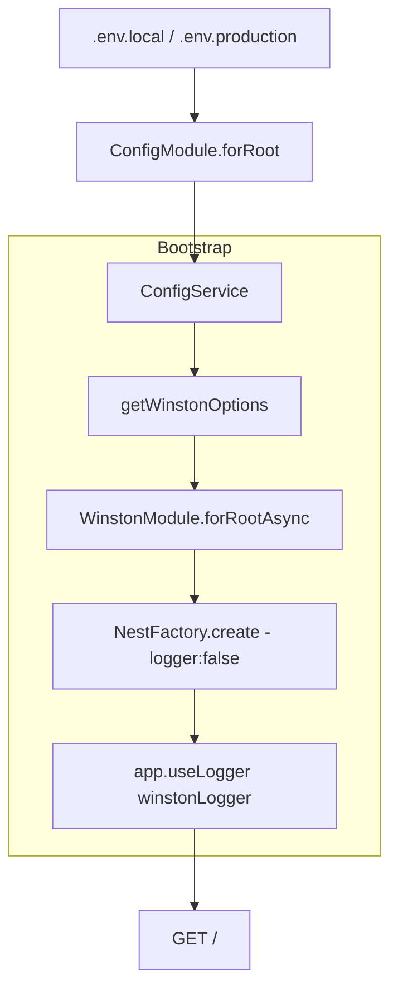

# title
Multi-environment Configuration and Production-ready Logging

# description
Hands-on setup of multi-environment app config using ConfigModule, replacing default logger with Winston, and validating different logging behavior between local and production.

# body

## 1. Opening

"Why does the same code produce different logs in production, and why are logs sometimes unreadable?" — a **Senior Engineer** asks while reviewing the logging system. A **Mid-level Developer** answers: "I'd use `console.log` and add `if (process.env.NODE_ENV === 'production')` conditions wherever needed." The answer shows awareness of environment-aware code, but still misses depth on **ConfigModule** namespace and **Logger pipeline**: without standardized config and logging from day one, deployment debugging becomes difficult, error tracing breaks down, and sensitive configuration is easier to leak — especially when scattered `console.log` calls have no unified format.

This lesson runs through two consecutive tracks:
- **Part 2.1**: **hands-on**, synchronized with the GitHub repository; the **stack** is pure **NestJS** (no Docker), with **two verification flows** (global logger override; local vs production config comparison).
- **Part 2.2**: **theory** clarifying the nature of **ConfigModule**, **registerAs namespace**, **Winston transport** — definitions, simple examples, and typical **edge cases** such as **envFilePath** priority, **logger fallback**, and **config validation**.

## 2. Core concepts

The lesson structure follows **practice-led theory**. First, learners clone the source, run **NestJS** via `nest start --watch`, and call APIs to observe the actual **config → logger bootstrap flow**. Then the **theory** section systematizes **core concepts**, **architecture models**, and analyzes in-depth **edge cases** — mapping directly to what was observed in **part 2.1**.

### 2.1. Hands-on

#### 2.1.1. Prepare source code and environment

Goal: clone the demo source and run **NestJS** directly on your machine to verify the **ConfigModule → WinstonModule → app.useLogger(...)** flow and compare behavior between local/production.

Source: [StarCi-Academy/fullstack-mastery-module-1-backend-environment-nestjs-introduction](https://github.com/StarCi-Academy/fullstack-mastery-module-1-backend-environment-nestjs-introduction) on GitHub — lesson directory: [`2-production-ready-config-and-logging`](https://github.com/StarCi-Academy/fullstack-mastery-module-1-backend-environment-nestjs-introduction/tree/main/2-production-ready-config-and-logging).

```bash
# Step 1: Clone the repository locally
git clone https://github.com/StarCi-Academy/fullstack-mastery-module-1-backend-environment-nestjs-introduction.git

# Step 2: Navigate to the lesson directory
cd fullstack-mastery-module-1-backend-environment-nestjs-introduction/2-production-ready-config-and-logging
```

#### 2.1.2. Architecture / components (stack + flow)

- **ConfigModule:** loads `.env` based on `envFilePath` priority — `.env.local` or `.env.production`.
- **ConfigFactory `registerAs('app')`:** creates typed namespace for `name`, `version`, `port`, `nodeEnv`.
- **WinstonModule.forRootAsync:** builds logger from runtime config.
- **Winston transports:** write logs to both console (`nestLike` format) and `logs/app.log` (JSON).
- **bootstrap.ts:** disables default logger, attaches `WINSTON_MODULE_NEST_PROVIDER`.
- **AppController / AppService:** endpoint `GET /` returns runtime config status.

| Component | File | Role |
| --- | --- | --- |
| **ConfigModule** | `@nestjs/config` | Loads environment variables |
| **ConfigFactory** | `src/config/app.config.ts` | Namespace `app` typed |
| **WinstonModule** | `nest-winston` | Global logger |
| **Console Transport** | Winston | Logs to terminal (`nestLike`) |
| **File Transport** | Winston | Logs to `logs/app.log` (JSON) |
| **bootstrap.ts** | `src/bootstrap.ts` | Overrides default logger |



Figure 1: Configuration and logger bootstrap flow by environment.

#### 2.1.3. Prerequisites and startup

##### 2.1.3.1. Prerequisites

- **Node.js** LTS (recommended ≥ 18).
- **npm** or **pnpm**.
- **NestJS CLI**: `npm i -g @nestjs/cli`.
- **Windows:** API commands use **`Invoke-RestMethod`** (PowerShell). See parallel **`curl`** for macOS / Linux.

##### 2.1.3.2. Start

```bash
# Step 1: Install dependencies
npm install

# Step 2: Start in watch mode (defaults to .env.local)
nest start --watch
```

After the command above: terminal logs show the app listening on **`http://localhost:3000`**, and the `logs/app.log` file is created automatically.

#### 2.1.4. Verification

**2 flows** below verify two goals: **(1)** global logger is overridden to **Winston**; **(2)** local vs production config comparison.

- **Flow 1:** Verify global logger override — `GET /` + check terminal/file logs.
- **Flow 2:** Compare local vs production — switch `envFilePath` in `app.module.ts`.

##### 2.1.4.1. Flow 1 — Verify global logger override

- Step 1: call `GET /` while app is running in local profile.

  ```bash
  # Windows (PowerShell)
  Invoke-RestMethod -Uri http://localhost:3000/

  # macOS / Linux
  # → Paste cURL into Postman: Import → Raw text
  curl -s http://localhost:3000/
  ```

  Expected response (HTTP 200):

  ```json
  {
    "message": "local - config-and-logging-ready",
    "env": "local",
    "appName": "local",
    "appVersion": "0.0.1",
    "appPort": 3000
  }
  ```

  Terminal should display logs in Winston `nestLike` format, and the same event should be written to `logs/app.log` as JSON.

*If the response matches and logs appear in both terminal and file:*

- *Global logger is overridden — `app.useLogger(winstonLogger)` in `bootstrap.ts` was applied successfully.*
- *Winston transports work correctly — logs fan out to console (`nestLike`) and file `logs/app.log` (JSON).*

##### 2.1.4.2. Flow 2 — Compare local vs production

- Step 1: keep `envFilePath` using `.env.local`, run the app and call `GET /`.

  ```bash
  # Windows (PowerShell)
  Invoke-RestMethod -Uri http://localhost:3000/

  # macOS / Linux
  # → Paste cURL into Postman: Import → Raw text
  curl -s http://localhost:3000/
  ```

  Local response must be:

  ```json
  {
    "message": "local - config-and-logging-ready",
    "env": "local",
    "appName": "local",
    "appVersion": "0.0.1",
    "appPort": 3000
  }
  ```

- Step 2: switch to production — open `src/app.module.ts`, uncomment `".env.production"` and comment out `".env.local"`:

  ```typescript
  ConfigModule.forRoot({
      isGlobal: true,
      envFilePath: [
          ".env.production",
          // ".env.local",
          ".env",
      ],
      load: [appConfig],
  }),
  ```

  Restart the app and call `GET /`.

  ```bash
  # Windows (PowerShell)
  Invoke-RestMethod -Uri http://localhost:3000/

  # macOS / Linux
  # → Paste cURL into Postman: Import → Raw text
  curl -s http://localhost:3000/
  ```

  Production response must be:

  ```json
  {
    "message": "production - config-and-logging-ready",
    "env": "production",
    "appName": "production",
    "appVersion": "0.0.1",
    "appPort": 3000
  }
  ```

*If the response changes correctly per profile:*

- *App identity is controlled via config — `ConfigModule` successfully loaded variables from the corresponding `.env` file.*
- *Codebase is independent of configuration — without any source code changes, the app's behavior automatically adapts to the environment.*

#### 2.1.5. Cleanup

This lesson does not use Docker, no resource cleanup is needed. Press `Ctrl+C` in the terminal to stop NestJS.

#### 2.1.6. Further reading

- **ConfigModule Scope:** `ConfigModule.forRoot({ isGlobal: true })` makes **ConfigService** available across all modules without repetitive imports. If `isGlobal` is missed, runtime DI errors occur. ([NestJS Docs](https://docs.nestjs.com/techniques/configuration))
- **envFilePath Priority:** `envFilePath` is evaluated in order; the first match for each key wins. If precedence is misunderstood, teams debug the wrong layer. ([NestJS Docs](https://docs.nestjs.com/techniques/configuration))
- **registerAs Namespace:** `registerAs('app', ...)` groups related keys under one namespace like `app.name`, `app.port` — avoids flat-key chaos. ([NestJS Docs](https://docs.nestjs.com/techniques/configuration#configuration-namespaces))
- **forRootAsync Logger:** `WinstonModule.forRootAsync()` builds logger configuration from runtime config, not hard-coded values. ([NestJS Docs](https://docs.nestjs.com/fundamentals/async-providers))
- **Nest Logger Override:** `NestFactory.create(..., { logger: false })` plus `app.useLogger(...)` routes all logs through one unified pipeline. ([NestJS Docs](https://docs.nestjs.com/techniques/logger))
- **Response Config Echo:** Returning `env` and `appName` in a status endpoint provides direct runtime config verification without guessing from terminal. ([NestJS Docs](https://docs.nestjs.com/controllers))

### 2.2. Theory — ConfigModule, Winston, and Logger Pipeline

#### 2.2.1. ConfigModule and Environment Management

**ConfigModule** from **NestJS** is the official solution for managing environment variables. Instead of scattered `process.env.XXX`, **ConfigModule** centralizes config and provides **type safety** via `registerAs()` namespace.

```typescript
// Config namespace "app" — typed, grouped, easy to refactor.
export default registerAs('app', () => ({
    name: process.env.APP_NAME ?? 'default',
    port: Number(process.env.PORT) || 3000,
}))
```

`envFilePath` allows specifying the priority order of `.env` files. The first key found is used — later files do not overwrite.

#### 2.2.2. Winston Logger and Transport Pattern

**Winston** is the most popular logging library in the Node.js ecosystem. In **NestJS**, `nest-winston` integrates **Winston** into the **IoC Container** via `WinstonModule.forRootAsync()`.

The **transport pattern** allows fan-out logging to multiple destinations simultaneously:
- **Console transport:** `nestLike` format for developer readability.
- **File transport:** JSON format for machine parsing and log aggregation.
- **Remote transport** (production): **Loki**, **Elasticsearch**, **CloudWatch**.

#### 2.2.3. Logger Override Pattern

**NestJS** has a default logger (console-based). To replace it with **Winston**:

1. Create app with `logger: false` — disables default logger.
2. Get `WINSTON_MODULE_NEST_PROVIDER` from the **IoC Container**.
3. Call `app.useLogger(winstonLogger)` — all **NestJS** internal logs (bootstrap, routing, lifecycle) go through **Winston**.

Result: a single logging pipeline, unified format, easy to aggregate.

#### 2.2.4. Edge cases to internalize

- **envFilePath order confusion:** If `.env.local` and `.env.production` both have `PORT=3000` but the order is wrong, the app uses the wrong profile. **Fix:** always place the highest-priority file first in the `envFilePath` array.
- **Logger fallback when transport fails:** If the file transport encounters permission errors (read-only filesystem), the app crashes at bootstrap. **Fix:** use `handleExceptions: true` and `exitOnError: false` in **Winston** options.
- **Missing config validation:** If `.env` is missing required variables (e.g., `DB_HOST`), the app starts but crashes when using config. **Fix:** use `validationSchema` (Joi) or a `validate` function in `ConfigModule.forRoot()` to fail fast at bootstrap.
- **Dual logger output:** If you forget `logger: false` when creating the app, both the **NestJS** default logger and **Winston** run simultaneously → duplicate logs. **Fix:** always use `logger: false` + `app.useLogger(...)`.

## 3. Wrap-up

### 3.1. Common interview questions

- **Question 1:** Why create the app with `logger: false` and then call `app.useLogger(...)`?
  - What interviewers want: single logging pipeline design.
  - Sample short answer: Disabling default logger prevents dual logger output and keeps all logs consistent through **Winston**.

- **Question 2:** If remote transport (Loki) connection fails in production, how should the app behave?
  - What interviewers want: graceful degradation strategy.
  - Sample short answer: Logger should fallback to console/file without crashing the app, while emitting alerts for operations follow-up.

- **Question 3:** What is the value of `ConfigModule.forRoot` plus namespaced config?
  - What interviewers want: config organization and coupling reduction.
  - Sample short answer: Namespaced config (`app`) reduces scattered env access, improves testability, and lowers deployment misconfiguration risk.

- **Question 4:** How does `envFilePath` work when there are multiple `.env` files?
  - What interviewers want: understanding of priority order.
  - Sample short answer: `envFilePath` reads in array order; the first key found is used — later files do not overwrite existing keys.

# references
## 0
### alias
NestJS Configuration
### url
https://docs.nestjs.com/techniques/configuration
## 1
### alias
Nest Winston
### url
https://github.com/gremo/nest-winston
## 2
### alias
NestJS Logger
### url
https://docs.nestjs.com/techniques/logger

# minutesRead
20
