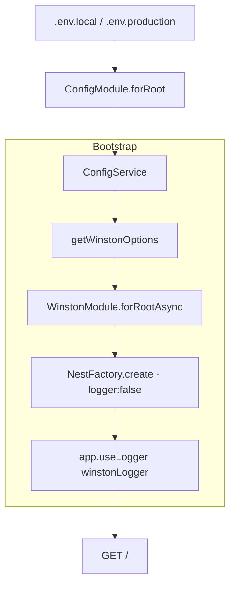

# title
Cấu hình đa môi trường và logging chuẩn production

# description
Thực hành cấu hình app theo nhiều môi trường bằng ConfigModule, thay logger mặc định bằng Winston, và kiểm tra hành vi log khác nhau giữa local và production.

# body

## 1. Lời mở đầu

"Vì sao cùng một code mà lên production log khác local, và đôi lúc không đọc nổi log?" — một **Senior Engineer** hỏi khi review hệ thống logging. Một **Mid-level Developer** trả lời: "Em sẽ dùng `console.log` và thêm điều kiện `if (process.env.NODE_ENV === 'production')` ở mỗi chỗ cần." Câu trả lời cho thấy nhận thức về environment-aware code, nhưng vẫn thiếu chiều sâu về **ConfigModule** namespace và **Logger pipeline**: nếu không chuẩn hóa config và logging từ đầu, khi deploy sẽ khó debug, khó truy vết lỗi, và dễ lộ cấu hình nhạy cảm — đặc biệt khi `console.log` rải rác không có format thống nhất.

Bài này dẫn qua hai mạch liên tiếp:
- **Phần 2.1**: **thực hành** đồng bộ với repository trên GitHub; **stack** gồm **NestJS** thuần (không Docker), kèm **hai luồng** kiểm thử (logger global override; so sánh local vs production config).
- **Phần 2.2**: **lý thuyết** làm rõ bản chất **ConfigModule**, **registerAs namespace**, **Winston transport** — định nghĩa, ví dụ đơn giản, và các **edge case** điển hình như **envFilePath** priority, **logger fallback**, **config validation**.

## 2. Các khái niệm cốt lõi

Cấu trúc bài học áp dụng phương pháp **Thực hành dẫn dắt Lý thuyết**. Khởi đầu, học viên sẽ trực tiếp clone source, chạy **NestJS** bằng `nest start --watch` và gọi API để quan sát **luồng bootstrap config → logger** thực tế. Tiếp theo, **phần lý thuyết** sẽ hệ thống hóa **các khái niệm cốt lõi**, **mô hình kiến trúc** và phân tích các **edge cases** chuyên sâu — giúp đối chiếu và củng cố trực tiếp những kết quả vừa thực nghiệm tại **phần 2.1**.

### 2.1. Thực hành

#### 2.1.1. Chuẩn bị source code và môi trường

Mục đích: clone source demo và chạy **NestJS** trực tiếp trên máy để kiểm chứng luồng **ConfigModule → WinstonModule → app.useLogger(...)** và so sánh hành vi giữa local/production.

Source: [StarCi-Academy/fullstack-mastery-module-1-backend-environment-nestjs-introduction](https://github.com/StarCi-Academy/fullstack-mastery-module-1-backend-environment-nestjs-introduction) trên GitHub — thư mục bài học: [`2-production-ready-config-and-logging`](https://github.com/StarCi-Academy/fullstack-mastery-module-1-backend-environment-nestjs-introduction/tree/main/2-production-ready-config-and-logging).

```bash
# Bước 1: Clone repository về máy local
git clone https://github.com/StarCi-Academy/fullstack-mastery-module-1-backend-environment-nestjs-introduction.git

# Bước 2: Di chuyển vào đúng thư mục bài học
cd fullstack-mastery-module-1-backend-environment-nestjs-introduction/2-production-ready-config-and-logging
```

#### 2.1.2. Kiến trúc/thành phần (stack + luồng)

- **ConfigModule:** nạp `.env` theo `envFilePath` priority — `.env.local` hoặc `.env.production`.
- **ConfigFactory `registerAs('app')`:** tạo namespace typed cho `name`, `version`, `port`, `nodeEnv`.
- **WinstonModule.forRootAsync:** khởi tạo logger từ config runtime.
- **Winston transports:** ghi log đồng thời ra console (format `nestLike`) và file `logs/app.log` (JSON).
- **bootstrap.ts:** tắt logger mặc định, gắn `WINSTON_MODULE_NEST_PROVIDER`.
- **AppController / AppService:** endpoint `GET /` trả về runtime config status.

| Thành phần | File | Vai trò |
| --- | --- | --- |
| **ConfigModule** | `@nestjs/config` | Nạp biến môi trường |
| **ConfigFactory** | `src/config/app.config.ts` | Namespace `app` typed |
| **WinstonModule** | `nest-winston` | Logger toàn cục |
| **Console Transport** | Winston | Log ra terminal (`nestLike`) |
| **File Transport** | Winston | Log ra `logs/app.log` (JSON) |
| **bootstrap.ts** | `src/bootstrap.ts` | Override logger mặc định |



Hình 1: Luồng khởi tạo cấu hình và logger theo môi trường.

#### 2.1.3. Chuẩn bị & khởi chạy

##### 2.1.3.1. Điều kiện cần trước

- **Node.js** LTS (khuyến nghị ≥ 18).
- **npm** hoặc **pnpm**.
- **NestJS CLI**: `npm i -g @nestjs/cli`.
- **Windows:** các lệnh API dùng **`Invoke-RestMethod`** (PowerShell). Xem song song **`curl`** cho macOS / Linux.

##### 2.1.3.2. Khởi động

```bash
# Bước 1: Cài dependency
npm install

# Bước 2: Khởi chạy ở chế độ watch (mặc định sử dụng .env.local)
nest start --watch
```

Sau lệnh trên: terminal log hiển thị app đang lắng nghe tại **`http://localhost:3000`**, đồng thời file `logs/app.log` được tạo tự động.

#### 2.1.4. Kiểm thử

**2 luồng** dưới đây kiểm chứng hai mục tiêu: **(1)** logger global đã được override thành **Winston**; **(2)** so sánh local vs production config.

- **Luồng 1:** Xác nhận logger global đã được override — `GET /` + kiểm tra terminal/file log.
- **Luồng 2:** So sánh local vs production — đổi `envFilePath` trong `app.module.ts`.

##### 2.1.4.1. Luồng 1 — Xác nhận logger global đã được override

- Bước 1: gọi `GET /` khi app đang chạy profile local.

  ```bash
  # Windows (PowerShell)
  Invoke-RestMethod -Uri http://localhost:3000/

  # macOS / Linux
  # → Dán cURL vào Postman: Import → Raw text
  curl -s http://localhost:3000/
  ```

  Response phải trả về (HTTP 200):

  ```json
  {
    "message": "local - config-and-logging-ready",
    "env": "local",
    "appName": "local",
    "appVersion": "0.0.1",
    "appPort": 3000
  }
  ```

  Đồng thời terminal phải xuất hiện log theo format `nestLike`, và cùng event đó được ghi vào `logs/app.log` dưới dạng JSON.

*Kết luận: Nếu response khớp và log xuất hiện ở cả terminal và file, hệ thống xác nhận:*

- *Logger global đã được override — `app.useLogger(winstonLogger)` trong `bootstrap.ts` áp dụng thành công.*
- *Winston transport hoạt động đúng — log fan-out ra console (`nestLike`) và file `logs/app.log` (JSON).*

##### 2.1.4.2. Luồng 2 — So sánh local vs production

- Bước 1: giữ `envFilePath` với `.env.local`, chạy app và gọi `GET /`.

  ```bash
  # Windows (PowerShell)
  Invoke-RestMethod -Uri http://localhost:3000/

  # macOS / Linux
  # → Dán cURL vào Postman: Import → Raw text
  curl -s http://localhost:3000/
  ```

  Response cho local phải là:

  ```json
  {
    "message": "local - config-and-logging-ready",
    "env": "local",
    "appName": "local",
    "appVersion": "0.0.1",
    "appPort": 3000
  }
  ```

- Bước 2: đổi sang production — mở `src/app.module.ts`, bỏ comment `".env.production"` và comment `".env.local"`:

  ```typescript
  ConfigModule.forRoot({
      isGlobal: true,
      envFilePath: [
          ".env.production",
          // ".env.local",
          ".env",
      ],
      load: [appConfig],
  }),
  ```

  Chạy lại app và gọi `GET /`.

  ```bash
  # Windows (PowerShell)
  Invoke-RestMethod -Uri http://localhost:3000/

  # macOS / Linux
  # → Dán cURL vào Postman: Import → Raw text
  curl -s http://localhost:3000/
  ```

  Response cho production phải là:

  ```json
  {
    "message": "production - config-and-logging-ready",
    "env": "production",
    "appName": "production",
    "appVersion": "0.0.1",
    "appPort": 3000
  }
  ```

*Kết luận: Nếu response thay đổi đúng theo profile, hệ thống xác nhận:*

- *Danh tính app được điều khiển qua config — `ConfigModule` nạp thành công biến từ file `.env` tương ứng.*
- *Codebase độc lập với cấu hình — không cần thay đổi source code, hành vi app tự động thích ứng với môi trường.*

#### 2.1.5. Dọn tài nguyên

Bài này không sử dụng Docker, không cần dọn tài nguyên. Nhấn `Ctrl+C` trong terminal để dừng NestJS.

#### 2.1.6. Đọc thêm

- **ConfigModule Scope:** `ConfigModule.forRoot({ isGlobal: true })` giúp inject **ConfigService** ở mọi module mà không import lặp. Nếu bỏ `isGlobal`, runtime sẽ báo không resolve được dependency. ([NestJS Docs](https://docs.nestjs.com/techniques/configuration))
- **envFilePath Priority:** `envFilePath` đọc theo thứ tự từ trên xuống, key đầu tiên match được dùng. Nếu không nắm thứ tự, debug sai hướng rất dễ xảy ra. ([NestJS Docs](https://docs.nestjs.com/techniques/configuration))
- **registerAs Namespace:** `registerAs('app', ...)` gom key theo namespace `app.name`, `app.port` — tránh key phẳng rải rác. ([NestJS Docs](https://docs.nestjs.com/techniques/configuration#configuration-namespaces))
- **forRootAsync Logger:** `WinstonModule.forRootAsync()` build logger options dựa trên config runtime, không hard-code. ([NestJS Docs](https://docs.nestjs.com/fundamentals/async-providers))
- **Nest Logger Override:** `NestFactory.create(..., { logger: false })` + `app.useLogger(...)` giúp toàn bộ log đi chung một pipeline thống nhất. ([NestJS Docs](https://docs.nestjs.com/techniques/logger))
- **Response Config Echo:** Trả `env` và `appName` từ status endpoint là kỹ thuật xác nhận config runtime mà không cần đoán qua terminal. ([NestJS Docs](https://docs.nestjs.com/controllers))

### 2.2. Lý thuyết — ConfigModule, Winston và Logger Pipeline

#### 2.2.1. ConfigModule và Environment Management

**ConfigModule** của **NestJS** là giải pháp chính thức để quản lý biến môi trường. Thay vì `process.env.XXX` rải rác, **ConfigModule** tập trung hóa config và cung cấp **type safety** qua `registerAs()` namespace.

```typescript
// Config namespace "app" — typed, gom nhóm, dễ refactor.
export default registerAs('app', () => ({
    name: process.env.APP_NAME ?? 'default',
    port: Number(process.env.PORT) || 3000,
}))
```

`envFilePath` cho phép chỉ định thứ tự ưu tiên file `.env`. Key đầu tiên tìm thấy sẽ được dùng — key sau không ghi đè.

#### 2.2.2. Winston Logger và Transport Pattern

**Winston** là thư viện logging phổ biến nhất trong Node.js ecosystem. Trong **NestJS**, `nest-winston` tích hợp **Winston** vào **IoC Container** qua `WinstonModule.forRootAsync()`.

**Transport pattern** cho phép fan-out log đến nhiều đích đồng thời:
- **Console transport:** format `nestLike` cho developer đọc dễ.
- **File transport:** format JSON cho machine parsing, log aggregation.
- **Remote transport** (production): **Loki**, **Elasticsearch**, **CloudWatch**.

#### 2.2.3. Logger Override Pattern

**NestJS** có logger mặc định (console-based). Để thay thế bằng **Winston**:

1. Tạo app với `logger: false` — tắt logger mặc định.
2. Lấy `WINSTON_MODULE_NEST_PROVIDER` từ **IoC Container**.
3. Gọi `app.useLogger(winstonLogger)` — toàn bộ internal log của **NestJS** (bootstrap, routing, lifecycle) đi qua **Winston**.

Kết quả: một pipeline logging duy nhất, format thống nhất, dễ aggregate.

#### 2.2.4. Các trường hợp biên (edge cases) cần lưu ý

- **envFilePath order confusion:** Nếu `.env.local` và `.env.production` đều có `PORT=3000` nhưng thứ tự sai, app dùng sai profile. **Giải pháp:** luôn đặt file ưu tiên cao nhất ở đầu mảng `envFilePath`.
- **Logger fallback khi transport lỗi:** Nếu file transport gặp lỗi quyền (read-only filesystem), app crash khi bootstrap. **Giải pháp:** dùng `handleExceptions: true` và `exitOnError: false` trong **Winston** options.
- **Config validation thiếu:** Nếu `.env` thiếu biến bắt buộc (ví dụ: `DB_HOST`), app khởi động nhưng crash khi dùng config. **Giải pháp:** dùng `validationSchema` (Joi) hoặc `validate` function trong `ConfigModule.forRoot()` để fail-fast lúc bootstrap.
- **Dual logger output:** Nếu quên `logger: false` khi tạo app, cả **NestJS** default logger và **Winston** đều chạy → log bị duplicate. **Giải pháp:** luôn `logger: false` + `app.useLogger(...)`.

## 3. Tổng kết

### 3.1. Các câu hỏi dễ bị phỏng vấn

- **Câu hỏi 1:** Vì sao `bootstrap.ts` tạo app với `logger: false` rồi mới `app.useLogger(...)`?
  - Ý interviewer muốn nghe: tránh chạy song song hai logger.
  - Trả lời mẫu (ngắn): Tắt logger mặc định để toàn bộ log đi qua một pipeline thống nhất (**Winston**), giúp format/transport nhất quán.

- **Câu hỏi 2:** Nếu remote transport (Loki) lỗi kết nối, app nên xử lý thế nào?
  - Ý interviewer muốn nghe: khả năng graceful degradation.
  - Trả lời mẫu (ngắn): Logger nên fallback về console/file và không làm app chết; đồng thời ghi cảnh báo để team vận hành xử lý.

- **Câu hỏi 3:** Lợi ích của `ConfigModule.forRoot` + namespace config là gì?
  - Ý interviewer muốn nghe: tổ chức config rõ ràng, giảm coupling.
  - Trả lời mẫu (ngắn): Gom config theo namespace (`app`) giúp tránh key rải rác, dễ test, dễ mở rộng và giảm lỗi cấu hình khi deploy.

- **Câu hỏi 4:** `envFilePath` hoạt động thế nào khi có nhiều file `.env`?
  - Ý interviewer muốn nghe: hiểu thứ tự ưu tiên.
  - Trả lời mẫu (ngắn): `envFilePath` đọc theo thứ tự mảng, key đầu tiên tìm thấy được dùng — file sau không ghi đè key đã có.

# references
## 0
### alias
NestJS Configuration
### url
https://docs.nestjs.com/techniques/configuration
## 1
### alias
Nest Winston
### url
https://github.com/gremo/nest-winston
## 2
### alias
NestJS Logger
### url
https://docs.nestjs.com/techniques/logger

# minutesRead
20
