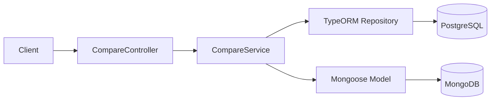
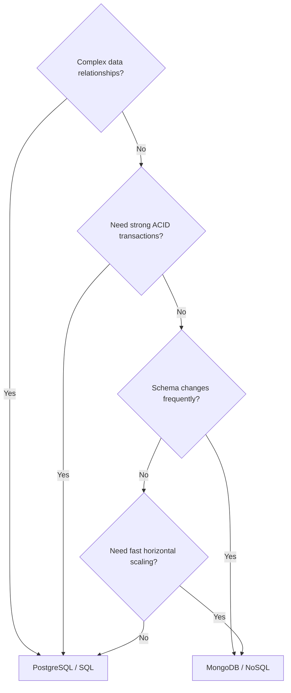

# title
<!-- @starci/seperator -->
SQL vs NoSQL in NestJS
<!-- @starci/seperator -->
# description
<!-- @starci/seperator -->
Hands-on comparison of PostgreSQL and MongoDB within the same NestJS application to understand when to choose SQL and when to choose NoSQL for each workload.
<!-- @starci/seperator -->
# body
<!-- @starci/seperator -->
## 1. Opening

*"We're storing order data -- why does one team pick **PostgreSQL** while another picks **MongoDB**?"* — a **Senior Engineer** asks. A **Mid-level Developer** replies: *"I'd go with **MongoDB** because it's trending and more flexible."*. The answer lacks depth: it only mentions **NoSQL** flexibility but skips **consistency**, **transactions**, and data relationships -- at scale, choosing the wrong engine leads to data loss, slow queries, or schema drift that only surface in production when it's too late.

This lesson ships **NestJS** + **PostgreSQL** (Docker) + **MongoDB** (Docker), with **5 verification flows** (parallel write; parallel read; side-by-side comparison; latency measurement; polyglot cleanup). **Part 2.1**: **hands-on** synchronized with the GitHub repository. **Part 2.2**: **theory** clarifying the nature of **SQL vs NoSQL** -- overall comparison, decision tree, and typical **edge cases** such as **schema drift**, **N+1 queries**, and **polyglot persistence**.

## 2. Core concepts

This lesson follows **practice-led theory**. Students first clone the source, start infra via **Docker Compose**, run **NestJS** via `nest start --watch`, and call the API to observe **polyglot persistence** in practice. The theory part then consolidates core concepts, architecture model, and deep edge cases.

### 2.1. Hands-on

#### 2.1.1. Prepare source code and environment

Goal: clone the demo source and run **NestJS** with **PostgreSQL** + **MongoDB** to observe the same domain (order) implemented in parallel across two engines.

Source: [StarCi-Academy/fullstack-mastery-module-1-database-integration-and-caching](https://github.com/StarCi-Academy/fullstack-mastery-module-1-database-integration-and-caching) on GitHub -- lesson directory: [`0-sql-vs-nosql-in-nestjs`](https://github.com/StarCi-Academy/fullstack-mastery-module-1-database-integration-and-caching/tree/main/0-sql-vs-nosql-in-nestjs).

```bash
# Step 1: Clone the repository locally
git clone https://github.com/StarCi-Academy/fullstack-mastery-module-1-database-integration-and-caching.git

# Step 2: Navigate to the lesson directory
cd fullstack-mastery-module-1-database-integration-and-caching/0-sql-vs-nosql-in-nestjs
```

#### 2.1.2. Architecture / components (stack + flow)

- **PostgreSQL (Docker):** SQL engine for the **TypeORM** branch.
- **MongoDB (Docker):** document engine for the **Mongoose** branch.
- **CompareController / CompareService:** single HTTP entry for comparison flow -- calls SQL and NoSQL branches in parallel.
- **TypeORM Repository:** maps table entities to **PostgreSQL**.
- **Mongoose Model:** maps documents to **MongoDB**.

| Component | File | Role |
| --- | --- | --- |
| **PostgreSQL** | `.docker/compose.yaml` | SQL storage (TypeORM) |
| **MongoDB** | `.docker/compose.yaml` | NoSQL storage (Mongoose) |
| **CompareController** | `backend/src/compare/compare.controller.ts` | Receives HTTP, delegates to service |
| **CompareService** | `backend/src/compare/compare.service.ts` | Parallel read/write across 2 engines |
| **TypeORM Repository** | `@nestjs/typeorm` | CRUD PostgreSQL |
| **Mongoose Model** | `@nestjs/mongoose` | CRUD MongoDB |



Figure 1: Data comparison flow between SQL and NoSQL.

#### 2.1.3. Prerequisites and startup

##### 2.1.3.1. Prerequisites

- **Node.js** LTS (recommended ≥ 18).
- **npm** or **pnpm**.
- **NestJS CLI**: `npm i -g @nestjs/cli`.
- **Docker Desktop** (or Docker Engine) + `docker compose`.
- **Windows:** use **`Invoke-RestMethod`** instead of **`curl`**.

> **Note:** The repo ships with env defaults via **ConfigModule**; you do not need to create or edit **.env** when running the system. Only modify this file if you want to run the service with custom ports/credentials.

##### 2.1.3.2. Start

```bash
# Step 1: Start PostgreSQL + MongoDB
docker compose -f .docker/compose.yaml up -d

# Step 2: Install dependencies
npm install

# Step 3: Start in watch mode
nest start --watch
```

After the command above: terminal logs show the app listening on **`http://localhost:3000`**.

#### 2.1.4. Verification

**5 flows** below verify five goals: **(1)** parallel write to both engines; **(2)** read both engines in parallel; **(3)** side-by-side comparison of SQL vs NoSQL result sets; **(4)** measure latency between SQL and NoSQL; **(5)** polyglot cleanup across both engines.

- **Flow 1:** Write sample data -- `POST /compare/write`.
- **Flow 2:** Read both engines in parallel -- `GET /compare/read`.
- **Flow 3:** Side-by-side comparison -- assert `sqlCount === noSqlCount` and titles match on the same `GET /compare/read` payload.
- **Flow 4:** Parallel latency measurement -- `GET /compare/timings`.
- **Flow 5:** Polyglot cleanup -- `DELETE /compare/all`.

##### 2.1.4.1. Flow 1 -- Write sample data (one command, two persistence)

- Step 1: call `POST /compare/write`.

  ```bash
  # Windows (PowerShell)
  Invoke-RestMethod -Uri http://localhost:3000/compare/write -Method Post -ContentType "application/json" -Body '{"title":"Order #1","amount":100}'

  # macOS / Linux
  # → Paste cURL into Postman: Import → Raw text
  curl -s -X POST http://localhost:3000/compare/write \
  -H "Content-Type: application/json" \
  -d '{"title":"Order #1","amount":100}'
  ```

  Expected response (HTTP 200):

  ```json
  {
    "message": "Saved to both SQL and NoSQL stores.",
    "sql": {
      "id": "<uuid>",
      "title": "Order #1",
      "amount": 100,
      "createdAt": "<ISO datetime>"
    },
    "noSql": {
      "id": "<mongo object id>",
      "title": "Order #1",
      "amount": 100,
      "createdAt": "<ISO datetime>"
    }
  }
  ```

*Conclusion: If the response matches the JSON above, the system confirms:*

- *Same business logic, different data stores -- the order creation request was saved in parallel to both **PostgreSQL** and **MongoDB**.*
- *Identifier difference -- SQL returns `id` as UUID, NoSQL returns `_id` as ObjectId.*

##### 2.1.4.2. Flow 2 -- Read both engines in parallel

- Step 1: call `GET /compare/read`.

  ```bash
  # Windows (PowerShell)
  Invoke-RestMethod -Uri http://localhost:3000/compare/read

  # macOS / Linux
  # → Paste cURL into Postman: Import → Raw text
  curl -s http://localhost:3000/compare/read
  ```

  Expected response (HTTP 200):

  ```json
  {
    "sqlCount": 1,
    "noSqlCount": 1,
    "sqlItems": [
      { "id": "<uuid>", "title": "Order #1", "amount": 100, "createdAt": "<ISO datetime>" }
    ],
    "noSqlItems": [
      { "_id": "<mongo object id>", "title": "Order #1", "amount": 100, "createdAt": "<ISO datetime>" }
    ]
  }
  ```

*Conclusion: If the response matches the JSON above, the system confirms:*

- *Concurrent multi-platform reads -- the controller fires `Promise.all([sqlService.findAll(), noSqlService.findAll()])` so both stores answer in a single request.*
- *Both arrays populated -- proves the underlying TypeORM repository and Mongoose model are both connected and the polyglot read path is wired end-to-end.*

##### 2.1.4.3. Flow 3 -- Side-by-side comparison (counts + titles match)

- Step 1: re-use the `GET /compare/read` payload from Flow 2 and assert that the two stores hold the same logical dataset.

  ```bash
  # Windows (PowerShell)
  $r = Invoke-RestMethod -Uri http://localhost:3000/compare/read
  if ($r.sqlCount -eq $r.noSqlCount -and $r.sqlItems[0].title -eq $r.noSqlItems[0].title) { "MATCH" } else { "MISMATCH" }

  # macOS / Linux
  # → Paste cURL into Postman: Import → Raw text
  curl -s http://localhost:3000/compare/read | jq '.sqlCount == .noSqlCount and .sqlItems[0].title == .noSqlItems[0].title'
  ```

  Expected output:

  ```
  MATCH       # PowerShell
  true        # curl + jq
  ```

*Conclusion: If the assertion holds, the system confirms:*

- *Parallel writes from Flow 1 produced equivalent logical records -- the two engines now hold the same `title`/`amount` payload despite different identifier shapes (`id` UUID vs `_id` ObjectId).*
- *Query result shape differences are surface-level only -- the business-meaningful fields line up, which is the property polyglot persistence relies on for read fan-out.*

##### 2.1.4.4. Flow 4 -- Parallel latency measurement SQL vs NoSQL

- Purpose: demonstrate how to benchmark latency in code so polyglot decisions are backed by quantitative data.
- Step 1: call `GET /compare/timings`.

  ```bash
  # Windows (PowerShell)
  Invoke-RestMethod -Uri http://localhost:3000/compare/timings

  # macOS / Linux
  # → Paste cURL into Postman: Import → Raw text
  curl -s http://localhost:3000/compare/timings
  ```

  Expected response (HTTP 200):

  ```json
  {
    "sqlMs": 12.435,
    "noSqlMs": 7.812,
    "deltaMs": 4.623
  }
  ```

*Conclusion: If the response matches the JSON above, the system confirms:*

- *In-code benchmarking is possible -- use `performance.now()` to capture sub-millisecond precision.*
- *`deltaMs > 0` means NoSQL is faster than SQL on this workload; `< 0` means SQL is faster -- quantitative evidence for polyglot decisions.*

##### 2.1.4.5. Flow 5 -- Polyglot cleanup across both engines

- Purpose: demonstrate atomic-bounded cleanup -- PG uses `TRUNCATE` inside a transaction, Mongo uses `deleteMany({})`.
- Step 1: call `DELETE /compare/all`.

  ```bash
  # Windows (PowerShell)
  Invoke-RestMethod -Uri http://localhost:3000/compare/all -Method Delete

  # macOS / Linux
  # → Paste cURL into Postman: Import → Raw text
  curl -s -X DELETE http://localhost:3000/compare/all
  ```

  Expected response (HTTP 200):

  ```json
  {
    "pgDeleted": 2,
    "mongoDeleted": 2
  }
  ```

*Conclusion: If the response matches the JSON above, the system confirms:*

- *Multi-engine cleanup requires a dedicated API -- there is no cross-engine "TRUNCATE ALL"; each store has its own semantics.*
- *PG TRUNCATE runs inside a transaction for atomicity; Mongo `deleteMany` has no default transaction, so we call PG first then Mongo sequentially.*

#### 2.1.5. Cleanup

Once you finish the lesson, you may clean up resources to free memory.

```bash
# Step 1: Stop the server
# Windows / macOS / Linux
Ctrl + C

# Step 2: Shut down Docker
docker compose -f .docker/compose.yaml down -v
```

#### 2.1.6. Further reading

- **Polyglot Persistence:** Using multiple database types optimizes each workload. Without workload separation, the system bottlenecks at one storage layer. ([Martin Fowler](https://martinfowler.com/bliki/PolyglotPersistence.html))
- **SQL vs NoSQL Trade-offs:** SQL excels at consistency and relationships; NoSQL excels at flexible schemas and document scaling. ([MongoDB Docs](https://www.mongodb.com/resources/basics/databases/sql-vs-nosql))
- **PostgreSQL MVCC:** Foundation for safe concurrency when multiple transactions run simultaneously. ([PostgreSQL Docs](https://www.postgresql.org/docs/current/mvcc.html))
- **Mongoose Schema Design:** Correct schema design (embed/reference, index) directly impacts query performance. ([Mongoose Docs](https://mongoosejs.com/docs/guide.html))
- **TypeORM Repository Pattern:** Repository separates data access from business logic. ([TypeORM Docs](https://typeorm.io/repository-api))

### 2.2. Theory -- SQL vs NoSQL

#### 2.2.1. Overall comparison

| Criteria | SQL (PostgreSQL) | NoSQL (MongoDB) |
| --- | --- | --- |
| **Data model** | Tables, rows, columns | Documents (JSON-like), Collections |
| **Schema** | Schema-on-write -- defined upfront | Schema-on-read -- flexible |
| **Relationships** | Strong JOINs, Foreign Keys | Embedding or Referencing |
| **Transactions** | Full ACID | Supported but not default |
| **Scaling** | Primarily vertical | Horizontal (sharding) natively |

#### 2.2.2. Decision Tree -- When to choose SQL vs NoSQL



- **Choose SQL:** financial orders (ACID), ERP (complex relations), stable schemas.
- **Choose NoSQL:** logging/analytics (flexible schema), social feeds (nested documents), IoT (horizontal scale).
- **Polyglot Persistence:** many systems use **both** -- SQL for core business, NoSQL for cache/search/log.

#### 2.2.3. Edge cases to internalize

- **Wrong engine for workload:** Using **MongoDB** for financial data requiring ACID → consistency loss. **Fix:** always evaluate consistency vs flexibility before choosing.
- **N+1 query with populate (MongoDB):** Deeply nested populate → performance drops. **Fix:** use aggregation pipeline or embed documents.
- **Schema drift in NoSQL:** No schema validation → old and new documents have different shapes. **Fix:** use Mongoose schema validation.
- **MongoDB transactions:** Not used by default. Need multi-document atomicity → enable replica set. **Fix:** configure replica set from development.

## 3. Wrap-up

### 3.1. Common interview questions

- **Question 1:** When should you prefer **PostgreSQL** over **MongoDB**?
  - What interviewers want to hear: reasoning about consistency, transactions, and data relationships.
  - Sample answer (concise): Prefer **PostgreSQL** when strong ACID, complex relationships, and strict schema constraints are required.

- **Question 2:** When is **MongoDB** a reasonable choice?
  - What interviewers want to hear: reasoning about flexible schemas and document scaling.
  - Sample answer (concise): Use **MongoDB** when schema changes frequently, data is document-shaped, and flexible scaling is needed.

- **Question 3:** Should you use both SQL and NoSQL in one system?
  - What interviewers want to hear: ability to apply polyglot persistence.
  - Sample answer (concise): Yes, if domains/workloads are clearly separated and the team accepts additional operational cost.
<!-- @starci/seperator -->
# codeExplaining

## 0

### code
<!-- @starci/seperator -->
```typescript
@Entity("comparison_items")
export class SqlComparisonItemEntity {
    @PrimaryGeneratedColumn("uuid")
        id!: string

    @Column({
        type: "varchar", length: 255 
    })
        title!: string

    @Column({
        type: "double precision" 
    })
        amount!: number

    @CreateDateColumn({
        type: "timestamptz" 
    })
        createdAt!: Date
}
```
<!-- @starci/seperator -->
### explain
<!-- @starci/seperator -->
Declaring each column with a concrete physical type (`varchar(255)`, `double precision`, `timestamptz`) is the **PostgreSQL** strength — the database itself rejects writes with the wrong shape, protecting data from application bugs. `@PrimaryGeneratedColumn("uuid")` lets the DB mint the PK so multiple service instances can insert concurrently without coordination. `@CreateDateColumn` makes the insert timestamp a **declarative** DB constraint — equivalent NoSQL solutions push that responsibility into application code.
<!-- @starci/seperator -->
## 1

### code
<!-- @starci/seperator -->
```typescript
@Schema({
    collection: "comparison_items", timestamps: true 
})
export class NoSqlComparisonItem {
    @Prop({
        required: true, trim: true 
    })
        title!: string

    @Prop({
        required: true 
    })
        amount!: number

    // Mongoose tự tạo khi timestamps: true.
    // (EN: Automatically added by Mongoose when timestamps is enabled.)
    createdAt?: Date
    updatedAt?: Date
}

export const NoSqlComparisonItemSchema =
    SchemaFactory.createForClass(NoSqlComparisonItem)
```
<!-- @starci/seperator -->
### explain
<!-- @starci/seperator -->
The same "item" concept but the **MongoDB** schema is looser — no length declaration, no `varchar(255)`, validation happens at the **Mongoose** layer rather than the database. `timestamps: true` delegates `createdAt`/`updatedAt` to Mongoose: terse to write, but anything bypassing Mongoose (e.g. raw `mongo` shell writes) will skip them. `SchemaFactory.createForClass` compiles the decorator metadata into a runtime **Mongoose Schema** so **NestJS** can register it via `MongooseModule.forFeature`.
<!-- @starci/seperator -->
## 2

### code
<!-- @starci/seperator -->
```typescript
async write(dto: CreateCompareDto) {
    // Lưu song song để giảm độ trễ và giữ cùng thời điểm test giữa 2 storage.
    // (EN: Save in parallel to reduce latency and keep comparison timing consistent.)
    const [sqlRecord,
        noSqlRecord] = await Promise.all([
        this.sqlRepository.save(this.sqlRepository.create(dto)),
        this.noSqlModel.create(dto),
    ])

    // Chuẩn hóa response để phía content/docs có thể đối chiếu field rõ ràng.
    // (EN: Normalize response fields for straightforward content/docs verification.)
    return {
        message: "Saved to both SQL and NoSQL stores.",
        sql: {
            id: sqlRecord.id,
            title: sqlRecord.title,
            amount: sqlRecord.amount,
            createdAt: sqlRecord.createdAt,
        },
        noSql: {
            id: noSqlRecord._id.toString(),
            title: noSqlRecord.title,
            amount: noSqlRecord.amount,
            createdAt: noSqlRecord.createdAt,
        },
    }
}
```
<!-- @starci/seperator -->
### explain
<!-- @starci/seperator -->
`Promise.all` fans out the two writes in parallel so latency comparison is fair — running them sequentially would bias the slower DB. This is **not** a distributed transaction: if Mongo fails after Postgres commits, the two stores diverge — section 2.2 introduces **Saga** for that case. The `.toString()` call on `ObjectId` normalises the response shape so docs/tests can diff Mongo's `_id` against Postgres's UUID directly.
<!-- @starci/seperator -->
# codeImplementations

## 0

### lang
<!-- @starci/seperator -->
csharp
<!-- @starci/seperator -->
### guide
<!-- @starci/seperator -->
Use **EF Core 8** for SQL (Postgres provider `Npgsql.EntityFrameworkCore.PostgreSQL`) and **`MongoDB.Driver`** for NoSQL — wire both in `Program.cs` via `AddDbContext` + `AddSingleton<IMongoClient>`.

**Mapping API:**
- `TypeOrmModule.forRoot + InjectRepository` → `services.AddDbContext<AppDbContext>(o => o.UseNpgsql(connString))` + inject `AppDbContext` then `ctx.Items.Add(item); await ctx.SaveChangesAsync()`.
- `MongooseModule.forRoot + InjectModel` → `services.AddSingleton<IMongoClient>(new MongoClient(uri))` + `client.GetDatabase("db").GetCollection<Item>("comparison_items")`.
- `Promise.all([sql, mongo])` → `await Task.WhenAll(sqlTask, mongoTask)`.

**Differences and gotchas:**
- EF Core has no `synchronize: true` — always `dotnet ef migrations add` to generate DDL before deploying.
- `MongoDB.Driver` POCO mapping uses `[BsonElement("title")]` attributes, not decorator-style metadata like Mongoose; `[BsonId, BsonRepresentation(BsonType.ObjectId)] public string Id` normalises `_id` to a plain string.
- `Task.WhenAll` does not cancel siblings on failure — wire a `CancellationTokenSource` for fail-fast.
<!-- @starci/seperator -->
### example
<!-- @starci/seperator -->
```csharp
public class Item {
    public Guid Id { get; set; }
    [MaxLength(255)] public string Title { get; set; } = "";
    public double Amount { get; set; }
    public DateTime CreatedAt { get; set; }
}

var sqlTask = Task.Run(async () => {
    ctx.Items.Add(new Item { Title = dto.Title, Amount = dto.Amount, CreatedAt = DateTime.UtcNow });
    await ctx.SaveChangesAsync();
});
var coll = mongoClient.GetDatabase("starci_nosql_db").GetCollection<Item>("comparison_items");
var mongoTask = coll.InsertOneAsync(new Item { Title = dto.Title, Amount = dto.Amount, CreatedAt = DateTime.UtcNow });
await Task.WhenAll(sqlTask, mongoTask);
```
<!-- @starci/seperator -->
## 1

### lang
<!-- @starci/seperator -->
typescript
<!-- @starci/seperator -->
### guide
<!-- @starci/seperator -->
Use **Express** + the raw `pg` driver for Postgres and the raw `mongodb` driver for Mongo — no TypeORM/Mongoose, every SQL/document written by hand so the learner sees what the abstraction was hiding.

**Mapping API:**
- `TypeOrmModule.forRoot + InjectRepository` → `const pgPool = new Pool({ connectionString })` then `pgPool.query("INSERT INTO comparison_items(...) VALUES (...) RETURNING *", [...])`.
- `MongooseModule.forRoot + InjectModel` → `new MongoClient(uri).connect()` then `client.db("starci_nosql_db").collection("comparison_items")`.
- `Promise.all([sql, mongo])` → keep plain JS `Promise.all`.

**Differences and gotchas:**
- No decorator mapping → you write `INSERT` manually and `RETURNING *` to recover `id` + `createdAt` (Postgres-generated).
- The native Mongo driver does not auto-add `createdAt`/`updatedAt` — set `new Date()` explicitly before insert.
- Pool/client must be created **once** at module level — never `new MongoClient` per request (connection leak).
<!-- @starci/seperator -->
### example
<!-- @starci/seperator -->
```typescript
import express from "express"
import { Pool } from "pg"
import { MongoClient } from "mongodb"

const pgPool = new Pool({ connectionString: process.env.POSTGRES_URL })
const mongo = await new MongoClient(process.env.MONGO_URI!).connect()
const coll = mongo.db("starci_nosql_db").collection("comparison_items")

const app = express()
app.use(express.json())
app.post("/compare/write", async (req, res) => {
    const { title, amount } = req.body as { title: string; amount: number }
    const [sqlRes, mongoRes] = await Promise.all([
        pgPool.query<{ id: string; created_at: Date }>(
            "INSERT INTO comparison_items(title, amount) VALUES ($1, $2) RETURNING id, created_at",
            [title, amount],
        ),
        coll.insertOne({ title, amount, createdAt: new Date() }),
    ])
    res.json({
        message: "Saved to both SQL and NoSQL stores.",
        sql: { id: sqlRes.rows[0].id, title, amount, createdAt: sqlRes.rows[0].created_at },
        noSql: { id: mongoRes.insertedId.toString(), title, amount, createdAt: new Date() },
    })
})
```
<!-- @starci/seperator -->
## 2

### lang
<!-- @starci/seperator -->
go
<!-- @starci/seperator -->
### guide
<!-- @starci/seperator -->
Use **`gorm.io/driver/postgres`** for SQL and **`go.mongodb.org/mongo-driver`** for NoSQL in the same binary — Go has no DI container, so clients are wired manually in `main.go`.

**Mapping API:**
- `TypeOrmModule.forRoot + InjectRepository` → `gorm.Open(postgres.Open(dsn))` + `db.Create(&item)`.
- `MongooseModule.forRoot + InjectModel` → `mongo.Connect(ctx, options.Client().ApplyURI(uri))` + `coll.InsertOne(ctx, doc)`.
- `Promise.all([sql, mongo])` → `errgroup.Group` with two `g.Go(...)` then `g.Wait()`.

**Differences and gotchas:**
- No decorators in Go → struct tag `gorm:"primaryKey;type:uuid"` replaces `@PrimaryGeneratedColumn`.
- Mongo driver does not auto-add `createdAt`/`updatedAt` — set them manually or use `bson:",omitempty"` + a helper.
- `errgroup` cancels the context when one branch fails, useful to avoid hanging on a slow DB.
<!-- @starci/seperator -->
### example
<!-- @starci/seperator -->
```go
type Item struct {
    ID        string    `gorm:"primaryKey;type:uuid;default:gen_random_uuid()"`
    Title     string    `gorm:"size:255"`
    Amount    float64
    CreatedAt time.Time
}
g, ctx := errgroup.WithContext(ctx)
g.Go(func() error { return pgDB.Create(&Item{Title: dto.Title, Amount: dto.Amount}).Error })
g.Go(func() error {
    _, err := mongoColl.InsertOne(ctx, bson.M{"title": dto.Title, "amount": dto.Amount, "createdAt": time.Now()})
    return err
})
err := g.Wait()
```
<!-- @starci/seperator -->
## 3

### lang
<!-- @starci/seperator -->
java
<!-- @starci/seperator -->
### guide
<!-- @starci/seperator -->
**Spring Data JPA** (Hibernate) for SQL and **Spring Data MongoDB** for NoSQL — same application context, two separate repository interfaces.

**Mapping API:**
- `@Entity` JPA + `JpaRepository<Item, UUID>` replaces TypeORM `@Entity` + `Repository<Item>`.
- `@Document` Spring Data MongoDB + `MongoRepository<Item, String>` replaces Mongoose `@Schema` + `Model<ItemDocument>`.
- `Promise.all` → `CompletableFuture.allOf(sqlFuture, mongoFuture).join()`.

**Differences and gotchas:**
- Spring Data auto-generates repository beans — declare the interface only, no manual wiring.
- JPA/Hibernate flushes lazily at the `@Transactional` boundary; without `@Transactional`, `save()` is not guaranteed committed by the time the method returns.
- Spring Data MongoDB uses `@Indexed` instead of Mongoose's `index: true` — indexes are created at startup, not runtime.
<!-- @starci/seperator -->
### example
<!-- @starci/seperator -->
```java
@Entity @Table(name = "comparison_items")
public class Item { @Id @GeneratedValue UUID id; @Column(length=255) String title; double amount; @CreationTimestamp Instant createdAt; }
@Document(collection = "comparison_items")
public class ItemDoc { @Id String id; String title; double amount; Instant createdAt; }

CompletableFuture<Void> sql = CompletableFuture.runAsync(() -> jpaRepo.save(new Item(dto.title(), dto.amount())));
CompletableFuture<Void> mongo = CompletableFuture.runAsync(() -> mongoRepo.save(new ItemDoc(dto.title(), dto.amount(), Instant.now())));
CompletableFuture.allOf(sql, mongo).join();
```
<!-- @starci/seperator -->
# references
## 0
### alias
<!-- @starci/seperator -->
MongoDB - SQL vs NoSQL Databases
<!-- @starci/seperator -->
### url
<!-- @starci/seperator -->
https://www.mongodb.com/resources/basics/databases/sql-vs-nosql
<!-- @starci/seperator -->

## 1
### alias
<!-- @starci/seperator -->
TypeORM Documentation
<!-- @starci/seperator -->
### url
<!-- @starci/seperator -->
https://typeorm.io
<!-- @starci/seperator -->

## 2
### alias
<!-- @starci/seperator -->
Mongoose Documentation
<!-- @starci/seperator -->
### url
<!-- @starci/seperator -->
https://mongoosejs.com
<!-- @starci/seperator -->

# minutesRead
<!-- @starci/seperator -->
18
<!-- @starci/seperator -->
# isPremium
<!-- @starci/seperator -->
false
<!-- @starci/seperator -->
