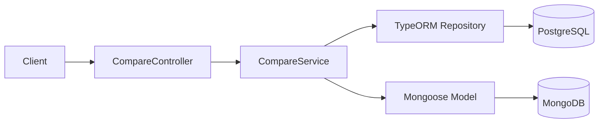
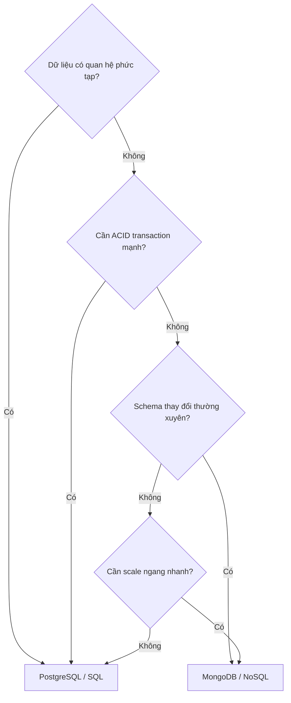

# title
<!-- @starci/seperator -->
SQL và NoSQL trong NestJS
<!-- @starci/seperator -->
# description
<!-- @starci/seperator -->
Thực hành so sánh PostgreSQL và MongoDB trong cùng một ứng dụng NestJS để hiểu khi nên chọn SQL và khi nên chọn NoSQL theo từng workload.
<!-- @starci/seperator -->
# body
<!-- @starci/seperator -->
## 1. Lời mở đầu

*"Cùng là lưu dữ liệu đơn hàng, tại sao có team chọn **PostgreSQL**, có team chọn **MongoDB**?"* — một **Senior Engineer** đặt câu hỏi. **Mid-level Developer** đáp: *"Em chọn **MongoDB** vì trending và schema linh hoạt hơn."*. Câu trả lời thiếu chiều sâu: chỉ thấy tính linh hoạt của **NoSQL** mà chưa nói tới **consistency**, **transaction**, và quan hệ dữ liệu -- khi hệ thống scale, chọn sai engine dẫn đến mất dữ liệu, query chậm, hoặc schema drift mà chỉ lộ ra ở production khi đã muộn.

Bài học triển khai **NestJS** + **PostgreSQL** (Docker) + **MongoDB** (Docker). **Phần 2.1**: **thực hành** đồng bộ với repository trên GitHub, kèm **5 luồng** kiểm thử (ghi song song; đọc song song; so sánh side-by-side; đo latency; cleanup polyglot). **Phần 2.2**: **lý thuyết** làm rõ bản chất **SQL vs NoSQL** -- so sánh tổng quan, decision tree, và các **edge cases** điển hình như **schema drift**, **N+1 query**, **polyglot persistence**.

## 2. Các khái niệm cốt lõi

Bài tuân theo **Thực hành dẫn dắt Lý thuyết**. Khởi đầu, học viên sẽ trực tiếp clone source, khởi động infrastructure bằng **Docker Compose**, chạy **NestJS** bằng `nest start --watch` và gọi API để quan sát **polyglot persistence** thực tế. Tiếp theo, phần lý thuyết sẽ hệ thống hóa các khái niệm cốt lõi, mô hình kiến trúc và phân tích các edge cases chuyên sâu.

### 2.1. Thực hành

#### 2.1.1. Chuẩn bị source code và môi trường

Mục đích: clone source demo và chạy **NestJS** kết hợp **PostgreSQL** + **MongoDB** để quan sát cùng một domain (order) được triển khai song song trên hai engine.

Source: [StarCi-Academy/fullstack-mastery-module-1-database-integration-and-caching](https://github.com/StarCi-Academy/fullstack-mastery-module-1-database-integration-and-caching) trên GitHub -- thư mục bài học: [`0-sql-vs-nosql-in-nestjs`](https://github.com/StarCi-Academy/fullstack-mastery-module-1-database-integration-and-caching/tree/main/0-sql-vs-nosql-in-nestjs).

```bash
# Bước 1: Clone repository về máy local
git clone https://github.com/StarCi-Academy/fullstack-mastery-module-1-database-integration-and-caching.git

# Bước 2: Di chuyển vào đúng thư mục bài học
cd fullstack-mastery-module-1-database-integration-and-caching/0-sql-vs-nosql-in-nestjs
```

#### 2.1.2. Kiến trúc/thành phần (stack + luồng)

- **PostgreSQL (Docker):** engine SQL cho nhánh **TypeORM**.
- **MongoDB (Docker):** engine document cho nhánh **Mongoose**.
- **CompareController / CompareService:** một entry HTTP cho luồng so sánh -- gọi nhánh SQL và NoSQL song song.
- **TypeORM Repository:** ánh xạ entity bảng sang **PostgreSQL**.
- **Mongoose Model:** ánh xạ document sang **MongoDB**.

| Thành phần | File | Vai trò |
| --- | --- | --- |
| **PostgreSQL** | `.docker/compose.yaml` | Lưu trữ SQL (TypeORM) |
| **MongoDB** | `.docker/compose.yaml` | Lưu trữ NoSQL (Mongoose) |
| **CompareController** | `backend/src/compare/compare.controller.ts` | Nhận HTTP, delegate service |
| **CompareService** | `backend/src/compare/compare.service.ts` | Ghi/đọc song song 2 engine |
| **TypeORM Repository** | `@nestjs/typeorm` | CRUD PostgreSQL |
| **Mongoose Model** | `@nestjs/mongoose` | CRUD MongoDB |



Hình 1: Luồng so sánh dữ liệu giữa SQL và NoSQL.

#### 2.1.3. Chuẩn bị & khởi chạy

##### 2.1.3.1. Điều kiện cần trước

- **Node.js** LTS (khuyến nghị ≥ 18).
- **npm** hoặc **pnpm**.
- **NestJS CLI**: `npm i -g @nestjs/cli`.
- **Docker Desktop** (hoặc Docker Engine) + `docker compose`.
- **Windows:** dùng **`Invoke-RestMethod`** thay cho **`curl`**.

> **Lưu ý:** Repo đã ship env defaults qua **ConfigModule**; khi chạy hệ thống không cần tạo hay sửa **.env**. Chỉ chỉnh sửa file này khi bạn muốn chạy service với các port/credential khác mặc định.

##### 2.1.3.2. Khởi động

```bash
# Bước 1: Khởi động PostgreSQL + MongoDB
docker compose -f .docker/compose.yaml up -d

# Bước 2: Cài dependency
npm install

# Bước 3: Khởi chạy ở chế độ watch
nest start --watch
```

Sau lệnh trên: terminal log hiển thị app đang lắng nghe tại **`http://localhost:3000`**.

#### 2.1.4. Kiểm thử

**5 luồng** dưới đây kiểm chứng năm mục tiêu: **(1)** ghi song song vào cả hai engine; **(2)** đọc song song cả hai engine; **(3)** so sánh side-by-side kết quả SQL vs NoSQL; **(4)** đo latency giữa SQL và NoSQL; **(5)** dọn dữ liệu polyglot trên cả hai engine.

- **Luồng 1:** Ghi dữ liệu mẫu -- `POST /compare/write`.
- **Luồng 2:** Đọc song song cả hai engine -- `GET /compare/read`.
- **Luồng 3:** So sánh side-by-side -- assert `sqlCount === noSqlCount` và title khớp trên cùng payload `GET /compare/read`.
- **Luồng 4:** Đo latency song song -- `GET /compare/timings`.
- **Luồng 5:** Dọn dữ liệu polyglot -- `DELETE /compare/all`.

##### 2.1.4.1. Luồng 1 -- Ghi dữ liệu mẫu (một lệnh, hai persistence)

- Bước 1: gọi `POST /compare/write`.

  ```bash
  # Windows (PowerShell)
  Invoke-RestMethod -Uri http://localhost:3000/compare/write -Method Post -ContentType "application/json" -Body '{"title":"Order #1","amount":100}'

  # macOS / Linux
  # → Dán cURL vào Postman: Import → Raw text
  curl -s -X POST http://localhost:3000/compare/write \
  -H "Content-Type: application/json" \
  -d '{"title":"Order #1","amount":100}'
  ```

  Response phải trả về (HTTP 200):

  ```json
  {
    "message": "Saved to both SQL and NoSQL stores.",
    "sql": {
      "id": "<uuid>",
      "title": "Order #1",
      "amount": 100,
      "createdAt": "<ISO datetime>"
    },
    "noSql": {
      "id": "<mongo object id>",
      "title": "Order #1",
      "amount": 100,
      "createdAt": "<ISO datetime>"
    }
  }
  ```

*Kết luận: Nếu response khớp format trên, hệ thống xác nhận:*

- *Cùng logic nghiệp vụ nhưng data store xử lý khác nhau -- request tạo order được lưu song song vào cả **PostgreSQL** và **MongoDB**.*
- *Sự khác biệt về định danh -- SQL trả `id` dạng UUID, NoSQL trả `_id` dạng ObjectId.*

##### 2.1.4.2. Luồng 2 -- Đọc song song cả hai engine

- Bước 1: gọi `GET /compare/read`.

  ```bash
  # Windows (PowerShell)
  Invoke-RestMethod -Uri http://localhost:3000/compare/read

  # macOS / Linux
  # → Dán cURL vào Postman: Import → Raw text
  curl -s http://localhost:3000/compare/read
  ```

  Response phải trả về (HTTP 200):

  ```json
  {
    "sqlCount": 1,
    "noSqlCount": 1,
    "sqlItems": [
      { "id": "<uuid>", "title": "Order #1", "amount": 100, "createdAt": "<ISO datetime>" }
    ],
    "noSqlItems": [
      { "_id": "<mongo object id>", "title": "Order #1", "amount": 100, "createdAt": "<ISO datetime>" }
    ]
  }
  ```

*Kết luận: Nếu response khớp format trên, hệ thống xác nhận:*

- *Đọc đồng thời đa nền tảng -- controller dùng `Promise.all([sqlService.findAll(), noSqlService.findAll()])` để cả hai store cùng trả lời trong một request.*
- *Cả hai mảng đều có dữ liệu -- chứng minh TypeORM repository và Mongoose model đều kết nối thành công, đường đọc polyglot được wired end-to-end.*

##### 2.1.4.3. Luồng 3 -- So sánh side-by-side (counts + titles khớp)

- Bước 1: dùng lại payload `GET /compare/read` ở Luồng 2 và assert hai store giữ cùng dataset logic.

  ```bash
  # Windows (PowerShell)
  $r = Invoke-RestMethod -Uri http://localhost:3000/compare/read
  if ($r.sqlCount -eq $r.noSqlCount -and $r.sqlItems[0].title -eq $r.noSqlItems[0].title) { "MATCH" } else { "MISMATCH" }

  # macOS / Linux
  # → Dán cURL vào Postman: Import → Raw text
  curl -s http://localhost:3000/compare/read | jq '.sqlCount == .noSqlCount and .sqlItems[0].title == .noSqlItems[0].title'
  ```

  Output mong đợi:

  ```
  MATCH       # PowerShell
  true        # curl + jq
  ```

*Kết luận: Nếu assertion đúng, hệ thống xác nhận:*

- *Ghi song song ở Luồng 1 tạo ra record logic tương đương -- hai engine giữ cùng payload `title`/`amount` dù shape id khác nhau (`id` UUID vs `_id` ObjectId).*
- *Khác biệt shape chỉ ở bề mặt -- các field có ý nghĩa nghiệp vụ vẫn khớp, đây là property mà polyglot persistence dựa vào để fan-out đọc.*

##### 2.1.4.4. Luồng 4 -- Đo latency song song SQL vs NoSQL

- Mục đích: chứng minh cách đo benchmark latency trong code để có dữ liệu định lượng cho quyết định polyglot.
- Bước 1: gọi `GET /compare/timings`.

  ```bash
  # Windows (PowerShell)
  Invoke-RestMethod -Uri http://localhost:3000/compare/timings

  # macOS / Linux
  # → Dán cURL vào Postman: Import → Raw text
  curl -s http://localhost:3000/compare/timings
  ```

  Response phải trả về (HTTP 200):

  ```json
  {
    "sqlMs": 12.435,
    "noSqlMs": 7.812,
    "deltaMs": 4.623
  }
  ```

*Kết luận: Nếu response khớp format trên, hệ thống xác nhận:*

- *Có thể đo benchmark trong code -- dùng `performance.now()` để bắt sub-millisecond chính xác.*
- *`deltaMs > 0` nghĩa NoSQL nhanh hơn SQL trên workload này; `< 0` nghĩa SQL nhanh hơn -- là dữ liệu định lượng cho quyết định polyglot.*

##### 2.1.4.5. Luồng 5 -- Dọn dữ liệu polyglot trên cả hai engine

- Mục đích: chứng minh cleanup atomic-bounded -- PG dùng `TRUNCATE` trong transaction, Mongo dùng `deleteMany({})`.
- Bước 1: gọi `DELETE /compare/all`.

  ```bash
  # Windows (PowerShell)
  Invoke-RestMethod -Uri http://localhost:3000/compare/all -Method Delete

  # macOS / Linux
  # → Dán cURL vào Postman: Import → Raw text
  curl -s -X DELETE http://localhost:3000/compare/all
  ```

  Response phải trả về (HTTP 200):

  ```json
  {
    "pgDeleted": 2,
    "mongoDeleted": 2
  }
  ```

*Kết luận: Nếu response khớp format trên, hệ thống xác nhận:*

- *Cleanup đa engine cần API riêng -- không có "TRUNCATE ALL" liên engine, mỗi storage có ngữ nghĩa riêng.*
- *PG TRUNCATE chạy trong transaction để đảm bảo atomicity; Mongo `deleteMany` không có transaction mặc định, vì vậy ta gọi tuần tự PG trước, Mongo sau.*

#### 2.1.5. Dọn tài nguyên

Sau khi kết thúc bài, bạn có thể dọn tài nguyên để tiết kiệm bộ nhớ.

```bash
# Bước 1: Dừng server
# Windows / macOS / Linux
Ctrl + C

# Bước 2: Đóng Docker
docker compose -f .docker/compose.yaml down -v
```

#### 2.1.6. Đọc thêm

- **Polyglot Persistence:** Dùng nhiều loại database trong cùng hệ thống giúp tối ưu theo workload. Nếu không tách theo workload, hệ thống dễ nghẽn cổ chai ở một lớp lưu trữ. ([Martin Fowler](https://martinfowler.com/bliki/PolyglotPersistence.html))
- **SQL vs NoSQL Trade-offs:** SQL mạnh consistency và quan hệ; NoSQL mạnh linh hoạt schema và scale document. ([MongoDB Docs](https://www.mongodb.com/resources/basics/databases/sql-vs-nosql))
- **PostgreSQL MVCC:** Nền tảng xử lý concurrency an toàn khi nhiều transaction đồng thời. ([PostgreSQL Docs](https://www.postgresql.org/docs/current/mvcc.html))
- **Mongoose Schema Design:** Thiết kế schema đúng (embed/reference, index) ảnh hưởng trực tiếp performance. ([Mongoose Docs](https://mongoosejs.com/docs/guide.html))
- **TypeORM Repository Pattern:** Repository tách truy cập dữ liệu khỏi business logic. ([TypeORM Docs](https://typeorm.io/repository-api))

### 2.2. Lý thuyết -- SQL vs NoSQL

#### 2.2.1. So sánh tổng quan

| Tiêu chí | SQL (PostgreSQL) | NoSQL (MongoDB) |
| --- | --- | --- |
| **Mô hình dữ liệu** | Bảng, hàng, cột | Document (JSON-like), Collection |
| **Schema** | Schema-on-write -- định nghĩa trước | Schema-on-read -- linh hoạt |
| **Quan hệ** | JOIN mạnh, Foreign Key | Embedding hoặc Referencing |
| **Transaction** | ACID đầy đủ | Hỗ trợ nhưng không mặc định |
| **Scale** | Vertical chính | Horizontal (sharding) natively |

#### 2.2.2. Decision Tree -- Khi nào chọn SQL, khi nào chọn NoSQL



- **Chọn SQL:** đơn hàng tài chính (ACID), ERP (quan hệ phức tạp), dữ liệu ít đổi schema.
- **Chọn NoSQL:** logging/analytics (schema linh hoạt), social feed (document lồng), IoT (scale ngang).
- **Polyglot Persistence:** nhiều hệ thống dùng **cả hai** -- SQL cho core business, NoSQL cho cache/search/log.

#### 2.2.3. Các trường hợp biên (edge cases) cần lưu ý

- **Chọn sai engine cho workload:** Dùng **MongoDB** cho dữ liệu tài chính cần ACID → mất consistency. **Giải pháp:** luôn đánh giá consistency vs flexibility trước khi chọn.
- **N+1 query khi populate (MongoDB):** Populate nhiều collection lồng nhau → performance giảm. **Giải pháp:** dùng aggregation pipeline hoặc embed document.
- **Schema drift trong NoSQL:** Không validate schema → document cũ và mới shape khác nhau. **Giải pháp:** dùng Mongoose schema validation.
- **Transaction MongoDB:** Mặc định không dùng transaction. Cần multi-document atomicity → bật replica set. **Giải pháp:** cấu hình replica set từ development.

## 3. Tổng kết

### 3.1. Các câu hỏi dễ bị phỏng vấn

- **Câu hỏi 1:** Khi nào nên ưu tiên **PostgreSQL** thay vì **MongoDB**?
  - Ý interviewer muốn nghe: tư duy theo consistency, transaction, quan hệ dữ liệu.
  - Trả lời mẫu (ngắn): Ưu tiên **PostgreSQL** khi cần ACID mạnh, quan hệ phức tạp, và ràng buộc schema chặt.

- **Câu hỏi 2:** Khi nào **MongoDB** là lựa chọn hợp lý?
  - Ý interviewer muốn nghe: tư duy schema linh hoạt và scale document.
  - Trả lời mẫu (ngắn): Dùng **MongoDB** khi schema thay đổi nhanh, dữ liệu dạng document, và cần scale linh hoạt.

- **Câu hỏi 3:** Có nên dùng cả SQL và NoSQL trong một hệ thống không?
  - Ý interviewer muốn nghe: khả năng áp dụng polyglot persistence.
  - Trả lời mẫu (ngắn): Có, nếu tách rõ domain/workload và chấp nhận chi phí vận hành thêm.
<!-- @starci/seperator -->
# codeExplaining

## 0

### code
<!-- @starci/seperator -->
```typescript
@Entity("comparison_items")
export class SqlComparisonItemEntity {
    @PrimaryGeneratedColumn("uuid")
        id!: string

    @Column({
        type: "varchar", length: 255 
    })
        title!: string

    @Column({
        type: "double precision" 
    })
        amount!: number

    @CreateDateColumn({
        type: "timestamptz" 
    })
        createdAt!: Date
}
```
<!-- @starci/seperator -->
### explain
<!-- @starci/seperator -->
Định nghĩa rõ ràng từng cột với kiểu dữ liệu cụ thể (`varchar(255)`, `double precision`, `timestamptz`) là điểm mạnh của **PostgreSQL** — DB từ chối ghi nếu dữ liệu sai shape, bảo vệ dữ liệu khỏi sai sót ứng dụng. `@PrimaryGeneratedColumn("uuid")` để DB tự sinh khóa chính dạng UUID, tránh đụng độ giữa các node khi scale ngang. `@CreateDateColumn` tự ghi timestamp lúc insert — đây là kiểu ràng buộc khai báo (declarative) mà NoSQL phải tự xử lý trong tầng ứng dụng.
<!-- @starci/seperator -->
## 1

### code
<!-- @starci/seperator -->
```typescript
@Schema({
    collection: "comparison_items", timestamps: true 
})
export class NoSqlComparisonItem {
    @Prop({
        required: true, trim: true 
    })
        title!: string

    @Prop({
        required: true 
    })
        amount!: number

    // Mongoose tự tạo khi timestamps: true.
    // (EN: Automatically added by Mongoose when timestamps is enabled.)
    createdAt?: Date
    updatedAt?: Date
}

export const NoSqlComparisonItemSchema =
    SchemaFactory.createForClass(NoSqlComparisonItem)
```
<!-- @starci/seperator -->
### explain
<!-- @starci/seperator -->
Cùng một concept "item" nhưng schema **MongoDB** lỏng hơn — không cần khai báo độ dài, không có `varchar(255)`, validate xảy ra ở tầng **Mongoose** chứ không phải DB. `timestamps: true` ủy thác việc set `createdAt`/`updatedAt` cho Mongoose, ưu điểm là viết ngắn nhưng nhược điểm là ai bỏ qua Mongoose (ví dụ ghi trực tiếp bằng `mongo` shell) thì timestamp không xuất hiện. `SchemaFactory.createForClass` biên dịch decorator thành **Mongoose Schema** runtime để **NestJS** đăng ký vào `MongooseModule.forFeature`.
<!-- @starci/seperator -->
## 2

### code
<!-- @starci/seperator -->
```typescript
async write(dto: CreateCompareDto) {
    // Lưu song song để giảm độ trễ và giữ cùng thời điểm test giữa 2 storage.
    // (EN: Save in parallel to reduce latency and keep comparison timing consistent.)
    const [sqlRecord,
        noSqlRecord] = await Promise.all([
        this.sqlRepository.save(this.sqlRepository.create(dto)),
        this.noSqlModel.create(dto),
    ])

    // Chuẩn hóa response để phía content/docs có thể đối chiếu field rõ ràng.
    // (EN: Normalize response fields for straightforward content/docs verification.)
    return {
        message: "Saved to both SQL and NoSQL stores.",
        sql: {
            id: sqlRecord.id,
            title: sqlRecord.title,
            amount: sqlRecord.amount,
            createdAt: sqlRecord.createdAt,
        },
        noSql: {
            id: noSqlRecord._id.toString(),
            title: noSqlRecord.title,
            amount: noSqlRecord.amount,
            createdAt: noSqlRecord.createdAt,
        },
    }
}
```
<!-- @starci/seperator -->
### explain
<!-- @starci/seperator -->
`Promise.all` chạy hai write song song để học viên thấy độ trễ tương đương — nếu chạy tuần tự sẽ thiên kiến về DB chậm hơn. Lưu ý: đây **không** phải là distributed transaction — nếu Mongo fail sau khi Postgres commit, dữ liệu sẽ lệch; bài 2.2 sẽ nói về **Saga** để xử lý. Việc `.toString()` trên `_id` (kiểu `ObjectId`) chuẩn hóa response thành cùng shape với UUID của Postgres, giúp content/docs đối chiếu trực tiếp.
<!-- @starci/seperator -->
# codeImplementations

## 0

### lang
<!-- @starci/seperator -->
csharp
<!-- @starci/seperator -->
### guide
<!-- @starci/seperator -->
Dùng **EF Core 8** cho SQL (Postgres provider `Npgsql.EntityFrameworkCore.PostgreSQL`) và **`MongoDB.Driver`** cho NoSQL — cấu hình tập trung trong `Program.cs` qua `AddDbContext` + `AddSingleton<IMongoClient>`.

**Mapping API:**
- `TypeOrmModule.forRoot + InjectRepository` → `services.AddDbContext<AppDbContext>(o => o.UseNpgsql(connString))` + inject `AppDbContext` rồi `ctx.Items.Add(item); await ctx.SaveChangesAsync()`.
- `MongooseModule.forRoot + InjectModel` → `services.AddSingleton<IMongoClient>(new MongoClient(uri))` + `client.GetDatabase("db").GetCollection<Item>("comparison_items")`.
- `Promise.all([sql, mongo])` → `await Task.WhenAll(sqlTask, mongoTask)`.

**Differences and gotchas:**
- EF Core không có `synchronize: true` — luôn `dotnet ef migrations add` để sinh DDL chính xác trước khi deploy.
- `MongoDB.Driver` map POCO qua attribute `[BsonElement("title")]`, không có decorator-style như Mongoose; `[BsonId, BsonRepresentation(BsonType.ObjectId)] public string Id` chuẩn hóa `_id` về string.
- `Task.WhenAll` không cancel khi một task fail; cần `CancellationTokenSource` thủ công để fail-fast.
<!-- @starci/seperator -->
### example
<!-- @starci/seperator -->
```csharp
public class Item {
    public Guid Id { get; set; }
    [MaxLength(255)] public string Title { get; set; } = "";
    public double Amount { get; set; }
    public DateTime CreatedAt { get; set; }
}

var sqlTask = Task.Run(async () => {
    ctx.Items.Add(new Item { Title = dto.Title, Amount = dto.Amount, CreatedAt = DateTime.UtcNow });
    await ctx.SaveChangesAsync();
});
var coll = mongoClient.GetDatabase("starci_nosql_db").GetCollection<Item>("comparison_items");
var mongoTask = coll.InsertOneAsync(new Item { Title = dto.Title, Amount = dto.Amount, CreatedAt = DateTime.UtcNow });
await Task.WhenAll(sqlTask, mongoTask);
```
<!-- @starci/seperator -->
## 1

### lang
<!-- @starci/seperator -->
typescript
<!-- @starci/seperator -->
### guide
<!-- @starci/seperator -->
Dùng **Express** + driver thuần `pg` cho Postgres và driver chính `mongodb` cho Mongo — không có TypeORM/Mongoose, mọi câu SQL/document viết tay để học viên thấy lớp abstraction đã bị bỏ ra.

**Mapping API:**
- `TypeOrmModule.forRoot + InjectRepository` → `const pgPool = new Pool({ connectionString })` rồi `pgPool.query("INSERT INTO comparison_items(...) VALUES (...) RETURNING *", [...])`.
- `MongooseModule.forRoot + InjectModel` → `new MongoClient(uri).connect()` rồi `client.db("starci_nosql_db").collection("comparison_items")`.
- `Promise.all([sql, mongo])` → giữ nguyên `Promise.all` của JS thuần.

**Differences and gotchas:**
- Không có decorator-mapping → bạn viết câu `INSERT` thủ công, tự `RETURNING *` để lấy lại `id` và `createdAt` (Postgres tự sinh).
- Mongo native driver không tự thêm `createdAt`/`updatedAt` — phải set `new Date()` rõ ràng trước khi insert.
- Pool/client phải khởi tạo **một lần** ở module-level — đừng `new MongoClient` per request (connection leak).
<!-- @starci/seperator -->
### example
<!-- @starci/seperator -->
```typescript
import express from "express"
import { Pool } from "pg"
import { MongoClient } from "mongodb"

const pgPool = new Pool({ connectionString: process.env.POSTGRES_URL })
const mongo = await new MongoClient(process.env.MONGO_URI!).connect()
const coll = mongo.db("starci_nosql_db").collection("comparison_items")

const app = express()
app.use(express.json())
app.post("/compare/write", async (req, res) => {
    const { title, amount } = req.body as { title: string; amount: number }
    const [sqlRes, mongoRes] = await Promise.all([
        pgPool.query<{ id: string; created_at: Date }>(
            "INSERT INTO comparison_items(title, amount) VALUES ($1, $2) RETURNING id, created_at",
            [title, amount],
        ),
        coll.insertOne({ title, amount, createdAt: new Date() }),
    ])
    res.json({
        message: "Saved to both SQL and NoSQL stores.",
        sql: { id: sqlRes.rows[0].id, title, amount, createdAt: sqlRes.rows[0].created_at },
        noSql: { id: mongoRes.insertedId.toString(), title, amount, createdAt: new Date() },
    })
})
```
<!-- @starci/seperator -->
## 2

### lang
<!-- @starci/seperator -->
go
<!-- @starci/seperator -->
### guide
<!-- @starci/seperator -->
Dùng **`gorm.io/driver/postgres`** cho SQL và **`go.mongodb.org/mongo-driver`** cho NoSQL trong cùng một process — Go không có DI container nên khởi tạo client thủ công trong `main.go`.

**Mapping API:**
- `TypeOrmModule.forRoot + InjectRepository` → `gorm.Open(postgres.Open(dsn))` + `db.Create(&item)`.
- `MongooseModule.forRoot + InjectModel` → `mongo.Connect(ctx, options.Client().ApplyURI(uri))` + `coll.InsertOne(ctx, doc)`.
- `Promise.all([sql, mongo])` → `errgroup.Group` với 2 `g.Go(...)` rồi `g.Wait()`.

**Differences and gotchas:**
- Go không có decorator → struct tag `gorm:"primaryKey;type:uuid"` thay cho `@PrimaryGeneratedColumn`.
- Mongo driver không tự thêm `createdAt`/`updatedAt` — phải tự set hoặc dùng `bson:",omitempty"` + helper.
- `errgroup` cancel context khi một nhánh fail, hữu ích để tránh treo khi DB chậm.
<!-- @starci/seperator -->
### example
<!-- @starci/seperator -->
```go
type Item struct {
    ID        string    `gorm:"primaryKey;type:uuid;default:gen_random_uuid()"`
    Title     string    `gorm:"size:255"`
    Amount    float64
    CreatedAt time.Time
}
g, ctx := errgroup.WithContext(ctx)
g.Go(func() error { return pgDB.Create(&Item{Title: dto.Title, Amount: dto.Amount}).Error })
g.Go(func() error {
    _, err := mongoColl.InsertOne(ctx, bson.M{"title": dto.Title, "amount": dto.Amount, "createdAt": time.Now()})
    return err
})
err := g.Wait()
```
<!-- @starci/seperator -->
## 3

### lang
<!-- @starci/seperator -->
java
<!-- @starci/seperator -->
### guide
<!-- @starci/seperator -->
**Spring Data JPA** (Hibernate) cho SQL và **Spring Data MongoDB** cho NoSQL — cùng một application context, hai repository riêng biệt.

**Mapping API:**
- `@Entity` JPA + `JpaRepository<Item, UUID>` thay cho `@Entity` TypeORM + `Repository<Item>`.
- `@Document` Spring Data MongoDB + `MongoRepository<Item, String>` thay cho `@Schema` Mongoose + `Model<ItemDocument>`.
- `Promise.all` → `CompletableFuture.allOf(sqlFuture, mongoFuture).join()`.

**Differences and gotchas:**
- Spring Data tự tạo bean repository — chỉ khai báo interface, không cần inject thủ công.
- JPA Hibernate flush lazy theo `@Transactional` boundary; thiếu `@Transactional` thì `save()` không chắc đã commit khi method return.
- Mongo Spring Data dùng `@Indexed` thay cho `index: true` của Mongoose — index được tạo lúc startup, không runtime.
<!-- @starci/seperator -->
### example
<!-- @starci/seperator -->
```java
@Entity @Table(name = "comparison_items")
public class Item { @Id @GeneratedValue UUID id; @Column(length=255) String title; double amount; @CreationTimestamp Instant createdAt; }
@Document(collection = "comparison_items")
public class ItemDoc { @Id String id; String title; double amount; Instant createdAt; }

CompletableFuture<Void> sql = CompletableFuture.runAsync(() -> jpaRepo.save(new Item(dto.title(), dto.amount())));
CompletableFuture<Void> mongo = CompletableFuture.runAsync(() -> mongoRepo.save(new ItemDoc(dto.title(), dto.amount(), Instant.now())));
CompletableFuture.allOf(sql, mongo).join();
```
<!-- @starci/seperator -->
# references
## 0
### alias
<!-- @starci/seperator -->
MongoDB - SQL vs NoSQL Databases
<!-- @starci/seperator -->
### url
<!-- @starci/seperator -->
https://www.mongodb.com/resources/basics/databases/sql-vs-nosql
<!-- @starci/seperator -->

## 1
### alias
<!-- @starci/seperator -->
TypeORM Documentation
<!-- @starci/seperator -->
### url
<!-- @starci/seperator -->
https://typeorm.io
<!-- @starci/seperator -->

## 2
### alias
<!-- @starci/seperator -->
Mongoose Documentation
<!-- @starci/seperator -->
### url
<!-- @starci/seperator -->
https://mongoosejs.com
<!-- @starci/seperator -->

# minutesRead
<!-- @starci/seperator -->
18
<!-- @starci/seperator -->
# isPremium
<!-- @starci/seperator -->
false
<!-- @starci/seperator -->
