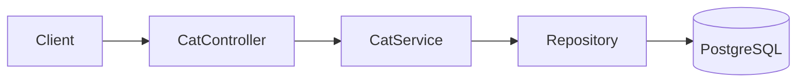
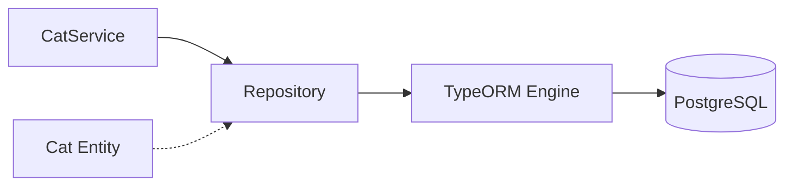

# title
<!-- @starci/seperator -->
Mastering PostgreSQL with TypeORM
<!-- @starci/seperator -->
# description
<!-- @starci/seperator -->
Hands-on integration of TypeORM with PostgreSQL in NestJS, from entities to 1:1, 1:N, N:N data relationships and CRUD API testing.
<!-- @starci/seperator -->
# body
<!-- @starci/seperator -->
## 1. Opening

*"When the domain starts having many 1:1, 1:N, N:N relationships, why not just write raw SQL instead of using **TypeORM**?"* — a **Senior Engineer** asks. A **Mid-level Developer** replies: *"ORM makes coding faster."* The answer lacks depth: it misses the real ORM trade-off — without understanding how ORM generates queries (N+1, eager/lazy), the system slows down as data grows, and debugging ORM queries is much harder than raw SQL.

This lesson ships **NestJS** + **PostgreSQL** (Docker) via **TypeORM**. **Part 2.1**: **hands-on**, synchronized with the GitHub repository, with **four verification flows** (create cat with cascade relations; read object graph; explicit relation loading; mutate 1:N collection). **Part 2.2**: **theory** clarifying **ORM**, **Repository Pattern**, **Entity Relationships** with typical edge cases such as lazy loading, migration vs synchronize, and connection pool.

## 2. Core concepts

The lesson structure follows **practice-led theory**. First, learners clone the source, start **PostgreSQL** via **Docker Compose**, run **NestJS** via `nest start --watch`, and call APIs to observe **TypeORM** handling entities, relations, and cascades. Then the **theory** section systematizes **core concepts**, **architecture models**, and analyzes in-depth **edge cases** -- mapping directly to what was observed in **part 2.1**.

### 2.1. Hands-on

#### 2.1.1. Prepare source code and environment

Goal: clone the demo source and run **NestJS** with **PostgreSQL** to observe **TypeORM** handling entities with 1:1 (**CatPassport**), 1:N (**Toy**), N:N (**Owner**) relationships.

Source: [StarCi-Academy/fullstack-mastery-module-1-database-integration-and-caching](https://github.com/StarCi-Academy/fullstack-mastery-module-1-database-integration-and-caching) on GitHub -- lesson directory: [`1-typeorm-and-postgresql`](https://github.com/StarCi-Academy/fullstack-mastery-module-1-database-integration-and-caching/tree/main/1-typeorm-and-postgresql).

```bash
# Step 1: Clone the repository locally
git clone https://github.com/StarCi-Academy/fullstack-mastery-module-1-database-integration-and-caching.git

# Step 2: Navigate to the lesson directory
cd fullstack-mastery-module-1-database-integration-and-caching/1-typeorm-and-postgresql
```

#### 2.1.2. Architecture / components (stack + flow)

- **PostgreSQL (Docker):** relational engine storing `cats`, `cat_passports`, `toys`, `owners`, and N:N junction table.
- **CatController:** receives HTTP requests, delegates to service.
- **CatService:** handles CRUD business logic via **TypeORM Repository**.
- **Cat Entity:** main entity with `@OneToOne` (CatPassport), `@OneToMany` (Toy), `@ManyToMany` (Owner) -- all with `cascade: true`.

| Component | File | Role |
| --- | --- | --- |
| **PostgreSQL** | `.docker/compose.yaml` | Stores cats + relation tables |
| **CatController** | `backend/src/modules/cat/cat.controller.ts` | Receives HTTP, delegates to service |
| **CatService** | `backend/src/modules/cat/cat.service.ts` | CRUD via TypeORM Repository |
| **Cat Entity** | `backend/src/modules/cat/entities/cat.entity.ts` | Schema + 1:1, 1:N, N:N relations |
| **CatPassport** | `backend/src/modules/cat/entities/cat-passport.entity.ts` | 1:1 entity |
| **Toy** | `backend/src/modules/cat/entities/toy.entity.ts` | 1:N entity |
| **Owner** | `backend/src/modules/cat/entities/owner.entity.ts` | N:N entity |



Figure 1: Data operation flow with TypeORM.

#### 2.1.3. Prerequisites and startup

##### 2.1.3.1. Prerequisites

- **Node.js** LTS (recommended ≥ 18).
- **npm** or **pnpm**.
- **NestJS CLI**: `npm i -g @nestjs/cli`.
- **Docker Desktop** (or Docker Engine) + `docker compose`.
- **Windows:** use **`Invoke-RestMethod`** instead of **`curl`**.

> **Note:** The repo ships with env defaults via **ConfigModule**; you do not need to create or edit **.env** when running the system. Only modify this file if you want to run the service with custom ports/credentials.

##### 2.1.3.2. Start

```bash
# Step 1: Start PostgreSQL
docker compose -f .docker/compose.yaml up -d

# Step 2: Install dependencies
npm install

# Step 3: Start in watch mode
nest start --watch
```

After the command above: terminal logs show the app listening on **`http://localhost:3000`**. **TypeORM** auto-creates tables via `synchronize: true`.

#### 2.1.4. Verification

**4 flows** below verify four goals: **(1)** create cat with full relations (cascade); **(2)** read back the object graph; **(3)** explicit relation loading; **(4)** mutate the 1:N collection by adding a new toy.

- **Flow 1:** Create cat with relations -- `POST /cats`.
- **Flow 2:** Read object graph -- `GET /cats` and `GET /cats/:id`.
- **Flow 3:** Explicit relation loading -- `GET /cats/:id/with-relations`.
- **Flow 4:** Mutate 1:N collection -- `POST /cats/:id/toys`.

##### 2.1.4.1. Flow 1 -- Create cat with relations

- Step 1: call `POST /cats`.

  ```bash
  # Windows (PowerShell)
  $body = '{"name":"Milo","passport":{"passportNumber":"PP-001"},"toys":[{"name":"Ball"}],"owners":[{"name":"Alice"}]}'
  Invoke-RestMethod -Uri http://localhost:3000/cats -Method Post -ContentType "application/json" -Body $body

  # macOS / Linux
  # → Paste cURL into Postman: Import → Raw text
  curl -s -X POST http://localhost:3000/cats \
    -H "Content-Type: application/json" \
    -d '{"name":"Milo","passport":{"passportNumber":"PP-001"},"toys":[{"name":"Ball"}],"owners":[{"name":"Alice"}]}'
  ```

  Expected response (HTTP 201):

  ```json
  {
    "id": 1,
    "name": "Milo",
    "passport": { "id": 1, "passportNumber": "PP-001" },
    "toys": [{ "id": 1, "name": "Ball" }],
    "owners": [{ "id": 1, "name": "Alice" }]
  }
  ```

*Conclusion: If the response matches the JSON above, the system confirms:*

- *Cascade works -- **TypeORM** auto-saved **CatPassport** (1:1), **Toy** (1:N), **Owner** (N:N) when saving the parent entity.*
- *Auto-generation -- `id` auto-increments via `@PrimaryGeneratedColumn()`.*

##### 2.1.4.2. Flow 2 -- Read object graph

- Step 1: call `GET /cats`.

  ```bash
  # Windows (PowerShell)
  Invoke-RestMethod -Uri http://localhost:3000/cats

  # macOS / Linux
  # → Paste cURL into Postman: Import → Raw text
  curl -s http://localhost:3000/cats
  ```

  Expected response (HTTP 200):

  ```json
  [
    {
      "id": 1,
      "name": "Milo",
      "passport": { "id": 1, "passportNumber": "PP-001" },
      "toys": [{ "id": 1, "name": "Ball" }],
      "owners": [{ "id": 1, "name": "Alice" }]
    }
  ]
  ```

- Step 2: call `GET /cats/1`.

  ```bash
  # Windows (PowerShell)
  Invoke-RestMethod -Uri http://localhost:3000/cats/1

  # macOS / Linux
  # → Paste cURL into Postman: Import → Raw text
  curl -s http://localhost:3000/cats/1
  ```

  Expected response (HTTP 200):

  ```json
  {
    "id": 1,
    "name": "Milo",
    "passport": { "id": 1, "passportNumber": "PP-001" },
    "toys": [{ "id": 1, "name": "Ball" }],
    "owners": [{ "id": 1, "name": "Alice" }]
  }
  ```

*Conclusion: If the response matches the JSON above, the system confirms:*

- *Relation loading works -- `find({ relations: ["passport", "toys", "owners"] })` executes JOINs correctly.*
- *NotFoundException -- `GET /cats/999` returns HTTP 404 because service checks `findOne` result.*

##### 2.1.4.3. Flow 3 -- Explicit relation loading (eager vs lazy)

- Purpose: demonstrate explicit `relations: ["passport", "toys", "owners"]` listing -- the opposite of the default lazy behavior that ships no relations.
- Step 1: call `GET /cats/1/with-relations`.

  ```bash
  # Windows (PowerShell)
  Invoke-RestMethod -Uri http://localhost:3000/cats/1/with-relations

  # macOS / Linux
  # → Paste cURL into Postman: Import → Raw text
  curl -s http://localhost:3000/cats/1/with-relations
  ```

  Expected response (HTTP 200):

  ```json
  {
    "id": 1,
    "name": "Milo",
    "passport": { "id": 1, "passportNumber": "PP-001" },
    "toys": [{ "id": 1, "name": "Ball" }],
    "owners": [{ "id": 1, "name": "Alice" }]
  }
  ```

*Conclusion: If the response matches the JSON above, the system confirms:*

- *Intentional eager loading -- explicitly listing relations avoids "load all" and N+1 query pitfalls.*
- *Without listing `relations`, TypeORM defaults to no JOIN -- nested fields are `undefined`. This is the core difference between eager vs lazy.*

##### 2.1.4.4. Flow 4 -- Mutate 1:N collection by adding a new toy

- Purpose: prove that a 1:N relation can be mutated after the cat is saved -- TypeORM auto-writes the FK `catId` via the `cat` relation.
- Step 1: call `POST /cats/1/toys`.

  ```bash
  # Windows (PowerShell)
  Invoke-RestMethod -Uri http://localhost:3000/cats/1/toys -Method Post -ContentType "application/json" -Body '{"name":"Laser Pointer"}'

  # macOS / Linux
  # → Paste cURL into Postman: Import → Raw text
  curl -s -X POST http://localhost:3000/cats/1/toys \
    -H "Content-Type: application/json" \
    -d '{"name":"Laser Pointer"}'
  ```

  Expected response (HTTP 201):

  ```json
  {
    "id": 1,
    "name": "Milo",
    "passport": { "id": 1, "passportNumber": "PP-001" },
    "toys": [
      { "id": 1, "name": "Ball" },
      { "id": 2, "name": "Laser Pointer" }
    ],
    "owners": [{ "id": 1, "name": "Alice" }]
  }
  ```

*Conclusion: If the response matches the JSON above, the system confirms:*

- *1:N collection is mutable -- TypeORM emits an INSERT into `toys` with FK `catId` without updating the parent cat row.*
- *Service re-reads after save so the response reflects the freshest state -- the `toys` array contains both the original and the new toy.*

#### 2.1.5. Cleanup

When you are done, tear down to free resources.

```bash
# Step 1: Stop the server
# Windows / macOS / Linux
Ctrl + C

# Step 2: Shut down Docker
docker compose -f .docker/compose.yaml down -v
```

#### 2.1.6. Further reading

- **TypeORM Relations:** 1:1, 1:N, N:N relations determine domain modeling. Misconfigured relations cause missing or inconsistent data. ([TypeORM Docs](https://typeorm.io/relations))
- **Cascade Behavior:** `cascade: true` simplifies object graph saves but uncontrolled usage causes unintended writes. ([TypeORM Docs](https://typeorm.io/relations#cascades))
- **Eager vs Lazy Loading:** Wrong loading strategy is a common cause of N+1 queries. ([TypeORM Docs](https://typeorm.io/eager-and-lazy-relations))
- **PostgreSQL Constraints:** PK, FK, UNIQUE, CHECK protect data integrity at the DB level. ([PostgreSQL Docs](https://www.postgresql.org/docs/current/ddl-constraints.html))
- **NestJS + TypeORM:** Module/repository organization directly affects testability and extensibility. ([NestJS Docs](https://docs.nestjs.com/techniques/sql))

### 2.2. Theory -- ORM, Repository Pattern, and Entity Relationships

#### 2.2.1. What problem does ORM solve?

| Without ORM | With ORM (TypeORM) |
| --- | --- |
| Write raw SQL: `SELECT * FROM cats WHERE id = 1` | Call method: `catRepository.findOne({ where: { id: 1 } })` |
| Manually map query results to objects | TypeORM auto-maps rows → Entity instances |
| Manage connection pools, transactions manually | TypeORM handles it |
| Changing database (PostgreSQL → MySQL) requires SQL rewrites | Only change config, code stays the same |

#### 2.2.2. Entity and Repository Pattern

- **Entity:** class representing a table. Each property maps to a column. Decorators `@Entity()`, `@Column()`, `@PrimaryGeneratedColumn()` declare metadata.
- **Repository:** intermediary providing CRUD methods (`find`, `findOne`, `save`, `delete`) without writing SQL.



#### 2.2.3. Entity Relationships

**TypeORM** supports 3 main relationship types:
- **@OneToOne:** One cat has one passport (`@JoinColumn` indicates the FK-owning side).
- **@OneToMany / @ManyToOne:** One cat has many toys.
- **@ManyToMany:** One cat belongs to many owners, one owner has many cats (`@JoinTable` creates the junction table).

#### 2.2.4. Edge cases to internalize

- **Lazy relation not loading:** Missing `eager: true` or `relations` in `find()` → relation returns `undefined`. **Fix:** always use explicit relation loading.
- **Migration vs synchronize:** `synchronize: true` auto-alters schema but may drop production data. **Fix:** only use `synchronize` in dev, use migrations in production.
- **Connection pool exhaustion:** Unconfigured pool size → connection leak crashes app. **Fix:** set `extra.max` in TypeORM config.
- **Entity listener side effects:** `@BeforeInsert` throwing exceptions → hard to debug. **Fix:** keep listeners simple, delegate complex logic to service.

## 3. Wrap-up

### 3.1. Common interview questions

- **Question 1:** Why use ORM instead of raw SQL?
  - What interviewers want to hear: balancing development speed vs control.
  - Sample answer (concise): ORM helps model domains more clearly and reduces boilerplate, but understanding SQL is still needed for query optimization.

- **Question 2:** When can TypeORM cause performance issues?
  - What interviewers want to hear: identifying N+1 queries and incorrect eager loading.
  - Sample answer (concise): When relation joins/loading are uncontrolled; use query builder, indexes, and profiling.

- **Question 3:** Why is understanding transactions still needed with ORM?
  - What interviewers want to hear: data correctness depends on DB semantics.
  - Sample answer (concise): ORM is just an access layer; consistency in multi-step operations still requires explicit transactions.
<!-- @starci/seperator -->
# codeExplaining

## 0

### code
<!-- @starci/seperator -->
```typescript
@Entity("cats")
export class Cat {
    @PrimaryGeneratedColumn()
        id: number

    @Column()
        name: string

    @OneToOne(() => CatPassport, (passport) => passport.cat, { cascade: true })
    @JoinColumn()
        passport: CatPassport

    @OneToMany(() => Toy, (toy) => toy.cat, { cascade: true })
        toys: Toy[]

    @ManyToMany(() => Owner, (owner) => owner.cats, { cascade: true })
    @JoinTable()
        owners: Owner[]
}
```
<!-- @starci/seperator -->
### explain
<!-- @starci/seperator -->
One entity class declares the three classic relation shapes — `1:1` via `@OneToOne`, `1:N` via `@OneToMany`, `N:N` via `@ManyToMany` — and **TypeORM** generates the corresponding tables and foreign keys at startup because `synchronize: true` is on. `@JoinColumn` puts the FK on the `Cat` side for the 1:1 (owning side holds the `passportId` column), while `@JoinTable` is required on exactly **one** side of the N:N to materialise the junction table `cat_owners_owner`. `cascade: true` lets `save(cat)` `INSERT` the related passport/toys/owners in one call — convenient for demos, but most production code disables cascade because an accidental update can fan out further than intended.
<!-- @starci/seperator -->
## 1

### code
<!-- @starci/seperator -->
```typescript
async findAll(): Promise<Cat[]> {
    this.logger.log("Fetching all cats with relations...")
    return await this.catRepository.find({
        relations: ["passport", "toys", "owners"],
    })
}

async create(catData: Partial<Cat>): Promise<Cat> {
    const cat = this.catRepository.create(catData)
    const savedCat = await this.catRepository.save(cat)
    return savedCat
}
```
<!-- @starci/seperator -->
### explain
<!-- @starci/seperator -->
`relations: [...]` tells **TypeORM** to emit `LEFT JOIN`s to the related tables in a single query — without it, the N+1 problem strikes (one extra query per cat per relation). `repository.create(catData)` only materialises an in-memory instance — no DB round trip yet; `save(cat)` performs the actual `INSERT` (or `UPDATE` when an id is present) and cascades into related entities. Splitting `create` and `save` lets you validate, transform, or enlist into a transaction before commit, instead of issuing raw SQL.
<!-- @starci/seperator -->
## 2

### code
<!-- @starci/seperator -->
```typescript
constructor(
    @InjectRepository(Cat)
    private readonly catRepository: Repository<Cat>,
) {}

@Get(":id")
async findOne(@Param("id", ParseIntPipe) id: number): Promise<Cat> {
    const cat = await this.catRepository.findOne({
        where: { id },
        relations: ["passport", "toys", "owners"],
    })
    if (!cat) throw new NotFoundException(`Cat with ID ${id} not found`)
    return cat
}
```
<!-- @starci/seperator -->
### explain
<!-- @starci/seperator -->
`@InjectRepository(Cat)` resolves the repository produced by **TypeOrmModule.forFeature** — no need to write a manual factory; the entity just needs to be registered in the feature module. `ParseIntPipe` converts the string URL param to a `number` and returns 400 if it isn't numeric, shielding the service from junk input. Throwing `NotFoundException` lets **NestJS** map the error to 404 — keep domain errors as HTTP exceptions instead of silently returning `null`.
<!-- @starci/seperator -->
# codeImplementations

## 0

### lang
<!-- @starci/seperator -->
csharp
<!-- @starci/seperator -->
### guide
<!-- @starci/seperator -->
Use **EF Core 8** — the closest direct analog to TypeORM, with change tracking, navigation properties, and `Include()` replacing `relations`.

**Mapping API:**
- `@Entity + @Column` → POCO + Fluent API `modelBuilder.Entity<Cat>().HasOne(c => c.Passport).WithOne(p => p.Cat).HasForeignKey<CatPassport>(p => p.CatId)`.
- `@OneToMany / @ManyToMany` → `HasMany().WithOne()` or `HasMany().WithMany().UsingEntity(...)`.
- `repository.find({ relations })` → `ctx.Cats.Include(c => c.Passport).Include(c => c.Toys).Include(c => c.Owners).ToListAsync()`.

**Differences and gotchas:**
- Virtual navigation properties enable lazy loading (needs `Microsoft.EntityFrameworkCore.Proxies`) — eager `Include` is the recommended default to avoid silent N+1.
- Cascade is convention-driven: required FK ⇒ `OnDelete(DeleteBehavior.Cascade)`; optional FK ⇒ `SetNull`. Wrong migration cascade is a frequent bug.
- EF Core has no `synchronize: true` — always `dotnet ef migrations add` for versioned DDL.
<!-- @starci/seperator -->
### example
<!-- @starci/seperator -->
```csharp
public class Cat {
    public int Id { get; set; }
    public string Name { get; set; } = "";
    public CatPassport? Passport { get; set; }
    public List<Toy> Toys { get; set; } = new();
    public List<Owner> Owners { get; set; } = new();
}

var cats = await ctx.Cats
    .Include(c => c.Passport).Include(c => c.Toys).Include(c => c.Owners)
    .ToListAsync();

ctx.Cats.Add(new Cat {
    Name = "Milo",
    Passport = new CatPassport { PassportNumber = "PP-001" },
    Toys = new() { new Toy { Name = "Ball" } },
    Owners = new() { new Owner { Name = "Alice" } },
});
await ctx.SaveChangesAsync();
```
<!-- @starci/seperator -->
## 1

### lang
<!-- @starci/seperator -->
typescript
<!-- @starci/seperator -->
### guide
<!-- @starci/seperator -->
Use **Express** + the raw **`pg`** driver with **manual transactions** — no TypeORM, every `INSERT`/`JOIN` written by hand so the learner sees exactly what cascade does once the ORM is taken away.

**Mapping API:**
- `@Entity + @PrimaryGeneratedColumn` → manually declared Postgres tables (DDL applied separately); `RETURNING id` replaces TypeORM's auto-assigned `id!`.
- `cascade: true` (1:1 / 1:N / N:N) → manual `BEGIN`, multiple `INSERT INTO ...` calls, `COMMIT`/`ROLLBACK`.
- `find({ relations: [...] })` → a single `SELECT` with `LEFT JOIN`s plus manual row-to-graph aggregation in code.

**Differences and gotchas:**
- You must call `client.query("BEGIN")` + `try/catch` + `ROLLBACK` manually, opposite to TypeORM's `@Transactional`.
- `pg` returns flat `rows` — aggregating across tables requires manual `groupBy` on `cat.id` to rebuild the object graph; wrong aggregation easily produces duplicates.
- A pool exhaustion makes `pgPool.connect()` hang until the timeout — always set `connectionTimeoutMillis` and `statement_timeout`.
<!-- @starci/seperator -->
### example
<!-- @starci/seperator -->
```typescript
import express from "express"
import { Pool } from "pg"

const pool = new Pool({ connectionString: process.env.POSTGRES_URL })

app.post("/cats", async (req, res) => {
    const { name, passport, toys, owners } = req.body as {
        name: string
        passport: { passportNumber: string }
        toys: Array<{ name: string }>
        owners: Array<{ name: string }>
    }
    const client = await pool.connect()
    try {
        await client.query("BEGIN")
        const { rows: [cat] } = await client.query<{ id: number }>(
            "INSERT INTO cats(name) VALUES ($1) RETURNING id", [name],
        )
        await client.query(
            "INSERT INTO cat_passports(cat_id, passport_number) VALUES ($1, $2)",
            [cat.id, passport.passportNumber],
        )
        for (const toy of toys) {
            await client.query("INSERT INTO toys(cat_id, name) VALUES ($1, $2)", [cat.id, toy.name])
        }
        for (const owner of owners) {
            const { rows: [ow] } = await client.query<{ id: number }>(
                "INSERT INTO owners(name) VALUES ($1) RETURNING id", [owner.name],
            )
            await client.query(
                "INSERT INTO cat_owners_owner(cat_id, owner_id) VALUES ($1, $2)", [cat.id, ow.id],
            )
        }
        await client.query("COMMIT")
        res.json({ id: cat.id, name })
    } catch (err) {
        await client.query("ROLLBACK")
        throw err
    } finally {
        client.release()
    }
})
```
<!-- @starci/seperator -->
## 2

### lang
<!-- @starci/seperator -->
go
<!-- @starci/seperator -->
### guide
<!-- @starci/seperator -->
Use **`gorm.io/gorm`** + `gorm.io/driver/postgres`. GORM supports relation preloading equivalent to TypeORM's `relations`, and generates schema via `db.AutoMigrate(&Cat{})`.

**Mapping API:**
- `@Entity` + `@Column` → struct tag `gorm:"primaryKey"`, `gorm:"size:255"`.
- `@OneToOne / @OneToMany / @ManyToMany` → field + `gorm:"foreignKey:CatID"` or `gorm:"many2many:cat_owners"`.
- `repository.find({ relations: [...] })` → `db.Preload("Passport").Preload("Toys").Preload("Owners").Find(&cats)`.

**Differences and gotchas:**
- GORM relies on conventions: a field `Toys []Toy` is implicitly `1:N` via `CatID` — a wrong FK name causes preload to silently return empty.
- No default cascade-save — use `db.Session(&gorm.Session{FullSaveAssociations: true})` or insert manually.
- `AutoMigrate` is safe for dev; in production use `golang-migrate` for versioned DDL.
<!-- @starci/seperator -->
### example
<!-- @starci/seperator -->
```go
type Cat struct {
    ID       uint        `gorm:"primaryKey"`
    Name     string
    Passport CatPassport `gorm:"foreignKey:CatID"`
    Toys     []Toy       `gorm:"foreignKey:CatID"`
    Owners   []Owner     `gorm:"many2many:cat_owners;"`
}
var cats []Cat
db.Preload("Passport").Preload("Toys").Preload("Owners").Find(&cats)
db.Session(&gorm.Session{FullSaveAssociations: true}).Create(&Cat{
    Name: "Milo",
    Passport: CatPassport{PassportNumber: "PP-001"},
    Toys: []Toy{{Name: "Ball"}},
    Owners: []Owner{{Name: "Alice"}},
})
```
<!-- @starci/seperator -->
## 3

### lang
<!-- @starci/seperator -->
java
<!-- @starci/seperator -->
### guide
<!-- @starci/seperator -->
**Spring Data JPA** (Hibernate) — almost a 1:1 conceptual mirror of TypeORM: `@Entity` + `@OneToOne` + `@OneToMany` + `@ManyToMany`.

**Mapping API:**
- `@Entity` + `@Column` mirror TypeORM; add `@Id` + `@GeneratedValue(strategy = GenerationType.IDENTITY)`.
- `relations: [...]` → JPQL `JOIN FETCH` or EntityGraph: `@EntityGraph(attributePaths = {"passport","toys","owners"})` on the repo method.
- `cascade: true` → `@OneToOne(cascade = CascadeType.ALL)`.

**Differences and gotchas:**
- Hibernate lazy-loads `@OneToMany`/`@ManyToMany` by default: missing `JOIN FETCH` causes N+1 or `LazyInitializationException` after the session closes.
- `@ManyToMany` join table is auto-generated — control naming with `@JoinTable(name = "cat_owners")`.
- The `@Transactional` boundary decides when Hibernate flushes — split read/write transactions when performance matters.
<!-- @starci/seperator -->
### example
<!-- @starci/seperator -->
```java
@Entity @Table(name="cats")
public class Cat {
    @Id @GeneratedValue Long id;
    String name;
    @OneToOne(cascade=ALL) @JoinColumn(name="passport_id") CatPassport passport;
    @OneToMany(mappedBy="cat", cascade=ALL) List<Toy> toys = new ArrayList<>();
    @ManyToMany(cascade=ALL) @JoinTable(name="cat_owners") List<Owner> owners = new ArrayList<>();
}
public interface CatRepo extends JpaRepository<Cat, Long> {
    @EntityGraph(attributePaths={"passport","toys","owners"})
    List<Cat> findAll();
}
```
<!-- @starci/seperator -->
# databases

## 0
### alias
<!-- @starci/seperator -->
postgresql
<!-- @starci/seperator -->
### entities
<!-- @starci/seperator -->
```typescript
@Entity("cats")
export class Cat {
    @PrimaryGeneratedColumn()
        id: number

    @Column()
        name: string

    @OneToOne(() => CatPassport, (passport) => passport.cat, { cascade: true })
    @JoinColumn()
        passport: CatPassport

    @OneToMany(() => Toy, (toy) => toy.cat, { cascade: true })
        toys: Toy[]

    @ManyToMany(() => Owner, (owner) => owner.cats, { cascade: true })
    @JoinTable()
        owners: Owner[]
}

@Entity("cat_passports")
export class CatPassport {
    @PrimaryGeneratedColumn()
        id: number

    @Column()
        passportNumber: string

    @OneToOne(() => Cat, (cat) => cat.passport)
        cat: Cat
}

@Entity("toys")
export class Toy {
    @PrimaryGeneratedColumn()
        id: number

    @Column()
        name: string

    @ManyToOne(() => Cat, (cat) => cat.toys, { onDelete: "CASCADE" })
        cat: Cat
}

@Entity("owners")
export class Owner {
    @PrimaryGeneratedColumn()
        id: number

    @Column()
        name: string

    @ManyToMany(() => Cat, (cat) => cat.owners)
        cats: Cat[]
}
```
<!-- @starci/seperator -->

# references
## 0
### alias
<!-- @starci/seperator -->
TypeORM Documentation
<!-- @starci/seperator -->
### url
<!-- @starci/seperator -->
https://typeorm.io
<!-- @starci/seperator -->

## 1
### alias
<!-- @starci/seperator -->
NestJS Documentation - SQL (TypeORM)
<!-- @starci/seperator -->
### url
<!-- @starci/seperator -->
https://docs.nestjs.com/techniques/sql
<!-- @starci/seperator -->

## 2
### alias
<!-- @starci/seperator -->
TypeORM Relations
<!-- @starci/seperator -->
### url
<!-- @starci/seperator -->
https://typeorm.io/relations
<!-- @starci/seperator -->

# minutesRead
<!-- @starci/seperator -->
18
<!-- @starci/seperator -->
# isPremium
<!-- @starci/seperator -->
false
<!-- @starci/seperator -->
