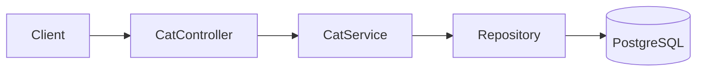
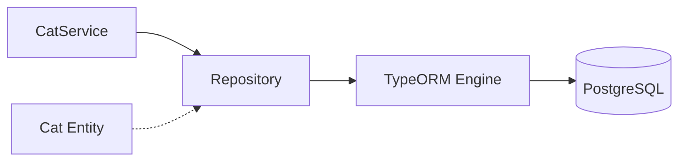

# title
<!-- @starci/seperator -->
Làm chủ PostgreSQL với TypeORM
<!-- @starci/seperator -->
# description
<!-- @starci/seperator -->
Thực hành tích hợp TypeORM với PostgreSQL trong NestJS, từ entity đến quan hệ dữ liệu 1:1, 1:N, N:N và kiểm thử API CRUD.
<!-- @starci/seperator -->
# body
<!-- @starci/seperator -->
## 1. Lời mở đầu

*"Khi domain bắt đầu có nhiều quan hệ 1:1, 1:N, N:N, vì sao không viết SQL thuần mà lại dùng **TypeORM**?"* — một **Senior Engineer** đặt câu hỏi. **Mid-level Developer** đáp: *"ORM giúp code nhanh hơn."* Câu trả lời thiếu chiều sâu: không nêu được trade-off thật của ORM — nếu không hiểu cách ORM sinh query (N+1, eager/lazy), hệ thống sẽ chậm dần khi data lớn, và debug ORM query khó hơn SQL thuần rất nhiều.

Bài học triển khai **NestJS** + **PostgreSQL** (Docker) qua **TypeORM**. **Phần 2.1**: **thực hành** đồng bộ với repository trên GitHub, gồm **bốn luồng** kiểm thử (tạo cat có quan hệ cascade; đọc object graph; explicit relation loading; mutate 1:N collection). **Phần 2.2**: **lý thuyết** làm rõ bản chất **ORM**, **Repository Pattern**, **Entity Relationships** kèm các edge case điển hình như lazy loading, migration vs synchronize, connection pool.

## 2. Các khái niệm cốt lõi

Cấu trúc bài học áp dụng phương pháp **Thực hành dẫn dắt Lý thuyết**. Khởi đầu, học viên sẽ trực tiếp clone source, khởi động **PostgreSQL** bằng **Docker Compose**, chạy **NestJS** bằng `nest start --watch` và gọi API để quan sát **TypeORM** xử lý entity, relation, và cascade. Tiếp theo, **phần lý thuyết** sẽ hệ thống hóa **các khái niệm cốt lõi**, **mô hình kiến trúc** và phân tích các **edge cases** chuyên sâu -- giúp đối chiếu và củng cố trực tiếp những kết quả vừa thực nghiệm tại **phần 2.1**.

### 2.1. Thực hành

#### 2.1.1. Chuẩn bị source code và môi trường

Mục đích: clone source demo và chạy **NestJS** kết hợp **PostgreSQL** để quan sát **TypeORM** xử lý entity có quan hệ 1:1 (**CatPassport**), 1:N (**Toy**), N:N (**Owner**).

Source: [StarCi-Academy/fullstack-mastery-module-1-database-integration-and-caching](https://github.com/StarCi-Academy/fullstack-mastery-module-1-database-integration-and-caching) trên GitHub -- thư mục bài học: [`1-typeorm-and-postgresql`](https://github.com/StarCi-Academy/fullstack-mastery-module-1-database-integration-and-caching/tree/main/1-typeorm-and-postgresql).

```bash
# Bước 1: Clone repository về máy local
git clone https://github.com/StarCi-Academy/fullstack-mastery-module-1-database-integration-and-caching.git

# Bước 2: Di chuyển vào đúng thư mục bài học
cd fullstack-mastery-module-1-database-integration-and-caching/1-typeorm-and-postgresql
```

#### 2.1.2. Kiến trúc/thành phần (stack + luồng)

- **PostgreSQL (Docker):** engine quan hệ lưu bảng `cats`, `cat_passports`, `toys`, `owners`, junction table N:N.
- **CatController:** nhận HTTP request, delegate xuống service.
- **CatService:** xử lý nghiệp vụ CRUD qua **TypeORM Repository**.
- **Cat Entity:** entity chính với quan hệ `@OneToOne` (CatPassport), `@OneToMany` (Toy), `@ManyToMany` (Owner) -- tất cả `cascade: true`.

| Thành phần | File | Vai trò |
| --- | --- | --- |
| **PostgreSQL** | `.docker/compose.yaml` | Lưu trữ bảng cats + relations |
| **CatController** | `backend/src/modules/cat/cat.controller.ts` | Nhận HTTP, delegate service |
| **CatService** | `backend/src/modules/cat/cat.service.ts` | CRUD với TypeORM Repository |
| **Cat Entity** | `backend/src/modules/cat/entities/cat.entity.ts` | Schema + quan hệ 1:1, 1:N, N:N |
| **CatPassport** | `backend/src/modules/cat/entities/cat-passport.entity.ts` | Entity 1:1 |
| **Toy** | `backend/src/modules/cat/entities/toy.entity.ts` | Entity 1:N |
| **Owner** | `backend/src/modules/cat/entities/owner.entity.ts` | Entity N:N |



Hình 1: Luồng thao tác dữ liệu với TypeORM.

#### 2.1.3. Chuẩn bị & khởi chạy

##### 2.1.3.1. Điều kiện cần trước

- **Node.js** LTS (khuyến nghị ≥ 18).
- **npm** hoặc **pnpm**.
- **NestJS CLI**: `npm i -g @nestjs/cli`.
- **Docker Desktop** (hoặc Docker Engine) + `docker compose`.
- **Windows:** dùng **`Invoke-RestMethod`** thay cho **`curl`**.

> **Lưu ý:** Repo đã ship env defaults qua **ConfigModule**; khi chạy hệ thống không cần tạo hay sửa **.env**. Chỉ chỉnh sửa file này khi bạn muốn chạy service với các port/credential khác mặc định.

##### 2.1.3.2. Khởi động

```bash
# Bước 1: Khởi động PostgreSQL
docker compose -f .docker/compose.yaml up -d

# Bước 2: Cài dependency
npm install

# Bước 3: Khởi chạy ở chế độ watch
nest start --watch
```

Sau lệnh trên: terminal log hiển thị app đang lắng nghe tại **`http://localhost:3000`**. **TypeORM** sẽ tự tạo bảng nhờ `synchronize: true`.

#### 2.1.4. Kiểm thử

**4 luồng** dưới đây kiểm chứng bốn mục tiêu: **(1)** tạo cat có đầy đủ quan hệ (cascade); **(2)** đọc lại object graph; **(3)** explicit relation loading; **(4)** mutate 1:N collection bằng cách thêm toy mới.

- **Luồng 1:** Tạo cat kèm quan hệ -- `POST /cats`.
- **Luồng 2:** Đọc object graph -- `GET /cats` và `GET /cats/:id`.
- **Luồng 3:** Explicit relation loading -- `GET /cats/:id/with-relations`.
- **Luồng 4:** Mutate 1:N collection -- `POST /cats/:id/toys`.

##### 2.1.4.1. Luồng 1 -- Tạo cat có quan hệ

- Bước 1: gọi `POST /cats`.

  ```bash
  # Windows (PowerShell)
  $body = '{"name":"Milo","passport":{"passportNumber":"PP-001"},"toys":[{"name":"Ball"}],"owners":[{"name":"Alice"}]}'
  Invoke-RestMethod -Uri http://localhost:3000/cats -Method Post -ContentType "application/json" -Body $body

  # macOS / Linux
  # → Dán cURL vào Postman: Import → Raw text
  curl -s -X POST http://localhost:3000/cats \
    -H "Content-Type: application/json" \
    -d '{"name":"Milo","passport":{"passportNumber":"PP-001"},"toys":[{"name":"Ball"}],"owners":[{"name":"Alice"}]}'
  ```

  Response phải trả về (HTTP 201):

  ```json
  {
    "id": 1,
    "name": "Milo",
    "passport": { "id": 1, "passportNumber": "PP-001" },
    "toys": [{ "id": 1, "name": "Ball" }],
    "owners": [{ "id": 1, "name": "Alice" }]
  }
  ```

*Kết luận: Nếu response khớp format trên, hệ thống xác nhận:*

- *Cascade hoạt động -- **TypeORM** tự lưu cả **CatPassport** (1:1), **Toy** (1:N), **Owner** (N:N) khi save entity cha.*
- *Auto-generation -- `id` tự tăng do `@PrimaryGeneratedColumn()`.*

##### 2.1.4.2. Luồng 2 -- Đọc object graph

- Bước 1: gọi `GET /cats`.

  ```bash
  # Windows (PowerShell)
  Invoke-RestMethod -Uri http://localhost:3000/cats

  # macOS / Linux
  # → Dán cURL vào Postman: Import → Raw text
  curl -s http://localhost:3000/cats
  ```

  Response phải trả về (HTTP 200):

  ```json
  [
    {
      "id": 1,
      "name": "Milo",
      "passport": { "id": 1, "passportNumber": "PP-001" },
      "toys": [{ "id": 1, "name": "Ball" }],
      "owners": [{ "id": 1, "name": "Alice" }]
    }
  ]
  ```

- Bước 2: gọi `GET /cats/1`.

  ```bash
  # Windows (PowerShell)
  Invoke-RestMethod -Uri http://localhost:3000/cats/1

  # macOS / Linux
  # → Dán cURL vào Postman: Import → Raw text
  curl -s http://localhost:3000/cats/1
  ```

  Response phải trả về (HTTP 200):

  ```json
  {
    "id": 1,
    "name": "Milo",
    "passport": { "id": 1, "passportNumber": "PP-001" },
    "toys": [{ "id": 1, "name": "Ball" }],
    "owners": [{ "id": 1, "name": "Alice" }]
  }
  ```

*Kết luận: Nếu response khớp format trên, hệ thống xác nhận:*

- *Relation loading hoạt động -- `find({ relations: ["passport", "toys", "owners"] })` thực hiện JOIN chính xác.*
- *NotFoundException -- `GET /cats/999` trả về HTTP 404 nhờ service kiểm tra kết quả `findOne`.*

##### 2.1.4.3. Luồng 3 -- Explicit relation loading (eager vs lazy)

- Mục đích: chứng minh việc liệt kê tường minh `relations: ["passport", "toys", "owners"]` -- đối lập với lazy mặc định không kèm relations.
- Bước 1: gọi `GET /cats/1/with-relations`.

  ```bash
  # Windows (PowerShell)
  Invoke-RestMethod -Uri http://localhost:3000/cats/1/with-relations

  # macOS / Linux
  # → Dán cURL vào Postman: Import → Raw text
  curl -s http://localhost:3000/cats/1/with-relations
  ```

  Response phải trả về (HTTP 200):

  ```json
  {
    "id": 1,
    "name": "Milo",
    "passport": { "id": 1, "passportNumber": "PP-001" },
    "toys": [{ "id": 1, "name": "Ball" }],
    "owners": [{ "id": 1, "name": "Alice" }]
  }
  ```

*Kết luận: Nếu response khớp format trên, hệ thống xác nhận:*

- *Eager loading có chủ đích -- liệt kê tường minh tránh tình trạng "load all" hay N+1 query khi không cần.*
- *Khi không liệt kê `relations`, TypeORM mặc định không JOIN -- nested fields sẽ `undefined`. Đây là điểm khác biệt cốt lõi của eager vs lazy.*

##### 2.1.4.4. Luồng 4 -- Mutate 1:N collection bằng cách thêm toy mới

- Mục đích: chứng minh quan hệ 1:N có thể mutate sau khi cat đã được lưu -- TypeORM auto-write FK `catId` qua relation.
- Bước 1: gọi `POST /cats/1/toys`.

  ```bash
  # Windows (PowerShell)
  Invoke-RestMethod -Uri http://localhost:3000/cats/1/toys -Method Post -ContentType "application/json" -Body '{"name":"Laser Pointer"}'

  # macOS / Linux
  # → Dán cURL vào Postman: Import → Raw text
  curl -s -X POST http://localhost:3000/cats/1/toys \
    -H "Content-Type: application/json" \
    -d '{"name":"Laser Pointer"}'
  ```

  Response phải trả về (HTTP 201):

  ```json
  {
    "id": 1,
    "name": "Milo",
    "passport": { "id": 1, "passportNumber": "PP-001" },
    "toys": [
      { "id": 1, "name": "Ball" },
      { "id": 2, "name": "Laser Pointer" }
    ],
    "owners": [{ "id": 1, "name": "Alice" }]
  }
  ```

*Kết luận: Nếu response khớp format trên, hệ thống xác nhận:*

- *Collection 1:N có thể mutate -- TypeORM tự sinh INSERT vào `toys` với FK `catId` mà không cần cập nhật cat parent.*
- *Service re-read sau khi save để response phản ánh state mới nhất -- mảng `toys` chứa cả toy cũ lẫn toy vừa thêm.*

#### 2.1.5. Dọn tài nguyên

Sau khi kết thúc bài, bạn có thể dọn tài nguyên để tiết kiệm bộ nhớ.

```bash
# Bước 1: Dừng server
# Windows / macOS / Linux
Ctrl + C

# Bước 2: Đóng Docker
docker compose -f .docker/compose.yaml down -v
```

#### 2.1.6. Đọc thêm

- **TypeORM Relations:** Quan hệ 1:1, 1:N, N:N quyết định cách mô hình hóa domain. Nếu cấu hình sai, dữ liệu trả về thiếu hoặc không nhất quán. ([TypeORM Docs](https://typeorm.io/relations))
- **Cascade Behavior:** `cascade: true` lưu object graph tiện hơn, nhưng dùng thiếu kiểm soát có thể ghi ngoài ý muốn. ([TypeORM Docs](https://typeorm.io/relations#cascades))
- **Eager vs Lazy Loading:** Chọn sai chiến lược load relation là nguyên nhân phổ biến của N+1 query. ([TypeORM Docs](https://typeorm.io/eager-and-lazy-relations))
- **PostgreSQL Constraints:** PK, FK, UNIQUE, CHECK bảo vệ tính đúng đắn ở mức DB. ([PostgreSQL Docs](https://www.postgresql.org/docs/current/ddl-constraints.html))
- **NestJS + TypeORM:** Tổ chức module/repository ảnh hưởng khả năng test và mở rộng. ([NestJS Docs](https://docs.nestjs.com/techniques/sql))

### 2.2. Lý thuyết -- ORM, Repository Pattern và Entity Relationships

#### 2.2.1. ORM giải quyết vấn đề gì?

| Không có ORM | Có ORM (TypeORM) |
| --- | --- |
| Viết SQL thô: `SELECT * FROM cats WHERE id = 1` | Gọi method: `catRepository.findOne({ where: { id: 1 } })` |
| Tự map kết quả query sang object | TypeORM tự map row → Entity instance |
| Tự quản lý connection pool, transaction | TypeORM quản lý sẵn |
| Đổi database (PostgreSQL → MySQL) phải sửa SQL | Chỉ đổi config, code giữ nguyên |

#### 2.2.2. Entity và Repository Pattern

- **Entity:** class đại diện cho một bảng. Mỗi property map với một cột. Decorator `@Entity()`, `@Column()`, `@PrimaryGeneratedColumn()` khai báo metadata.
- **Repository:** lớp trung gian cung cấp method CRUD (`find`, `findOne`, `save`, `delete`) mà không cần viết SQL.



#### 2.2.3. Quan hệ giữa các Entity

**TypeORM** hỗ trợ 3 loại quan hệ chính:
- **@OneToOne:** Một cat có một passport (`@JoinColumn` chỉ định side sở hữu FK).
- **@OneToMany / @ManyToOne:** Một cat có nhiều toy.
- **@ManyToMany:** Một cat thuộc nhiều owner, một owner có nhiều cat (`@JoinTable` tạo junction table).

#### 2.2.4. Các trường hợp biên (edge cases) cần lưu ý

- **Lazy relation không load:** Quên `eager: true` hoặc không dùng `relations` trong `find()` → relation trả `undefined`. **Giải pháp:** luôn explicit relation loading.
- **Migration vs synchronize:** `synchronize: true` tự đổi schema nhưng có thể xóa data production. **Giải pháp:** chỉ dùng `synchronize` ở dev, production dùng migration.
- **Connection pool exhaustion:** Không cấu hình pool size → connection leak crash app. **Giải pháp:** set `extra.max` trong TypeORM config.
- **Entity listener side effects:** `@BeforeInsert` throw exception → lỗi khó debug. **Giải pháp:** giữ listener đơn giản, delegate logic phức tạp vào service.

## 3. Tổng kết

### 3.1. Các câu hỏi dễ bị phỏng vấn

- **Câu hỏi 1:** Vì sao dùng ORM thay vì viết SQL thuần?
  - Ý interviewer muốn nghe: cân bằng tốc độ phát triển và khả năng kiểm soát.
  - Trả lời mẫu (ngắn): ORM giúp modeling domain rõ hơn và giảm boilerplate, nhưng vẫn cần hiểu SQL để tối ưu query.

- **Câu hỏi 2:** Khi nào TypeORM có thể gây vấn đề hiệu năng?
  - Ý interviewer muốn nghe: nhận diện N+1 query và eager loading sai cách.
  - Trả lời mẫu (ngắn): Khi join/load quan hệ thiếu kiểm soát; cần dùng query builder, index, và profiling.

- **Câu hỏi 3:** Vì sao vẫn cần hiểu transaction khi đã dùng ORM?
  - Ý interviewer muốn nghe: dữ liệu đúng đắn phụ thuộc DB semantics.
  - Trả lời mẫu (ngắn): ORM chỉ là lớp truy cập; consistency trong nghiệp vụ nhiều bước vẫn cần transaction rõ ràng.
<!-- @starci/seperator -->
# codeExplaining

## 0

### code
<!-- @starci/seperator -->
```typescript
@Entity("cats")
export class Cat {
    @PrimaryGeneratedColumn()
        id: number

    @Column()
        name: string

    @OneToOne(() => CatPassport, (passport) => passport.cat, { cascade: true })
    @JoinColumn()
        passport: CatPassport

    @OneToMany(() => Toy, (toy) => toy.cat, { cascade: true })
        toys: Toy[]

    @ManyToMany(() => Owner, (owner) => owner.cats, { cascade: true })
    @JoinTable()
        owners: Owner[]
}
```
<!-- @starci/seperator -->
### explain
<!-- @starci/seperator -->
Một class entity duy nhất khai báo cả 3 dạng quan hệ phổ biến — `1:1` qua `@OneToOne`, `1:N` qua `@OneToMany`, `N:N` qua `@ManyToMany` — và **TypeORM** tự sinh các bảng + foreign key tương ứng (vì `synchronize: true`). `@JoinColumn` đặt khóa ngoại bên `Cat` cho quan hệ 1:1 (chủ động nắm cột `passportId`), còn `@JoinTable` bắt buộc ở **một** phía của N:N để tạo bảng trung gian `cat_owners_owner`. `cascade: true` cho phép `save(cat)` tự động `INSERT` các bản ghi `passport`/`toys`/`owners` chưa tồn tại — tiện cho demo, nhưng production thường tắt vì lỡ tay update sẽ kéo cascade ngoài ý muốn.
<!-- @starci/seperator -->
## 1

### code
<!-- @starci/seperator -->
```typescript
async findAll(): Promise<Cat[]> {
    this.logger.log("Fetching all cats with relations...")
    return await this.catRepository.find({
        relations: ["passport", "toys", "owners"],
    })
}

async create(catData: Partial<Cat>): Promise<Cat> {
    const cat = this.catRepository.create(catData)
    const savedCat = await this.catRepository.save(cat)
    return savedCat
}
```
<!-- @starci/seperator -->
### explain
<!-- @starci/seperator -->
`relations: [...]` chỉ thị **TypeORM** sinh `LEFT JOIN` đến các bảng quan hệ trong cùng một query — không có nó sẽ N+1 (mỗi cat một query phụ cho từng quan hệ). `repository.create(catData)` chỉ tạo instance trong memory, chưa chạm DB; `save(cat)` mới thực thi `INSERT` (hoặc `UPDATE` nếu có id) và cascade các quan hệ. Phân tách `create` + `save` cho phép thực hiện validate, transform, hoặc gắn vào transaction trước khi commit, thay vì viết SQL thẳng vào DB.
<!-- @starci/seperator -->
## 2

### code
<!-- @starci/seperator -->
```typescript
constructor(
    @InjectRepository(Cat)
    private readonly catRepository: Repository<Cat>,
    @InjectRepository(Toy)
    private readonly toyRepository: Repository<Toy>,
) {}

async findOne(id: number): Promise<Cat> {
    const cat = await this.catRepository.findOne({
        where: { id },
        relations: ["passport", "toys", "owners"],
    })
    if (!cat) {
        this.logger.error(`Cat with ID ${id} not found`)
        throw new NotFoundException(`Cat with ID ${id} not found`)
    }
    return cat
}
```
<!-- @starci/seperator -->
### explain
<!-- @starci/seperator -->
`@InjectRepository(Cat)` lấy repository do **TypeOrmModule.forFeature** sinh ra — không cần khai báo thủ công factory, chỉ cần entity nằm trong `forFeature` của module; cùng pattern áp dụng cho `toyRepository` phục vụ luồng mutate 1:N. `findOne({ where, relations })` ép **TypeORM** sinh một câu `SELECT` kèm `LEFT JOIN` để hydrate `passport`, `toys`, `owners` trong cùng một round trip — tránh N+1 khi caller truy cập nested fields. Khi không tìm thấy bản ghi, service ném `NotFoundException` để **NestJS** map thành HTTP 404 — lỗi domain trở thành lỗi HTTP có ngữ nghĩa, không trả `null` ngầm cho controller xử lý.
<!-- @starci/seperator -->
# codeImplementations

## 0

### lang
<!-- @starci/seperator -->
csharp
<!-- @starci/seperator -->
### guide
<!-- @starci/seperator -->
Dùng **EF Core 8** — tương đương trực tiếp TypeORM với change tracking, navigation properties và `Include()` thay cho `relations`.

**Mapping API:**
- `@Entity + @Column` → POCO + Fluent API `modelBuilder.Entity<Cat>().HasOne(c => c.Passport).WithOne(p => p.Cat).HasForeignKey<CatPassport>(p => p.CatId)`.
- `@OneToMany / @ManyToMany` → `HasMany().WithOne()` hoặc `HasMany().WithMany().UsingEntity(...)`.
- `repository.find({ relations })` → `ctx.Cats.Include(c => c.Passport).Include(c => c.Toys).Include(c => c.Owners).ToListAsync()`.

**Differences and gotchas:**
- Navigation property `virtual` bật lazy loading (cần `Microsoft.EntityFrameworkCore.Proxies`) — production thường khuyến nghị eager `Include` rõ ràng để tránh N+1 silent.
- Cascade ngầm theo convention: required FK ⇒ `OnDelete(DeleteBehavior.Cascade)`; optional FK ⇒ `SetNull`. Migration build sai cascade là bug phổ biến.
- EF Core không có `synchronize: true` — luôn dùng `dotnet ef migrations add` để sinh DDL có version control.
<!-- @starci/seperator -->
### example
<!-- @starci/seperator -->
```csharp
public class Cat {
    public int Id { get; set; }
    public string Name { get; set; } = "";
    public CatPassport? Passport { get; set; }
    public List<Toy> Toys { get; set; } = new();
    public List<Owner> Owners { get; set; } = new();
}

var cats = await ctx.Cats
    .Include(c => c.Passport).Include(c => c.Toys).Include(c => c.Owners)
    .ToListAsync();

ctx.Cats.Add(new Cat {
    Name = "Milo",
    Passport = new CatPassport { PassportNumber = "PP-001" },
    Toys = new() { new Toy { Name = "Ball" } },
    Owners = new() { new Owner { Name = "Alice" } },
});
await ctx.SaveChangesAsync();
```
<!-- @starci/seperator -->
## 1

### lang
<!-- @starci/seperator -->
typescript
<!-- @starci/seperator -->
### guide
<!-- @starci/seperator -->
Dùng **Express** + driver thuần **`pg`** với **manual transaction** — không có TypeORM, mọi `INSERT`/`JOIN` viết tay để học viên hiểu chính xác cascade là gì khi ORM bị bỏ ra.

**Mapping API:**
- `@Entity + @PrimaryGeneratedColumn` → bảng Postgres tự khai báo (DDL chạy thủ công); `RETURNING id` thay cho property `id!` do TypeORM gán.
- `cascade: true` (1:1 / 1:N / N:N) → tự `BEGIN` transaction, `INSERT INTO cat_passports`, `INSERT INTO toys`, `INSERT INTO cat_owners_owner`, `COMMIT`/`ROLLBACK`.
- `find({ relations: [...] })` → một câu `SELECT` với `LEFT JOIN` rồi tự gộp row → object graph trong code.

**Differences and gotchas:**
- Phải `client.query("BEGIN")` + `try/catch` + `ROLLBACK` thủ công, ngược với `@Transactional` của TypeORM.
- `pg` trả `rows` flat — gộp nhiều bảng phải tự `groupBy` theo `cat.id` ở client để dựng cây quan hệ; sai logic gộp dễ sinh duplicate.
- Khi pool exhausted, `pgPool.connect()` treo tới hết timeout — luôn set `connectionTimeoutMillis` và `statement_timeout`.
<!-- @starci/seperator -->
### example
<!-- @starci/seperator -->
```typescript
import express from "express"
import { Pool } from "pg"

const pool = new Pool({ connectionString: process.env.POSTGRES_URL })

app.post("/cats", async (req, res) => {
    const { name, passport, toys, owners } = req.body as {
        name: string
        passport: { passportNumber: string }
        toys: Array<{ name: string }>
        owners: Array<{ name: string }>
    }
    const client = await pool.connect()
    try {
        await client.query("BEGIN")
        const { rows: [cat] } = await client.query<{ id: number }>(
            "INSERT INTO cats(name) VALUES ($1) RETURNING id", [name],
        )
        await client.query(
            "INSERT INTO cat_passports(cat_id, passport_number) VALUES ($1, $2)",
            [cat.id, passport.passportNumber],
        )
        for (const toy of toys) {
            await client.query("INSERT INTO toys(cat_id, name) VALUES ($1, $2)", [cat.id, toy.name])
        }
        for (const owner of owners) {
            const { rows: [ow] } = await client.query<{ id: number }>(
                "INSERT INTO owners(name) VALUES ($1) RETURNING id", [owner.name],
            )
            await client.query(
                "INSERT INTO cat_owners_owner(cat_id, owner_id) VALUES ($1, $2)", [cat.id, ow.id],
            )
        }
        await client.query("COMMIT")
        res.json({ id: cat.id, name })
    } catch (err) {
        await client.query("ROLLBACK")
        throw err
    } finally {
        client.release()
    }
})
```
<!-- @starci/seperator -->
## 2

### lang
<!-- @starci/seperator -->
go
<!-- @starci/seperator -->
### guide
<!-- @starci/seperator -->
Dùng **`gorm.io/gorm`** + `gorm.io/driver/postgres`. GORM hỗ trợ relation preload tương đương `relations` của TypeORM, và sinh schema tự động qua `db.AutoMigrate(&Cat{})`.

**Mapping API:**
- `@Entity` + `@Column` → struct tag `gorm:"primaryKey"`, `gorm:"size:255"`.
- `@OneToOne / @OneToMany / @ManyToMany` → field + `gorm:"foreignKey:CatID"` hoặc `gorm:"many2many:cat_owners"`.
- `repository.find({ relations: [...] })` → `db.Preload("Passport").Preload("Toys").Preload("Owners").Find(&cats)`.

**Differences and gotchas:**
- GORM dùng convention: field `Toys []Toy` ngầm hiểu là `1:N` qua `CatID` — đặt sai tên FK thì preload silently bỏ qua.
- Không có cascade `save` mặc định — phải `db.Session(&gorm.Session{FullSaveAssociations: true})` hoặc save tay.
- `AutoMigrate` an toàn cho dev; production dùng tool `golang-migrate` để versioned DDL.
<!-- @starci/seperator -->
### example
<!-- @starci/seperator -->
```go
type Cat struct {
    ID       uint        `gorm:"primaryKey"`
    Name     string
    Passport CatPassport `gorm:"foreignKey:CatID"`
    Toys     []Toy       `gorm:"foreignKey:CatID"`
    Owners   []Owner     `gorm:"many2many:cat_owners;"`
}
var cats []Cat
db.Preload("Passport").Preload("Toys").Preload("Owners").Find(&cats)
db.Session(&gorm.Session{FullSaveAssociations: true}).Create(&Cat{
    Name: "Milo",
    Passport: CatPassport{PassportNumber: "PP-001"},
    Toys: []Toy{{Name: "Ball"}},
    Owners: []Owner{{Name: "Alice"}},
})
```
<!-- @starci/seperator -->
## 3

### lang
<!-- @starci/seperator -->
java
<!-- @starci/seperator -->
### guide
<!-- @starci/seperator -->
**Spring Data JPA** (Hibernate) — gần như mirror 1:1 với TypeORM về mặt khái niệm: `@Entity` + `@OneToOne` + `@OneToMany` + `@ManyToMany`.

**Mapping API:**
- `@Entity` + `@Column` giống TypeORM; thêm `@Id` + `@GeneratedValue(strategy = GenerationType.IDENTITY)`.
- `relations: [...]` → JPQL `JOIN FETCH` hoặc EntityGraph: `@EntityGraph(attributePaths = {"passport","toys","owners"})` trên method repository.
- `cascade: true` → `@OneToOne(cascade = CascadeType.ALL)`.

**Differences and gotchas:**
- Hibernate lazy-load mặc định cho `@OneToMany` / `@ManyToMany`: nếu thiếu `JOIN FETCH` sẽ N+1 hoặc `LazyInitializationException` khi session đã đóng.
- `@ManyToMany` join table tự sinh — kiểm soát qua `@JoinTable(name = "cat_owners")` để đặt tên rõ ràng.
- Spring `@Transactional` boundary quyết định khi flush — tách read/write transaction nếu performance cần.
<!-- @starci/seperator -->
### example
<!-- @starci/seperator -->
```java
@Entity @Table(name="cats")
public class Cat {
    @Id @GeneratedValue Long id;
    String name;
    @OneToOne(cascade=ALL) @JoinColumn(name="passport_id") CatPassport passport;
    @OneToMany(mappedBy="cat", cascade=ALL) List<Toy> toys = new ArrayList<>();
    @ManyToMany(cascade=ALL) @JoinTable(name="cat_owners") List<Owner> owners = new ArrayList<>();
}
public interface CatRepo extends JpaRepository<Cat, Long> {
    @EntityGraph(attributePaths={"passport","toys","owners"})
    List<Cat> findAll();
}
```
<!-- @starci/seperator -->
# databases

## 0
### alias
<!-- @starci/seperator -->
postgresql
<!-- @starci/seperator -->
### entities
<!-- @starci/seperator -->
```typescript
@Entity("cats")
export class Cat {
    @PrimaryGeneratedColumn()
        id: number

    @Column()
        name: string

    @OneToOne(() => CatPassport, (passport) => passport.cat, { cascade: true })
    @JoinColumn()
        passport: CatPassport

    @OneToMany(() => Toy, (toy) => toy.cat, { cascade: true })
        toys: Toy[]

    @ManyToMany(() => Owner, (owner) => owner.cats, { cascade: true })
    @JoinTable()
        owners: Owner[]
}

@Entity("cat_passports")
export class CatPassport {
    @PrimaryGeneratedColumn()
        id: number

    @Column()
        passportNumber: string

    @OneToOne(() => Cat, (cat) => cat.passport)
        cat: Cat
}

@Entity("toys")
export class Toy {
    @PrimaryGeneratedColumn()
        id: number

    @Column()
        name: string

    @ManyToOne(() => Cat, (cat) => cat.toys, { onDelete: "CASCADE" })
        cat: Cat
}

@Entity("owners")
export class Owner {
    @PrimaryGeneratedColumn()
        id: number

    @Column()
        name: string

    @ManyToMany(() => Cat, (cat) => cat.owners)
        cats: Cat[]
}
```
<!-- @starci/seperator -->

# references
## 0
### alias
<!-- @starci/seperator -->
TypeORM Documentation
<!-- @starci/seperator -->
### url
<!-- @starci/seperator -->
https://typeorm.io
<!-- @starci/seperator -->

## 1
### alias
<!-- @starci/seperator -->
NestJS Documentation - SQL (TypeORM)
<!-- @starci/seperator -->
### url
<!-- @starci/seperator -->
https://docs.nestjs.com/techniques/sql
<!-- @starci/seperator -->

## 2
### alias
<!-- @starci/seperator -->
TypeORM Relations
<!-- @starci/seperator -->
### url
<!-- @starci/seperator -->
https://typeorm.io/relations
<!-- @starci/seperator -->

# minutesRead
<!-- @starci/seperator -->
18
<!-- @starci/seperator -->
# isPremium
<!-- @starci/seperator -->
false
<!-- @starci/seperator -->
