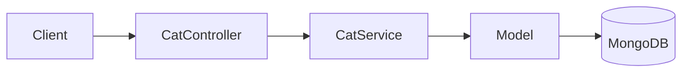

# title
<!-- @starci/seperator -->
NoSQL Storage with MongoDB and Mongoose
<!-- @starci/seperator -->
# description
<!-- @starci/seperator -->
Hands-on integration of MongoDB with Mongoose in NestJS, from schema definition to API testing for flexible yet disciplined data at the application layer.
<!-- @starci/seperator -->
# body
<!-- @starci/seperator -->
## 1. Opening

"If it's document storage, why use **MongoDB** but still need **Mongoose Schema**?" -- a **Senior Engineer** asks during a data layer review. A **Mid-level Developer** answers: "NoSQL is flexible so we don't need many constraints." The answer shows awareness of **document model** flexibility, but misses depth on **schema discipline**: as the system scales, documents without schema validation suffer **schema drift** -- old and new documents have different shapes, causing hard-to-trace runtime errors.

This lesson runs through two consecutive tracks:
- **Part 2.1**: **hands-on**, synchronized with the GitHub repository; the **stack** is **NestJS** + **MongoDB** (Docker), with **two verification flows** (create cat; search and update).
- **Part 2.2**: **theory** clarifying the nature of **ODM**, **Schema Design**, **Mongoose Query** -- definitions, examples, and typical **edge cases** such as **populate depth**, **runValidators**, and **indexes**.

## 2. Core concepts

The lesson structure follows **practice-led theory**. First, learners clone the source, start **MongoDB** via **Docker Compose**, run **NestJS** via `nest start --watch`, and call APIs to observe **Mongoose** handling schema, validation, queries, and updates. Then the **theory** section systematizes **core concepts**, **architecture models**, and analyzes in-depth **edge cases** -- mapping directly to what was observed in **part 2.1**.

### 2.1. Hands-on

#### 2.1.1. Prepare source code and environment

Goal: clone the demo source and run **NestJS** with **MongoDB** to observe **Mongoose** handling schema with `@Prop()`, timestamps, nested objects, and string arrays.

Source: [StarCi-Academy/fullstack-mastery-module-1-database-integration-and-caching](https://github.com/StarCi-Academy/fullstack-mastery-module-1-database-integration-and-caching) on GitHub -- lesson directory: [`2-mongoose-and-mongodb`](https://github.com/StarCi-Academy/fullstack-mastery-module-1-database-integration-and-caching/tree/main/2-mongoose-and-mongodb).

```bash
# Step 1: Clone the repository locally
git clone https://github.com/StarCi-Academy/fullstack-mastery-module-1-database-integration-and-caching.git

# Step 2: Navigate to the lesson directory
cd fullstack-mastery-module-1-database-integration-and-caching/2-mongoose-and-mongodb
```

#### 2.1.2. Architecture / components (stack + flow)

- **MongoDB (Docker):** document engine storing collection `cats`.
- **CatController:** REST endpoints `POST /cats`, `GET /cats`, `GET /cats/search`, `PUT /cats/:id`.
- **CatService:** CRUD business logic via **Mongoose Model**.
- **Cat Schema:** schema with `@Prop({ required, index })`, `timestamps: true`, nested `metadata`, array `hobbies`.

| Component | File | Role |
| --- | --- | --- |
| **MongoDB** | `.docker/compose.yaml` | Stores cats collection |
| **CatController** | `backend/src/modules/cat/cat.controller.ts` | REST endpoints |
| **CatService** | `backend/src/modules/cat/cat.service.ts` | CRUD via Mongoose Model |
| **Cat Schema** | `backend/src/modules/cat/schemas/cat.schema.ts` | Schema definition + validation |



Figure 1: Data operation flow with Mongoose.

#### 2.1.3. Prerequisites and startup

##### 2.1.3.1. Prerequisites

- **Node.js** LTS (recommended ≥ 18).
- **npm** or **pnpm**.
- **NestJS CLI**: `npm i -g @nestjs/cli`.
- **Docker Desktop** (or Docker Engine) + `docker compose`.
- **Windows:** use **`Invoke-RestMethod`** instead of **`curl`**.

> **Note:** The repo ships with env defaults via **ConfigModule**; you do not need to create or edit **.env** when running the system. Only modify this file if you want to run the service with custom ports/credentials.

##### 2.1.3.2. Start

```bash
# Step 1: Start MongoDB
docker compose -f .docker/compose.yaml up -d

# Step 2: Install dependencies
npm install

# Step 3: Start in watch mode
nest start --watch
```

After the command above: terminal logs show the app listening on **`http://localhost:3000`**.

#### 2.1.4. Verification

**5 flows** below verify five goals: **(1)** create cat with schema validation; **(2)** search by name (index lookup); **(3)** `findByIdAndUpdate` with `returnDocument=after`; **(4)** query by element inside the `hobbies` array; **(5)** atomic `$inc` for `likes`.

- **Flow 1:** Create cat -- `POST /cats`.
- **Flow 2:** Search by name -- `GET /cats/search?name=Luna`.
- **Flow 3:** `findByIdAndUpdate` with `returnDocument=after` -- `PUT /cats/:id`.
- **Flow 4:** Array query -- `GET /cats?hobby=fishing`.
- **Flow 5:** Atomic increment -- `POST /cats/:id/like`.

##### 2.1.4.1. Flow 1 -- Create cat document

- Step 1: call `POST /cats`.

  ```bash
  # Windows (PowerShell)
  $body = '{"name":"Luna","age":3,"breed":"Persian","hobbies":["sleeping","eating"],"metadata":{"color":"white"}}'
  Invoke-RestMethod -Uri http://localhost:3000/cats -Method Post -ContentType "application/json" -Body $body

  # macOS / Linux
  # → Paste cURL into Postman: Import → Raw text
  curl -s -X POST http://localhost:3000/cats \
    -H "Content-Type: application/json" \
    -d '{"name":"Luna","age":3,"breed":"Persian","hobbies":["sleeping","eating"],"metadata":{"color":"white"}}'
  ```

  Expected response (HTTP 201):

  ```json
  {
    "_id": "<ObjectId>",
    "name": "Luna",
    "age": 3,
    "breed": "Persian",
    "hobbies": ["sleeping", "eating"],
    "metadata": { "color": "white" },
    "createdAt": "<ISO datetime>",
    "updatedAt": "<ISO datetime>"
  }
  ```

*If the response matches the format above:*

- *Schema validation works -- `name` (required), `age` (min: 0) validated by **Mongoose**.*
- *Auto timestamps -- `createdAt` and `updatedAt` added via `timestamps: true`.*
- *Flexible schema -- `hobbies` (string array) and `metadata` (nested object) stored in the same document.*

##### 2.1.4.2. Flow 2 -- Search by name (index lookup)

- Step 1: call `GET /cats/search?name=Luna`.

  ```bash
  # Windows (PowerShell)
  Invoke-RestMethod -Uri "http://localhost:3000/cats/search?name=Luna"

  # macOS / Linux
  # → Paste cURL into Postman: Import → Raw text
  curl -s "http://localhost:3000/cats/search?name=Luna"
  ```

  Expected response (HTTP 200): Luna's document with `name: "Luna"` and a Mongo ObjectId.

*If the response matches the format above:*

- *Index lookup works -- `CatService.findByName()` issues `findOne({ name })` which uses the index declared on the `name` field in the schema.*
- *Single-document API surfaces the right shape -- the response is a single document, not an array, proving `findOne` (not `find`) was used.*

##### 2.1.4.3. Flow 3 -- `findByIdAndUpdate` with `returnDocument=after`

- Step 1: call `PUT /cats/<id>` using the ObjectId from Flow 2 (replace `<id>`).

  ```bash
  # Windows (PowerShell)
  Invoke-RestMethod -Uri http://localhost:3000/cats/<id> -Method Put -ContentType "application/json" -Body '{"age":4}'

  # macOS / Linux
  # → Paste cURL into Postman: Import → Raw text
  curl -s -X PUT http://localhost:3000/cats/<id> \
    -H "Content-Type: application/json" \
    -d '{"age":4}'
  ```

  Expected response (HTTP 200): the updated document, with `age: 4` and a freshly-bumped `updatedAt` timestamp. Other fields (`name`, `breed`, `hobbies`) preserved unchanged.

*If the response matches the format above:*

- *`returnDocument: "after"` works -- the API returns the post-update state, not the pre-update snapshot, which is the property the controller relies on to forward the latest version to the caller.*
- *Partial update semantics -- `findByIdAndUpdate` only mutates the keys present in the body (`age`), preserving the rest, proving Mongoose merges the update document into the existing record.*

##### 2.1.4.4. Flow 4 -- Query element inside the `hobbies` array (`$in`)

- Purpose: demonstrate MongoDB's `$in` operator filtering documents that contain a specific element inside an array field.
- Step 1: create another cat with the "fishing" hobby so there is data to query:

  ```bash
  # Windows (PowerShell)
  Invoke-RestMethod -Uri http://localhost:3000/cats -Method Post -ContentType "application/json" -Body '{"name":"Whiskers","age":2,"breed":"Tabby","hobbies":["fishing","napping"]}'

  # macOS / Linux
  # → Paste cURL into Postman: Import → Raw text
  curl -s -X POST http://localhost:3000/cats \
    -H "Content-Type: application/json" \
    -d '{"name":"Whiskers","age":2,"breed":"Tabby","hobbies":["fishing","napping"]}'
  ```

- Step 2: call `GET /cats?hobby=fishing`.

  ```bash
  # Windows (PowerShell)
  Invoke-RestMethod -Uri "http://localhost:3000/cats?hobby=fishing"

  # macOS / Linux
  curl -s "http://localhost:3000/cats?hobby=fishing"
  ```

  Expected response (HTTP 200): cats whose `hobbies` array contains "fishing":

  ```json
  [
    {
      "_id": "<ObjectId>",
      "name": "Whiskers",
      "age": 2,
      "breed": "Tabby",
      "hobbies": ["fishing", "napping"],
      "likes": 0
    }
  ]
  ```

*If the response matches the format above:*

- *Mongo array query operator works -- `{ hobbies: { $in: [hobby] } }` matches documents containing that hobby in the array.*
- *Cat "Luna" (only `sleeping`, `eating`) is absent -- confirming the filter is precise.*

##### 2.1.4.5. Flow 5 -- Atomic `likes` increment via `$inc`

- Purpose: demonstrate MongoDB's atomic update operator `$inc` -- no client-side read-modify-write, safe under concurrent callers.
- Step 1: call `POST /cats/<id>/like` (replace `<id>` with Luna's ObjectId):

  ```bash
  # Windows (PowerShell)
  Invoke-RestMethod -Uri http://localhost:3000/cats/<id>/like -Method Post

  # macOS / Linux
  curl -s -X POST http://localhost:3000/cats/<id>/like
  ```

  Expected response (HTTP 201): Luna's document with `likes: 1` (or the freshest value after `$inc: 1`):

  ```json
  {
    "_id": "<ObjectId>",
    "name": "Luna",
    "age": 4,
    "breed": "Persian",
    "hobbies": ["sleeping", "eating"],
    "likes": 1,
    "updatedAt": "<ISO datetime>"
  }
  ```

- Step 2: call the same endpoint again → `likes: 2`.

*If the responses match the format above:*

- *Atomic `$inc` runs server-side -- no `findOne` then `save` round trip, avoiding race conditions between concurrent requests.*
- *`returnDocument: "after"` returns the document after the update so clients see the fresh value immediately.*

#### 2.1.5. Cleanup

When you are done, tear down to free resources.

```bash
# Step 1: Stop the server
# Windows / macOS / Linux
Ctrl + C

# Step 2: Shut down Docker
docker compose -f .docker/compose.yaml down -v
```

#### 2.1.6. Further reading

- **Mongoose Schema Guide:** Correct schema design (embed/reference, index) directly impacts performance. ([Mongoose Docs](https://mongoosejs.com/docs/guide.html))
- **Mongoose Queries:** `find()`, `findOne()`, `findByIdAndUpdate()` -- Mongoose query API. ([Mongoose Docs](https://mongoosejs.com/docs/queries.html))
- **MongoDB Data Modeling:** Embed vs reference -- the most important design decision in document modeling. ([MongoDB Docs](https://www.mongodb.com/docs/manual/core/data-modeling-introduction/))
- **NestJS + Mongoose:** Integrating Mongoose into the NestJS IoC Container. ([NestJS Docs](https://docs.nestjs.com/techniques/mongodb))

### 2.2. Theory -- ODM, Schema Design, and Mongoose Query

#### 2.2.1. What problem does ODM solve?

**ODM** (Object-Document Mapping) maps documents in **MongoDB** to classes/objects in code. Similar to **ORM** for SQL, but operates on documents (JSON-like) instead of rows/tables.

**Mongoose** provides:
- **Schema definition:** declare fields, types, validation, indexes.
- **Model:** class that interacts with collections -- CRUD operations.
- **Middleware (hooks):** pre/post save, validate, remove.

#### 2.2.2. Embed vs Reference

| Embed | Reference |
| --- | --- |
| Store sub-document in parent | Store ObjectId reference |
| Fast reads (1 query) | Needs `populate` (2+ queries) |
| Hard to update sub-documents independently | Easy to update documents independently |
| Best for rarely-changing data | Best for frequently-changing data |

#### 2.2.3. Schema Design Best Practices

- **`timestamps: true`:** auto-adds `createdAt` and `updatedAt`.
- **`@Prop({ required: true })`:** enforce required fields at app layer.
- **`@Prop({ index: true })`:** index frequently queried fields.
- **`@Prop([String])`:** declare array of strings.
- **`@Prop({ type: Object })`:** allow flexible nested objects.

#### 2.2.4. Edge cases to internalize

- **Populate depth too deep:** Multiple nested references → N+1 queries. **Fix:** use aggregation pipeline or embed sub-documents.
- **Schema not validating on update:** Mongoose only validates on `save()`, not `updateOne()`. **Fix:** enable `runValidators: true`.
- **Missing indexes:** Slow queries on large collections. **Fix:** index frequently queried fields, verify with `explain()`.
- **Connection string wrong format:** Missing `authSource` → silent connection failure. **Fix:** test connection with `mongosh` first.

## 3. Wrap-up

### 3.1. Common interview questions

- **Question 1:** Why use **Mongoose Schema** when **MongoDB** is schemaless?
  - What interviewers want: schema discipline reasoning at app level.
  - Sample short answer: MongoDB is schemaless at DB level, but apps need validation to prevent schema drift and runtime errors.

- **Question 2:** When to embed vs reference?
  - What interviewers want: read vs write performance trade-off reasoning.
  - Sample short answer: Embed when data rarely changes and is always read with parent; reference when data changes frequently or is shared across documents.

- **Question 3:** Does `findByIdAndUpdate` run validation?
  - What interviewers want: understanding Mongoose validation scope.
  - Sample short answer: Not by default. You need to enable `runValidators: true` in options.
<!-- @starci/seperator -->
# codeExplaining

## 0

### code
<!-- @starci/seperator -->
```typescript
@Schema({ timestamps: true, collection: "cats" })
export class Cat {
    @Prop({ required: true, index: true })
        name: string

    @Prop({ required: true, min: 0 })
        age: number

    @Prop()
        breed: string

    @Prop([String])
        hobbies: string[]

    @Prop({ type: Object })
        metadata: Record<string, unknown>

    @Prop({ required: true, default: 0, min: 0 })
        likes: number
}

export const CatSchema = SchemaFactory.createForClass(Cat)
```
<!-- @starci/seperator -->
### explain
<!-- @starci/seperator -->
`@Schema({ timestamps: true, collection: "cats" })` lets Mongoose set `createdAt`/`updatedAt` on every save and pins the collection name to `cats` instead of relying on auto-pluralization — preventing breakage if the class is renamed. `@Prop({ index: true })` on `name` creates a single-field index at schema bind time, so `findOne({ name })` runs in O(log n) instead of a collection scan — required for the `/cats/search` route. Using `Record<string, unknown>` (not `any`) forces the service to narrow the type before reading fields, protecting against runtime crashes when document shapes drift. The `likes` field with `default: 0` + `min: 0` at the schema layer is the contract for the atomic `$inc` demo: new documents always start at 0, so `$inc` does not need a client-side null check.
<!-- @starci/seperator -->
## 1

### code
<!-- @starci/seperator -->
```typescript
async findAll(): Promise<Cat[]> {
    this.logger.log("Fetching all cats from MongoDB...")
    return await this.catModel
        .find()
        .sort({
            age: -1 
        })
        .limit(10)
        .exec()
}

async findByName(name: string): Promise<Cat> {
    this.logger.log(`Searching for cat with name: ${name}`)

    const cat = await this.catModel.findOne({
        name 
    }).exec()

    if (!cat) {
        throw new NotFoundException(`Cat with name "${name}" not found`)
    }

    return cat
}
```
<!-- @starci/seperator -->
### explain
<!-- @starci/seperator -->
The `.find().sort().limit().exec()` chain builds Mongoose's **Query Builder** — no DB call happens until `.exec()` (or `await` on the query) — equivalent to Postgres lazy query plans. `sort({ age: -1 })` + `limit(10)` pushes the heavy lifting into Mongo: the server only sorts the top-10, and if `age` is indexed the sort can be served straight off the index (cover-index pattern). `findOne({ name })` uses the single-field index declared via `index: true` in the schema and returns `null` on miss — the service must throw `NotFoundException` so Nest maps it to a 404, unlike JPA's implicit `EntityNotFoundException`. The Nest `Logger` traces each query, giving you a request lifecycle view in dev without attaching a debugger.
<!-- @starci/seperator -->
## 2

### code
<!-- @starci/seperator -->
```typescript
async update(id: string, updateData: Partial<Cat>): Promise<Cat> {
    const updatedCat = await this.catModel
        .findByIdAndUpdate(id,
            updateData,
            {
                returnDocument: "after" 
            })
        .exec()

    if (!updatedCat) {
        throw new NotFoundException(`Cat with id "${id}" not found`)
    }

    return updatedCat
}

async like(id: string): Promise<Cat> {
    const updated = await this.catModel
        .findByIdAndUpdate(
            id,
            {
                $inc: {
                    likes: 1,
                },
            },
            {
                returnDocument: "after",
            },
        )
        .exec()

    if (!updated) {
        throw new NotFoundException(`Cat with id "${id}" not found`)
    }
    return updated
}
```
<!-- @starci/seperator -->
### explain
<!-- @starci/seperator -->
`findByIdAndUpdate` overwrites only the fields present in `updateData` — implicit `$set` partial update — unlike `replaceOne` which swaps the whole document. `returnDocument: "after"` (the modern alias for `new: true`) returns the post-update document; Mongoose's default is the pre-update version — a common bug if forgotten. Important caveat: this command does **not** run schema validators unless you add `runValidators: true` — production code should opt in so a payload like `age: -5` cannot land in the DB. The `like` method demonstrates the atomic `$inc` operator: Mongo runs `likes += 1` server-side in a single command, avoiding the read-modify-write race condition that concurrent Node clients can hit when many users like at once — combined with `returnDocument: "after"` to ship the updated `likes` back to the client without an extra `findById` round trip.
<!-- @starci/seperator -->
# codeImplementations

## 0

### lang
<!-- @starci/seperator -->
csharp
<!-- @starci/seperator -->
### guide
<!-- @starci/seperator -->
Use **`MongoDB.Driver`** — the official .NET driver. POCO mapping via `[BsonElement]` attributes or conventions; the thread-safe `IMongoCollection<T>` lets you register a singleton in `Program.cs`.

**Mapping API:**
- `@Schema + @Prop` → POCO + `[BsonElement("name")]`; `[BsonId, BsonRepresentation(BsonType.ObjectId)] public string Id` maps `_id` to a plain string.
- `findOne({ name })` → `await coll.Find(Builders<Cat>.Filter.Eq(c => c.Name, name)).FirstOrDefaultAsync()`.
- `findByIdAndUpdate` → `await coll.FindOneAndUpdateAsync(filter, update, new FindOneAndUpdateOptions<Cat> { ReturnDocument = ReturnDocument.After })`.

**Differences and gotchas:**
- `FilterDefinitionBuilder<T>` is typed: `Builders<Cat>.Filter.Eq(c => c.Name, name)` is refactor-safer than raw `bson`.
- No automatic `timestamps: true` — set `CreatedAt = DateTime.UtcNow` manually or use a class-map convention with an insert hook.
- Indexes via `await coll.Indexes.CreateOneAsync(new CreateIndexModel<Cat>(Builders<Cat>.IndexKeys.Ascending(c => c.Name)))` at startup; in production split into a separate migration script.
<!-- @starci/seperator -->
### example
<!-- @starci/seperator -->
```csharp
public class Cat {
    [BsonId, BsonRepresentation(BsonType.ObjectId)] public string Id { get; set; } = "";
    public string Name { get; set; } = "";
    public int Age { get; set; }
    public string? Breed { get; set; }
    public DateTime CreatedAt { get; set; } = DateTime.UtcNow;
    public DateTime UpdatedAt { get; set; } = DateTime.UtcNow;
}

var byName = await coll.Find(Builders<Cat>.Filter.Eq(c => c.Name, name)).FirstOrDefaultAsync()
    ?? throw new InvalidOperationException("not found");

var update = Builders<Cat>.Update
    .Set(c => c.Age, newAge)
    .Set(c => c.UpdatedAt, DateTime.UtcNow);
var opts = new FindOneAndUpdateOptions<Cat> { ReturnDocument = ReturnDocument.After };
var updated = await coll.FindOneAndUpdateAsync(
    Builders<Cat>.Filter.Eq(c => c.Id, id), update, opts);
```
<!-- @starci/seperator -->
## 1

### lang
<!-- @starci/seperator -->
typescript
<!-- @starci/seperator -->
### guide
<!-- @starci/seperator -->
Use **Express** + the raw `mongodb` driver — no Mongoose, every insert/update/query is written by hand with a `bson` filter object so the learner sees exactly what Mongoose is abstracting.

**Mapping API:**
- `@Schema + @Prop` → no decorators: declare a TypeScript `interface CatDoc { _id?: ObjectId; name: string; age: number; ... }` and validate with `zod`/`ajv` before `insertOne`.
- `findOne({ name }).exec()` → `coll.findOne({ name })` returning `CatDoc | null`.
- `findByIdAndUpdate(id, data, { returnDocument: "after" })` → `coll.findOneAndUpdate({ _id: new ObjectId(id) }, { $set: data }, { returnDocument: "after" })`.

**Differences and gotchas:**
- No `timestamps: true` — set `Date.now()` on `createdAt`/`updatedAt` for every insert/update, or wrap it in a helper.
- ObjectId string ↔ ObjectId instance: clients send `string`, the driver needs `new ObjectId(id)` — forget it and `findOne` silently returns `null`.
- `MongoClient` is instantiated **once** at module scope; call `client.connect()` asynchronously at boot, not per request.
<!-- @starci/seperator -->
### example
<!-- @starci/seperator -->
```typescript
import express from "express"
import { MongoClient, ObjectId } from "mongodb"

interface CatDoc {
    _id?: ObjectId
    name: string
    age: number
    breed?: string
    hobbies: string[]
    metadata: Record<string, unknown>
    createdAt: Date
    updatedAt: Date
}

const client = await new MongoClient(process.env.MONGO_URI!).connect()
const coll = client.db("starci_nosql_db").collection<CatDoc>("cats")
await coll.createIndex({ name: 1 })

app.post("/cats", async (req, res) => {
    const now = new Date()
    const result = await coll.insertOne({ ...req.body, createdAt: now, updatedAt: now })
    res.status(201).json({ _id: result.insertedId, ...req.body, createdAt: now, updatedAt: now })
})

app.put("/cats/:id", async (req, res) => {
    const updated = await coll.findOneAndUpdate(
        { _id: new ObjectId(req.params.id) },
        { $set: { ...req.body, updatedAt: new Date() } },
        { returnDocument: "after" },
    )
    if (!updated) { res.status(404).end(); return }
    res.json(updated)
})
```
<!-- @starci/seperator -->
## 2

### lang
<!-- @starci/seperator -->
go
<!-- @starci/seperator -->
### guide
<!-- @starci/seperator -->
Use **`go.mongodb.org/mongo-driver`** (official driver) — no ORM or decorators; every document shape is declared via struct + `bson` tag.

**Mapping API:**
- `@Schema + @Prop` → struct + `bson:"name,omitempty"`.
- `findOne({ name })` → `coll.FindOne(ctx, bson.M{"name": name}).Decode(&cat)`.
- `findByIdAndUpdate` → `coll.FindOneAndUpdate(ctx, filter, bson.M{"$set": update}, options.FindOneAndUpdate().SetReturnDocument(options.After))`.

**Differences and gotchas:**
- No automatic `timestamps: true` — set `CreatedAt = time.Now()` manually or use `bson.M{"$currentDate": bson.M{"updatedAt": true}}`.
- Create indexes at startup with `coll.Indexes().CreateOne(ctx, mongo.IndexModel{Keys: bson.D{{"name", 1}}})`.
- Result error is `mongo.ErrNoDocuments` instead of Mongoose's `null` — check explicitly.
<!-- @starci/seperator -->
### example
<!-- @starci/seperator -->
```go
type Cat struct {
    ID        primitive.ObjectID `bson:"_id,omitempty"`
    Name      string             `bson:"name"`
    Age       int                `bson:"age"`
    Breed     string             `bson:"breed,omitempty"`
    CreatedAt time.Time          `bson:"createdAt"`
}
var cat Cat
err := coll.FindOne(ctx, bson.M{"name": name}).Decode(&cat)
if errors.Is(err, mongo.ErrNoDocuments) { /* 404 */ }

opts := options.FindOneAndUpdate().SetReturnDocument(options.After)
err = coll.FindOneAndUpdate(ctx, bson.M{"_id": objID},
    bson.M{"$set": bson.M{"age": newAge}}, opts).Decode(&cat)
```
<!-- @starci/seperator -->
## 3

### lang
<!-- @starci/seperator -->
java
<!-- @starci/seperator -->
### guide
<!-- @starci/seperator -->
**Spring Data MongoDB** — nearly a Mongoose mirror: `@Document`, `@Field`, `@Indexed` replace `@Schema`, `@Prop`, `index: true`.

**Mapping API:**
- `@Schema + @Prop` → `@Document(collection = "cats")` + POJO + `@Field`/`@Indexed`.
- `findOne` → `repository.findByName(name)` (Spring derives the query from the method name).
- `findByIdAndUpdate` → `mongoTemplate.findAndModify(query, update, FindAndModifyOptions.options().returnNew(true), Cat.class)`.

**Differences and gotchas:**
- No built-in `timestamps: true` — use `@CreatedDate` + `@LastModifiedDate` + enable `@EnableMongoAuditing`.
- Indexes are created at startup if `auto-index-creation=true`; production typically disables this and creates via migration.
- Use `MongoTemplate` for complex aggregation pipelines and repository interfaces for simple CRUD — both APIs coexist.
<!-- @starci/seperator -->
### example
<!-- @starci/seperator -->
```java
@Document(collection = "cats")
public class Cat {
    @Id String id;
    @Indexed String name;
    int age;
    String breed;
    @CreatedDate Instant createdAt;
    @LastModifiedDate Instant updatedAt;
}
public interface CatRepo extends MongoRepository<Cat, String> {
    Optional<Cat> findByName(String name);
}
Cat updated = mongoTemplate.findAndModify(
    Query.query(Criteria.where("_id").is(id)),
    Update.update("age", newAge),
    FindAndModifyOptions.options().returnNew(true),
    Cat.class);
```
<!-- @starci/seperator -->
# databases

## 0
### alias
<!-- @starci/seperator -->
mongodb
<!-- @starci/seperator -->
### schemas
<!-- @starci/seperator -->
```typescript
import {
    Prop,
    Schema,
    SchemaFactory,
} from "@nestjs/mongoose"
import { HydratedDocument } from "mongoose"

export type CatDocument = HydratedDocument<CatSchema>

/**
 * Schema lưu thông tin Cat — minh hoạ Mongoose `@Prop`, index, timestamps, array, nested object.
 * (EN: Schema storing Cat info — illustrates Mongoose `@Prop`, index, timestamps, array, nested object.)
 */
@Schema({ collection: "cats", timestamps: true })
export class CatSchema {
    @Prop({ required: true, index: true })
    name: string

    @Prop({ required: true, min: 0 })
    age: number

    @Prop()
    breed: string

    @Prop([String])
    hobbies: string[]

    @Prop({ type: Object })
    metadata: Record<string, unknown>

    @Prop({ default: 0 })
    likes: number
}

export const CatSchemaFactory = SchemaFactory.createForClass(CatSchema)
```
<!-- @starci/seperator -->

# references
## 0
### alias
<!-- @starci/seperator -->
Mongoose Documentation
<!-- @starci/seperator -->
### url
<!-- @starci/seperator -->
https://mongoosejs.com
<!-- @starci/seperator -->

## 1
### alias
<!-- @starci/seperator -->
NestJS Documentation - MongoDB (Mongoose)
<!-- @starci/seperator -->
### url
<!-- @starci/seperator -->
https://docs.nestjs.com/techniques/mongodb
<!-- @starci/seperator -->

## 2
### alias
<!-- @starci/seperator -->
MongoDB Data Modeling
<!-- @starci/seperator -->
### url
<!-- @starci/seperator -->
https://www.mongodb.com/docs/manual/core/data-modeling-introduction/
<!-- @starci/seperator -->

# minutesRead
<!-- @starci/seperator -->
18
<!-- @starci/seperator -->
# isPremium
<!-- @starci/seperator -->
false
<!-- @starci/seperator -->
