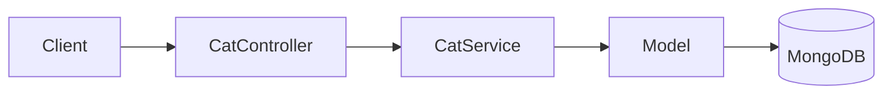

# title
<!-- @starci/seperator -->
Lưu trữ NoSQL với MongoDB và Mongoose
<!-- @starci/seperator -->
# description
<!-- @starci/seperator -->
Thực hành tích hợp MongoDB với Mongoose trong NestJS, từ định nghĩa schema đến kiểm thử API để dữ liệu linh hoạt nhưng vẫn có kỷ luật ở tầng ứng dụng.
<!-- @starci/seperator -->
# body
<!-- @starci/seperator -->
## 1. Lời mở đầu

"Đã là lưu dữ liệu document, vì sao dùng **MongoDB** nhưng vẫn cần **Mongoose Schema**?" -- một **Senior Engineer** hỏi khi review data layer. Một **Mid-level Developer** trả lời: "NoSQL linh hoạt nên không cần ràng buộc nhiều." Câu trả lời cho thấy nhận thức về tính linh hoạt của **document model**, nhưng vẫn thiếu chiều sâu về **schema discipline**: khi hệ thống mở rộng, document không có schema validation sẽ bị **schema drift** -- field cũ và mới có shape khác nhau, gây lỗi runtime khó truy nguyên.

Bài này dẫn qua hai mạch liên tiếp:
- **Phần 2.1**: **thực hành** đồng bộ với repository trên GitHub; **stack** gồm **NestJS** + **MongoDB** (Docker), kèm **hai luồng** kiểm thử (tạo cat; tìm kiếm và cập nhật).
- **Phần 2.2**: **lý thuyết** làm rõ bản chất **ODM**, **Schema Design**, **Mongoose Query** -- định nghĩa, ví dụ, và các **edge case** điển hình như **populate depth**, **runValidators**, **index**.

## 2. Các khái niệm cốt lõi

Cấu trúc bài học áp dụng phương pháp **Thực hành dẫn dắt Lý thuyết**. Khởi đầu, học viên sẽ trực tiếp clone source, khởi động **MongoDB** bằng **Docker Compose**, chạy **NestJS** bằng `nest start --watch` và gọi API để quan sát **Mongoose** xử lý schema, validation, query, và update. Tiếp theo, **phần lý thuyết** sẽ hệ thống hóa **các khái niệm cốt lõi**, **mô hình kiến trúc** và phân tích các **edge cases** chuyên sâu -- giúp đối chiếu và củng cố trực tiếp những kết quả vừa thực nghiệm tại **phần 2.1**.

### 2.1. Thực hành

#### 2.1.1. Chuẩn bị source code và môi trường

Mục đích: clone source demo và chạy **NestJS** kết hợp **MongoDB** để quan sát **Mongoose** xử lý schema với `@Prop()`, timestamps, nested object, array of strings.

Source: [StarCi-Academy/fullstack-mastery-module-1-database-integration-and-caching](https://github.com/StarCi-Academy/fullstack-mastery-module-1-database-integration-and-caching) trên GitHub -- thư mục bài học: [`2-mongoose-and-mongodb`](https://github.com/StarCi-Academy/fullstack-mastery-module-1-database-integration-and-caching/tree/main/2-mongoose-and-mongodb).

```bash
# Bước 1: Clone repository về máy local
git clone https://github.com/StarCi-Academy/fullstack-mastery-module-1-database-integration-and-caching.git

# Bước 2: Di chuyển vào đúng thư mục bài học
cd fullstack-mastery-module-1-database-integration-and-caching/2-mongoose-and-mongodb
```

#### 2.1.2. Kiến trúc/thành phần (stack + luồng)

- **MongoDB (Docker):** engine document lưu collection `cats`.
- **CatController:** REST endpoints `POST /cats`, `GET /cats`, `GET /cats/search`, `PUT /cats/:id`.
- **CatService:** nghiệp vụ CRUD qua **Mongoose Model**.
- **Cat Schema:** schema với `@Prop({ required, index })`, `timestamps: true`, nested `metadata`, array `hobbies`.

| Thành phần | File | Vai trò |
| --- | --- | --- |
| **MongoDB** | `.docker/compose.yaml` | Lưu trữ collection cats |
| **CatController** | `backend/src/modules/cat/cat.controller.ts` | REST endpoints |
| **CatService** | `backend/src/modules/cat/cat.service.ts` | CRUD với Mongoose Model |
| **Cat Schema** | `backend/src/modules/cat/schemas/cat.schema.ts` | Schema definition + validation |



Hình 1: Luồng thao tác dữ liệu với Mongoose.

#### 2.1.3. Chuẩn bị & khởi chạy

##### 2.1.3.1. Điều kiện cần trước

- **Node.js** LTS (khuyến nghị ≥ 18).
- **npm** hoặc **pnpm**.
- **NestJS CLI**: `npm i -g @nestjs/cli`.
- **Docker Desktop** (hoặc Docker Engine) + `docker compose`.
- **Windows:** dùng **`Invoke-RestMethod`** thay cho **`curl`**.

> **Lưu ý:** Repo đã ship env defaults qua **ConfigModule**; khi chạy hệ thống không cần tạo hay sửa **.env**. Chỉ chỉnh sửa file này khi bạn muốn chạy service với các port/credential khác mặc định.

##### 2.1.3.2. Khởi động

```bash
# Bước 1: Khởi động MongoDB
docker compose -f .docker/compose.yaml up -d

# Bước 2: Cài dependency
npm install

# Bước 3: Khởi chạy ở chế độ watch
nest start --watch
```

Sau lệnh trên: terminal log hiển thị app đang lắng nghe tại **`http://localhost:3000`**.

#### 2.1.4. Kiểm thử

**5 luồng** dưới đây kiểm chứng năm mục tiêu: **(1)** tạo cat với schema validation; **(2)** tìm kiếm theo name (index lookup); **(3)** `findByIdAndUpdate` với `returnDocument=after`; **(4)** query theo phần tử trong mảng `hobbies`; **(5)** atomic `$inc` cho `likes`.

- **Luồng 1:** Tạo cat -- `POST /cats`.
- **Luồng 2:** Tìm kiếm theo name -- `GET /cats/search?name=Luna`.
- **Luồng 3:** `findByIdAndUpdate` với `returnDocument=after` -- `PUT /cats/:id`.
- **Luồng 4:** Query mảng -- `GET /cats?hobby=fishing`.
- **Luồng 5:** Atomic increment -- `POST /cats/:id/like`.

##### 2.1.4.1. Luồng 1 -- Tạo cat document

- Bước 1: gọi `POST /cats`.

  ```bash
  # Windows (PowerShell)
  $body = '{"name":"Luna","age":3,"breed":"Persian","hobbies":["sleeping","eating"],"metadata":{"color":"white"}}'
  Invoke-RestMethod -Uri http://localhost:3000/cats -Method Post -ContentType "application/json" -Body $body

  # macOS / Linux
  # → Dán cURL vào Postman: Import → Raw text
  curl -s -X POST http://localhost:3000/cats \
    -H "Content-Type: application/json" \
    -d '{"name":"Luna","age":3,"breed":"Persian","hobbies":["sleeping","eating"],"metadata":{"color":"white"}}'
  ```

  Response phải trả về (HTTP 201):

  ```json
  {
    "_id": "<ObjectId>",
    "name": "Luna",
    "age": 3,
    "breed": "Persian",
    "hobbies": ["sleeping", "eating"],
    "metadata": { "color": "white" },
    "createdAt": "<ISO datetime>",
    "updatedAt": "<ISO datetime>"
  }
  ```

*Kết luận: Nếu response khớp format trên, hệ thống xác nhận:*

- *Schema validation hoạt động -- `name` (required), `age` (min: 0) được validate bởi **Mongoose**.*
- *Timestamps tự động -- `createdAt` và `updatedAt` được thêm nhờ `timestamps: true`.*
- *Flexible schema -- `hobbies` (array string) và `metadata` (nested object) lưu được trong cùng document.*

##### 2.1.4.2. Luồng 2 -- Tìm kiếm theo name (index lookup)

- Bước 1: gọi `GET /cats/search?name=Luna`.

  ```bash
  # Windows (PowerShell)
  Invoke-RestMethod -Uri "http://localhost:3000/cats/search?name=Luna"

  # macOS / Linux
  # → Dán cURL vào Postman: Import → Raw text
  curl -s "http://localhost:3000/cats/search?name=Luna"
  ```

  Response phải trả về (HTTP 200) document Luna với `name: "Luna"` và Mongo ObjectId.

*Kết luận: Nếu response khớp format trên, hệ thống xác nhận:*

- *Index lookup hoạt động -- `CatService.findByName()` phát `findOne({ name })` dùng index đã đánh trên field `name` trong schema.*
- *API single-document đúng shape -- response là một document duy nhất, không phải array, chứng minh dùng `findOne` (không phải `find`).*

##### 2.1.4.3. Luồng 3 -- `findByIdAndUpdate` với `returnDocument=after`

- Bước 1: gọi `PUT /cats/<id>` dùng ObjectId từ Luồng 2 (thay `<id>`).

  ```bash
  # Windows (PowerShell)
  Invoke-RestMethod -Uri http://localhost:3000/cats/<id> -Method Put -ContentType "application/json" -Body '{"age":4}'

  # macOS / Linux
  # → Dán cURL vào Postman: Import → Raw text
  curl -s -X PUT http://localhost:3000/cats/<id> \
    -H "Content-Type: application/json" \
    -d '{"age":4}'
  ```

  Response phải trả về (HTTP 200) document đã cập nhật, với `age: 4` và `updatedAt` mới. Các field khác (`name`, `breed`, `hobbies`) giữ nguyên.

*Kết luận: Nếu response khớp format trên, hệ thống xác nhận:*

- *`returnDocument: "after"` hoạt động -- API trả về state sau khi update, không phải snapshot trước update, đây là property mà controller dựa vào để forward bản mới nhất cho caller.*
- *Semantics partial update -- `findByIdAndUpdate` chỉ mutate các key có trong body (`age`), giữ nguyên phần còn lại, chứng minh Mongoose merge update document vào record cũ.*

##### 2.1.4.4. Luồng 4 -- Query phần tử trong mảng `hobbies` (`$in`)

- Mục đích: chứng minh cách dùng toán tử `$in` của MongoDB để filter document có chứa phần tử cụ thể trong mảng.
- Bước 1: tạo thêm một cat có hobby "fishing" để có dữ liệu test:

  ```bash
  # Windows (PowerShell)
  Invoke-RestMethod -Uri http://localhost:3000/cats -Method Post -ContentType "application/json" -Body '{"name":"Whiskers","age":2,"breed":"Tabby","hobbies":["fishing","napping"]}'

  # macOS / Linux
  # → Dán cURL vào Postman: Import → Raw text
  curl -s -X POST http://localhost:3000/cats \
    -H "Content-Type: application/json" \
    -d '{"name":"Whiskers","age":2,"breed":"Tabby","hobbies":["fishing","napping"]}'
  ```

- Bước 2: gọi `GET /cats?hobby=fishing`.

  ```bash
  # Windows (PowerShell)
  Invoke-RestMethod -Uri "http://localhost:3000/cats?hobby=fishing"

  # macOS / Linux
  curl -s "http://localhost:3000/cats?hobby=fishing"
  ```

  Response phải trả về (HTTP 200): mảng các cat có `hobbies` chứa "fishing":

  ```json
  [
    {
      "_id": "<ObjectId>",
      "name": "Whiskers",
      "age": 2,
      "breed": "Tabby",
      "hobbies": ["fishing", "napping"],
      "likes": 0
    }
  ]
  ```

*Kết luận: Nếu response khớp format trên, hệ thống xác nhận:*

- *Mongo array query operator hoạt động -- `{ hobbies: { $in: [hobby] } }` so khớp document có hobby đó trong mảng.*
- *Cat "Luna" (chỉ có `sleeping`, `eating`) không xuất hiện -- xác nhận filter chính xác.*

##### 2.1.4.5. Luồng 5 -- Atomic increment `likes` qua `$inc`

- Mục đích: chứng minh atomic update operator `$inc` của MongoDB -- không cần read-modify-write từ client, an toàn khi nhiều client gọi đồng thời.
- Bước 1: gọi `POST /cats/<id>/like` (thay `<id>` bằng ObjectId của Luna):

  ```bash
  # Windows (PowerShell)
  Invoke-RestMethod -Uri http://localhost:3000/cats/<id>/like -Method Post

  # macOS / Linux
  curl -s -X POST http://localhost:3000/cats/<id>/like
  ```

  Response phải trả về (HTTP 201) document Luna với `likes: 1` (hoặc giá trị mới nhất sau khi `$inc: 1`):

  ```json
  {
    "_id": "<ObjectId>",
    "name": "Luna",
    "age": 4,
    "breed": "Persian",
    "hobbies": ["sleeping", "eating"],
    "likes": 1,
    "updatedAt": "<ISO datetime>"
  }
  ```

- Bước 2: gọi cùng endpoint lần nữa → `likes: 2`.

*Kết luận: Nếu response khớp format trên, hệ thống xác nhận:*

- *Atomic `$inc` chạy server-side -- không cần `findOne` rồi `save` từ client, tránh race condition giữa các request đồng thời.*
- *`returnDocument: "after"` trả về document sau khi update, cho phép client thấy giá trị mới ngay lập tức.*

#### 2.1.5. Dọn tài nguyên

Sau khi kết thúc bài, bạn có thể dọn tài nguyên để tiết kiệm bộ nhớ.

```bash
# Bước 1: Dừng server
# Windows / macOS / Linux
Ctrl + C

# Bước 2: Đóng Docker
docker compose -f .docker/compose.yaml down -v
```

#### 2.1.6. Đọc thêm

- **Mongoose Schema Guide:** Thiết kế schema đúng (embed/reference, index) ảnh hưởng trực tiếp performance. ([Mongoose Docs](https://mongoosejs.com/docs/guide.html))
- **Mongoose Queries:** `find()`, `findOne()`, `findByIdAndUpdate()` -- API query của Mongoose. ([Mongoose Docs](https://mongoosejs.com/docs/queries.html))
- **MongoDB Data Modeling:** Embed vs reference -- quyết định thiết kế quan trọng nhất trong document model. ([MongoDB Docs](https://www.mongodb.com/docs/manual/core/data-modeling-introduction/))
- **NestJS + Mongoose:** Tích hợp Mongoose vào NestJS IoC Container. ([NestJS Docs](https://docs.nestjs.com/techniques/mongodb))

### 2.2. Lý thuyết -- ODM, Schema Design và Mongoose Query

#### 2.2.1. ODM giải quyết vấn đề gì?

**ODM** (Object-Document Mapping) ánh xạ document trong **MongoDB** sang class/object trong code. Tương tự **ORM** cho SQL, nhưng thao tác trên document (JSON-like) thay vì row/table.

**Mongoose** cung cấp:
- **Schema definition:** khai báo field, type, validation, index.
- **Model:** class tương tác với collection -- CRUD operations.
- **Middleware (hooks):** pre/post save, validate, remove.

#### 2.2.2. Embed vs Reference

| Embed | Reference |
| --- | --- |
| Lưu sub-document trong parent | Lưu ObjectId reference |
| Đọc nhanh (1 query) | Cần `populate` (2+ queries) |
| Khó update sub-document riêng lẻ | Dễ update document riêng |
| Phù hợp data ít thay đổi | Phù hợp data thay đổi thường xuyên |

#### 2.2.3. Schema Design Best Practices

- **`timestamps: true`:** tự động thêm `createdAt` và `updatedAt`.
- **`@Prop({ required: true })`:** enforce field bắt buộc ở tầng app.
- **`@Prop({ index: true })`:** đánh index cho field thường query.
- **`@Prop([String])`:** khai báo array of strings.
- **`@Prop({ type: Object })`:** cho phép nested object linh hoạt.

#### 2.2.4. Các trường hợp biên (edge cases) cần lưu ý

- **Populate depth quá sâu:** Nested references nhiều level → N+1 query. **Giải pháp:** dùng aggregation pipeline hoặc embed sub-document.
- **Schema không validate runtime:** Mongoose chỉ validate khi `save()`, không validate khi `updateOne()`. **Giải pháp:** bật `runValidators: true` trong update options.
- **Index thiếu:** Query chậm khi collection lớn mà không có index. **Giải pháp:** đánh index cho field thường query, kiểm tra bằng `explain()`.
- **Connection string sai format:** Thiếu `authSource` hoặc sai replica set name → connection fail. **Giải pháp:** test connection bằng `mongosh` trước.

## 3. Tổng kết

### 3.1. Các câu hỏi dễ bị phỏng vấn

- **Câu hỏi 1:** Vì sao dùng **Mongoose Schema** khi **MongoDB** đã schemaless?
  - Ý interviewer muốn nghe: tư duy schema discipline ở tầng ứng dụng.
  - Trả lời mẫu (ngắn): MongoDB schemaless ở DB level, nhưng app cần validation để tránh schema drift và lỗi runtime.

- **Câu hỏi 2:** Khi nào nên embed, khi nào nên reference?
  - Ý interviewer muốn nghe: trade-off read vs write performance.
  - Trả lời mẫu (ngắn): Embed khi data ít thay đổi và đọc cùng parent; reference khi data thay đổi thường xuyên hoặc dùng chung nhiều nơi.

- **Câu hỏi 3:** `findByIdAndUpdate` có chạy validation không?
  - Ý interviewer muốn nghe: hiểu Mongoose validation scope.
  - Trả lời mẫu (ngắn): Mặc định không. Cần bật `runValidators: true` trong options.
<!-- @starci/seperator -->
# codeExplaining

## 0

### code
<!-- @starci/seperator -->
```typescript
@Schema({ timestamps: true, collection: "cats" })
export class Cat {
    @Prop({ required: true, index: true })
        name: string

    @Prop({ required: true, min: 0 })
        age: number

    @Prop()
        breed: string

    @Prop([String])
        hobbies: string[]

    @Prop({ type: Object })
        metadata: Record<string, unknown>

    @Prop({ required: true, default: 0, min: 0 })
        likes: number
}

export const CatSchema = SchemaFactory.createForClass(Cat)
```
<!-- @starci/seperator -->
### explain
<!-- @starci/seperator -->
`@Schema({ timestamps: true, collection: "cats" })` ủy thác Mongoose tự ghi `createdAt`/`updatedAt` trên mỗi save và ghim tên collection thành `cats` thay vì để Mongoose auto-pluralize — tránh bug khi class rename. `@Prop({ index: true })` trên `name` sinh single-field index tại lúc bind schema, nên `findOne({ name })` chạy O(log n) thay vì collection scan — bắt buộc cho route `/cats/search`. Kiểu `Record<string, unknown>` (thay cho `any`) buộc service phải narrow trước khi đọc field, bảo vệ khỏi runtime crash khi dữ liệu document lệch shape. Field `likes` có `default: 0` + `min: 0` ở schema layer chính là contract cho atomic `$inc` demo: document mới luôn khởi tạo từ 0 nên `$inc` không cần kiểm tra `null` ở client.
<!-- @starci/seperator -->
## 1

### code
<!-- @starci/seperator -->
```typescript
async findAll(): Promise<Cat[]> {
    this.logger.log("Fetching all cats from MongoDB...")
    return await this.catModel
        .find()
        .sort({
            age: -1 
        })
        .limit(10)
        .exec()
}

async findByName(name: string): Promise<Cat> {
    this.logger.log(`Searching for cat with name: ${name}`)

    const cat = await this.catModel.findOne({
        name 
    }).exec()

    if (!cat) {
        throw new NotFoundException(`Cat with name "${name}" not found`)
    }

    return cat
}
```
<!-- @starci/seperator -->
### explain
<!-- @starci/seperator -->
Chuỗi `.find().sort().limit().exec()` xây dựng **Query Builder** của Mongoose — không hit DB cho đến khi gọi `.exec()` (hoặc `await` trực tiếp), tương đương lazy query plan của Postgres. `sort({ age: -1 })` + `limit(10)` đẩy heavy lifting xuống Mongo: server chỉ phải sort top-10, mà nếu có index trên `age` thì sort cũng được phục vụ trực tiếp từ index (cover-index pattern). `findOne({ name })` đi qua single-field index đã khai báo `index: true` ở schema và trả về `null` khi không match — service phải tự throw `NotFoundException` để Nest map sang 404, khác với JPA throw `EntityNotFoundException` ngầm. `Logger` của Nest log mỗi truy vấn giúp trace request lifecycle trong dev mà không cần debugger.
<!-- @starci/seperator -->
## 2

### code
<!-- @starci/seperator -->
```typescript
async update(id: string, updateData: Partial<Cat>): Promise<Cat> {
    const updatedCat = await this.catModel
        .findByIdAndUpdate(id,
            updateData,
            {
                returnDocument: "after" 
            })
        .exec()

    if (!updatedCat) {
        throw new NotFoundException(`Cat with id "${id}" not found`)
    }

    return updatedCat
}

async like(id: string): Promise<Cat> {
    const updated = await this.catModel
        .findByIdAndUpdate(
            id,
            {
                $inc: {
                    likes: 1,
                },
            },
            {
                returnDocument: "after",
            },
        )
        .exec()

    if (!updated) {
        throw new NotFoundException(`Cat with id "${id}" not found`)
    }
    return updated
}
```
<!-- @starci/seperator -->
### explain
<!-- @starci/seperator -->
`findByIdAndUpdate` chỉ ghi đè các field có mặt trong `updateData` — đây là partial update (`$set` ngầm) mặc định, khác với `replaceOne` thay toàn bộ document. `returnDocument: "after"` (alias mới của `new: true`) trả về phiên bản sau update; mặc định Mongoose trả version trước — bug phổ biến nếu quên option này. Lưu ý quan trọng: lệnh này **không** chạy schema validator trừ khi thêm `runValidators: true` — production phải bật để tránh ghi `age: -5` vào DB. Method `like` minh hoạ atomic operator `$inc`: Mongo chạy `likes += 1` server-side trong cùng một lệnh, tránh race condition kiểu read-modify-write mà ứng dụng Node concurrent dễ mắc khi nhiều client like cùng lúc — kết hợp `returnDocument: "after"` để trả về giá trị `likes` đã cập nhật cho client mà không cần một round-trip `findById` tiếp theo.
<!-- @starci/seperator -->
# codeImplementations

## 0

### lang
<!-- @starci/seperator -->
csharp
<!-- @starci/seperator -->
### guide
<!-- @starci/seperator -->
Dùng **`MongoDB.Driver`** — official driver cho .NET. POCO mapping qua attribute `[BsonElement]` hoặc convention; có `IMongoCollection<T>` thread-safe nên đăng ký singleton trong `Program.cs`.

**Mapping API:**
- `@Schema + @Prop` → POCO + `[BsonElement("name")]`; `[BsonId, BsonRepresentation(BsonType.ObjectId)] public string Id` để map `_id` về string.
- `findOne({ name })` → `await coll.Find(Builders<Cat>.Filter.Eq(c => c.Name, name)).FirstOrDefaultAsync()`.
- `findByIdAndUpdate` → `await coll.FindOneAndUpdateAsync(filter, update, new FindOneAndUpdateOptions<Cat> { ReturnDocument = ReturnDocument.After })`.

**Differences and gotchas:**
- `FilterDefinitionBuilder<T>` typed: `Builders<Cat>.Filter.Eq(c => c.Name, name)` an toàn refactor hơn raw `bson`.
- Không có `timestamps: true` tự động — tự set `CreatedAt = DateTime.UtcNow` hoặc viết MongoDB convention class map cho insert hook.
- Index tạo qua `await coll.Indexes.CreateOneAsync(new CreateIndexModel<Cat>(Builders<Cat>.IndexKeys.Ascending(c => c.Name)))` lúc startup; production thường tách thành migration script riêng.
<!-- @starci/seperator -->
### example
<!-- @starci/seperator -->
```csharp
public class Cat {
    [BsonId, BsonRepresentation(BsonType.ObjectId)] public string Id { get; set; } = "";
    public string Name { get; set; } = "";
    public int Age { get; set; }
    public string? Breed { get; set; }
    public DateTime CreatedAt { get; set; } = DateTime.UtcNow;
    public DateTime UpdatedAt { get; set; } = DateTime.UtcNow;
}

var byName = await coll.Find(Builders<Cat>.Filter.Eq(c => c.Name, name)).FirstOrDefaultAsync()
    ?? throw new InvalidOperationException("not found");

var update = Builders<Cat>.Update
    .Set(c => c.Age, newAge)
    .Set(c => c.UpdatedAt, DateTime.UtcNow);
var opts = new FindOneAndUpdateOptions<Cat> { ReturnDocument = ReturnDocument.After };
var updated = await coll.FindOneAndUpdateAsync(
    Builders<Cat>.Filter.Eq(c => c.Id, id), update, opts);
```
<!-- @starci/seperator -->
## 1

### lang
<!-- @starci/seperator -->
typescript
<!-- @starci/seperator -->
### guide
<!-- @starci/seperator -->
Dùng **Express** + driver thuần `mongodb` — không có Mongoose, mọi insert/update/query viết tay với `bson` filter object để học viên thấy chính xác Mongoose đang abstract những gì.

**Mapping API:**
- `@Schema + @Prop` → không có decorator: bạn tự khai báo TypeScript `interface CatDoc { _id?: ObjectId; name: string; age: number; ... }` và validate bằng `zod`/`ajv` trước khi `insertOne`.
- `findOne({ name }).exec()` → `coll.findOne({ name })` trả `CatDoc | null`.
- `findByIdAndUpdate(id, data, { returnDocument: "after" })` → `coll.findOneAndUpdate({ _id: new ObjectId(id) }, { $set: data }, { returnDocument: "after" })`.

**Differences and gotchas:**
- Không có `timestamps: true` — tự `Date.now()` set `createdAt`/`updatedAt` ở mỗi insert/update, hoặc gói trong helper.
- ObjectId string ↔ ObjectId instance: client gửi `string`, driver cần `new ObjectId(id)` — quên là `findOne` trả `null` silently.
- `MongoClient` chỉ khởi tạo **một lần** ở module level; gọi `client.connect()` async, không phải mỗi request.
<!-- @starci/seperator -->
### example
<!-- @starci/seperator -->
```typescript
import express from "express"
import { MongoClient, ObjectId } from "mongodb"

interface CatDoc {
    _id?: ObjectId
    name: string
    age: number
    breed?: string
    hobbies: string[]
    metadata: Record<string, unknown>
    createdAt: Date
    updatedAt: Date
}

const client = await new MongoClient(process.env.MONGO_URI!).connect()
const coll = client.db("starci_nosql_db").collection<CatDoc>("cats")
await coll.createIndex({ name: 1 })

app.post("/cats", async (req, res) => {
    const now = new Date()
    const result = await coll.insertOne({ ...req.body, createdAt: now, updatedAt: now })
    res.status(201).json({ _id: result.insertedId, ...req.body, createdAt: now, updatedAt: now })
})

app.put("/cats/:id", async (req, res) => {
    const updated = await coll.findOneAndUpdate(
        { _id: new ObjectId(req.params.id) },
        { $set: { ...req.body, updatedAt: new Date() } },
        { returnDocument: "after" },
    )
    if (!updated) { res.status(404).end(); return }
    res.json(updated)
})
```
<!-- @starci/seperator -->
## 2

### lang
<!-- @starci/seperator -->
go
<!-- @starci/seperator -->
### guide
<!-- @starci/seperator -->
Dùng **`go.mongodb.org/mongo-driver`** (official driver) — không có ORM/decorator, mọi shape document khai báo qua struct + `bson` tag.

**Mapping API:**
- `@Schema + @Prop` → struct + `bson:"name,omitempty"`.
- `findOne({ name })` → `coll.FindOne(ctx, bson.M{"name": name}).Decode(&cat)`.
- `findByIdAndUpdate` → `coll.FindOneAndUpdate(ctx, filter, bson.M{"$set": update}, options.FindOneAndUpdate().SetReturnDocument(options.After))`.

**Differences and gotchas:**
- Không có `timestamps: true` tự động — bạn tự set `CreatedAt = time.Now()` hoặc dùng `bson.M{"$currentDate": bson.M{"updatedAt": true}}`.
- Index tạo bằng `coll.Indexes().CreateOne(ctx, mongo.IndexModel{Keys: bson.D{{"name", 1}}})` tại startup.
- Result error: `mongo.ErrNoDocuments` thay cho `null` của Mongoose — check explicit.
<!-- @starci/seperator -->
### example
<!-- @starci/seperator -->
```go
type Cat struct {
    ID        primitive.ObjectID `bson:"_id,omitempty"`
    Name      string             `bson:"name"`
    Age       int                `bson:"age"`
    Breed     string             `bson:"breed,omitempty"`
    CreatedAt time.Time          `bson:"createdAt"`
}
var cat Cat
err := coll.FindOne(ctx, bson.M{"name": name}).Decode(&cat)
if errors.Is(err, mongo.ErrNoDocuments) { /* 404 */ }

opts := options.FindOneAndUpdate().SetReturnDocument(options.After)
err = coll.FindOneAndUpdate(ctx, bson.M{"_id": objID},
    bson.M{"$set": bson.M{"age": newAge}}, opts).Decode(&cat)
```
<!-- @starci/seperator -->
## 3

### lang
<!-- @starci/seperator -->
java
<!-- @starci/seperator -->
### guide
<!-- @starci/seperator -->
**Spring Data MongoDB** — gần như mirror Mongoose: `@Document`, `@Field`, `@Indexed` thay cho `@Schema`, `@Prop`, `index: true`.

**Mapping API:**
- `@Schema + @Prop` → `@Document(collection = "cats")` + POJO + `@Field`/`@Indexed`.
- `findOne` → `repository.findByName(name)` (Spring tự sinh query từ tên method).
- `findByIdAndUpdate` → `mongoTemplate.findAndModify(query, update, FindAndModifyOptions.options().returnNew(true), Cat.class)`.

**Differences and gotchas:**
- Spring Data MongoDB không có `timestamps: true` mặc định — dùng `@CreatedDate` + `@LastModifiedDate` + enable `@EnableMongoAuditing`.
- Index tạo lúc startup nếu `auto-index-creation=true`; production thường tắt và tạo qua migration.
- `MongoTemplate` cho query phức tạp (aggregation pipeline); repository interface cho CRUD đơn giản — dùng cả hai song song.
<!-- @starci/seperator -->
### example
<!-- @starci/seperator -->
```java
@Document(collection = "cats")
public class Cat {
    @Id String id;
    @Indexed String name;
    int age;
    String breed;
    @CreatedDate Instant createdAt;
    @LastModifiedDate Instant updatedAt;
}
public interface CatRepo extends MongoRepository<Cat, String> {
    Optional<Cat> findByName(String name);
}
Cat updated = mongoTemplate.findAndModify(
    Query.query(Criteria.where("_id").is(id)),
    Update.update("age", newAge),
    FindAndModifyOptions.options().returnNew(true),
    Cat.class);
```
<!-- @starci/seperator -->
# databases

## 0
### alias
<!-- @starci/seperator -->
mongodb
<!-- @starci/seperator -->
### schemas
<!-- @starci/seperator -->
```typescript
import {
    Prop,
    Schema,
    SchemaFactory,
} from "@nestjs/mongoose"
import { HydratedDocument } from "mongoose"

export type CatDocument = HydratedDocument<CatSchema>

/**
 * Schema lưu thông tin Cat — minh hoạ Mongoose `@Prop`, index, timestamps, array, nested object.
 * (EN: Schema storing Cat info — illustrates Mongoose `@Prop`, index, timestamps, array, nested object.)
 */
@Schema({ collection: "cats", timestamps: true })
export class CatSchema {
    @Prop({ required: true, index: true })
    name: string

    @Prop({ required: true, min: 0 })
    age: number

    @Prop()
    breed: string

    @Prop([String])
    hobbies: string[]

    @Prop({ type: Object })
    metadata: Record<string, unknown>

    @Prop({ default: 0 })
    likes: number
}

export const CatSchemaFactory = SchemaFactory.createForClass(CatSchema)
```
<!-- @starci/seperator -->

# references
## 0
### alias
<!-- @starci/seperator -->
Mongoose Documentation
<!-- @starci/seperator -->
### url
<!-- @starci/seperator -->
https://mongoosejs.com
<!-- @starci/seperator -->

## 1
### alias
<!-- @starci/seperator -->
NestJS Documentation - MongoDB (Mongoose)
<!-- @starci/seperator -->
### url
<!-- @starci/seperator -->
https://docs.nestjs.com/techniques/mongodb
<!-- @starci/seperator -->

## 2
### alias
<!-- @starci/seperator -->
MongoDB Data Modeling
<!-- @starci/seperator -->
### url
<!-- @starci/seperator -->
https://www.mongodb.com/docs/manual/core/data-modeling-introduction/
<!-- @starci/seperator -->

# minutesRead
<!-- @starci/seperator -->
18
<!-- @starci/seperator -->
# isPremium
<!-- @starci/seperator -->
false
<!-- @starci/seperator -->
