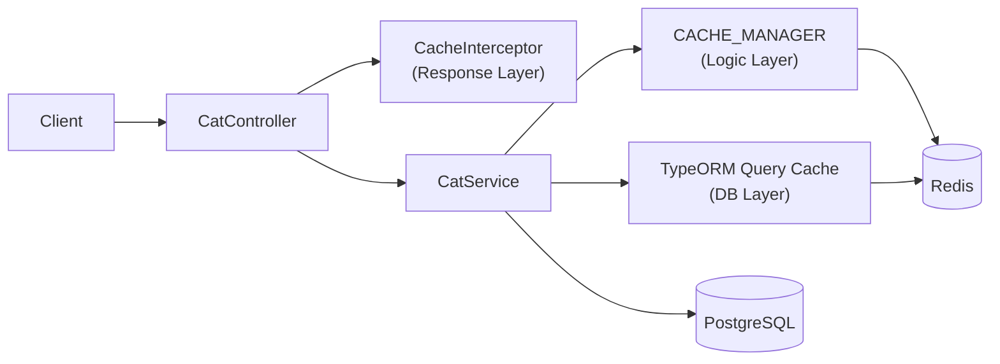
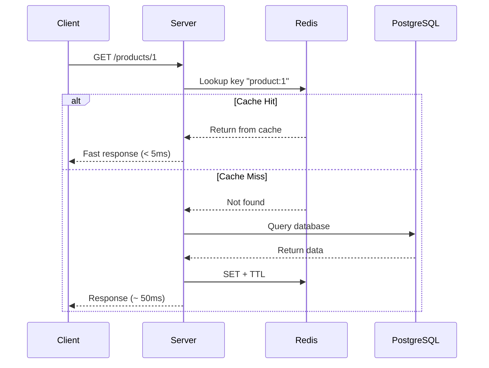

# title
<!-- @starci/seperator -->
Accelerating Systems with Redis Caching
<!-- @starci/seperator -->
# description
<!-- @starci/seperator -->
Hands-on integration of Redis into NestJS for multi-layer caching (Response, Logic, DB Query), reducing database load and improving latency for repeated read APIs.
<!-- @starci/seperator -->
# body
<!-- @starci/seperator -->
## 1. Opening

*"With repeated read APIs, why is the system still slow even though queries are optimized?"* — a **Senior Engineer** asks. A **Mid-level Developer** replies: *"Just scale up the database."* The answer lacks depth: it only touches **vertical scaling** while ignoring the real bottleneck — no matter how powerful the database, repeated processing cost across multiple layers (query → business logic → serialization) still piles up on every request, and **caching strategy** is the only way to completely eliminate that cost for repeated reads.

This lesson ships **NestJS** + **PostgreSQL** (Docker) + **Redis** (Docker) with four verification flows covering three independent cache layers plus cascade invalidation. **Part 2.1**: **hands-on** clones the source, starts infra via **Docker Compose**, runs `nest start --watch`, and calls APIs to observe cache miss/hit at each layer (Response Layer, Logic Layer, DB Query Layer) plus a cascade flow that clears all three layers at once. **Part 2.2**: **theory** systematizes **caching strategy** — cache-aside, write-through, TTL, and analyzes typical edge cases like **cache stampede**, stale data, and serialization mismatch.

## 2. Core concepts

This lesson follows **practice-led theory**. Students first clone the source, start **PostgreSQL** + **Redis** via **Docker Compose**, run **NestJS** via `nest start --watch`, and call APIs to observe cache miss/hit at each layer. The theory part then consolidates core concepts, architecture model, and deep edge cases.

### 2.1. Hands-on

#### 2.1.1. Prepare source code and environment

Goal: clone the demo source and run **NestJS** with **PostgreSQL** + **Redis** to observe caching across 3 layers: **Response Layer** (`CacheInterceptor`), **Logic Layer** (`CACHE_MANAGER`), **DB Query Layer** (TypeORM query cache).

Source: [StarCi-Academy/fullstack-mastery-module-1-database-integration-and-caching](https://github.com/StarCi-Academy/fullstack-mastery-module-1-database-integration-and-caching) on GitHub -- lesson directory: [`3-caching-with-redis`](https://github.com/StarCi-Academy/fullstack-mastery-module-1-database-integration-and-caching/tree/main/3-caching-with-redis).

```bash
# Step 1: Clone the repository locally
git clone https://github.com/StarCi-Academy/fullstack-mastery-module-1-database-integration-and-caching.git

# Step 2: Navigate to the lesson directory
cd fullstack-mastery-module-1-database-integration-and-caching/3-caching-with-redis
```

#### 2.1.2. Architecture / components (stack + flow)

- **PostgreSQL (Docker):** stores the `cats` table.
- **Redis (Docker):** cache backend for all 3 layers.
- **CatController:** REST endpoints for seed, 3-layer demo, and cache clearing.
- **CatService:** CRUD + cache logic via `CACHE_MANAGER` and TypeORM query cache.
- **RequestTimingInterceptor:** measures request duration, prints `[TIME]` log.

| Component | File | Role |
| --- | --- | --- |
| **PostgreSQL** | `.docker/compose.yaml` | Stores cats data |
| **Redis** | `.docker/compose.yaml` | Cache backend (3 layers) |
| **CatController** | `backend/src/modules/cat/cat.controller.ts` | REST endpoints |
| **CatService** | `backend/src/modules/cat/cat.service.ts` | CRUD + cache logic |
| **RequestTimingInterceptor** | `backend/src/common/interceptors/request-timing.interceptor.ts` | Request timing |
| **CacheModule** | `AppModule` | Multi-tier: Redis + Local Memory |



Figure 1: Multi-layer caching flow with Redis.

#### 2.1.3. Prerequisites and startup

##### 2.1.3.1. Prerequisites

- **Node.js** LTS (recommended ≥ 18).
- **npm** or **pnpm**.
- **NestJS CLI**: `npm i -g @nestjs/cli`.
- **Docker Desktop** (or Docker Engine) + `docker compose`.
- **Windows:** use **`Invoke-RestMethod`** instead of **`curl`**.

> **Note:** The repo ships with env defaults via **`ConfigModule`**; you do not need to create or edit **`.env`** when running the system. Only modify this file if you want to run the service with custom ports/credentials.

##### 2.1.3.2. Start

```bash
# Step 1: Start PostgreSQL + Redis
docker compose -f .docker/compose.yaml up -d

# Step 2: Install dependencies
npm install

# Step 3: Start in watch mode
nest start --watch
```

After the command above: terminal logs show the app listening on **`http://localhost:3000`**. **TypeORM** auto-creates tables via `synchronize: true`.

#### 2.1.4. Verification

**4 flows** below verify 3 independent cache layers + cascade invalidation: **(1)** Response Layer (CacheInterceptor); **(2)** Logic Layer (CACHE_MANAGER); **(3)** DB Query Layer (TypeORM query cache); **(4)** Cascade invalidation across all 3 layers.

- **Flow 1:** Response cache -- `GET /cats/response-layer`.
- **Flow 2:** Logic cache -- `GET /cats/logic-layer`.
- **Flow 3:** DB query cache -- `POST /cats/seed` + `GET /cats/db-layer`.
- **Flow 4:** Cascade invalidation -- `GET /cats/all-layers/:id` + `DELETE /cats/all-layers/cache`.

##### 2.1.4.1. Flow 1 -- Response cache (CacheInterceptor)

- Step 1: call `GET /cats/response-layer` first time (cache miss -- sleeps 1s).

  ```bash
  # Windows (PowerShell)
  Invoke-RestMethod -Uri http://localhost:3000/cats/response-layer

  # macOS / Linux
  # → Paste cURL into Postman: Import → Raw text
  curl -s http://localhost:3000/cats/response-layer
  ```

  Expected response (HTTP 200):

  ```json
  "This data would be cached at the Controller level using CacheInterceptor"
  ```

  Check terminal: `[TIME] GET /cats/response-layer 200 ~1000ms` (miss).

- Step 2: call again (cache hit). Same response but `[TIME]` much faster (~1-5ms).

- Step 3: clear response layer cache.

  ```bash
  # Windows (PowerShell)
  Invoke-RestMethod -Uri http://localhost:3000/cats/response-layer/cache -Method Delete

  # macOS / Linux
  curl -s -X DELETE http://localhost:3000/cats/response-layer/cache
  ```

  Expected response (HTTP 200):

  ```json
  {
    "message": "Response-layer cache key was cleared successfully.",
    "cacheKey": "cats_res_layer"
  }
  ```

*Conclusion: If the response matches the format above, the system confirms:*

- *CacheInterceptor works -- auto-saves response on first call, returns from Redis on subsequent calls.*
- *Manual invalidation -- deleting Redis key resets the next request to miss.*

##### 2.1.4.2. Flow 2 -- Logic cache (CACHE_MANAGER)

- Step 1: call `GET /cats/logic-layer` first time (cache miss -- sleeps 1s).

  ```bash
  # Windows (PowerShell)
  Invoke-RestMethod -Uri http://localhost:3000/cats/logic-layer

  # macOS / Linux
  # → Paste cURL into Postman: Import → Raw text
  curl -s http://localhost:3000/cats/logic-layer
  ```

  Expected response (HTTP 200):

  ```json
  {
    "message": "Hải sản cho mèo cực phẩm",
    "timestamp": "<ISO datetime>"
  }
  ```

- Step 2: call again (cache hit -- faster).

- Step 3: clear logic layer cache.

  ```bash
  # Windows (PowerShell)
  Invoke-RestMethod -Uri http://localhost:3000/cats/logic-layer/cache -Method Delete

  # macOS / Linux
  curl -s -X DELETE http://localhost:3000/cats/logic-layer/cache
  ```

  Expected response (HTTP 200):

  ```json
  {
    "message": "Logic-layer cache key was cleared successfully.",
    "cacheKey": "cats_logic_layer_cache"
  }
  ```

*Conclusion: If the response matches the format above, the system confirms:*

- *Programmatic cache -- `CACHE_MANAGER.get()/set()` caches by business key.*
- *Miss bypasses heavy logic -- first call sleeps 1s, subsequent calls return directly from Redis.*

##### 2.1.4.3. Flow 3 -- DB query cache (TypeORM)

- Step 1: seed 1000 cats.

  ```bash
  # Windows (PowerShell)
  Invoke-RestMethod -Uri "http://localhost:3000/cats/seed?count=1000" -Method Post

  # macOS / Linux
  curl -s -X POST "http://localhost:3000/cats/seed?count=1000"
  ```

  Expected response (HTTP 200):

  ```json
  {
    "message": "Seed completed successfully.",
    "inserted": 1000
  }
  ```

- Step 2: call `GET /cats/db-layer` first time (query cache miss).

  ```bash
  # Windows (PowerShell)
  Invoke-RestMethod -Uri http://localhost:3000/cats/db-layer

  # macOS / Linux
  # → Paste cURL into Postman: Import → Raw text
  curl -s http://localhost:3000/cats/db-layer
  ```

  Expected response (HTTP 200): JSON array of cats. Check `[TIME]` log.

- Step 3: call again (query cache hit -- faster).

- Step 4: clear DB layer cache.

  ```bash
  # Windows (PowerShell)
  Invoke-RestMethod -Uri http://localhost:3000/cats/db-layer/cache -Method Delete

  # macOS / Linux
  curl -s -X DELETE http://localhost:3000/cats/db-layer/cache
  ```

  Expected response (HTTP 200):

  ```json
  {
    "message": "DB query-layer cache key was cleared successfully.",
    "cacheKey": "cats_db_layer_cache"
  }
  ```

*Conclusion: If the response matches the format above, the system confirms:*

- *TypeORM query cache -- `cache: { id, milliseconds }` in `find()` auto-hashes queries into Redis keys.*
- *DB bypass -- on hit, no SQL is sent to PostgreSQL.*

##### 2.1.4.4. Flow 4 -- Cascade invalidation across all 3 layers

- Purpose: prove that when you clear the top-most cache (response), the lower layers (logic + DB) must also be cleared so the first re-fetch genuinely MISSES the entire pipeline.
- Step 1: call `GET /cats/all-layers/1` once to fill all 3 layers.

  ```bash
  # Windows (PowerShell)
  Invoke-RestMethod -Uri http://localhost:3000/cats/all-layers/1

  # macOS / Linux
  curl -s http://localhost:3000/cats/all-layers/1
  ```

  Expected response (HTTP 200):

  ```json
  {
    "responseSample": "This data would be cached at the Controller level using CacheInterceptor",
    "logicSample": {
      "message": "Hải sản cho mèo cực phẩm",
      "timestamp": "<ISO datetime>"
    },
    "dbCount": 1000
  }
  ```

  Observe terminal: first call MISSES all 3 layers (sleep 1s + sleep 1s + SQL query).

- Step 2: call `GET /cats/all-layers/1` again (HIT on all 3 layers -- very fast).

- Step 3: clear all 3 layers at once.

  ```bash
  # Windows (PowerShell)
  Invoke-RestMethod -Uri http://localhost:3000/cats/all-layers/cache -Method Delete

  # macOS / Linux
  curl -s -X DELETE http://localhost:3000/cats/all-layers/cache
  ```

  Expected response (HTTP 200):

  ```json
  {
    "message": "All 3 cache layers cleared. Next /cats/all-layers/:id will MISS on every layer.",
    "cleared": {
      "responseLayer": "cats_res_layer",
      "logicLayer": "cats_logic_layer_cache",
      "dbLayer": "cats_db_layer_cache"
    }
  }
  ```

- Step 4: call `GET /cats/all-layers/1` again -- logs show MISS on all 3 layers (confirming cascade clear succeeded).

*Conclusion: If the response matches the format above, the system confirms:*

- *Correct cascade invalidation -- clearing the top-most key does NOT auto-invalidate lower layers; you need a dedicated endpoint that clears all 3 keys.*
- *This is the mandatory pattern when data changes -- clearing only the response cache while keeping logic/DB cache would still return stale data through the lower layers.*

#### 2.1.5. Cleanup

Once you finish the lesson, you may clean up resources to free memory.

```bash
# Step 1: Stop the server
# Windows / macOS / Linux
Ctrl + C

# Step 2: Shut down Docker
docker compose -f .docker/compose.yaml down -v
```

#### 2.1.6. Further reading

- **NestJS Caching:** `CacheInterceptor` and `CACHE_MANAGER` -- two caching approaches in NestJS. ([NestJS Docs](https://docs.nestjs.com/techniques/caching))
- **TypeORM Query Cache:** Reduces repeated SQL executions for heavy read queries. ([TypeORM Docs](https://typeorm.io/caching))
- **Redis Eviction Policy:** Balances cache hit ratio and memory limits. ([Redis Docs](https://redis.io/docs/latest/develop/reference/eviction/))
- **Cache-Aside Pattern:** Most common pattern -- app checks cache → miss queries DB → writes cache. ([Microsoft Docs](https://learn.microsoft.com/en-us/azure/architecture/patterns/cache-aside))

### 2.2. Theory

#### 2.2.1. Cache Hit vs Cache Miss



#### 2.2.2. Common caching strategies

| Strategy | Description | When to use |
| --- | --- | --- |
| **Cache-Aside** | App checks cache → miss queries DB → writes cache | Read-heavy, rarely changing data |
| **Write-Through** | Write simultaneously to cache + DB | Data requiring high consistency |
| **Write-Behind** | Write cache first, async write DB | High performance, accepting eventual consistency |
| **TTL Expiration** | Cache auto-deletes after N seconds | Periodically changing data |

#### 2.2.3. 3 cache layers in the hands-on

| Layer | Mechanism | Scope |
| --- | --- | --- |
| **Response Layer** | `CacheInterceptor` decorator | Entire HTTP response |
| **Logic Layer** | `CACHE_MANAGER.get()/set()` | Specific business data |
| **DB Query Layer** | TypeORM `cache: { id, milliseconds }` | Query result sets |

#### 2.2.4. Edge cases to internalize

- **Cache stampede:** Many requests hit DB simultaneously when cache expires. **Fix:** use mutex lock or stale-while-revalidate.
- **Wrong cache invalidation:** DB updated but cache not invalidated → stale data. **Fix:** invalidate immediately after write or use short TTL.
- **Serialization mismatch:** Object stored in Redis differs in shape when deserialized. **Fix:** use consistent `JSON.stringify/parse`.
- **Redis connection lost:** App crashes when Redis is unavailable. **Fix:** implement fallback strategy, don't let cache failure block requests.

## 3. Wrap-up

### 3.1. Common interview questions

- **Question 1:** When to cache at response layer vs service layer?
  - What interviewers want to hear: separating cache goals by processing cost.
  - Sample answer (concise): Response layer is quick to deploy for read endpoints; service layer is more flexible when caching by business key.

- **Question 2:** What's the biggest risk of using cache?
  - What interviewers want to hear: stale data and invalidation strategy.
  - Sample answer (concise): Stale data is the primary risk; need clear TTL and invalidation on write.

- **Question 3:** Why can't cache replace the database?
  - What interviewers want to hear: persistence vs acceleration roles.
  - Sample answer (concise): Cache only optimizes temporary access; source of truth must be a durable database.
<!-- @starci/seperator -->
# codeExplaining

## 0

### code
<!-- @starci/seperator -->
```typescript
@Get("response-layer")
@UseInterceptors(CacheInterceptor)
@CacheKey("cats_res_layer")
@CacheTTL(30000)
async getResponseCache(): Promise<string> {
    this.logger.log("--- Triggering Layer 3 (Response Cache) flow ---")
    return await this.catService.findForResponseCacheWithDelay()
}
```
<!-- @starci/seperator -->
### explain
<!-- @starci/seperator -->
`CacheInterceptor` intercepts the request **before** it reaches the service — on the second hit **NestJS** returns straight from Redis without invoking this method, so the `sleep(1000)` only runs on a miss. `@CacheKey` pins the Redis key to `cats_res_layer` instead of hashing the URL, which makes manual invalidation easier (the controller has a dedicated DELETE endpoint). `@CacheTTL(30000)` sets a 30s TTL at the decorator level — the simplest cache style but inflexible when invalidation must follow a business event.
<!-- @starci/seperator -->
## 1

### code
<!-- @starci/seperator -->
```typescript
async findByLogicCache(): Promise<{ message: string; timestamp: string }> {
    const cachedData = await this.cacheManager.get(this.logicCacheKey)
    if (this.isLogicCacheResult(cachedData)) {
        return cachedData
    }
    await this.sleep(1000)
    const result = { message: "Premium seafood for cats", timestamp: new Date().toISOString() }
    await this.cacheManager.set(this.logicCacheKey, result, 60000)
    return result
}
```
<!-- @starci/seperator -->
### explain
<!-- @starci/seperator -->
This is the canonical **Cache-Aside** pattern at the service layer — code explicitly `get` → check → fallback compute → `set`, distinct from `CacheInterceptor` running at the controller layer. The `isLogicCacheResult` type guard ensures data fetched from Redis has the right `{ message, timestamp }` shape — avoiding `any` while staying runtime-safe (serialization mismatch is a real edge case). The two TTLs (response: 30s, logic: 60s) show each layer has its own policy — important because cache TTL must match data volatility.
<!-- @starci/seperator -->
## 2

### code
<!-- @starci/seperator -->
```typescript
async findByDbCache(): Promise<Cat[]> {
    return await this.catRepository.find({
        cache: {
            id: this.dbQueryCacheKey,
            milliseconds: 30000,
        },
    })
}
```
<!-- @starci/seperator -->
### explain
<!-- @starci/seperator -->
`cache: { id, milliseconds }` delegates to **TypeORM** to auto-generate the key, auto-`SET`/`GET` Redis, and auto-hash the SQL — the service sees no Redis logic, pushing it all down to the ORM layer. Compared to the Logic layer, this saves a DB round-trip but still runs through all service/controller processing — suitable for caching **query results** (DB-bound work) rather than **whole responses** (also serialization-bound). On DELETE, the controller calls `dataSource.queryResultCache.remove([id])` — a low-level TypeORM API; `CACHE_MANAGER` does not own this key.
<!-- @starci/seperator -->
# codeImplementations

## 0

### lang
<!-- @starci/seperator -->
csharp
<!-- @starci/seperator -->
### guide
<!-- @starci/seperator -->
Use **`StackExchange.Redis`** (`IDatabase`) for manual service-layer Cache-Aside, and **`Microsoft.Extensions.Caching.StackExchangeRedis`** (`IDistributedCache`) for response-layer via ASP.NET Core 7+ **Output Caching**.

**Mapping API:**
- `@UseInterceptors(CacheInterceptor)` → `[OutputCache(Duration = 30)]` on the action.
- `CACHE_MANAGER.get/set` → `IDistributedCache.GetStringAsync` + `SetStringAsync(key, json, new DistributedCacheEntryOptions { AbsoluteExpirationRelativeToNow = TimeSpan.FromSeconds(60) })`.
- `dataSource.queryResultCache.remove` → `IConnectionMultiplexer.GetDatabase().KeyDeleteAsync(key)` for the manual key.

**Differences and gotchas:**
- Output Caching does not automatically use `IDistributedCache` — must call `services.AddOutputCache().AddStackExchangeRedisOutputCache(...)` to push to Redis.
- `StackExchange.Redis` does not auto-serialize POCOs — always `JsonSerializer.Serialize/Deserialize` before set/get.
- EF Core has no built-in query result cache like TypeORM; needs a third-party package (`EFCoreSecondLevelCacheInterceptor`).
<!-- @starci/seperator -->
### example
<!-- @starci/seperator -->
```csharp
[OutputCache(Duration = 30)]
[HttpGet("response-layer")]
public IActionResult ResponseLayer() => Ok("Cached at endpoint level");

public async Task<CatResult> GetLogicCache(IDistributedCache cache)
{
    var raw = await cache.GetStringAsync("cats_logic_layer_cache");
    if (raw is not null) return JsonSerializer.Deserialize<CatResult>(raw)!;
    await Task.Delay(1000);
    var result = new CatResult("Premium seafood for cats", DateTime.UtcNow);
    await cache.SetStringAsync("cats_logic_layer_cache",
        JsonSerializer.Serialize(result),
        new DistributedCacheEntryOptions { AbsoluteExpirationRelativeToNow = TimeSpan.FromMinutes(1) });
    return result;
}
```
<!-- @starci/seperator -->
## 1

### lang
<!-- @starci/seperator -->
typescript
<!-- @starci/seperator -->
### guide
<!-- @starci/seperator -->
Use **Express** + **`ioredis`** directly — no NestJS DI, no decorators; every cache tier is written by hand as plain middleware/handler.

**Mapping API:**
- `CacheInterceptor` → Express middleware that checks `await redis.get(key)` before the handler and calls `res.json` on a hit.
- `CACHE_MANAGER` → a `new Redis(uri)` instance shared via a module-level singleton; `redis.get/set` with `EX` for TTL.
- TypeORM query cache → wrap the query in a helper `cacheJSON(redis, key, ttl, async () => db.query(sql))`.

**Differences and gotchas:**
- No DI container → instantiate `Redis` once in `app.ts` and pass it into routers; avoid `new Redis()` per request (connection leak).
- `ioredis` sets TTL via `"EX", seconds` — different from `cache-manager` (milliseconds) and `node-redis` (`PX` for ms).
- Manual Cache-Aside is vulnerable to **cache stampede**: use `SET ... NX` + jittered TTL to mitigate when many requests miss together.
<!-- @starci/seperator -->
### example
<!-- @starci/seperator -->
```typescript
import express from "express"
import Redis from "ioredis"

const app = express()
const redis = new Redis(process.env.REDIS_URL!)

const cacheResp = (key: string, ttl: number) =>
    async (req: express.Request, res: express.Response, next: express.NextFunction) => {
        const hit = await redis.get(key)
        if (hit) { res.type("json").send(hit); return }
        const original = res.send.bind(res)
        res.send = (body: unknown) => { redis.set(key, String(body), "EX", ttl); return original(body) }
        next()
    }

app.get("/cats/response-layer", cacheResp("cats_res_layer", 30), async (_req, res) => {
    await new Promise((r) => setTimeout(r, 1000))
    res.send("Cached at controller level via ioredis")
})
```
<!-- @starci/seperator -->
## 2

### lang
<!-- @starci/seperator -->
go
<!-- @starci/seperator -->
### guide
<!-- @starci/seperator -->
Use **`github.com/redis/go-redis/v9`** for the Redis client and **`github.com/gin-gonic/gin`** for HTTP — Cache-Aside is implemented as a helper function since Go has no decorators.

**Mapping API:**
- `CacheInterceptor` → a Gin middleware that reads `rdb.Get(ctx, key)` before the handler, then `rdb.Set` after the handler runs.
- `CACHE_MANAGER` → `rdb.Get/Set/Del` with `time.Duration` for TTL.
- TypeORM query cache → wrap a repo function: `cacheJSON(rdb, key, ttl, func() ([]Cat, error) { return repo.FindAll() })`.

**Differences and gotchas:**
- `go-redis` returns `redis.Nil` when the key is absent (not a nil error) — must `errors.Is(err, redis.Nil)` to distinguish miss vs. system error.
- No generics before Go 1.18 — from 1.18 use `cacheJSON[T any](...)` for type-safety.
- Mind the context: use `ctx, cancel := context.WithTimeout(reqCtx, 200*time.Millisecond)` for Redis calls so a slow Redis does not block the request.
<!-- @starci/seperator -->
### example
<!-- @starci/seperator -->
```go
func cacheJSON[T any](ctx context.Context, rdb *redis.Client, key string, ttl time.Duration, fn func() (T, error)) (T, error) {
    var zero T
    if raw, err := rdb.Get(ctx, key).Bytes(); err == nil {
        var v T
        if err := json.Unmarshal(raw, &v); err == nil { return v, nil }
    }
    v, err := fn()
    if err != nil { return zero, err }
    if b, err := json.Marshal(v); err == nil { rdb.Set(ctx, key, b, ttl) }
    return v, nil
}

r.GET("/cats/logic-layer", func(c *gin.Context) {
    res, err := cacheJSON(c, rdb, "cats_logic_layer_cache", time.Minute,
        func() (CatResult, error) {
            time.Sleep(time.Second)
            return CatResult{Message: "Premium seafood for cats", Timestamp: time.Now()}, nil
        })
    if err != nil { c.AbortWithError(500, err); return }
    c.JSON(200, res)
})
```
<!-- @starci/seperator -->
## 3

### lang
<!-- @starci/seperator -->
java
<!-- @starci/seperator -->
### guide
<!-- @starci/seperator -->
Use the **Spring Cache** abstraction (`@Cacheable`, `@CacheEvict`) with **Spring Data Redis** as the backend — closest analogue to NestJS `@CacheKey`/`@CacheTTL`.

**Mapping API:**
- `@CacheKey + @CacheTTL` → `@Cacheable(value = "cats_res_layer", cacheManager = "redisCacheManager")` + TTL configured in `RedisCacheConfiguration`.
- `CACHE_MANAGER.get/set` → inject `CacheManager`, then `cacheManager.getCache("logic").get(key, () -> heavyWork())`.
- `queryResultCache.remove` → `@CacheEvict(value = "cats_db_layer_cache", allEntries = false, key = "#root.methodName")`.

**Differences and gotchas:**
- Spring Cache is an abstraction — swapping from Caffeine to Redis only changes the `CacheManager` bean; service code stays the same.
- TTL is not configured per-`@Cacheable` (deprecated in Spring Boot 3); use `RedisCacheManager.builder().withCacheConfiguration("name", config.entryTtl(Duration.ofSeconds(30)))` instead.
- `@CacheEvict(beforeInvocation = true)` evicts before the method runs — important when the method may throw, so a stale key does not linger after a failure.
<!-- @starci/seperator -->
### example
<!-- @starci/seperator -->
```java
@RestController
@RequestMapping("/cats")
public class CatController {
    @Cacheable(value = "cats_res_layer", cacheManager = "redisCacheManager")
    @GetMapping("/response-layer")
    public String responseLayer() throws InterruptedException {
        Thread.sleep(1000);
        return "Cached at controller level via Spring Cache";
    }

    @CacheEvict(value = "cats_res_layer", allEntries = true)
    @DeleteMapping("/response-layer/cache")
    public Map<String, String> clearResponse() {
        return Map.of("message", "cleared", "cacheKey", "cats_res_layer");
    }
}
```
<!-- @starci/seperator -->
# databases

## 0
### alias
<!-- @starci/seperator -->
postgresql
<!-- @starci/seperator -->
### entities
<!-- @starci/seperator -->
```typescript
import { Column, Entity, PrimaryGeneratedColumn } from "typeorm"

@Entity({ name: "cats" })
export class Cat {
    @PrimaryGeneratedColumn("uuid")
    id: string

    @Column({ type: "varchar", length: 120 })
    name: string

    @Column({ type: "varchar", length: 60 })
    breed: string

    @Column({ type: "int" })
    age: number
}
```
<!-- @starci/seperator -->

# references
## 0
### alias
<!-- @starci/seperator -->
NestJS Caching
<!-- @starci/seperator -->
### url
<!-- @starci/seperator -->
https://docs.nestjs.com/techniques/caching
<!-- @starci/seperator -->

## 1
### alias
<!-- @starci/seperator -->
Redis Documentation
<!-- @starci/seperator -->
### url
<!-- @starci/seperator -->
https://redis.io/docs
<!-- @starci/seperator -->

## 2
### alias
<!-- @starci/seperator -->
TypeORM Caching
<!-- @starci/seperator -->
### url
<!-- @starci/seperator -->
https://typeorm.io/caching
<!-- @starci/seperator -->

# minutesRead
<!-- @starci/seperator -->
20
<!-- @starci/seperator -->
# isPremium
<!-- @starci/seperator -->
false
<!-- @starci/seperator -->
