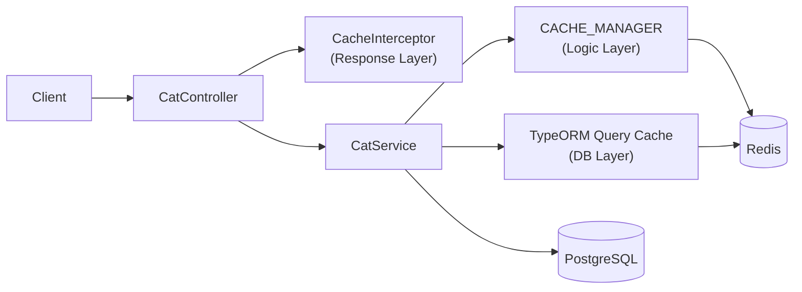
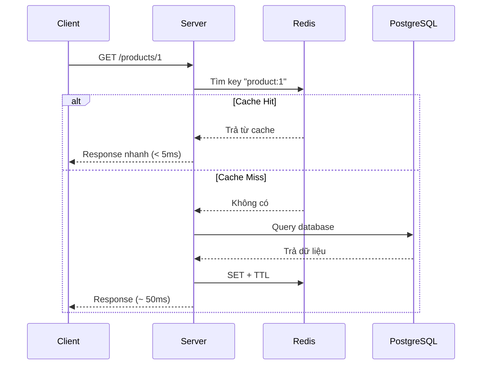

# title
<!-- @starci/seperator -->
Tăng tốc hệ thống với bộ nhớ đệm Redis
<!-- @starci/seperator -->
# description
<!-- @starci/seperator -->
Thực hành tích hợp Redis vào NestJS để cache nhiều tầng (Response, Logic, DB Query), giảm tải database và cải thiện độ trễ cho các API đọc lặp lại.
<!-- @starci/seperator -->
# body
<!-- @starci/seperator -->
## 1. Lời mở đầu

*"Với API đọc lặp lại, vì sao hệ thống vẫn chậm dù query đã tối ưu?"* — một **Senior Engineer** đặt câu hỏi. **Mid-level Developer** đáp: *"Chỉ cần tăng tài nguyên database."* Câu trả lời thiếu chiều sâu: chỉ chạm đến **vertical scaling** mà bỏ qua bản chất bottleneck — dù database có mạnh đến đâu, chi phí xử lý lặp lại ở nhiều tầng (query → business logic → serialization) vẫn dồn lên mỗi request, và **caching strategy** mới là cách triệt tiêu hoàn toàn chi phí đó cho repeated reads.

Bài học triển khai **NestJS** + **PostgreSQL** (Docker) + **Redis** (Docker) với bốn luồng kiểm thử bao phủ ba tầng cache độc lập cộng cascade invalidation. **Phần 2.1**: **thực hành** clone source, khởi động infra qua **Docker Compose**, chạy `nest start --watch` và gọi API quan sát cache miss/hit ở từng tầng (Response Layer, Logic Layer, DB Query Layer) cộng luồng cascade xóa cả ba tầng cùng lúc. **Phần 2.2**: **lý thuyết** hệ thống hóa **caching strategy** — cache-aside, write-through, TTL, và phân tích các edge case điển hình như **cache stampede**, stale data, serialization mismatch.

## 2. Các khái niệm cốt lõi

Bài tuân theo **Thực hành dẫn dắt Lý thuyết**. Khởi đầu, học viên sẽ trực tiếp clone source, khởi động **PostgreSQL** + **Redis** bằng **Docker Compose**, chạy **NestJS** bằng `nest start --watch` và gọi API để quan sát cache miss/hit ở từng tầng. Tiếp theo, phần lý thuyết sẽ hệ thống hóa các khái niệm cốt lõi, mô hình kiến trúc và phân tích các edge cases chuyên sâu.

### 2.1. Thực hành

#### 2.1.1. Chuẩn bị source code và môi trường

Mục đích: clone source demo và chạy **NestJS** kết hợp **PostgreSQL** + **Redis** để quan sát caching ở 3 tầng: **Response Layer** (`CacheInterceptor`), **Logic Layer** (`CACHE_MANAGER`), **DB Query Layer** (TypeORM query cache).

Source: [StarCi-Academy/fullstack-mastery-module-1-database-integration-and-caching](https://github.com/StarCi-Academy/fullstack-mastery-module-1-database-integration-and-caching) trên GitHub -- thư mục bài học: [`3-caching-with-redis`](https://github.com/StarCi-Academy/fullstack-mastery-module-1-database-integration-and-caching/tree/main/3-caching-with-redis).

```bash
# Bước 1: Clone repository về máy local
git clone https://github.com/StarCi-Academy/fullstack-mastery-module-1-database-integration-and-caching.git

# Bước 2: Di chuyển vào đúng thư mục bài học
cd fullstack-mastery-module-1-database-integration-and-caching/3-caching-with-redis
```

#### 2.1.2. Kiến trúc/thành phần (stack + luồng)

- **PostgreSQL (Docker):** lưu trữ bảng `cats`.
- **Redis (Docker):** backend lưu cache cho cả 3 tầng.
- **CatController:** REST endpoints cho seed, 3 layer demo, và clear cache.
- **CatService:** nghiệp vụ CRUD + cache logic qua `CACHE_MANAGER` và TypeORM query cache.
- **RequestTimingInterceptor:** đo thời gian xử lý request, in log `[TIME]`.

| Thành phần | File | Vai trò |
| --- | --- | --- |
| **PostgreSQL** | `.docker/compose.yaml` | Lưu trữ dữ liệu cats |
| **Redis** | `.docker/compose.yaml` | Backend cache (3 tầng) |
| **CatController** | `backend/src/modules/cat/cat.controller.ts` | REST endpoints |
| **CatService** | `backend/src/modules/cat/cat.service.ts` | CRUD + cache logic |
| **RequestTimingInterceptor** | `backend/src/common/interceptors/request-timing.interceptor.ts` | Đo thời gian request |
| **CacheModule** | `AppModule` | Multi-tier: Redis + Local Memory |



Hình 1: Luồng caching nhiều tầng với Redis.

#### 2.1.3. Chuẩn bị & khởi chạy

##### 2.1.3.1. Điều kiện cần trước

- **Node.js** LTS (khuyến nghị ≥ 18).
- **npm** hoặc **pnpm**.
- **NestJS CLI**: `npm i -g @nestjs/cli`.
- **Docker Desktop** (hoặc Docker Engine) + `docker compose`.
- **Windows:** dùng **`Invoke-RestMethod`** thay cho **`curl`**.

> **Lưu ý:** Repo đã ship env defaults qua **`ConfigModule`**; khi chạy hệ thống không cần tạo hay sửa **`.env`**. Chỉ chỉnh sửa file này khi bạn muốn chạy service với các port/credential khác mặc định.

##### 2.1.3.2. Khởi động

```bash
# Bước 1: Khởi động PostgreSQL + Redis
docker compose -f .docker/compose.yaml up -d

# Bước 2: Cài dependency
npm install

# Bước 3: Khởi chạy ở chế độ watch
nest start --watch
```

Sau lệnh trên: terminal log hiển thị app đang lắng nghe tại **`http://localhost:3000`**. **TypeORM** tự tạo bảng nhờ `synchronize: true`.

#### 2.1.4. Kiểm thử

**4 luồng** dưới đây kiểm chứng 3 tầng cache độc lập + cascade invalidation: **(1)** Response Layer (CacheInterceptor); **(2)** Logic Layer (CACHE_MANAGER); **(3)** DB Query Layer (TypeORM query cache); **(4)** Cascade invalidation cả 3 tầng cùng lúc.

- **Luồng 1:** Response cache -- `GET /cats/response-layer`.
- **Luồng 2:** Logic cache -- `GET /cats/logic-layer`.
- **Luồng 3:** DB query cache -- `POST /cats/seed` + `GET /cats/db-layer`.
- **Luồng 4:** Cascade invalidation -- `GET /cats/all-layers/:id` + `DELETE /cats/all-layers/cache`.

##### 2.1.4.1. Luồng 1 -- Response cache (CacheInterceptor)

- Bước 1: gọi `GET /cats/response-layer` lần đầu (cache miss -- sleep 1s).

  ```bash
  # Windows (PowerShell)
  Invoke-RestMethod -Uri http://localhost:3000/cats/response-layer

  # macOS / Linux
  # → Dán cURL vào Postman: Import → Raw text
  curl -s http://localhost:3000/cats/response-layer
  ```

  Response phải trả về (HTTP 200):

  ```json
  "This data would be cached at the Controller level using CacheInterceptor"
  ```

  Quan sát terminal: `[TIME] GET /cats/response-layer 200 ~1000ms` (miss).

- Bước 2: gọi lại `GET /cats/response-layer` lần hai (cache hit).

  Response giữ nguyên nội dung, nhưng `[TIME]` nhanh hơn (~1-5ms).

- Bước 3: xóa cache response layer.

  ```bash
  # Windows (PowerShell)
  Invoke-RestMethod -Uri http://localhost:3000/cats/response-layer/cache -Method Delete

  # macOS / Linux
  curl -s -X DELETE http://localhost:3000/cats/response-layer/cache
  ```

  Response phải trả về (HTTP 200):

  ```json
  {
    "message": "Response-layer cache key was cleared successfully.",
    "cacheKey": "cats_res_layer"
  }
  ```

*Kết luận: Nếu response khớp format trên, hệ thống xác nhận:*

- *CacheInterceptor hoạt động -- tự lưu response lần đầu, lần sau trả từ Redis.*
- *Invalidation thủ công -- xóa key Redis để request tiếp theo trở lại miss.*

##### 2.1.4.2. Luồng 2 -- Logic cache (CACHE_MANAGER)

- Bước 1: gọi `GET /cats/logic-layer` lần đầu (cache miss -- sleep 1s).

  ```bash
  # Windows (PowerShell)
  Invoke-RestMethod -Uri http://localhost:3000/cats/logic-layer

  # macOS / Linux
  # → Dán cURL vào Postman: Import → Raw text
  curl -s http://localhost:3000/cats/logic-layer
  ```

  Response phải trả về (HTTP 200):

  ```json
  {
    "message": "Hải sản cho mèo cực phẩm",
    "timestamp": "<ISO datetime>"
  }
  ```

- Bước 2: gọi lại lần hai (cache hit -- nhanh hơn).

- Bước 3: xóa cache logic layer.

  ```bash
  # Windows (PowerShell)
  Invoke-RestMethod -Uri http://localhost:3000/cats/logic-layer/cache -Method Delete

  # macOS / Linux
  curl -s -X DELETE http://localhost:3000/cats/logic-layer/cache
  ```

  Response phải trả về (HTTP 200):

  ```json
  {
    "message": "Logic-layer cache key was cleared successfully.",
    "cacheKey": "cats_logic_layer_cache"
  }
  ```

*Kết luận: Nếu response khớp format trên, hệ thống xác nhận:*

- *Programmatic cache -- `CACHE_MANAGER.get()/set()` cho phép cache theo business key.*
- *Miss bypass heavy logic -- lần đầu sleep 1s, lần sau trả trực tiếp từ Redis.*

##### 2.1.4.3. Luồng 3 -- DB query cache (TypeORM)

- Bước 1: seed 1000 cats.

  ```bash
  # Windows (PowerShell)
  Invoke-RestMethod -Uri "http://localhost:3000/cats/seed?count=1000" -Method Post

  # macOS / Linux
  curl -s -X POST "http://localhost:3000/cats/seed?count=1000"
  ```

  Response phải trả về (HTTP 200):

  ```json
  {
    "message": "Seed completed successfully.",
    "inserted": 1000
  }
  ```

- Bước 2: gọi `GET /cats/db-layer` lần đầu (query cache miss).

  ```bash
  # Windows (PowerShell)
  Invoke-RestMethod -Uri http://localhost:3000/cats/db-layer

  # macOS / Linux
  # → Dán cURL vào Postman: Import → Raw text
  curl -s http://localhost:3000/cats/db-layer
  ```

  Response phải trả về (HTTP 200): mảng JSON cats. Quan sát `[TIME]` log.

- Bước 3: gọi lại lần hai (query cache hit -- nhanh hơn).

- Bước 4: xóa cache DB layer.

  ```bash
  # Windows (PowerShell)
  Invoke-RestMethod -Uri http://localhost:3000/cats/db-layer/cache -Method Delete

  # macOS / Linux
  curl -s -X DELETE http://localhost:3000/cats/db-layer/cache
  ```

  Response phải trả về (HTTP 200):

  ```json
  {
    "message": "DB query-layer cache key was cleared successfully.",
    "cacheKey": "cats_db_layer_cache"
  }
  ```

*Kết luận: Nếu response khớp format trên, hệ thống xác nhận:*

- *TypeORM query cache -- `cache: { id, milliseconds }` trong `find()` tự hash query thành key Redis.*
- *DB bypass -- lần hit không gửi SQL nào tới PostgreSQL.*

##### 2.1.4.4. Luồng 4 -- Cascade invalidation cả 3 tầng cùng lúc

- Mục đích: chứng minh khi xóa cache cấp cao nhất (response), các tầng dưới (logic + DB) cũng phải bị xóa thì lần re-fetch đầu tiên mới thực sự MISS qua toàn bộ pipeline.
- Bước 1: gọi `GET /cats/all-layers/1` lần đầu để fill cache cả 3 tầng.

  ```bash
  # Windows (PowerShell)
  Invoke-RestMethod -Uri http://localhost:3000/cats/all-layers/1

  # macOS / Linux
  curl -s http://localhost:3000/cats/all-layers/1
  ```

  Response phải trả về (HTTP 200):

  ```json
  {
    "responseSample": "This data would be cached at the Controller level using CacheInterceptor",
    "logicSample": {
      "message": "Hải sản cho mèo cực phẩm",
      "timestamp": "<ISO datetime>"
    },
    "dbCount": 1000
  }
  ```

  Quan sát terminal: lần đầu MISS ở cả 3 tầng (sleep 1s + sleep 1s + SQL query).

- Bước 2: gọi lại `GET /cats/all-layers/1` (HIT cả 3 tầng -- rất nhanh).

- Bước 3: xóa cache cả 3 tầng cùng lúc.

  ```bash
  # Windows (PowerShell)
  Invoke-RestMethod -Uri http://localhost:3000/cats/all-layers/cache -Method Delete

  # macOS / Linux
  curl -s -X DELETE http://localhost:3000/cats/all-layers/cache
  ```

  Response phải trả về (HTTP 200):

  ```json
  {
    "message": "All 3 cache layers cleared. Next /cats/all-layers/:id will MISS on every layer.",
    "cleared": {
      "responseLayer": "cats_res_layer",
      "logicLayer": "cats_logic_layer_cache",
      "dbLayer": "cats_db_layer_cache"
    }
  }
  ```

- Bước 4: gọi lại `GET /cats/all-layers/1` -- log cho thấy MISS lại ở cả 3 tầng (chứng tỏ cascade clear thành công).

*Kết luận: Nếu response khớp format trên, hệ thống xác nhận:*

- *Cascade invalidation đúng đắn -- xóa key cấp cao nhất KHÔNG tự động xóa cache cấp dưới; cần endpoint dedicated xóa cả 3 keys.*
- *Đây là pattern bắt buộc khi data đổi -- nếu chỉ xóa response cache mà giữ logic/DB cache, response lần kế sẽ trả ra data cũ qua logic/DB layer.*

#### 2.1.5. Dọn tài nguyên

Sau khi kết thúc bài, bạn có thể dọn tài nguyên để tiết kiệm bộ nhớ.

```bash
# Bước 1: Dừng server
# Windows / macOS / Linux
Ctrl + C

# Bước 2: Đóng Docker
docker compose -f .docker/compose.yaml down -v
```

#### 2.1.6. Đọc thêm

- **NestJS Caching:** `CacheInterceptor` và `CACHE_MANAGER` -- hai cách cache trong NestJS. ([NestJS Docs](https://docs.nestjs.com/techniques/caching))
- **TypeORM Query Cache:** Giảm SQL lặp lại cho truy vấn đọc nặng. ([TypeORM Docs](https://typeorm.io/caching))
- **Redis Eviction Policy:** Cân bằng cache hit ratio và memory limit. ([Redis Docs](https://redis.io/docs/latest/develop/reference/eviction/))
- **Cache-Aside Pattern:** Pattern phổ biến nhất -- app tự check cache → miss thì query DB → ghi cache. ([Microsoft Docs](https://learn.microsoft.com/en-us/azure/architecture/patterns/cache-aside))

### 2.2. Lý thuyết

#### 2.2.1. Cache Hit vs Cache Miss



#### 2.2.2. Các chiến lược caching phổ biến

| Chiến lược | Mô tả | Khi nào dùng |
| --- | --- | --- |
| **Cache-Aside** | App tự check cache → miss thì query DB → ghi cache | Đọc nhiều, dữ liệu ít thay đổi |
| **Write-Through** | Ghi đồng thời cache + DB | Dữ liệu cần consistency cao |
| **Write-Behind** | Ghi cache trước, async ghi DB | Performance cao, chấp nhận eventual consistency |
| **TTL Expiration** | Cache tự xóa sau N giây | Dữ liệu thay đổi theo chu kỳ |

#### 2.2.3. 3 tầng cache trong bài thực hành

| Tầng | Cơ chế | Scope |
| --- | --- | --- |
| **Response Layer** | `CacheInterceptor` decorator | Toàn bộ HTTP response |
| **Logic Layer** | `CACHE_MANAGER.get()/set()` | Business data cụ thể |
| **DB Query Layer** | TypeORM `cache: { id, milliseconds }` | Query result set |

#### 2.2.4. Các trường hợp biên (edge cases) cần lưu ý

- **Cache stampede:** Nhiều request cùng lúc khi cache expire → tất cả hit DB. **Giải pháp:** dùng mutex lock hoặc stale-while-revalidate.
- **Cache invalidation sai:** Update DB nhưng quên invalidate cache → stale data. **Giải pháp:** invalidate ngay sau write hoặc dùng TTL ngắn.
- **Serialization mismatch:** Object lưu Redis khác shape khi deserialize. **Giải pháp:** dùng `JSON.stringify/parse` nhất quán.
- **Redis connection lost:** App crash khi Redis unavailable. **Giải pháp:** implement fallback strategy, không để cache failure block request.

## 3. Tổng kết

### 3.1. Các câu hỏi dễ bị phỏng vấn

- **Câu hỏi 1:** Khi nào nên cache ở response layer, khi nào ở service layer?
  - Ý interviewer muốn nghe: phân tách mục tiêu cache theo chi phí xử lý.
  - Trả lời mẫu (ngắn): Response layer nhanh triển khai cho endpoint đọc; service layer linh hoạt hơn khi cần cache theo business key.

- **Câu hỏi 2:** Rủi ro lớn nhất khi dùng cache là gì?
  - Ý interviewer muốn nghe: stale data và invalidation strategy.
  - Trả lời mẫu (ngắn): Dữ liệu cũ là rủi ro chính; cần TTL rõ ràng và invalidation khi write.

- **Câu hỏi 3:** Vì sao cache không thể thay thế database?
  - Ý interviewer muốn nghe: vai trò persistence vs acceleration.
  - Trả lời mẫu (ngắn): Cache chỉ tối ưu truy cập tạm thời; source of truth vẫn phải là database bền vững.
<!-- @starci/seperator -->
# codeExplaining

## 0

### code
<!-- @starci/seperator -->
```typescript
@Get("response-layer")
@UseInterceptors(CacheInterceptor)
@CacheKey("cats_res_layer")
@CacheTTL(30000)
async getResponseCache(): Promise<string> {
    this.logger.log("--- Triggering Layer 3 (Response Cache) flow ---")
    return await this.catService.findForResponseCacheWithDelay()
}
```
<!-- @starci/seperator -->
### explain
<!-- @starci/seperator -->
`CacheInterceptor` chặn request **trước** khi đến service — lần thứ hai trở đi, **NestJS** trả thẳng từ Redis mà không gọi method này, nên `sleep(1000)` chỉ chạy ở lần miss. `@CacheKey` cố định key Redis là `cats_res_layer` thay vì hash URL mặc định, giúp invalidate thủ công dễ hơn (controller có endpoint DELETE riêng). `@CacheTTL(30000)` đặt TTL 30s ở tầng decorator — đây là kiểu cache đơn giản nhất nhưng kém linh hoạt khi cần invalidate theo business event.
<!-- @starci/seperator -->
## 1

### code
<!-- @starci/seperator -->
```typescript
async findByLogicCache(): Promise<{ message: string; timestamp: string }> {
    const cachedData = await this.cacheManager.get(this.logicCacheKey)
    if (this.isLogicCacheResult(cachedData)) {
        return cachedData
    }
    await this.sleep(1000)
    const result = { message: "Hải sản cho mèo cực phẩm", timestamp: new Date().toISOString() }
    await this.cacheManager.set(this.logicCacheKey, result, 60000)
    return result
}
```
<!-- @starci/seperator -->
### explain
<!-- @starci/seperator -->
Đây là **Cache-Aside** kinh điển ở tầng service — code chủ động `get` → kiểm tra → fallback compute → `set`, khác với `CacheInterceptor` chạy ở tầng controller. Type guard `isLogicCacheResult` đảm bảo dữ liệu lấy từ Redis có đúng shape `{ message, timestamp }`, tránh `any` mà vẫn an toàn runtime (serialization mismatch là edge case thật). Hai mức TTL khác nhau (response: 30s, logic: 60s) cho thấy mỗi tầng có policy riêng — bài học quan trọng vì cache TTL phải khớp tốc độ thay đổi dữ liệu.
<!-- @starci/seperator -->
## 2

### code
<!-- @starci/seperator -->
```typescript
async findByDbCache(): Promise<Cat[]> {
    return await this.catRepository.find({
        cache: {
            id: this.dbQueryCacheKey,
            milliseconds: 30000,
        },
    })
}
```
<!-- @starci/seperator -->
### explain
<!-- @starci/seperator -->
`cache: { id, milliseconds }` ủy thác cho **TypeORM** tự sinh key, tự `SET`/`GET` Redis, và tự hash câu SQL bên trong — service không thấy logic Redis nào, đẩy hết xuống ORM layer. So với tầng Logic, tầng này tiết kiệm DB round-trip nhưng vẫn chạy qua tất cả phần xử lý của service/controller — phù hợp cache **kết quả query** (tốn DB) chứ không cache **toàn bộ response** (tốn cả serialization). Khi DELETE cache, controller gọi `dataSource.queryResultCache.remove([id])` — đây là API thấp tầng riêng của TypeORM, không dùng được `CACHE_MANAGER` cho key này.
<!-- @starci/seperator -->
# codeImplementations

## 0

### lang
<!-- @starci/seperator -->
csharp
<!-- @starci/seperator -->
### guide
<!-- @starci/seperator -->
Dùng **`StackExchange.Redis`** (`IDatabase`) cho Cache-Aside thủ công ở tầng service, và **`Microsoft.Extensions.Caching.StackExchangeRedis`** (`IDistributedCache`) cho tầng response qua **Output Caching** của ASP.NET Core 7+.

**Mapping API:**
- `@UseInterceptors(CacheInterceptor)` → `[OutputCache(Duration = 30)]` trên action.
- `CACHE_MANAGER.get/set` → `IDistributedCache.GetStringAsync` + `SetStringAsync(key, json, new DistributedCacheEntryOptions { AbsoluteExpirationRelativeToNow = TimeSpan.FromSeconds(60) })`.
- `dataSource.queryResultCache.remove` → `IConnectionMultiplexer.GetDatabase().KeyDeleteAsync(key)` cho key thủ công.

**Differences and gotchas:**
- Output Caching không tự tương tác với `IDistributedCache` — phải gọi `services.AddOutputCache().AddStackExchangeRedisOutputCache(...)` mới đẩy được sang Redis.
- `StackExchange.Redis` không tự serialize POCO — luôn `JsonSerializer.Serialize/Deserialize` trước khi set/get.
- EF Core không có built-in query result cache như TypeORM; cần package thứ ba (`EFCoreSecondLevelCacheInterceptor`).
<!-- @starci/seperator -->
### example
<!-- @starci/seperator -->
```csharp
[OutputCache(Duration = 30)]
[HttpGet("response-layer")]
public IActionResult ResponseLayer() => Ok("Cached at endpoint level");

public async Task<CatResult> GetLogicCache(IDistributedCache cache)
{
    var raw = await cache.GetStringAsync("cats_logic_layer_cache");
    if (raw is not null) return JsonSerializer.Deserialize<CatResult>(raw)!;
    await Task.Delay(1000);
    var result = new CatResult("Premium seafood for cats", DateTime.UtcNow);
    await cache.SetStringAsync("cats_logic_layer_cache",
        JsonSerializer.Serialize(result),
        new DistributedCacheEntryOptions { AbsoluteExpirationRelativeToNow = TimeSpan.FromMinutes(1) });
    return result;
}
```
<!-- @starci/seperator -->
## 1

### lang
<!-- @starci/seperator -->
typescript
<!-- @starci/seperator -->
### guide
<!-- @starci/seperator -->
Dùng **Express** + **`ioredis`** trực tiếp — không có NestJS DI, không có decorator; mọi tầng cache đều viết tay như middleware/handler thuần.

**Mapping API:**
- `CacheInterceptor` → middleware Express kiểm tra `await redis.get(key)` trước handler, gọi `res.json` nếu hit.
- `CACHE_MANAGER` → instance `new Redis(uri)` chia sẻ qua module-level singleton; `redis.get/set` với `EX` cho TTL.
- TypeORM query cache → wrap query bằng helper `cacheJSON(redis, key, ttl, async () => db.query(sql))`.

**Differences and gotchas:**
- Không có DI container → tự khởi tạo `Redis` ở `app.ts`, truyền vào router; tránh new client mỗi request (connection leak).
- `ioredis` set TTL qua tham số `"EX", seconds` (giây) — khác `cache-manager` (millisecond) và `node-redis` (`PX` cho ms).
- Cache-Aside thủ công dễ bị **cache stampede**: thêm `SET ... NX` + jittered TTL để mitigate khi nhiều request cùng miss.
<!-- @starci/seperator -->
### example
<!-- @starci/seperator -->
```typescript
import express from "express"
import Redis from "ioredis"

const app = express()
const redis = new Redis(process.env.REDIS_URL!)

const cacheResp = (key: string, ttl: number) =>
    async (req: express.Request, res: express.Response, next: express.NextFunction) => {
        const hit = await redis.get(key)
        if (hit) { res.type("json").send(hit); return }
        const original = res.send.bind(res)
        res.send = (body: unknown) => { redis.set(key, String(body), "EX", ttl); return original(body) }
        next()
    }

app.get("/cats/response-layer", cacheResp("cats_res_layer", 30), async (_req, res) => {
    await new Promise((r) => setTimeout(r, 1000))
    res.send("Cached at controller level via ioredis")
})
```
<!-- @starci/seperator -->
## 2

### lang
<!-- @starci/seperator -->
go
<!-- @starci/seperator -->
### guide
<!-- @starci/seperator -->
Dùng **`github.com/redis/go-redis/v9`** cho client Redis và **`github.com/gin-gonic/gin`** cho HTTP framework — Cache-Aside được implement bằng helper function vì Go không có decorator.

**Mapping API:**
- `CacheInterceptor` → Gin middleware đọc `rdb.Get(ctx, key)` trước handler, ghi vào response writer rồi `rdb.Set` sau khi handler chạy xong.
- `CACHE_MANAGER` → `rdb.Get/Set/Del` với `time.Duration` cho TTL.
- TypeORM query cache → wrap repo function: `cacheJSON(rdb, key, ttl, func() ([]Cat, error) { return repo.FindAll() })`.

**Differences and gotchas:**
- `go-redis` trả `redis.Nil` khi key không tồn tại (không phải nil error) — phải `errors.Is(err, redis.Nil)` để phân biệt miss vs system error.
- Không có generic helper trước Go 1.18 — sau 1.18 dùng `cacheJSON[T any](...)` để type-safe.
- Cẩn thận với context: dùng `ctx, cancel := context.WithTimeout(reqCtx, 200*time.Millisecond)` cho Redis call để Redis chậm không block request.
<!-- @starci/seperator -->
### example
<!-- @starci/seperator -->
```go
func cacheJSON[T any](ctx context.Context, rdb *redis.Client, key string, ttl time.Duration, fn func() (T, error)) (T, error) {
    var zero T
    if raw, err := rdb.Get(ctx, key).Bytes(); err == nil {
        var v T
        if err := json.Unmarshal(raw, &v); err == nil { return v, nil }
    }
    v, err := fn()
    if err != nil { return zero, err }
    if b, err := json.Marshal(v); err == nil { rdb.Set(ctx, key, b, ttl) }
    return v, nil
}

r.GET("/cats/logic-layer", func(c *gin.Context) {
    res, err := cacheJSON(c, rdb, "cats_logic_layer_cache", time.Minute,
        func() (CatResult, error) {
            time.Sleep(time.Second)
            return CatResult{Message: "Premium seafood for cats", Timestamp: time.Now()}, nil
        })
    if err != nil { c.AbortWithError(500, err); return }
    c.JSON(200, res)
})
```
<!-- @starci/seperator -->
## 3

### lang
<!-- @starci/seperator -->
java
<!-- @starci/seperator -->
### guide
<!-- @starci/seperator -->
Dùng **Spring Cache** abstraction (`@Cacheable`, `@CacheEvict`) với **Spring Data Redis** làm backend — gần nhất với `@CacheKey`/`@CacheTTL` của NestJS.

**Mapping API:**
- `@CacheKey + @CacheTTL` → `@Cacheable(value = "cats_res_layer", cacheManager = "redisCacheManager")` + cấu hình TTL trong `RedisCacheConfiguration`.
- `CACHE_MANAGER.get/set` → inject `CacheManager` rồi `cacheManager.getCache("logic").get(key, () -> heavyWork())`.
- `queryResultCache.remove` → `@CacheEvict(value = "cats_db_layer_cache", allEntries = false, key = "#root.methodName")`.

**Differences and gotchas:**
- Spring Cache là abstraction — chuyển từ Caffeine sang Redis chỉ đổi `CacheManager` bean, code service không đổi.
- TTL không cấu hình per-`@Cacheable` (deprecated trong Spring Boot 3); thay vào đó dùng `RedisCacheManager.builder().withCacheConfiguration("name", config.entryTtl(Duration.ofSeconds(30)))`.
- `@CacheEvict(beforeInvocation = true)` evict trước khi method chạy — quan trọng khi method có thể throw, tránh để key cũ tồn tại sau lỗi.
<!-- @starci/seperator -->
### example
<!-- @starci/seperator -->
```java
@RestController
@RequestMapping("/cats")
public class CatController {
    @Cacheable(value = "cats_res_layer", cacheManager = "redisCacheManager")
    @GetMapping("/response-layer")
    public String responseLayer() throws InterruptedException {
        Thread.sleep(1000);
        return "Cached at controller level via Spring Cache";
    }

    @CacheEvict(value = "cats_res_layer", allEntries = true)
    @DeleteMapping("/response-layer/cache")
    public Map<String, String> clearResponse() {
        return Map.of("message", "cleared", "cacheKey", "cats_res_layer");
    }
}
```
<!-- @starci/seperator -->
# databases

## 0
### alias
<!-- @starci/seperator -->
postgresql
<!-- @starci/seperator -->
### entities
<!-- @starci/seperator -->
```typescript
import { Column, Entity, PrimaryGeneratedColumn } from "typeorm"

@Entity({ name: "cats" })
export class Cat {
    @PrimaryGeneratedColumn("uuid")
    id: string

    @Column({ type: "varchar", length: 120 })
    name: string

    @Column({ type: "varchar", length: 60 })
    breed: string

    @Column({ type: "int" })
    age: number
}
```
<!-- @starci/seperator -->

# references
## 0
### alias
<!-- @starci/seperator -->
NestJS Caching
<!-- @starci/seperator -->
### url
<!-- @starci/seperator -->
https://docs.nestjs.com/techniques/caching
<!-- @starci/seperator -->

## 1
### alias
<!-- @starci/seperator -->
Redis Documentation
<!-- @starci/seperator -->
### url
<!-- @starci/seperator -->
https://redis.io/docs
<!-- @starci/seperator -->

## 2
### alias
<!-- @starci/seperator -->
TypeORM Caching
<!-- @starci/seperator -->
### url
<!-- @starci/seperator -->
https://typeorm.io/caching
<!-- @starci/seperator -->

# minutesRead
<!-- @starci/seperator -->
20
<!-- @starci/seperator -->
# isPremium
<!-- @starci/seperator -->
false
<!-- @starci/seperator -->
