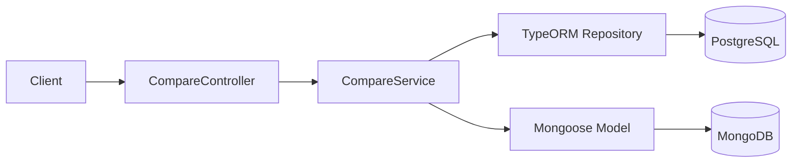
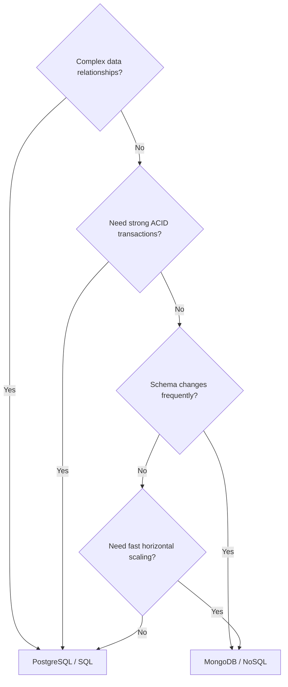

# title
SQL vs NoSQL in NestJS

# description
Hands-on comparison of PostgreSQL and MongoDB within the same NestJS application to understand when to choose SQL and when to choose NoSQL for each workload.

# body

## 1. Opening

"We're storing order data — why does one team pick **PostgreSQL** while another picks **MongoDB**?" — a **Senior Engineer** asks during a database design review. A **Mid-level Developer** answers: "I'd go with **MongoDB** because it's trending and more flexible." The answer shows awareness of **NoSQL** flexibility, but still misses depth on **consistency**, **transactions**, and **data relationships**: at scale, choosing the wrong engine leads to data loss, slow queries, or schema drift — problems that only surface in production when it's too late.

This lesson runs through two consecutive tracks:
- **Part 2.1**: **hands-on**, synchronized with the GitHub repository; the **stack** is **NestJS** + **PostgreSQL** (Docker) + **MongoDB** (Docker), with **two verification flows** (parallel write; read comparison).
- **Part 2.2**: **theory** clarifying the nature of **SQL vs NoSQL** — overall comparison, decision tree, and typical **edge cases** such as **schema drift**, **N+1 queries**, and **polyglot persistence**.

## 2. Core concepts

The lesson structure follows **practice-led theory**. First, learners clone the source, start infrastructure via **Docker Compose**, run **NestJS** via `nest start --watch`, and call APIs to observe **polyglot persistence** in practice. Then the **theory** section systematizes **core concepts**, **architecture models**, and analyzes in-depth **edge cases** — mapping directly to what was observed in **part 2.1**.

### 2.1. Hands-on

#### 2.1.1. Prepare source code and environment

Goal: clone the demo source and run **NestJS** with **PostgreSQL** + **MongoDB** to observe the same domain (order) implemented in parallel across two engines.

Source: [StarCi-Academy/fullstack-mastery-module-2-database-integration-orm-odm-caching](https://github.com/StarCi-Academy/fullstack-mastery-module-2-database-integration-orm-odm-caching) on GitHub — lesson directory: [`0-sql-vs-nosql-in-nestjs`](https://github.com/StarCi-Academy/fullstack-mastery-module-2-database-integration-orm-odm-caching/tree/main/0-sql-vs-nosql-in-nestjs).

```bash
# Step 1: Clone the repository locally
git clone https://github.com/StarCi-Academy/fullstack-mastery-module-2-database-integration-orm-odm-caching.git

# Step 2: Navigate to the lesson directory
cd fullstack-mastery-module-2-database-integration-orm-odm-caching/0-sql-vs-nosql-in-nestjs
```

#### 2.1.2. Architecture / components (stack + flow)

- **PostgreSQL (Docker):** SQL engine for the **TypeORM** branch.
- **MongoDB (Docker):** document engine for the **Mongoose** branch.
- **CompareController / CompareService:** single HTTP entry for comparison flow — calls SQL and NoSQL branches in parallel.
- **TypeORM Repository:** maps table entities to **PostgreSQL**.
- **Mongoose Model:** maps documents to **MongoDB**.

| Component | File | Role |
| --- | --- | --- |
| **PostgreSQL** | `.docker/compose.yaml` | SQL storage (TypeORM) |
| **MongoDB** | `.docker/compose.yaml` | NoSQL storage (Mongoose) |
| **CompareController** | `src/compare/compare.controller.ts` | Receives HTTP, delegates to service |
| **CompareService** | `src/compare/compare.service.ts` | Parallel read/write across 2 engines |
| **TypeORM Repository** | `@nestjs/typeorm` | CRUD PostgreSQL |
| **Mongoose Model** | `@nestjs/mongoose` | CRUD MongoDB |



Figure 1: Data comparison flow between SQL and NoSQL.

#### 2.1.3. Prerequisites and startup

##### 2.1.3.1. Prerequisites

- **Node.js** LTS (recommended ≥ 18).
- **npm** or **pnpm**.
- **NestJS CLI**: `npm i -g @nestjs/cli`.
- **Docker Desktop** (or Docker Engine) + `docker compose`.
- **Windows:** API commands use **`Invoke-RestMethod`** (PowerShell). See parallel **`curl`** for macOS / Linux.

> **Note:** The repo ships with env defaults via **ConfigModule**; you do not need to create or edit **.env** when running the system. Only modify this file if you want to run the service with custom ports/credentials.

##### 2.1.3.2. Start

```bash
# Step 1: Start PostgreSQL + MongoDB
docker compose -f .docker/compose.yaml up -d

# Step 2: Install dependencies
npm install

# Step 3: Start in watch mode
nest start --watch
```

After the command above: terminal logs show the app listening on **`http://localhost:3000`**.

#### 2.1.4. Verification

**2 flows** below verify two goals: **(1)** parallel write to both engines; **(2)** read and compare results.

- **Flow 1:** Write sample data — `POST /compare/write`.
- **Flow 2:** Read comparison — `GET /compare/read`.

##### 2.1.4.1. Flow 1 — Write sample data (one command, two persistence)

- Step 1: call `POST /compare/write`.

  ```bash
  # Windows (PowerShell)
  Invoke-RestMethod -Uri http://localhost:3000/compare/write -Method Post -ContentType "application/json" -Body '{"title":"Order #1","amount":100}'

  # macOS / Linux
  # → Paste cURL into Postman: Import → Raw text
  curl -s -X POST http://localhost:3000/compare/write \
  -H "Content-Type: application/json" \
  -d '{"title":"Order #1","amount":100}'
  ```

  Expected response (HTTP 200):

  ```json
  {
    "message": "Saved to both SQL and NoSQL stores.",
    "sql": {
      "id": "<uuid>",
      "title": "Order #1",
      "amount": 100,
      "createdAt": "<ISO datetime>"
    },
    "noSql": {
      "id": "<mongo object id>",
      "title": "Order #1",
      "amount": 100,
      "createdAt": "<ISO datetime>"
    }
  }
  ```

*If the response matches the format above:*

- *Same business logic, different data stores — the order creation request was saved in parallel to both **PostgreSQL** and **MongoDB**.*
- *Identifier difference — SQL returns `id` as UUID, NoSQL returns `_id` as ObjectId.*

##### 2.1.4.2. Flow 2 — Read and compare results

- Step 1: call `GET /compare/read`.

  ```bash
  # Windows (PowerShell)
  Invoke-RestMethod -Uri http://localhost:3000/compare/read

  # macOS / Linux
  # → Paste cURL into Postman: Import → Raw text
  curl -s http://localhost:3000/compare/read
  ```

  Expected response (HTTP 200):

  ```json
  {
    "sqlCount": 1,
    "noSqlCount": 1,
    "sqlItems": [
      { "id": "<uuid>", "title": "Order #1", "amount": 100, "createdAt": "<ISO datetime>" }
    ],
    "noSqlItems": [
      { "_id": "<mongo object id>", "title": "Order #1", "amount": 100, "createdAt": "<ISO datetime>" }
    ]
  }
  ```

*If the response matches the format above:*

- *Concurrent multi-platform reads — Controller calls both services to aggregate data in a single API.*
- *Query differences — SQL uses `JOIN` for relations, MongoDB retrieves complete documents or uses `populate`.*

#### 2.1.5. Cleanup

When you are done, tear down to free resources.

```bash
# Step 1: Stop the running server
# Windows / macOS / Linux
Ctrl + C

# Step 2: Close Docker (if the lesson uses Docker)
docker compose -f .docker/compose.yaml down -v
```

#### 2.1.6. Further reading

- **Polyglot Persistence:** Using multiple database types optimizes each workload. Without workload separation, the system bottlenecks at one storage layer. ([Martin Fowler](https://martinfowler.com/bliki/PolyglotPersistence.html))
- **SQL vs NoSQL Trade-offs:** SQL excels at consistency and relationships; NoSQL excels at flexible schemas and document scaling. ([MongoDB Docs](https://www.mongodb.com/resources/basics/databases/sql-vs-nosql))
- **PostgreSQL MVCC:** Foundation for safe concurrency when multiple transactions run simultaneously. ([PostgreSQL Docs](https://www.postgresql.org/docs/current/mvcc.html))
- **Mongoose Schema Design:** Correct schema design (embed/reference, index) directly impacts query performance. ([Mongoose Docs](https://mongoosejs.com/docs/guide.html))
- **TypeORM Repository Pattern:** Repository separates data access from business logic. ([TypeORM Docs](https://typeorm.io/repository-api))

### 2.2. Theory — SQL vs NoSQL

#### 2.2.1. Overall comparison

| Criteria | SQL (PostgreSQL) | NoSQL (MongoDB) |
| --- | --- | --- |
| **Data model** | Tables, rows, columns | Documents (JSON-like), Collections |
| **Schema** | Schema-on-write — defined upfront | Schema-on-read — flexible |
| **Relationships** | Strong JOINs, Foreign Keys | Embedding or Referencing |
| **Transactions** | Full ACID | Supported but not default |
| **Scaling** | Primarily vertical | Horizontal (sharding) natively |

#### 2.2.2. Decision Tree — When to choose SQL vs NoSQL



- **Choose SQL:** financial orders (ACID), ERP (complex relations), stable schemas.
- **Choose NoSQL:** logging/analytics (flexible schema), social feeds (nested documents), IoT (horizontal scale).
- **Polyglot Persistence:** many systems use **both** — SQL for core business, NoSQL for cache/search/log.

#### 2.2.3. Edge cases to internalize

- **Wrong engine for workload:** Using **MongoDB** for financial data requiring ACID → consistency loss. **Fix:** always evaluate consistency vs flexibility before choosing.
- **N+1 query with populate (MongoDB):** Deeply nested populate → performance drops. **Fix:** use aggregation pipeline or embed documents.
- **Schema drift in NoSQL:** No schema validation → old and new documents have different shapes. **Fix:** use Mongoose schema validation.
- **MongoDB transactions:** Not used by default. Need multi-document atomicity → enable replica set. **Fix:** configure replica set from development.

## 3. Wrap-up

### 3.1. Common interview questions

- **Question 1:** When should you prefer **PostgreSQL** over **MongoDB**?
  - What interviewers want: reasoning about consistency, transactions, and data relationships.
  - Sample short answer: Prefer **PostgreSQL** when strong ACID, complex relationships, and strict schema constraints are required.

- **Question 2:** When is **MongoDB** a reasonable choice?
  - What interviewers want: reasoning about flexible schemas and document scaling.
  - Sample short answer: Use **MongoDB** when schema changes frequently, data is document-shaped, and flexible scaling is needed.

- **Question 3:** Should you use both SQL and NoSQL in one system?
  - What interviewers want: ability to apply polyglot persistence.
  - Sample short answer: Yes, if domains/workloads are clearly separated and the team accepts additional operational cost.

# references
## 0
### alias
MongoDB - SQL vs NoSQL Databases
### url
https://www.mongodb.com/resources/basics/databases/sql-vs-nosql
## 1
### alias
TypeORM Documentation
### url
https://typeorm.io
## 2
### alias
Mongoose Documentation
### url
https://mongoosejs.com

# minutesRead
18
