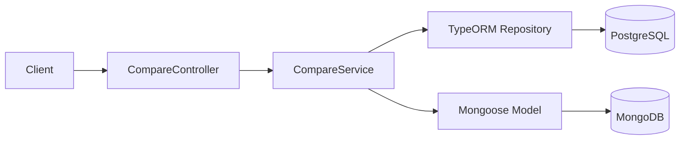
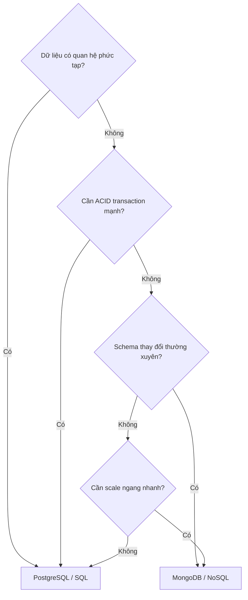

# title
SQL và NoSQL trong NestJS

# description
Thực hành so sánh PostgreSQL và MongoDB trong cùng một ứng dụng NestJS để hiểu khi nên chọn SQL và khi nên chọn NoSQL theo từng workload.

# body

## 1. Lời mở đầu

"Cùng là lưu dữ liệu đơn hàng, tại sao có team chọn **PostgreSQL**, có team chọn **MongoDB**?" — một **Senior Engineer** hỏi khi review thiết kế database. Một **Mid-level Developer** trả lời: "Em chọn **MongoDB** vì trending và schema linh hoạt hơn." Câu trả lời cho thấy nhận thức về tính linh hoạt của **NoSQL**, nhưng vẫn thiếu chiều sâu về **consistency**, **transaction**, và **quan hệ dữ liệu**: khi hệ thống scale, chọn sai engine dẫn đến mất dữ liệu, query chậm, hoặc schema drift — vấn đề chỉ lộ ra ở production khi đã muộn.

Bài này dẫn qua hai mạch liên tiếp:
- **Phần 2.1**: **thực hành** đồng bộ với repository trên GitHub; **stack** gồm **NestJS** + **PostgreSQL** (Docker) + **MongoDB** (Docker), kèm **hai luồng** kiểm thử (ghi song song; đọc so sánh).
- **Phần 2.2**: **lý thuyết** làm rõ bản chất **SQL vs NoSQL** — so sánh tổng quan, decision tree, và các **edge case** điển hình như **schema drift**, **N+1 query**, **polyglot persistence**.

## 2. Các khái niệm cốt lõi

Cấu trúc bài học áp dụng phương pháp **Thực hành dẫn dắt Lý thuyết**. Khởi đầu, học viên sẽ trực tiếp clone source, khởi động infrastructure bằng **Docker Compose**, chạy **NestJS** bằng `nest start --watch` và gọi API để quan sát **polyglot persistence** thực tế. Tiếp theo, **phần lý thuyết** sẽ hệ thống hóa **các khái niệm cốt lõi**, **mô hình kiến trúc** và phân tích các **edge cases** chuyên sâu — giúp đối chiếu và củng cố trực tiếp những kết quả vừa thực nghiệm tại **phần 2.1**.

### 2.1. Thực hành

#### 2.1.1. Chuẩn bị source code và môi trường

Mục đích: clone source demo và chạy **NestJS** kết hợp **PostgreSQL** + **MongoDB** để quan sát cùng một domain (order) được triển khai song song trên hai engine.

Source: [StarCi-Academy/fullstack-mastery-module-2-database-integration-orm-odm-caching](https://github.com/StarCi-Academy/fullstack-mastery-module-2-database-integration-orm-odm-caching) trên GitHub — thư mục bài học: [`0-sql-vs-nosql-in-nestjs`](https://github.com/StarCi-Academy/fullstack-mastery-module-2-database-integration-orm-odm-caching/tree/main/0-sql-vs-nosql-in-nestjs).

```bash
# Bước 1: Clone repository về máy local
git clone https://github.com/StarCi-Academy/fullstack-mastery-module-2-database-integration-orm-odm-caching.git

# Bước 2: Di chuyển vào đúng thư mục bài học
cd fullstack-mastery-module-2-database-integration-orm-odm-caching/0-sql-vs-nosql-in-nestjs
```

#### 2.1.2. Kiến trúc/thành phần (stack + luồng)

- **PostgreSQL (Docker):** engine SQL cho nhánh **TypeORM**.
- **MongoDB (Docker):** engine document cho nhánh **Mongoose**.
- **CompareController / CompareService:** một entry HTTP cho luồng so sánh — gọi nhánh SQL và NoSQL song song.
- **TypeORM Repository:** ánh xạ entity bảng sang **PostgreSQL**.
- **Mongoose Model:** ánh xạ document sang **MongoDB**.

| Thành phần | File | Vai trò |
| --- | --- | --- |
| **PostgreSQL** | `.docker/compose.yaml` | Lưu trữ SQL (TypeORM) |
| **MongoDB** | `.docker/compose.yaml` | Lưu trữ NoSQL (Mongoose) |
| **CompareController** | `src/compare/compare.controller.ts` | Nhận HTTP, delegate service |
| **CompareService** | `src/compare/compare.service.ts` | Ghi/đọc song song 2 engine |
| **TypeORM Repository** | `@nestjs/typeorm` | CRUD PostgreSQL |
| **Mongoose Model** | `@nestjs/mongoose` | CRUD MongoDB |



Hình 1: Luồng so sánh dữ liệu giữa SQL và NoSQL.

#### 2.1.3. Chuẩn bị & khởi chạy

##### 2.1.3.1. Điều kiện cần trước

- **Node.js** LTS (khuyến nghị ≥ 18).
- **npm** hoặc **pnpm**.
- **NestJS CLI**: `npm i -g @nestjs/cli`.
- **Docker Desktop** (hoặc Docker Engine) + `docker compose`.
- **Windows:** các lệnh API dùng **`Invoke-RestMethod`** (PowerShell). Xem song song **`curl`** cho macOS / Linux.

##### 2.1.3.2. Khởi động

```bash
# Bước 1: Khởi động PostgreSQL + MongoDB
docker compose -f .docker/compose.yaml up -d

# Bước 2: Cài dependency
npm install

# Bước 3: Khởi chạy ở chế độ watch
nest start --watch
```

Sau lệnh trên: terminal log hiển thị app đang lắng nghe tại **`http://localhost:3000`**.

#### 2.1.4. Kiểm thử

**2 luồng** dưới đây kiểm chứng hai mục tiêu: **(1)** ghi song song vào cả hai engine; **(2)** đọc và so sánh kết quả.

- **Luồng 1:** Ghi dữ liệu mẫu — `POST /compare/write`.
- **Luồng 2:** Đọc so sánh — `GET /compare/read`.

##### 2.1.4.1. Luồng 1 — Ghi dữ liệu mẫu (một lệnh, hai persistence)

- Bước 1: gọi `POST /compare/write`.

  ```bash
  # Windows (PowerShell)
  Invoke-RestMethod -Uri http://localhost:3000/compare/write -Method Post -ContentType "application/json" -Body '{"title":"Order #1","amount":100}'

  # macOS / Linux
  # → Dán cURL vào Postman: Import → Raw text
  curl -s -X POST http://localhost:3000/compare/write \
  -H "Content-Type: application/json" \
  -d '{"title":"Order #1","amount":100}'
  ```

  Response phải trả về (HTTP 200):

  ```json
  {
    "message": "Saved to both SQL and NoSQL stores.",
    "sql": {
      "id": "<uuid>",
      "title": "Order #1",
      "amount": 100,
      "createdAt": "<ISO datetime>"
    },
    "noSql": {
      "id": "<mongo object id>",
      "title": "Order #1",
      "amount": 100,
      "createdAt": "<ISO datetime>"
    }
  }
  ```

*Kết luận: Nếu response khớp format trên, hệ thống xác nhận:*

- *Cùng logic nghiệp vụ nhưng data store xử lý khác nhau — request tạo order được lưu song song vào cả **PostgreSQL** và **MongoDB**.*
- *Sự khác biệt về định danh — SQL trả `id` dạng UUID, NoSQL trả `_id` dạng ObjectId.*

##### 2.1.4.2. Luồng 2 — Đọc và so sánh kết quả

- Bước 1: gọi `GET /compare/read`.

  ```bash
  # Windows (PowerShell)
  Invoke-RestMethod -Uri http://localhost:3000/compare/read

  # macOS / Linux
  # → Dán cURL vào Postman: Import → Raw text
  curl -s http://localhost:3000/compare/read
  ```

  Response phải trả về (HTTP 200):

  ```json
  {
    "sqlCount": 1,
    "noSqlCount": 1,
    "sqlItems": [
      { "id": "<uuid>", "title": "Order #1", "amount": 100, "createdAt": "<ISO datetime>" }
    ],
    "noSqlItems": [
      { "_id": "<mongo object id>", "title": "Order #1", "amount": 100, "createdAt": "<ISO datetime>" }
    ]
  }
  ```

*Kết luận: Nếu response khớp format trên, hệ thống xác nhận:*

- *Đọc đồng thời đa nền tảng — Controller gọi cả hai service để gom dữ liệu trong cùng một API.*
- *Sự khác biệt khi truy vấn — SQL cần `JOIN` cho relation, MongoDB lấy document hoàn chỉnh hoặc qua `populate`.*

#### 2.1.5. Dọn tài nguyên

Sau khi kết thúc bài, bạn có thể dọn tài nguyên để tiết kiệm bộ nhớ.

```bash
# Bước 1: Dừng server đang chạy
# Windows / macOS / Linux
Ctrl + C

# Bước 2: Đóng Docker (nếu bài học có dùng Docker)
docker compose -f .docker/compose.yaml down -v
```

#### 2.1.6. Đọc thêm

- **Polyglot Persistence:** Dùng nhiều loại database trong cùng hệ thống giúp tối ưu theo workload. Nếu không tách theo workload, hệ thống dễ nghẽn cổ chai ở một lớp lưu trữ. ([Martin Fowler](https://martinfowler.com/bliki/PolyglotPersistence.html))
- **SQL vs NoSQL Trade-offs:** SQL mạnh consistency và quan hệ; NoSQL mạnh linh hoạt schema và scale document. ([MongoDB Docs](https://www.mongodb.com/resources/basics/databases/sql-vs-nosql))
- **PostgreSQL MVCC:** Nền tảng xử lý concurrency an toàn khi nhiều transaction đồng thời. ([PostgreSQL Docs](https://www.postgresql.org/docs/current/mvcc.html))
- **Mongoose Schema Design:** Thiết kế schema đúng (embed/reference, index) ảnh hưởng trực tiếp performance. ([Mongoose Docs](https://mongoosejs.com/docs/guide.html))
- **TypeORM Repository Pattern:** Repository tách truy cập dữ liệu khỏi business logic. ([TypeORM Docs](https://typeorm.io/repository-api))

### 2.2. Lý thuyết — SQL vs NoSQL

#### 2.2.1. So sánh tổng quan

| Tiêu chí | SQL (PostgreSQL) | NoSQL (MongoDB) |
| --- | --- | --- |
| **Mô hình dữ liệu** | Bảng, hàng, cột | Document (JSON-like), Collection |
| **Schema** | Schema-on-write — định nghĩa trước | Schema-on-read — linh hoạt |
| **Quan hệ** | JOIN mạnh, Foreign Key | Embedding hoặc Referencing |
| **Transaction** | ACID đầy đủ | Hỗ trợ nhưng không mặc định |
| **Scale** | Vertical chính | Horizontal (sharding) natively |

#### 2.2.2. Decision Tree — Khi nào chọn SQL, khi nào chọn NoSQL



- **Chọn SQL:** đơn hàng tài chính (ACID), ERP (quan hệ phức tạp), dữ liệu ít đổi schema.
- **Chọn NoSQL:** logging/analytics (schema linh hoạt), social feed (document lồng), IoT (scale ngang).
- **Polyglot Persistence:** nhiều hệ thống dùng **cả hai** — SQL cho core business, NoSQL cho cache/search/log.

#### 2.2.3. Các trường hợp biên (edge cases) cần lưu ý

- **Chọn sai engine cho workload:** Dùng **MongoDB** cho dữ liệu tài chính cần ACID → mất consistency. **Giải pháp:** luôn đánh giá consistency vs flexibility trước khi chọn.
- **N+1 query khi populate (MongoDB):** Populate nhiều collection lồng nhau → performance giảm. **Giải pháp:** dùng aggregation pipeline hoặc embed document.
- **Schema drift trong NoSQL:** Không validate schema → document cũ và mới shape khác nhau. **Giải pháp:** dùng Mongoose schema validation.
- **Transaction MongoDB:** Mặc định không dùng transaction. Cần multi-document atomicity → bật replica set. **Giải pháp:** cấu hình replica set từ development.

## 3. Tổng kết

### 3.1. Các câu hỏi dễ bị phỏng vấn

- **Câu hỏi 1:** Khi nào nên ưu tiên **PostgreSQL** thay vì **MongoDB**?
  - Ý interviewer muốn nghe: tư duy theo consistency, transaction, quan hệ dữ liệu.
  - Trả lời mẫu (ngắn): Ưu tiên **PostgreSQL** khi cần ACID mạnh, quan hệ phức tạp, và ràng buộc schema chặt.

- **Câu hỏi 2:** Khi nào **MongoDB** là lựa chọn hợp lý?
  - Ý interviewer muốn nghe: tư duy schema linh hoạt và scale document.
  - Trả lời mẫu (ngắn): Dùng **MongoDB** khi schema thay đổi nhanh, dữ liệu dạng document, và cần scale linh hoạt.

- **Câu hỏi 3:** Có nên dùng cả SQL và NoSQL trong một hệ thống không?
  - Ý interviewer muốn nghe: khả năng áp dụng polyglot persistence.
  - Trả lời mẫu (ngắn): Có, nếu tách rõ domain/workload và chấp nhận chi phí vận hành thêm.

# references
## 0
### alias
MongoDB - SQL vs NoSQL Databases
### url
https://www.mongodb.com/resources/basics/databases/sql-vs-nosql
## 1
### alias
TypeORM Documentation
### url
https://typeorm.io
## 2
### alias
Mongoose Documentation
### url
https://mongoosejs.com

# minutesRead
18
