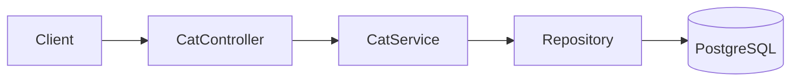
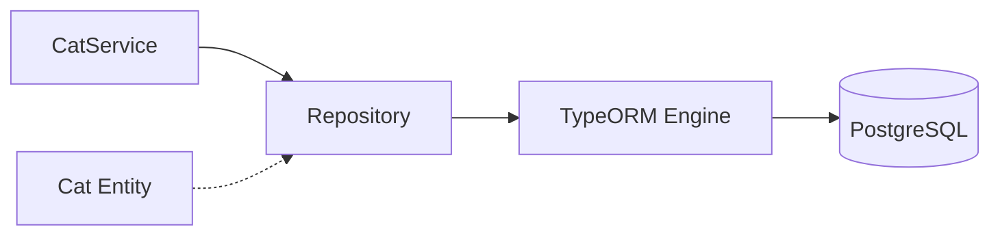

# title
Mastering PostgreSQL with TypeORM

# description
Hands-on integration of TypeORM with PostgreSQL in NestJS, from entities to 1:1, 1:N, N:N data relationships and CRUD API testing.

# body

## 1. Opening

"When the domain starts having many 1:1, 1:N, N:N relationships, why not just write raw SQL instead of using **TypeORM**?" — a **Senior Engineer** asks during a data access layer review. A **Mid-level Developer** answers: "ORM makes coding faster." The answer shows awareness of developer experience, but still misses depth on **trade-offs**: ORM helps model domains more clearly and reduces boilerplate, but without understanding how ORM generates queries (N+1, eager/lazy), the system slows down as data grows — and debugging ORM queries is much harder than raw SQL.

This lesson runs through two consecutive tracks:
- **Part 2.1**: **hands-on**, synchronized with the GitHub repository; the **stack** is **NestJS** + **PostgreSQL** (Docker), with **two verification flows** (create cat with relations; read object graph).
- **Part 2.2**: **theory** clarifying the nature of **ORM**, **Repository Pattern**, **Entity Relationships** — definitions, examples, and typical **edge cases** such as **lazy loading**, **migration vs synchronize**, and **connection pool**.

## 2. Core concepts

The lesson structure follows **practice-led theory**. First, learners clone the source, start **PostgreSQL** via **Docker Compose**, run **NestJS** via `nest start --watch`, and call APIs to observe **TypeORM** handling entities, relations, and cascades. Then the **theory** section systematizes **core concepts**, **architecture models**, and analyzes in-depth **edge cases** — mapping directly to what was observed in **part 2.1**.

### 2.1. Hands-on

#### 2.1.1. Prepare source code and environment

Goal: clone the demo source and run **NestJS** with **PostgreSQL** to observe **TypeORM** handling entities with 1:1 (**CatPassport**), 1:N (**Toy**), N:N (**Owner**) relationships.

Source: [StarCi-Academy/fullstack-mastery-module-2-database-integration-orm-odm-caching](https://github.com/StarCi-Academy/fullstack-mastery-module-2-database-integration-orm-odm-caching) on GitHub — lesson directory: [`1-typeorm-and-postgresql`](https://github.com/StarCi-Academy/fullstack-mastery-module-2-database-integration-orm-odm-caching/tree/main/1-typeorm-and-postgresql).

```bash
# Step 1: Clone the repository locally
git clone https://github.com/StarCi-Academy/fullstack-mastery-module-2-database-integration-orm-odm-caching.git

# Step 2: Navigate to the lesson directory
cd fullstack-mastery-module-2-database-integration-orm-odm-caching/1-typeorm-and-postgresql
```

#### 2.1.2. Architecture / components (stack + flow)

- **PostgreSQL (Docker):** relational engine storing `cats`, `cat_passports`, `toys`, `owners`, and N:N junction table.
- **CatController:** receives HTTP requests, delegates to service.
- **CatService:** handles CRUD business logic via **TypeORM Repository**.
- **Cat Entity:** main entity with `@OneToOne` (CatPassport), `@OneToMany` (Toy), `@ManyToMany` (Owner) — all with `cascade: true`.

| Component | File | Role |
| --- | --- | --- |
| **PostgreSQL** | `.docker/compose.yaml` | Stores cats + relation tables |
| **CatController** | `src/modules/cat/cat.controller.ts` | Receives HTTP, delegates to service |
| **CatService** | `src/modules/cat/cat.service.ts` | CRUD via TypeORM Repository |
| **Cat Entity** | `src/modules/cat/entities/cat.entity.ts` | Schema + 1:1, 1:N, N:N relations |
| **CatPassport** | `src/modules/cat/entities/cat-passport.entity.ts` | 1:1 entity |
| **Toy** | `src/modules/cat/entities/toy.entity.ts` | 1:N entity |
| **Owner** | `src/modules/cat/entities/owner.entity.ts` | N:N entity |



Figure 1: Data operation flow with TypeORM.

#### 2.1.3. Prerequisites and startup

##### 2.1.3.1. Prerequisites

- **Node.js** LTS (recommended ≥ 18).
- **npm** or **pnpm**.
- **NestJS CLI**: `npm i -g @nestjs/cli`.
- **Docker Desktop** (or Docker Engine) + `docker compose`.
- **Windows:** API commands use **`Invoke-RestMethod`** (PowerShell). See parallel **`curl`** for macOS / Linux.

> **Note:** The repo ships with env defaults via **ConfigModule**; you do not need to create or edit **.env** when running the system. Only modify this file if you want to run the service with custom ports/credentials.

##### 2.1.3.2. Start

```bash
# Step 1: Start PostgreSQL
docker compose -f .docker/compose.yaml up -d

# Step 2: Install dependencies
npm install

# Step 3: Start in watch mode
nest start --watch
```

After the command above: terminal logs show the app listening on **`http://localhost:3000`**. **TypeORM** auto-creates tables via `synchronize: true`.

#### 2.1.4. Verification

**2 flows** below verify two goals: **(1)** create cat with full relations (cascade); **(2)** read back the object graph.

- **Flow 1:** Create cat with relations — `POST /cats`.
- **Flow 2:** Read object graph — `GET /cats` and `GET /cats/:id`.

##### 2.1.4.1. Flow 1 — Create cat with relations

- Step 1: call `POST /cats`.

  ```bash
  # Windows (PowerShell)
  $body = '{"name":"Milo","passport":{"passportNumber":"PP-001"},"toys":[{"name":"Ball"}],"owners":[{"name":"Alice"}]}'
  Invoke-RestMethod -Uri http://localhost:3000/cats -Method Post -ContentType "application/json" -Body $body

  # macOS / Linux
  # → Paste cURL into Postman: Import → Raw text
  curl -s -X POST http://localhost:3000/cats \
    -H "Content-Type: application/json" \
    -d '{"name":"Milo","passport":{"passportNumber":"PP-001"},"toys":[{"name":"Ball"}],"owners":[{"name":"Alice"}]}'
  ```

  Expected response (HTTP 201):

  ```json
  {
    "id": 1,
    "name": "Milo",
    "passport": { "id": 1, "passportNumber": "PP-001" },
    "toys": [{ "id": 1, "name": "Ball" }],
    "owners": [{ "id": 1, "name": "Alice" }]
  }
  ```

*If the response matches the format above:*

- *Cascade works — **TypeORM** auto-saved **CatPassport** (1:1), **Toy** (1:N), **Owner** (N:N) when saving the parent entity.*
- *Auto-generation — `id` auto-increments via `@PrimaryGeneratedColumn()`.*

##### 2.1.4.2. Flow 2 — Read object graph

- Step 1: call `GET /cats`.

  ```bash
  # Windows (PowerShell)
  Invoke-RestMethod -Uri http://localhost:3000/cats

  # macOS / Linux
  # → Paste cURL into Postman: Import → Raw text
  curl -s http://localhost:3000/cats
  ```

  Expected response (HTTP 200):

  ```json
  [
    {
      "id": 1,
      "name": "Milo",
      "passport": { "id": 1, "passportNumber": "PP-001" },
      "toys": [{ "id": 1, "name": "Ball" }],
      "owners": [{ "id": 1, "name": "Alice" }]
    }
  ]
  ```

- Step 2: call `GET /cats/1`.

  ```bash
  # Windows (PowerShell)
  Invoke-RestMethod -Uri http://localhost:3000/cats/1

  # macOS / Linux
  # → Paste cURL into Postman: Import → Raw text
  curl -s http://localhost:3000/cats/1
  ```

  Expected response (HTTP 200):

  ```json
  {
    "id": 1,
    "name": "Milo",
    "passport": { "id": 1, "passportNumber": "PP-001" },
    "toys": [{ "id": 1, "name": "Ball" }],
    "owners": [{ "id": 1, "name": "Alice" }]
  }
  ```

*If the responses match the format above:*

- *Relation loading works — `find({ relations: ["passport", "toys", "owners"] })` executes JOINs correctly.*
- *NotFoundException — `GET /cats/999` returns HTTP 404 because service checks `findOne` result.*

#### 2.1.5. Cleanup

When you are done, tear down to free resources.

```bash
# Step 1: Stop the running server
# Windows / macOS / Linux
Ctrl + C

# Step 2: Close Docker (if the lesson uses Docker)
docker compose -f .docker/compose.yaml down -v
```

#### 2.1.6. Further reading

- **TypeORM Relations:** 1:1, 1:N, N:N relations determine domain modeling. Misconfigured relations cause missing or inconsistent data. ([TypeORM Docs](https://typeorm.io/relations))
- **Cascade Behavior:** `cascade: true` simplifies object graph saves but uncontrolled usage causes unintended writes. ([TypeORM Docs](https://typeorm.io/relations#cascades))
- **Eager vs Lazy Loading:** Wrong loading strategy is a common cause of N+1 queries. ([TypeORM Docs](https://typeorm.io/eager-and-lazy-relations))
- **PostgreSQL Constraints:** PK, FK, UNIQUE, CHECK protect data integrity at the DB level. ([PostgreSQL Docs](https://www.postgresql.org/docs/current/ddl-constraints.html))
- **NestJS + TypeORM:** Module/repository organization directly affects testability and extensibility. ([NestJS Docs](https://docs.nestjs.com/techniques/sql))

### 2.2. Theory — ORM, Repository Pattern, and Entity Relationships

#### 2.2.1. What problem does ORM solve?

| Without ORM | With ORM (TypeORM) |
| --- | --- |
| Write raw SQL: `SELECT * FROM cats WHERE id = 1` | Call method: `catRepository.findOne({ where: { id: 1 } })` |
| Manually map query results to objects | TypeORM auto-maps rows → Entity instances |
| Manage connection pools, transactions manually | TypeORM handles it |
| Changing database (PostgreSQL → MySQL) requires SQL rewrites | Only change config, code stays the same |

#### 2.2.2. Entity and Repository Pattern

- **Entity:** class representing a table. Each property maps to a column. Decorators `@Entity()`, `@Column()`, `@PrimaryGeneratedColumn()` declare metadata.
- **Repository:** intermediary providing CRUD methods (`find`, `findOne`, `save`, `delete`) without writing SQL.



#### 2.2.3. Entity Relationships

**TypeORM** supports 3 main relationship types:
- **@OneToOne:** One cat has one passport (`@JoinColumn` indicates the FK-owning side).
- **@OneToMany / @ManyToOne:** One cat has many toys.
- **@ManyToMany:** One cat belongs to many owners, one owner has many cats (`@JoinTable` creates the junction table).

#### 2.2.4. Edge cases to internalize

- **Lazy relation not loading:** Missing `eager: true` or `relations` in `find()` → relation returns `undefined`. **Fix:** always use explicit relation loading.
- **Migration vs synchronize:** `synchronize: true` auto-alters schema but may drop production data. **Fix:** only use `synchronize` in dev, use migrations in production.
- **Connection pool exhaustion:** Unconfigured pool size → connection leak crashes app. **Fix:** set `extra.max` in TypeORM config.
- **Entity listener side effects:** `@BeforeInsert` throwing exceptions → hard to debug. **Fix:** keep listeners simple, delegate complex logic to service.

## 3. Wrap-up

### 3.1. Common interview questions

- **Question 1:** Why use ORM instead of raw SQL?
  - What interviewers want: balancing development speed vs control.
  - Sample short answer: ORM helps model domains more clearly and reduces boilerplate, but understanding SQL is still needed for query optimization.

- **Question 2:** When can TypeORM cause performance issues?
  - What interviewers want: identifying N+1 queries and incorrect eager loading.
  - Sample short answer: When relation joins/loading are uncontrolled; use query builder, indexes, and profiling.

- **Question 3:** Why is understanding transactions still needed with ORM?
  - What interviewers want: data correctness depends on DB semantics.
  - Sample short answer: ORM is just an access layer; consistency in multi-step operations still requires explicit transactions.

# references
## 0
### alias
TypeORM Documentation
### url
https://typeorm.io
## 1
### alias
NestJS Documentation - SQL (TypeORM)
### url
https://docs.nestjs.com/techniques/sql
## 2
### alias
TypeORM Relations
### url
https://typeorm.io/relations

# minutesRead
18
