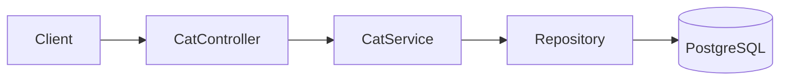
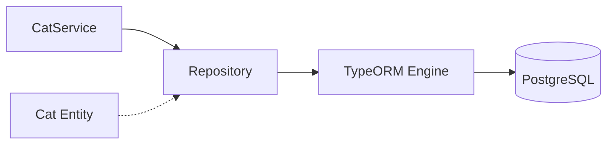

# title
Làm chủ PostgreSQL với TypeORM

# description
Thực hành tích hợp TypeORM với PostgreSQL trong NestJS, từ entity đến quan hệ dữ liệu 1:1, 1:N, N:N và kiểm thử API CRUD.

# body

## 1. Lời mở đầu

"Khi domain bắt đầu có nhiều quan hệ 1:1, 1:N, N:N, vì sao không viết SQL thuần mà lại dùng **TypeORM**?" — một **Senior Engineer** hỏi khi review data access layer. Một **Mid-level Developer** trả lời: "ORM giúp code nhanh hơn." Câu trả lời cho thấy nhận thức về developer experience, nhưng vẫn thiếu chiều sâu về **trade-off**: ORM giúp modeling domain rõ hơn và giảm boilerplate, nhưng nếu không hiểu cách ORM sinh query (N+1, eager/lazy), hệ thống sẽ chậm dần khi data lớn — và debug ORM query khó hơn SQL thuần rất nhiều.

Bài này dẫn qua hai mạch liên tiếp:
- **Phần 2.1**: **thực hành** đồng bộ với repository trên GitHub; **stack** gồm **NestJS** + **PostgreSQL** (Docker), kèm **hai luồng** kiểm thử (tạo cat có quan hệ; đọc lại object graph).
- **Phần 2.2**: **lý thuyết** làm rõ bản chất **ORM**, **Repository Pattern**, **Entity Relationships** — định nghĩa, ví dụ, và các **edge case** điển hình như **lazy loading**, **migration vs synchronize**, **connection pool**.

## 2. Các khái niệm cốt lõi

Cấu trúc bài học áp dụng phương pháp **Thực hành dẫn dắt Lý thuyết**. Khởi đầu, học viên sẽ trực tiếp clone source, khởi động **PostgreSQL** bằng **Docker Compose**, chạy **NestJS** bằng `nest start --watch` và gọi API để quan sát **TypeORM** xử lý entity, relation, và cascade. Tiếp theo, **phần lý thuyết** sẽ hệ thống hóa **các khái niệm cốt lõi**, **mô hình kiến trúc** và phân tích các **edge cases** chuyên sâu — giúp đối chiếu và củng cố trực tiếp những kết quả vừa thực nghiệm tại **phần 2.1**.

### 2.1. Thực hành

#### 2.1.1. Chuẩn bị source code và môi trường

Mục đích: clone source demo và chạy **NestJS** kết hợp **PostgreSQL** để quan sát **TypeORM** xử lý entity có quan hệ 1:1 (**CatPassport**), 1:N (**Toy**), N:N (**Owner**).

Source: [StarCi-Academy/fullstack-mastery-module-2-database-integration-orm-odm-caching](https://github.com/StarCi-Academy/fullstack-mastery-module-2-database-integration-orm-odm-caching) trên GitHub — thư mục bài học: [`1-typeorm-and-postgresql`](https://github.com/StarCi-Academy/fullstack-mastery-module-2-database-integration-orm-odm-caching/tree/main/1-typeorm-and-postgresql).

```bash
# Bước 1: Clone repository về máy local
git clone https://github.com/StarCi-Academy/fullstack-mastery-module-2-database-integration-orm-odm-caching.git

# Bước 2: Di chuyển vào đúng thư mục bài học
cd fullstack-mastery-module-2-database-integration-orm-odm-caching/1-typeorm-and-postgresql
```

#### 2.1.2. Kiến trúc/thành phần (stack + luồng)

- **PostgreSQL (Docker):** engine quan hệ lưu bảng `cats`, `cat_passports`, `toys`, `owners`, junction table N:N.
- **CatController:** nhận HTTP request, delegate xuống service.
- **CatService:** xử lý nghiệp vụ CRUD qua **TypeORM Repository**.
- **Cat Entity:** entity chính với quan hệ `@OneToOne` (CatPassport), `@OneToMany` (Toy), `@ManyToMany` (Owner) — tất cả `cascade: true`.

| Thành phần | File | Vai trò |
| --- | --- | --- |
| **PostgreSQL** | `.docker/compose.yaml` | Lưu trữ bảng cats + relations |
| **CatController** | `src/modules/cat/cat.controller.ts` | Nhận HTTP, delegate service |
| **CatService** | `src/modules/cat/cat.service.ts` | CRUD với TypeORM Repository |
| **Cat Entity** | `src/modules/cat/entities/cat.entity.ts` | Schema + quan hệ 1:1, 1:N, N:N |
| **CatPassport** | `src/modules/cat/entities/cat-passport.entity.ts` | Entity 1:1 |
| **Toy** | `src/modules/cat/entities/toy.entity.ts` | Entity 1:N |
| **Owner** | `src/modules/cat/entities/owner.entity.ts` | Entity N:N |



Hình 1: Luồng thao tác dữ liệu với TypeORM.

#### 2.1.3. Chuẩn bị & khởi chạy

##### 2.1.3.1. Điều kiện cần trước

- **Node.js** LTS (khuyến nghị ≥ 18).
- **npm** hoặc **pnpm**.
- **NestJS CLI**: `npm i -g @nestjs/cli`.
- **Docker Desktop** (hoặc Docker Engine) + `docker compose`.
- **Windows:** các lệnh API dùng **`Invoke-RestMethod`** (PowerShell). Xem song song **`curl`** cho macOS / Linux.

##### 2.1.3.2. Khởi động

```bash
# Bước 1: Khởi động PostgreSQL
docker compose -f .docker/compose.yaml up -d

# Bước 2: Cài dependency
npm install

# Bước 3: Khởi chạy ở chế độ watch
nest start --watch
```

Sau lệnh trên: terminal log hiển thị app đang lắng nghe tại **`http://localhost:3000`**. **TypeORM** sẽ tự tạo bảng nhờ `synchronize: true`.

#### 2.1.4. Kiểm thử

**2 luồng** dưới đây kiểm chứng hai mục tiêu: **(1)** tạo cat có đầy đủ quan hệ (cascade); **(2)** đọc lại object graph.

- **Luồng 1:** Tạo cat kèm quan hệ — `POST /cats`.
- **Luồng 2:** Đọc object graph — `GET /cats` và `GET /cats/:id`.

##### 2.1.4.1. Luồng 1 — Tạo cat có quan hệ

- Bước 1: gọi `POST /cats`.

  ```bash
  # Windows (PowerShell)
  $body = '{"name":"Milo","passport":{"passportNumber":"PP-001"},"toys":[{"name":"Ball"}],"owners":[{"name":"Alice"}]}'
  Invoke-RestMethod -Uri http://localhost:3000/cats -Method Post -ContentType "application/json" -Body $body

  # macOS / Linux
  # → Dán cURL vào Postman: Import → Raw text
  curl -s -X POST http://localhost:3000/cats \
    -H "Content-Type: application/json" \
    -d '{"name":"Milo","passport":{"passportNumber":"PP-001"},"toys":[{"name":"Ball"}],"owners":[{"name":"Alice"}]}'
  ```

  Response phải trả về (HTTP 201):

  ```json
  {
    "id": 1,
    "name": "Milo",
    "passport": { "id": 1, "passportNumber": "PP-001" },
    "toys": [{ "id": 1, "name": "Ball" }],
    "owners": [{ "id": 1, "name": "Alice" }]
  }
  ```

*Kết luận: Nếu response khớp format trên, hệ thống xác nhận:*

- *Cascade hoạt động — **TypeORM** tự lưu cả **CatPassport** (1:1), **Toy** (1:N), **Owner** (N:N) khi save entity cha.*
- *Auto-generation — `id` tự tăng do `@PrimaryGeneratedColumn()`.*

##### 2.1.4.2. Luồng 2 — Đọc object graph

- Bước 1: gọi `GET /cats`.

  ```bash
  # Windows (PowerShell)
  Invoke-RestMethod -Uri http://localhost:3000/cats

  # macOS / Linux
  # → Dán cURL vào Postman: Import → Raw text
  curl -s http://localhost:3000/cats
  ```

  Response phải trả về (HTTP 200):

  ```json
  [
    {
      "id": 1,
      "name": "Milo",
      "passport": { "id": 1, "passportNumber": "PP-001" },
      "toys": [{ "id": 1, "name": "Ball" }],
      "owners": [{ "id": 1, "name": "Alice" }]
    }
  ]
  ```

- Bước 2: gọi `GET /cats/1`.

  ```bash
  # Windows (PowerShell)
  Invoke-RestMethod -Uri http://localhost:3000/cats/1

  # macOS / Linux
  # → Dán cURL vào Postman: Import → Raw text
  curl -s http://localhost:3000/cats/1
  ```

  Response phải trả về (HTTP 200):

  ```json
  {
    "id": 1,
    "name": "Milo",
    "passport": { "id": 1, "passportNumber": "PP-001" },
    "toys": [{ "id": 1, "name": "Ball" }],
    "owners": [{ "id": 1, "name": "Alice" }]
  }
  ```

*Kết luận: Nếu response khớp format trên, hệ thống xác nhận:*

- *Relation loading hoạt động — `find({ relations: ["passport", "toys", "owners"] })` thực hiện JOIN chính xác.*
- *NotFoundException — `GET /cats/999` trả về HTTP 404 nhờ service kiểm tra kết quả `findOne`.*

#### 2.1.5. Dọn tài nguyên

```bash
# Bước 1: Dừng PostgreSQL và xóa volume
docker compose -f .docker/compose.yaml down -v
```

#### 2.1.6. Đọc thêm

- **TypeORM Relations:** Quan hệ 1:1, 1:N, N:N quyết định cách mô hình hóa domain. Nếu cấu hình sai, dữ liệu trả về thiếu hoặc không nhất quán. ([TypeORM Docs](https://typeorm.io/relations))
- **Cascade Behavior:** `cascade: true` lưu object graph tiện hơn, nhưng dùng thiếu kiểm soát có thể ghi ngoài ý muốn. ([TypeORM Docs](https://typeorm.io/relations#cascades))
- **Eager vs Lazy Loading:** Chọn sai chiến lược load relation là nguyên nhân phổ biến của N+1 query. ([TypeORM Docs](https://typeorm.io/eager-and-lazy-relations))
- **PostgreSQL Constraints:** PK, FK, UNIQUE, CHECK bảo vệ tính đúng đắn ở mức DB. ([PostgreSQL Docs](https://www.postgresql.org/docs/current/ddl-constraints.html))
- **NestJS + TypeORM:** Tổ chức module/repository ảnh hưởng khả năng test và mở rộng. ([NestJS Docs](https://docs.nestjs.com/techniques/sql))

### 2.2. Lý thuyết — ORM, Repository Pattern và Entity Relationships

#### 2.2.1. ORM giải quyết vấn đề gì?

| Không có ORM | Có ORM (TypeORM) |
| --- | --- |
| Viết SQL thô: `SELECT * FROM cats WHERE id = 1` | Gọi method: `catRepository.findOne({ where: { id: 1 } })` |
| Tự map kết quả query sang object | TypeORM tự map row → Entity instance |
| Tự quản lý connection pool, transaction | TypeORM quản lý sẵn |
| Đổi database (PostgreSQL → MySQL) phải sửa SQL | Chỉ đổi config, code giữ nguyên |

#### 2.2.2. Entity và Repository Pattern

- **Entity:** class đại diện cho một bảng. Mỗi property map với một cột. Decorator `@Entity()`, `@Column()`, `@PrimaryGeneratedColumn()` khai báo metadata.
- **Repository:** lớp trung gian cung cấp method CRUD (`find`, `findOne`, `save`, `delete`) mà không cần viết SQL.



#### 2.2.3. Quan hệ giữa các Entity

**TypeORM** hỗ trợ 3 loại quan hệ chính:
- **@OneToOne:** Một cat có một passport (`@JoinColumn` chỉ định side sở hữu FK).
- **@OneToMany / @ManyToOne:** Một cat có nhiều toy.
- **@ManyToMany:** Một cat thuộc nhiều owner, một owner có nhiều cat (`@JoinTable` tạo junction table).

#### 2.2.4. Các trường hợp biên (edge cases) cần lưu ý

- **Lazy relation không load:** Quên `eager: true` hoặc không dùng `relations` trong `find()` → relation trả `undefined`. **Giải pháp:** luôn explicit relation loading.
- **Migration vs synchronize:** `synchronize: true` tự đổi schema nhưng có thể xóa data production. **Giải pháp:** chỉ dùng `synchronize` ở dev, production dùng migration.
- **Connection pool exhaustion:** Không cấu hình pool size → connection leak crash app. **Giải pháp:** set `extra.max` trong TypeORM config.
- **Entity listener side effects:** `@BeforeInsert` throw exception → lỗi khó debug. **Giải pháp:** giữ listener đơn giản, delegate logic phức tạp vào service.

## 3. Tổng kết

### 3.1. Các câu hỏi dễ bị phỏng vấn

- **Câu hỏi 1:** Vì sao dùng ORM thay vì viết SQL thuần?
  - Ý interviewer muốn nghe: cân bằng tốc độ phát triển và khả năng kiểm soát.
  - Trả lời mẫu (ngắn): ORM giúp modeling domain rõ hơn và giảm boilerplate, nhưng vẫn cần hiểu SQL để tối ưu query.

- **Câu hỏi 2:** Khi nào TypeORM có thể gây vấn đề hiệu năng?
  - Ý interviewer muốn nghe: nhận diện N+1 query và eager loading sai cách.
  - Trả lời mẫu (ngắn): Khi join/load quan hệ thiếu kiểm soát; cần dùng query builder, index, và profiling.

- **Câu hỏi 3:** Vì sao vẫn cần hiểu transaction khi đã dùng ORM?
  - Ý interviewer muốn nghe: dữ liệu đúng đắn phụ thuộc DB semantics.
  - Trả lời mẫu (ngắn): ORM chỉ là lớp truy cập; consistency trong nghiệp vụ nhiều bước vẫn cần transaction rõ ràng.

# references
## 0
### alias
TypeORM Documentation
### url
https://typeorm.io
## 1
### alias
NestJS Documentation - SQL (TypeORM)
### url
https://docs.nestjs.com/techniques/sql
## 2
### alias
TypeORM Relations
### url
https://typeorm.io/relations

# minutesRead
18
