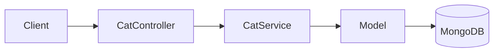

# title
NoSQL Storage with MongoDB and Mongoose

# description
Hands-on integration of MongoDB with Mongoose in NestJS, from schema definition to API testing for flexible yet disciplined data at the application layer.

# body

## 1. Opening

"If it's document storage, why use **MongoDB** but still need **Mongoose Schema**?" — a **Senior Engineer** asks during a data layer review. A **Mid-level Developer** answers: "NoSQL is flexible so we don't need many constraints." The answer shows awareness of **document model** flexibility, but misses depth on **schema discipline**: as the system scales, documents without schema validation suffer **schema drift** — old and new documents have different shapes, causing hard-to-trace runtime errors.

This lesson runs through two consecutive tracks:
- **Part 2.1**: **hands-on**, synchronized with the GitHub repository; the **stack** is **NestJS** + **MongoDB** (Docker), with **two verification flows** (create cat; search and update).
- **Part 2.2**: **theory** clarifying the nature of **ODM**, **Schema Design**, **Mongoose Query** — definitions, examples, and typical **edge cases** such as **populate depth**, **runValidators**, and **indexes**.

## 2. Core concepts

The lesson structure follows **practice-led theory**. First, learners clone the source, start **MongoDB** via **Docker Compose**, run **NestJS** via `nest start --watch`, and call APIs to observe **Mongoose** handling schema, validation, queries, and updates. Then the **theory** section systematizes **core concepts**, **architecture models**, and analyzes in-depth **edge cases** — mapping directly to what was observed in **part 2.1**.

### 2.1. Hands-on

#### 2.1.1. Prepare source code and environment

Goal: clone the demo source and run **NestJS** with **MongoDB** to observe **Mongoose** handling schema with `@Prop()`, timestamps, nested objects, and string arrays.

Source: [StarCi-Academy/fullstack-mastery-module-2-database-integration-orm-odm-caching](https://github.com/StarCi-Academy/fullstack-mastery-module-2-database-integration-orm-odm-caching) on GitHub — lesson directory: [`2-mongoose-and-mongodb`](https://github.com/StarCi-Academy/fullstack-mastery-module-2-database-integration-orm-odm-caching/tree/main/2-mongoose-and-mongodb).

```bash
# Step 1: Clone the repository locally
git clone https://github.com/StarCi-Academy/fullstack-mastery-module-2-database-integration-orm-odm-caching.git

# Step 2: Navigate to the lesson directory
cd fullstack-mastery-module-2-database-integration-orm-odm-caching/2-mongoose-and-mongodb
```

#### 2.1.2. Architecture / components (stack + flow)

- **MongoDB (Docker):** document engine storing collection `cats`.
- **CatController:** REST endpoints `POST /cats`, `GET /cats`, `GET /cats/search`, `PUT /cats/:id`.
- **CatService:** CRUD business logic via **Mongoose Model**.
- **Cat Schema:** schema with `@Prop({ required, index })`, `timestamps: true`, nested `metadata`, array `hobbies`.

| Component | File | Role |
| --- | --- | --- |
| **MongoDB** | `.docker/compose.yaml` | Stores cats collection |
| **CatController** | `src/modules/cat/cat.controller.ts` | REST endpoints |
| **CatService** | `src/modules/cat/cat.service.ts` | CRUD via Mongoose Model |
| **Cat Schema** | `src/modules/cat/schemas/cat.schema.ts` | Schema definition + validation |



Figure 1: Data operation flow with Mongoose.

#### 2.1.3. Prerequisites and startup

##### 2.1.3.1. Prerequisites

- **Node.js** LTS (recommended ≥ 18).
- **npm** or **pnpm**.
- **NestJS CLI**: `npm i -g @nestjs/cli`.
- **Docker Desktop** (or Docker Engine) + `docker compose`.
- **Windows:** API commands use **`Invoke-RestMethod`** (PowerShell). See parallel **`curl`** for macOS / Linux.

##### 2.1.3.2. Start

```bash
# Step 1: Start MongoDB
docker compose -f .docker/compose.yaml up -d

# Step 2: Install dependencies
npm install

# Step 3: Start in watch mode
nest start --watch
```

After the command above: terminal logs show the app listening on **`http://localhost:3000`**.

#### 2.1.4. Verification

**2 flows** below verify two goals: **(1)** create cat with schema validation; **(2)** search and update document.

- **Flow 1:** Create cat — `POST /cats`.
- **Flow 2:** Search and update — `GET /cats/search?name=` and `PUT /cats/:id`.

##### 2.1.4.1. Flow 1 — Create cat document

- Step 1: call `POST /cats`.

  ```bash
  # Windows (PowerShell)
  $body = '{"name":"Luna","age":3,"breed":"Persian","hobbies":["sleeping","eating"],"metadata":{"color":"white"}}'
  Invoke-RestMethod -Uri http://localhost:3000/cats -Method Post -ContentType "application/json" -Body $body

  # macOS / Linux
  # → Paste cURL into Postman: Import → Raw text
  curl -s -X POST http://localhost:3000/cats \
    -H "Content-Type: application/json" \
    -d '{"name":"Luna","age":3,"breed":"Persian","hobbies":["sleeping","eating"],"metadata":{"color":"white"}}'
  ```

  Expected response (HTTP 201):

  ```json
  {
    "_id": "<ObjectId>",
    "name": "Luna",
    "age": 3,
    "breed": "Persian",
    "hobbies": ["sleeping", "eating"],
    "metadata": { "color": "white" },
    "createdAt": "<ISO datetime>",
    "updatedAt": "<ISO datetime>"
  }
  ```

*If the response matches the format above:*

- *Schema validation works — `name` (required), `age` (min: 0) validated by **Mongoose**.*
- *Auto timestamps — `createdAt` and `updatedAt` added via `timestamps: true`.*
- *Flexible schema — `hobbies` (string array) and `metadata` (nested object) stored in the same document.*

##### 2.1.4.2. Flow 2 — Search and update

- Step 1: call `GET /cats/search?name=Luna`.

  ```bash
  # Windows (PowerShell)
  Invoke-RestMethod -Uri "http://localhost:3000/cats/search?name=Luna"

  # macOS / Linux
  # → Paste cURL into Postman: Import → Raw text
  curl -s "http://localhost:3000/cats/search?name=Luna"
  ```

  Expected response (HTTP 200): Luna's document.

- Step 2: call `PUT /cats/<id>` (replace `<id>` with ObjectId from previous step).

  ```bash
  # Windows (PowerShell)
  Invoke-RestMethod -Uri http://localhost:3000/cats/<id> -Method Put -ContentType "application/json" -Body '{"age":4}'

  # macOS / Linux
  # → Paste cURL into Postman: Import → Raw text
  curl -s -X PUT http://localhost:3000/cats/<id> \
    -H "Content-Type: application/json" \
    -d '{"age":4}'
  ```

  Expected response (HTTP 200): document with `age: 4` and updated `updatedAt`.

*If the responses match the format above:*

- *Index works — `findOne({ name })` uses the index defined on `name` field.*
- *Partial update — `findByIdAndUpdate` only updates sent fields, preserving the rest.*

#### 2.1.5. Cleanup

```bash
# Step 1: Stop MongoDB and remove volumes
docker compose -f .docker/compose.yaml down -v
```

#### 2.1.6. Further reading

- **Mongoose Schema Guide:** Correct schema design (embed/reference, index) directly impacts performance. ([Mongoose Docs](https://mongoosejs.com/docs/guide.html))
- **Mongoose Queries:** `find()`, `findOne()`, `findByIdAndUpdate()` — Mongoose query API. ([Mongoose Docs](https://mongoosejs.com/docs/queries.html))
- **MongoDB Data Modeling:** Embed vs reference — the most important design decision in document modeling. ([MongoDB Docs](https://www.mongodb.com/docs/manual/core/data-modeling-introduction/))
- **NestJS + Mongoose:** Integrating Mongoose into the NestJS IoC Container. ([NestJS Docs](https://docs.nestjs.com/techniques/mongodb))

### 2.2. Theory — ODM, Schema Design, and Mongoose Query

#### 2.2.1. What problem does ODM solve?

**ODM** (Object-Document Mapping) maps documents in **MongoDB** to classes/objects in code. Similar to **ORM** for SQL, but operates on documents (JSON-like) instead of rows/tables.

**Mongoose** provides:
- **Schema definition:** declare fields, types, validation, indexes.
- **Model:** class that interacts with collections — CRUD operations.
- **Middleware (hooks):** pre/post save, validate, remove.

#### 2.2.2. Embed vs Reference

| Embed | Reference |
| --- | --- |
| Store sub-document in parent | Store ObjectId reference |
| Fast reads (1 query) | Needs `populate` (2+ queries) |
| Hard to update sub-documents independently | Easy to update documents independently |
| Best for rarely-changing data | Best for frequently-changing data |

#### 2.2.3. Schema Design Best Practices

- **`timestamps: true`:** auto-adds `createdAt` and `updatedAt`.
- **`@Prop({ required: true })`:** enforce required fields at app layer.
- **`@Prop({ index: true })`:** index frequently queried fields.
- **`@Prop([String])`:** declare array of strings.
- **`@Prop({ type: Object })`:** allow flexible nested objects.

#### 2.2.4. Edge cases to internalize

- **Populate depth too deep:** Multiple nested references → N+1 queries. **Fix:** use aggregation pipeline or embed sub-documents.
- **Schema not validating on update:** Mongoose only validates on `save()`, not `updateOne()`. **Fix:** enable `runValidators: true`.
- **Missing indexes:** Slow queries on large collections. **Fix:** index frequently queried fields, verify with `explain()`.
- **Connection string wrong format:** Missing `authSource` → silent connection failure. **Fix:** test connection with `mongosh` first.

## 3. Wrap-up

### 3.1. Common interview questions

- **Question 1:** Why use **Mongoose Schema** when **MongoDB** is schemaless?
  - What interviewers want: schema discipline reasoning at app level.
  - Sample short answer: MongoDB is schemaless at DB level, but apps need validation to prevent schema drift and runtime errors.

- **Question 2:** When to embed vs reference?
  - What interviewers want: read vs write performance trade-off reasoning.
  - Sample short answer: Embed when data rarely changes and is always read with parent; reference when data changes frequently or is shared across documents.

- **Question 3:** Does `findByIdAndUpdate` run validation?
  - What interviewers want: understanding Mongoose validation scope.
  - Sample short answer: Not by default. You need to enable `runValidators: true` in options.

# references
## 0
### alias
Mongoose Documentation
### url
https://mongoosejs.com
## 1
### alias
NestJS Documentation - MongoDB (Mongoose)
### url
https://docs.nestjs.com/techniques/mongodb
## 2
### alias
MongoDB Data Modeling
### url
https://www.mongodb.com/docs/manual/core/data-modeling-introduction/

# minutesRead
18
