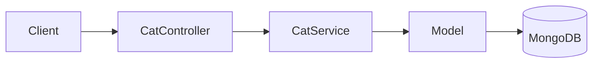

# title
Lưu trữ NoSQL với MongoDB và Mongoose

# description
Thực hành tích hợp MongoDB với Mongoose trong NestJS, từ định nghĩa schema đến kiểm thử API để dữ liệu linh hoạt nhưng vẫn có kỷ luật ở tầng ứng dụng.

# body

## 1. Lời mở đầu

"Đã là lưu dữ liệu document, vì sao dùng **MongoDB** nhưng vẫn cần **Mongoose Schema**?" — một **Senior Engineer** hỏi khi review data layer. Một **Mid-level Developer** trả lời: "NoSQL linh hoạt nên không cần ràng buộc nhiều." Câu trả lời cho thấy nhận thức về tính linh hoạt của **document model**, nhưng vẫn thiếu chiều sâu về **schema discipline**: khi hệ thống mở rộng, document không có schema validation sẽ bị **schema drift** — field cũ và mới có shape khác nhau, gây lỗi runtime khó truy nguyên.

Bài này dẫn qua hai mạch liên tiếp:
- **Phần 2.1**: **thực hành** đồng bộ với repository trên GitHub; **stack** gồm **NestJS** + **MongoDB** (Docker), kèm **hai luồng** kiểm thử (tạo cat; tìm kiếm và cập nhật).
- **Phần 2.2**: **lý thuyết** làm rõ bản chất **ODM**, **Schema Design**, **Mongoose Query** — định nghĩa, ví dụ, và các **edge case** điển hình như **populate depth**, **runValidators**, **index**.

## 2. Các khái niệm cốt lõi

Cấu trúc bài học áp dụng phương pháp **Thực hành dẫn dắt Lý thuyết**. Khởi đầu, học viên sẽ trực tiếp clone source, khởi động **MongoDB** bằng **Docker Compose**, chạy **NestJS** bằng `nest start --watch` và gọi API để quan sát **Mongoose** xử lý schema, validation, query, và update. Tiếp theo, **phần lý thuyết** sẽ hệ thống hóa **các khái niệm cốt lõi**, **mô hình kiến trúc** và phân tích các **edge cases** chuyên sâu — giúp đối chiếu và củng cố trực tiếp những kết quả vừa thực nghiệm tại **phần 2.1**.

### 2.1. Thực hành

#### 2.1.1. Chuẩn bị source code và môi trường

Mục đích: clone source demo và chạy **NestJS** kết hợp **MongoDB** để quan sát **Mongoose** xử lý schema với `@Prop()`, timestamps, nested object, array of strings.

Source: [StarCi-Academy/fullstack-mastery-module-2-database-integration-orm-odm-caching](https://github.com/StarCi-Academy/fullstack-mastery-module-2-database-integration-orm-odm-caching) trên GitHub — thư mục bài học: [`2-mongoose-and-mongodb`](https://github.com/StarCi-Academy/fullstack-mastery-module-2-database-integration-orm-odm-caching/tree/main/2-mongoose-and-mongodb).

```bash
# Bước 1: Clone repository về máy local
git clone https://github.com/StarCi-Academy/fullstack-mastery-module-2-database-integration-orm-odm-caching.git

# Bước 2: Di chuyển vào đúng thư mục bài học
cd fullstack-mastery-module-2-database-integration-orm-odm-caching/2-mongoose-and-mongodb
```

#### 2.1.2. Kiến trúc/thành phần (stack + luồng)

- **MongoDB (Docker):** engine document lưu collection `cats`.
- **CatController:** REST endpoints `POST /cats`, `GET /cats`, `GET /cats/search`, `PUT /cats/:id`.
- **CatService:** nghiệp vụ CRUD qua **Mongoose Model**.
- **Cat Schema:** schema với `@Prop({ required, index })`, `timestamps: true`, nested `metadata`, array `hobbies`.

| Thành phần | File | Vai trò |
| --- | --- | --- |
| **MongoDB** | `.docker/compose.yaml` | Lưu trữ collection cats |
| **CatController** | `src/modules/cat/cat.controller.ts` | REST endpoints |
| **CatService** | `src/modules/cat/cat.service.ts` | CRUD với Mongoose Model |
| **Cat Schema** | `src/modules/cat/schemas/cat.schema.ts` | Schema definition + validation |



Hình 1: Luồng thao tác dữ liệu với Mongoose.

#### 2.1.3. Chuẩn bị & khởi chạy

##### 2.1.3.1. Điều kiện cần trước

- **Node.js** LTS (khuyến nghị ≥ 18).
- **npm** hoặc **pnpm**.
- **NestJS CLI**: `npm i -g @nestjs/cli`.
- **Docker Desktop** (hoặc Docker Engine) + `docker compose`.
- **Windows:** các lệnh API dùng **`Invoke-RestMethod`** (PowerShell). Xem song song **`curl`** cho macOS / Linux.

> **Lưu ý:** Repo đã ship env defaults qua **ConfigModule**; khi chạy hệ thống không cần tạo hay sửa **.env**. Chỉ chỉnh sửa file này khi bạn muốn chạy service với các port/credential khác mặc định.

##### 2.1.3.2. Khởi động

```bash
# Bước 1: Khởi động MongoDB
docker compose -f .docker/compose.yaml up -d

# Bước 2: Cài dependency
npm install

# Bước 3: Khởi chạy ở chế độ watch
nest start --watch
```

Sau lệnh trên: terminal log hiển thị app đang lắng nghe tại **`http://localhost:3000`**.

#### 2.1.4. Kiểm thử

**2 luồng** dưới đây kiểm chứng hai mục tiêu: **(1)** tạo cat với schema validation; **(2)** tìm kiếm và cập nhật document.

- **Luồng 1:** Tạo cat — `POST /cats`.
- **Luồng 2:** Tìm kiếm và cập nhật — `GET /cats/search?name=` và `PUT /cats/:id`.

##### 2.1.4.1. Luồng 1 — Tạo cat document

- Bước 1: gọi `POST /cats`.

  ```bash
  # Windows (PowerShell)
  $body = '{"name":"Luna","age":3,"breed":"Persian","hobbies":["sleeping","eating"],"metadata":{"color":"white"}}'
  Invoke-RestMethod -Uri http://localhost:3000/cats -Method Post -ContentType "application/json" -Body $body

  # macOS / Linux
  # → Dán cURL vào Postman: Import → Raw text
  curl -s -X POST http://localhost:3000/cats \
    -H "Content-Type: application/json" \
    -d '{"name":"Luna","age":3,"breed":"Persian","hobbies":["sleeping","eating"],"metadata":{"color":"white"}}'
  ```

  Response phải trả về (HTTP 201):

  ```json
  {
    "_id": "<ObjectId>",
    "name": "Luna",
    "age": 3,
    "breed": "Persian",
    "hobbies": ["sleeping", "eating"],
    "metadata": { "color": "white" },
    "createdAt": "<ISO datetime>",
    "updatedAt": "<ISO datetime>"
  }
  ```

*Kết luận: Nếu response khớp format trên, hệ thống xác nhận:*

- *Schema validation hoạt động — `name` (required), `age` (min: 0) được validate bởi **Mongoose**.*
- *Timestamps tự động — `createdAt` và `updatedAt` được thêm nhờ `timestamps: true`.*
- *Flexible schema — `hobbies` (array string) và `metadata` (nested object) lưu được trong cùng document.*

##### 2.1.4.2. Luồng 2 — Tìm kiếm và cập nhật

- Bước 1: gọi `GET /cats/search?name=Luna`.

  ```bash
  # Windows (PowerShell)
  Invoke-RestMethod -Uri "http://localhost:3000/cats/search?name=Luna"

  # macOS / Linux
  # → Dán cURL vào Postman: Import → Raw text
  curl -s "http://localhost:3000/cats/search?name=Luna"
  ```

  Response phải trả về (HTTP 200) document Luna.

- Bước 2: gọi `PUT /cats/<id>` (thay `<id>` bằng ObjectId từ bước trước).

  ```bash
  # Windows (PowerShell)
  Invoke-RestMethod -Uri http://localhost:3000/cats/<id> -Method Put -ContentType "application/json" -Body '{"age":4}'

  # macOS / Linux
  # → Dán cURL vào Postman: Import → Raw text
  curl -s -X PUT http://localhost:3000/cats/<id> \
    -H "Content-Type: application/json" \
    -d '{"age":4}'
  ```

  Response phải trả về (HTTP 200) document với `age: 4` và `updatedAt` thay đổi.

*Kết luận: Nếu response khớp format trên, hệ thống xác nhận:*

- *Index hoạt động — `findOne({ name })` dùng index đã đánh trên field `name`.*
- *Partial update — `findByIdAndUpdate` chỉ cập nhật field được gửi, giữ nguyên phần còn lại.*

#### 2.1.5. Dọn tài nguyên

Sau khi kết thúc bài, bạn có thể dọn tài nguyên để tiết kiệm bộ nhớ.

```bash
# Bước 1: Dừng server đang chạy
# Windows / macOS / Linux
Ctrl + C

# Bước 2: Đóng Docker (nếu bài học có dùng Docker)
docker compose -f .docker/compose.yaml down -v
```

#### 2.1.6. Đọc thêm

- **Mongoose Schema Guide:** Thiết kế schema đúng (embed/reference, index) ảnh hưởng trực tiếp performance. ([Mongoose Docs](https://mongoosejs.com/docs/guide.html))
- **Mongoose Queries:** `find()`, `findOne()`, `findByIdAndUpdate()` — API query của Mongoose. ([Mongoose Docs](https://mongoosejs.com/docs/queries.html))
- **MongoDB Data Modeling:** Embed vs reference — quyết định thiết kế quan trọng nhất trong document model. ([MongoDB Docs](https://www.mongodb.com/docs/manual/core/data-modeling-introduction/))
- **NestJS + Mongoose:** Tích hợp Mongoose vào NestJS IoC Container. ([NestJS Docs](https://docs.nestjs.com/techniques/mongodb))

### 2.2. Lý thuyết — ODM, Schema Design và Mongoose Query

#### 2.2.1. ODM giải quyết vấn đề gì?

**ODM** (Object-Document Mapping) ánh xạ document trong **MongoDB** sang class/object trong code. Tương tự **ORM** cho SQL, nhưng thao tác trên document (JSON-like) thay vì row/table.

**Mongoose** cung cấp:
- **Schema definition:** khai báo field, type, validation, index.
- **Model:** class tương tác với collection — CRUD operations.
- **Middleware (hooks):** pre/post save, validate, remove.

#### 2.2.2. Embed vs Reference

| Embed | Reference |
| --- | --- |
| Lưu sub-document trong parent | Lưu ObjectId reference |
| Đọc nhanh (1 query) | Cần `populate` (2+ queries) |
| Khó update sub-document riêng lẻ | Dễ update document riêng |
| Phù hợp data ít thay đổi | Phù hợp data thay đổi thường xuyên |

#### 2.2.3. Schema Design Best Practices

- **`timestamps: true`:** tự động thêm `createdAt` và `updatedAt`.
- **`@Prop({ required: true })`:** enforce field bắt buộc ở tầng app.
- **`@Prop({ index: true })`:** đánh index cho field thường query.
- **`@Prop([String])`:** khai báo array of strings.
- **`@Prop({ type: Object })`:** cho phép nested object linh hoạt.

#### 2.2.4. Các trường hợp biên (edge cases) cần lưu ý

- **Populate depth quá sâu:** Nested references nhiều level → N+1 query. **Giải pháp:** dùng aggregation pipeline hoặc embed sub-document.
- **Schema không validate runtime:** Mongoose chỉ validate khi `save()`, không validate khi `updateOne()`. **Giải pháp:** bật `runValidators: true` trong update options.
- **Index thiếu:** Query chậm khi collection lớn mà không có index. **Giải pháp:** đánh index cho field thường query, kiểm tra bằng `explain()`.
- **Connection string sai format:** Thiếu `authSource` hoặc sai replica set name → connection fail. **Giải pháp:** test connection bằng `mongosh` trước.

## 3. Tổng kết

### 3.1. Các câu hỏi dễ bị phỏng vấn

- **Câu hỏi 1:** Vì sao dùng **Mongoose Schema** khi **MongoDB** đã schemaless?
  - Ý interviewer muốn nghe: tư duy schema discipline ở tầng ứng dụng.
  - Trả lời mẫu (ngắn): MongoDB schemaless ở DB level, nhưng app cần validation để tránh schema drift và lỗi runtime.

- **Câu hỏi 2:** Khi nào nên embed, khi nào nên reference?
  - Ý interviewer muốn nghe: trade-off read vs write performance.
  - Trả lời mẫu (ngắn): Embed khi data ít thay đổi và đọc cùng parent; reference khi data thay đổi thường xuyên hoặc dùng chung nhiều nơi.

- **Câu hỏi 3:** `findByIdAndUpdate` có chạy validation không?
  - Ý interviewer muốn nghe: hiểu Mongoose validation scope.
  - Trả lời mẫu (ngắn): Mặc định không. Cần bật `runValidators: true` trong options.

# references
## 0
### alias
Mongoose Documentation
### url
https://mongoosejs.com
## 1
### alias
NestJS Documentation - MongoDB (Mongoose)
### url
https://docs.nestjs.com/techniques/mongodb
## 2
### alias
MongoDB Data Modeling
### url
https://www.mongodb.com/docs/manual/core/data-modeling-introduction/

# minutesRead
18
