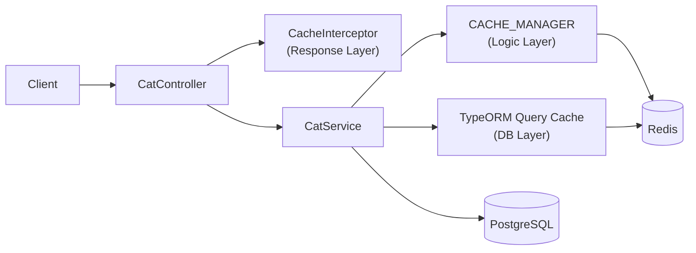
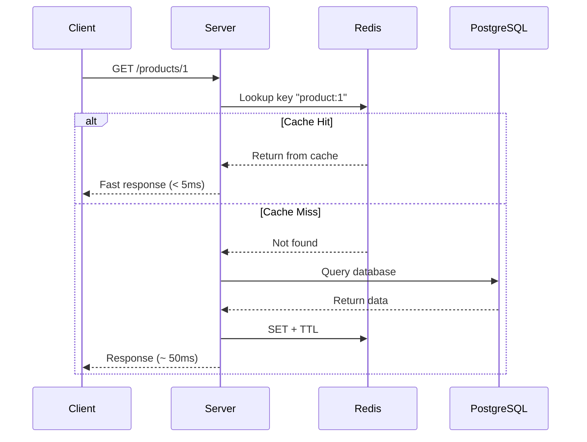

# title
Accelerating Systems with Redis Caching

# description
Hands-on integration of Redis into NestJS for multi-layer caching (Response, Logic, DB Query), reducing database load and improving latency for repeated read APIs.

# body

## 1. Opening

"With repeated read APIs, why is the system still slow even though queries are optimized?" — a **Senior Engineer** asks during a performance review. A **Mid-level Developer** answers: "Just scale up the database." The answer shows awareness of **vertical scaling**, but misses depth on **caching strategy**: no matter how powerful the database, the repeated processing cost across multiple layers (query → business logic → serialization) remains a bottleneck — and caching is the only way to completely eliminate that cost for repeated reads.

This lesson runs through two consecutive tracks:
- **Part 2.1**: **hands-on**, synchronized with the GitHub repository; the **stack** is **NestJS** + **PostgreSQL** (Docker) + **Redis** (Docker), with **three verification flows** corresponding to three cache layers (Response Layer, Logic Layer, DB Query Layer).
- **Part 2.2**: **theory** clarifying the nature of **caching strategy** — Cache-Aside, Write-Through, TTL, and typical **edge cases** such as **cache stampede**, **stale data**, and **serialization mismatch**.

## 2. Core concepts

The lesson structure follows **practice-led theory**. First, learners clone the source, start **PostgreSQL** + **Redis** via **Docker Compose**, run **NestJS** via `nest start --watch`, and call APIs to observe cache miss/hit at each layer. Then the **theory** section systematizes **core concepts**, **architecture models**, and analyzes in-depth **edge cases** — mapping directly to what was observed in **part 2.1**.

### 2.1. Hands-on

#### 2.1.1. Prepare source code and environment

Goal: clone the demo source and run **NestJS** with **PostgreSQL** + **Redis** to observe caching across 3 layers: **Response Layer** (`CacheInterceptor`), **Logic Layer** (`CACHE_MANAGER`), **DB Query Layer** (TypeORM query cache).

Source: [StarCi-Academy/fullstack-mastery-module-2-database-integration-orm-odm-caching](https://github.com/StarCi-Academy/fullstack-mastery-module-2-database-integration-orm-odm-caching) on GitHub — lesson directory: [`3-caching-with-redis`](https://github.com/StarCi-Academy/fullstack-mastery-module-2-database-integration-orm-odm-caching/tree/main/3-caching-with-redis).

```bash
# Step 1: Clone the repository locally
git clone https://github.com/StarCi-Academy/fullstack-mastery-module-2-database-integration-orm-odm-caching.git

# Step 2: Navigate to the lesson directory
cd fullstack-mastery-module-2-database-integration-orm-odm-caching/3-caching-with-redis
```

#### 2.1.2. Architecture / components (stack + flow)

- **PostgreSQL (Docker):** stores the `cats` table.
- **Redis (Docker):** cache backend for all 3 layers.
- **CatController:** REST endpoints for seed, 3-layer demo, and cache clearing.
- **CatService:** CRUD + cache logic via `CACHE_MANAGER` and TypeORM query cache.
- **RequestTimingInterceptor:** measures request duration, prints `[TIME]` log.

| Component | File | Role |
| --- | --- | --- |
| **PostgreSQL** | `.docker/compose.yaml` | Stores cats data |
| **Redis** | `.docker/compose.yaml` | Cache backend (3 layers) |
| **CatController** | `src/modules/cat/cat.controller.ts` | REST endpoints |
| **CatService** | `src/modules/cat/cat.service.ts` | CRUD + cache logic |
| **RequestTimingInterceptor** | `src/common/interceptors/request-timing.interceptor.ts` | Request timing |
| **CacheModule** | `AppModule` | Multi-tier: Redis + Local Memory |



Figure 1: Multi-layer caching flow with Redis.

#### 2.1.3. Prerequisites and startup

##### 2.1.3.1. Prerequisites

- **Node.js** LTS (recommended ≥ 18).
- **npm** or **pnpm**.
- **NestJS CLI**: `npm i -g @nestjs/cli`.
- **Docker Desktop** (or Docker Engine) + `docker compose`.
- **Windows:** API commands use **`Invoke-RestMethod`** (PowerShell). See parallel **`curl`** for macOS / Linux.

> **Note:** The repo ships with env defaults via **ConfigModule**; you do not need to create or edit **.env** when running the system. Only modify this file if you want to run the service with custom ports/credentials.

##### 2.1.3.2. Start

```bash
# Step 1: Start PostgreSQL + Redis
docker compose -f .docker/compose.yaml up -d

# Step 2: Install dependencies
npm install

# Step 3: Start in watch mode
nest start --watch
```

After the command above: terminal logs show the app listening on **`http://localhost:3000`**. **TypeORM** auto-creates tables via `synchronize: true`.

#### 2.1.4. Verification

**3 flows** below verify 3 cache layers: **(1)** Response Layer (CacheInterceptor); **(2)** Logic Layer (CACHE_MANAGER); **(3)** DB Query Layer (TypeORM query cache).

- **Flow 1:** Response cache — `GET /cats/response-layer`.
- **Flow 2:** Logic cache — `GET /cats/logic-layer`.
- **Flow 3:** DB query cache — `POST /cats/seed` + `GET /cats/db-layer`.

##### 2.1.4.1. Flow 1 — Response cache (CacheInterceptor)

- Step 1: call `GET /cats/response-layer` first time (cache miss — sleeps 1s).

  ```bash
  # Windows (PowerShell)
  Invoke-RestMethod -Uri http://localhost:3000/cats/response-layer

  # macOS / Linux
  # → Paste cURL into Postman: Import → Raw text
  curl -s http://localhost:3000/cats/response-layer
  ```

  Expected response (HTTP 200):

  ```json
  "This data would be cached at the Controller level using CacheInterceptor"
  ```

  Check terminal: `[TIME] GET /cats/response-layer 200 ~1000ms` (miss).

- Step 2: call again (cache hit). Same response but `[TIME]` much faster (~1-5ms).

- Step 3: clear response layer cache.

  ```bash
  # Windows (PowerShell)
  Invoke-RestMethod -Uri http://localhost:3000/cats/response-layer/cache -Method Delete

  # macOS / Linux
  curl -s -X DELETE http://localhost:3000/cats/response-layer/cache
  ```

  Expected response (HTTP 200):

  ```json
  {
    "message": "Response-layer cache key was cleared successfully.",
    "cacheKey": "cats_res_layer"
  }
  ```

*If the responses match the format above:*

- *CacheInterceptor works — auto-saves response on first call, returns from Redis on subsequent calls.*
- *Manual invalidation — deleting Redis key resets the next request to miss.*

##### 2.1.4.2. Flow 2 — Logic cache (CACHE_MANAGER)

- Step 1: call `GET /cats/logic-layer` first time (cache miss — sleeps 1s).

  ```bash
  # Windows (PowerShell)
  Invoke-RestMethod -Uri http://localhost:3000/cats/logic-layer

  # macOS / Linux
  # → Paste cURL into Postman: Import → Raw text
  curl -s http://localhost:3000/cats/logic-layer
  ```

  Expected response (HTTP 200):

  ```json
  {
    "message": "Hải sản cho mèo cực phẩm",
    "timestamp": "<ISO datetime>"
  }
  ```

- Step 2: call again (cache hit — faster).

- Step 3: clear logic layer cache.

  ```bash
  # Windows (PowerShell)
  Invoke-RestMethod -Uri http://localhost:3000/cats/logic-layer/cache -Method Delete

  # macOS / Linux
  curl -s -X DELETE http://localhost:3000/cats/logic-layer/cache
  ```

  Expected response (HTTP 200):

  ```json
  {
    "message": "Logic-layer cache key was cleared successfully.",
    "cacheKey": "cats_logic_layer_cache"
  }
  ```

*If the responses match the format above:*

- *Programmatic cache — `CACHE_MANAGER.get()/set()` caches by business key.*
- *Miss bypasses heavy logic — first call sleeps 1s, subsequent calls return directly from Redis.*

##### 2.1.4.3. Flow 3 — DB query cache (TypeORM)

- Step 1: seed 1000 cats.

  ```bash
  # Windows (PowerShell)
  Invoke-RestMethod -Uri "http://localhost:3000/cats/seed?count=1000" -Method Post

  # macOS / Linux
  curl -s -X POST "http://localhost:3000/cats/seed?count=1000"
  ```

  Expected response (HTTP 200):

  ```json
  {
    "message": "Seed completed successfully.",
    "inserted": 1000
  }
  ```

- Step 2: call `GET /cats/db-layer` first time (query cache miss).

  ```bash
  # Windows (PowerShell)
  Invoke-RestMethod -Uri http://localhost:3000/cats/db-layer

  # macOS / Linux
  # → Paste cURL into Postman: Import → Raw text
  curl -s http://localhost:3000/cats/db-layer
  ```

  Expected response (HTTP 200): JSON array of cats. Check `[TIME]` log.

- Step 3: call again (query cache hit — faster).

- Step 4: clear DB layer cache.

  ```bash
  # Windows (PowerShell)
  Invoke-RestMethod -Uri http://localhost:3000/cats/db-layer/cache -Method Delete

  # macOS / Linux
  curl -s -X DELETE http://localhost:3000/cats/db-layer/cache
  ```

  Expected response (HTTP 200):

  ```json
  {
    "message": "DB query-layer cache key was cleared successfully.",
    "cacheKey": "cats_db_layer_cache"
  }
  ```

*If the responses match the format above:*

- *TypeORM query cache — `cache: { id, milliseconds }` in `find()` auto-hashes queries into Redis keys.*
- *DB bypass — on hit, no SQL is sent to PostgreSQL.*

#### 2.1.5. Cleanup

When you are done, tear down to free resources.

```bash
# Step 1: Stop the running server
# Windows / macOS / Linux
Ctrl + C

# Step 2: Close Docker (if the lesson uses Docker)
docker compose -f .docker/compose.yaml down -v
```

#### 2.1.6. Further reading

- **NestJS Caching:** `CacheInterceptor` and `CACHE_MANAGER` — two caching approaches in NestJS. ([NestJS Docs](https://docs.nestjs.com/techniques/caching))
- **TypeORM Query Cache:** Reduces repeated SQL executions for heavy read queries. ([TypeORM Docs](https://typeorm.io/caching))
- **Redis Eviction Policy:** Balances cache hit ratio and memory limits. ([Redis Docs](https://redis.io/docs/latest/develop/reference/eviction/))
- **Cache-Aside Pattern:** Most common pattern — app checks cache → miss queries DB → writes cache. ([Microsoft Docs](https://learn.microsoft.com/en-us/azure/architecture/patterns/cache-aside))

### 2.2. Theory — Caching Strategy and Redis

#### 2.2.1. Cache Hit vs Cache Miss



#### 2.2.2. Common caching strategies

| Strategy | Description | When to use |
| --- | --- | --- |
| **Cache-Aside** | App checks cache → miss queries DB → writes cache | Read-heavy, rarely changing data |
| **Write-Through** | Write simultaneously to cache + DB | Data requiring high consistency |
| **Write-Behind** | Write cache first, async write DB | High performance, accepting eventual consistency |
| **TTL Expiration** | Cache auto-deletes after N seconds | Periodically changing data |

#### 2.2.3. 3 cache layers in the hands-on

| Layer | Mechanism | Scope |
| --- | --- | --- |
| **Response Layer** | `CacheInterceptor` decorator | Entire HTTP response |
| **Logic Layer** | `CACHE_MANAGER.get()/set()` | Specific business data |
| **DB Query Layer** | TypeORM `cache: { id, milliseconds }` | Query result sets |

#### 2.2.4. Edge cases to internalize

- **Cache stampede:** Many requests hit DB simultaneously when cache expires. **Fix:** use mutex lock or stale-while-revalidate.
- **Wrong cache invalidation:** DB updated but cache not invalidated → stale data. **Fix:** invalidate immediately after write or use short TTL.
- **Serialization mismatch:** Object stored in Redis differs in shape when deserialized. **Fix:** use consistent `JSON.stringify/parse`.
- **Redis connection lost:** App crashes when Redis is unavailable. **Fix:** implement fallback strategy, don't let cache failure block requests.

## 3. Wrap-up

### 3.1. Common interview questions

- **Question 1:** When to cache at response layer vs service layer?
  - What interviewers want: separating cache goals by processing cost.
  - Sample short answer: Response layer is quick to deploy for read endpoints; service layer is more flexible when caching by business key.

- **Question 2:** What's the biggest risk of using cache?
  - What interviewers want: stale data and invalidation strategy.
  - Sample short answer: Stale data is the primary risk; need clear TTL and invalidation on write.

- **Question 3:** Why can't cache replace the database?
  - What interviewers want: persistence vs acceleration roles.
  - Sample short answer: Cache only optimizes temporary access; source of truth must be a durable database.

# references
## 0
### alias
NestJS Caching
### url
https://docs.nestjs.com/techniques/caching
## 1
### alias
Redis Documentation
### url
https://redis.io/docs
## 2
### alias
TypeORM Caching
### url
https://typeorm.io/caching

# minutesRead
20
