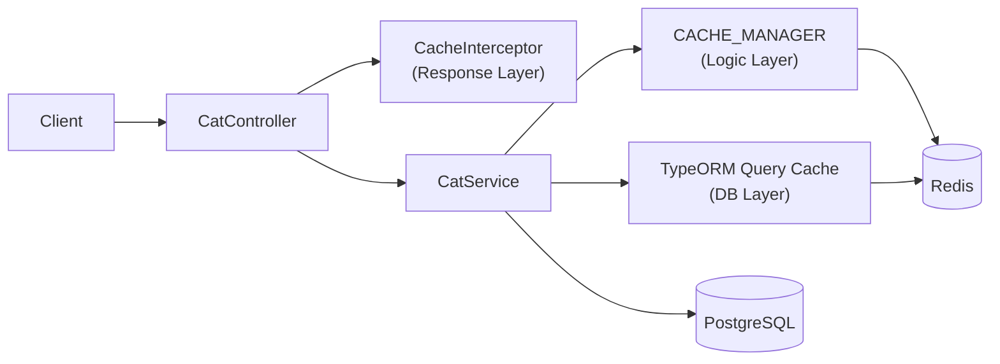
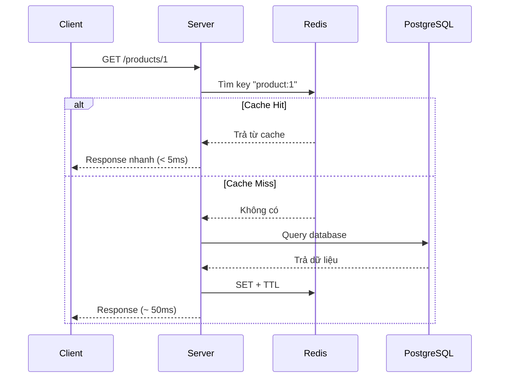

# title
Tăng tốc hệ thống với bộ nhớ đệm Redis

# description
Thực hành tích hợp Redis vào NestJS để cache nhiều tầng (Response, Logic, DB Query), giảm tải database và cải thiện độ trễ cho các API đọc lặp lại.

# body

## 1. Lời mở đầu

"Với API đọc lặp lại, vì sao hệ thống vẫn chậm dù query đã tối ưu?" — một **Senior Engineer** hỏi khi review performance. Một **Mid-level Developer** trả lời: "Chỉ cần tăng tài nguyên database." Câu trả lời cho thấy nhận thức về **vertical scaling**, nhưng vẫn thiếu chiều sâu về **caching strategy**: dù database có mạnh đến đâu, chi phí xử lý lặp lại ở nhiều tầng (query → business logic → serialization) vẫn là bottleneck — và caching là cách duy nhất để triệt tiêu hoàn toàn chi phí đó cho repeated reads.

Bài này dẫn qua hai mạch liên tiếp:
- **Phần 2.1**: **thực hành** đồng bộ với repository trên GitHub; **stack** gồm **NestJS** + **PostgreSQL** (Docker) + **Redis** (Docker), kèm **ba luồng** kiểm thử tương ứng ba tầng cache (Response Layer, Logic Layer, DB Query Layer).
- **Phần 2.2**: **lý thuyết** làm rõ bản chất **caching strategy** — Cache-Aside, Write-Through, TTL, và các **edge case** điển hình như **cache stampede**, **stale data**, **serialization mismatch**.

## 2. Các khái niệm cốt lõi

Cấu trúc bài học áp dụng phương pháp **Thực hành dẫn dắt Lý thuyết**. Khởi đầu, học viên sẽ trực tiếp clone source, khởi động **PostgreSQL** + **Redis** bằng **Docker Compose**, chạy **NestJS** bằng `nest start --watch` và gọi API để quan sát cache miss/hit ở từng tầng. Tiếp theo, **phần lý thuyết** sẽ hệ thống hóa **các khái niệm cốt lõi**, **mô hình kiến trúc** và phân tích các **edge cases** chuyên sâu — giúp đối chiếu và củng cố trực tiếp những kết quả vừa thực nghiệm tại **phần 2.1**.

### 2.1. Thực hành

#### 2.1.1. Chuẩn bị source code và môi trường

Mục đích: clone source demo và chạy **NestJS** kết hợp **PostgreSQL** + **Redis** để quan sát caching ở 3 tầng: **Response Layer** (`CacheInterceptor`), **Logic Layer** (`CACHE_MANAGER`), **DB Query Layer** (TypeORM query cache).

Source: [StarCi-Academy/fullstack-mastery-module-2-database-integration-orm-odm-caching](https://github.com/StarCi-Academy/fullstack-mastery-module-2-database-integration-orm-odm-caching) trên GitHub — thư mục bài học: [`3-caching-with-redis`](https://github.com/StarCi-Academy/fullstack-mastery-module-2-database-integration-orm-odm-caching/tree/main/3-caching-with-redis).

```bash
# Bước 1: Clone repository về máy local
git clone https://github.com/StarCi-Academy/fullstack-mastery-module-2-database-integration-orm-odm-caching.git

# Bước 2: Di chuyển vào đúng thư mục bài học
cd fullstack-mastery-module-2-database-integration-orm-odm-caching/3-caching-with-redis
```

#### 2.1.2. Kiến trúc/thành phần (stack + luồng)

- **PostgreSQL (Docker):** lưu trữ bảng `cats`.
- **Redis (Docker):** backend lưu cache cho cả 3 tầng.
- **CatController:** REST endpoints cho seed, 3 layer demo, và clear cache.
- **CatService:** nghiệp vụ CRUD + cache logic qua `CACHE_MANAGER` và TypeORM query cache.
- **RequestTimingInterceptor:** đo thời gian xử lý request, in log `[TIME]`.

| Thành phần | File | Vai trò |
| --- | --- | --- |
| **PostgreSQL** | `.docker/compose.yaml` | Lưu trữ dữ liệu cats |
| **Redis** | `.docker/compose.yaml` | Backend cache (3 tầng) |
| **CatController** | `src/modules/cat/cat.controller.ts` | REST endpoints |
| **CatService** | `src/modules/cat/cat.service.ts` | CRUD + cache logic |
| **RequestTimingInterceptor** | `src/common/interceptors/request-timing.interceptor.ts` | Đo thời gian request |
| **CacheModule** | `AppModule` | Multi-tier: Redis + Local Memory |



Hình 1: Luồng caching nhiều tầng với Redis.

#### 2.1.3. Chuẩn bị & khởi chạy

##### 2.1.3.1. Điều kiện cần trước

- **Node.js** LTS (khuyến nghị ≥ 18).
- **npm** hoặc **pnpm**.
- **NestJS CLI**: `npm i -g @nestjs/cli`.
- **Docker Desktop** (hoặc Docker Engine) + `docker compose`.
- **Windows:** các lệnh API dùng **`Invoke-RestMethod`** (PowerShell). Xem song song **`curl`** cho macOS / Linux.

> **Lưu ý:** Repo đã ship env defaults qua **ConfigModule**; khi chạy hệ thống không cần tạo hay sửa **.env**. Chỉ chỉnh sửa file này khi bạn muốn chạy service với các port/credential khác mặc định.

##### 2.1.3.2. Khởi động

```bash
# Bước 1: Khởi động PostgreSQL + Redis
docker compose -f .docker/compose.yaml up -d

# Bước 2: Cài dependency
npm install

# Bước 3: Khởi chạy ở chế độ watch
nest start --watch
```

Sau lệnh trên: terminal log hiển thị app đang lắng nghe tại **`http://localhost:3000`**. **TypeORM** tự tạo bảng nhờ `synchronize: true`.

#### 2.1.4. Kiểm thử

**3 luồng** dưới đây kiểm chứng 3 tầng cache: **(1)** Response Layer (CacheInterceptor); **(2)** Logic Layer (CACHE_MANAGER); **(3)** DB Query Layer (TypeORM query cache).

- **Luồng 1:** Response cache — `GET /cats/response-layer`.
- **Luồng 2:** Logic cache — `GET /cats/logic-layer`.
- **Luồng 3:** DB query cache — `POST /cats/seed` + `GET /cats/db-layer`.

##### 2.1.4.1. Luồng 1 — Response cache (CacheInterceptor)

- Bước 1: gọi `GET /cats/response-layer` lần đầu (cache miss — sleep 1s).

  ```bash
  # Windows (PowerShell)
  Invoke-RestMethod -Uri http://localhost:3000/cats/response-layer

  # macOS / Linux
  # → Dán cURL vào Postman: Import → Raw text
  curl -s http://localhost:3000/cats/response-layer
  ```

  Response phải trả về (HTTP 200):

  ```json
  "This data would be cached at the Controller level using CacheInterceptor"
  ```

  Quan sát terminal: `[TIME] GET /cats/response-layer 200 ~1000ms` (miss).

- Bước 2: gọi lại `GET /cats/response-layer` lần hai (cache hit).

  Response giữ nguyên nội dung, nhưng `[TIME]` nhanh hơn (~1-5ms).

- Bước 3: xóa cache response layer.

  ```bash
  # Windows (PowerShell)
  Invoke-RestMethod -Uri http://localhost:3000/cats/response-layer/cache -Method Delete

  # macOS / Linux
  curl -s -X DELETE http://localhost:3000/cats/response-layer/cache
  ```

  Response phải trả về (HTTP 200):

  ```json
  {
    "message": "Response-layer cache key was cleared successfully.",
    "cacheKey": "cats_res_layer"
  }
  ```

*Kết luận: Nếu response khớp format trên, hệ thống xác nhận:*

- *CacheInterceptor hoạt động — tự lưu response lần đầu, lần sau trả từ Redis.*
- *Invalidation thủ công — xóa key Redis để request tiếp theo trở lại miss.*

##### 2.1.4.2. Luồng 2 — Logic cache (CACHE_MANAGER)

- Bước 1: gọi `GET /cats/logic-layer` lần đầu (cache miss — sleep 1s).

  ```bash
  # Windows (PowerShell)
  Invoke-RestMethod -Uri http://localhost:3000/cats/logic-layer

  # macOS / Linux
  # → Dán cURL vào Postman: Import → Raw text
  curl -s http://localhost:3000/cats/logic-layer
  ```

  Response phải trả về (HTTP 200):

  ```json
  {
    "message": "Hải sản cho mèo cực phẩm",
    "timestamp": "<ISO datetime>"
  }
  ```

- Bước 2: gọi lại lần hai (cache hit — nhanh hơn).

- Bước 3: xóa cache logic layer.

  ```bash
  # Windows (PowerShell)
  Invoke-RestMethod -Uri http://localhost:3000/cats/logic-layer/cache -Method Delete

  # macOS / Linux
  curl -s -X DELETE http://localhost:3000/cats/logic-layer/cache
  ```

  Response phải trả về (HTTP 200):

  ```json
  {
    "message": "Logic-layer cache key was cleared successfully.",
    "cacheKey": "cats_logic_layer_cache"
  }
  ```

*Kết luận: Nếu response khớp format trên, hệ thống xác nhận:*

- *Programmatic cache — `CACHE_MANAGER.get()/set()` cho phép cache theo business key.*
- *Miss bypass heavy logic — lần đầu sleep 1s, lần sau trả trực tiếp từ Redis.*

##### 2.1.4.3. Luồng 3 — DB query cache (TypeORM)

- Bước 1: seed 1000 cats.

  ```bash
  # Windows (PowerShell)
  Invoke-RestMethod -Uri "http://localhost:3000/cats/seed?count=1000" -Method Post

  # macOS / Linux
  curl -s -X POST "http://localhost:3000/cats/seed?count=1000"
  ```

  Response phải trả về (HTTP 200):

  ```json
  {
    "message": "Seed completed successfully.",
    "inserted": 1000
  }
  ```

- Bước 2: gọi `GET /cats/db-layer` lần đầu (query cache miss).

  ```bash
  # Windows (PowerShell)
  Invoke-RestMethod -Uri http://localhost:3000/cats/db-layer

  # macOS / Linux
  # → Dán cURL vào Postman: Import → Raw text
  curl -s http://localhost:3000/cats/db-layer
  ```

  Response phải trả về (HTTP 200): mảng JSON cats. Quan sát `[TIME]` log.

- Bước 3: gọi lại lần hai (query cache hit — nhanh hơn).

- Bước 4: xóa cache DB layer.

  ```bash
  # Windows (PowerShell)
  Invoke-RestMethod -Uri http://localhost:3000/cats/db-layer/cache -Method Delete

  # macOS / Linux
  curl -s -X DELETE http://localhost:3000/cats/db-layer/cache
  ```

  Response phải trả về (HTTP 200):

  ```json
  {
    "message": "DB query-layer cache key was cleared successfully.",
    "cacheKey": "cats_db_layer_cache"
  }
  ```

*Kết luận: Nếu response khớp format trên, hệ thống xác nhận:*

- *TypeORM query cache — `cache: { id, milliseconds }` trong `find()` tự hash query thành key Redis.*
- *DB bypass — lần hit không gửi SQL nào tới PostgreSQL.*

#### 2.1.5. Dọn tài nguyên

Sau khi kết thúc bài, bạn có thể dọn tài nguyên để tiết kiệm bộ nhớ.

```bash
# Bước 1: Dừng server đang chạy
# Windows / macOS / Linux
Ctrl + C

# Bước 2: Đóng Docker (nếu bài học có dùng Docker)
docker compose -f .docker/compose.yaml down -v
```

#### 2.1.6. Đọc thêm

- **NestJS Caching:** `CacheInterceptor` và `CACHE_MANAGER` — hai cách cache trong NestJS. ([NestJS Docs](https://docs.nestjs.com/techniques/caching))
- **TypeORM Query Cache:** Giảm SQL lặp lại cho truy vấn đọc nặng. ([TypeORM Docs](https://typeorm.io/caching))
- **Redis Eviction Policy:** Cân bằng cache hit ratio và memory limit. ([Redis Docs](https://redis.io/docs/latest/develop/reference/eviction/))
- **Cache-Aside Pattern:** Pattern phổ biến nhất — app tự check cache → miss thì query DB → ghi cache. ([Microsoft Docs](https://learn.microsoft.com/en-us/azure/architecture/patterns/cache-aside))

### 2.2. Lý thuyết — Caching Strategy và Redis

#### 2.2.1. Cache Hit vs Cache Miss



#### 2.2.2. Các chiến lược caching phổ biến

| Chiến lược | Mô tả | Khi nào dùng |
| --- | --- | --- |
| **Cache-Aside** | App tự check cache → miss thì query DB → ghi cache | Đọc nhiều, dữ liệu ít thay đổi |
| **Write-Through** | Ghi đồng thời cache + DB | Dữ liệu cần consistency cao |
| **Write-Behind** | Ghi cache trước, async ghi DB | Performance cao, chấp nhận eventual consistency |
| **TTL Expiration** | Cache tự xóa sau N giây | Dữ liệu thay đổi theo chu kỳ |

#### 2.2.3. 3 tầng cache trong bài thực hành

| Tầng | Cơ chế | Scope |
| --- | --- | --- |
| **Response Layer** | `CacheInterceptor` decorator | Toàn bộ HTTP response |
| **Logic Layer** | `CACHE_MANAGER.get()/set()` | Business data cụ thể |
| **DB Query Layer** | TypeORM `cache: { id, milliseconds }` | Query result set |

#### 2.2.4. Các trường hợp biên (edge cases) cần lưu ý

- **Cache stampede:** Nhiều request cùng lúc khi cache expire → tất cả hit DB. **Giải pháp:** dùng mutex lock hoặc stale-while-revalidate.
- **Cache invalidation sai:** Update DB nhưng quên invalidate cache → stale data. **Giải pháp:** invalidate ngay sau write hoặc dùng TTL ngắn.
- **Serialization mismatch:** Object lưu Redis khác shape khi deserialize. **Giải pháp:** dùng `JSON.stringify/parse` nhất quán.
- **Redis connection lost:** App crash khi Redis unavailable. **Giải pháp:** implement fallback strategy, không để cache failure block request.

## 3. Tổng kết

### 3.1. Các câu hỏi dễ bị phỏng vấn

- **Câu hỏi 1:** Khi nào nên cache ở response layer, khi nào ở service layer?
  - Ý interviewer muốn nghe: phân tách mục tiêu cache theo chi phí xử lý.
  - Trả lời mẫu (ngắn): Response layer nhanh triển khai cho endpoint đọc; service layer linh hoạt hơn khi cần cache theo business key.

- **Câu hỏi 2:** Rủi ro lớn nhất khi dùng cache là gì?
  - Ý interviewer muốn nghe: stale data và invalidation strategy.
  - Trả lời mẫu (ngắn): Dữ liệu cũ là rủi ro chính; cần TTL rõ ràng và invalidation khi write.

- **Câu hỏi 3:** Vì sao cache không thể thay thế database?
  - Ý interviewer muốn nghe: vai trò persistence vs acceleration.
  - Trả lời mẫu (ngắn): Cache chỉ tối ưu truy cập tạm thời; source of truth vẫn phải là database bền vững.

# references
## 0
### alias
NestJS Caching
### url
https://docs.nestjs.com/techniques/caching
## 1
### alias
Redis Documentation
### url
https://redis.io/docs
## 2
### alias
TypeORM Caching
### url
https://typeorm.io/caching

# minutesRead
20
