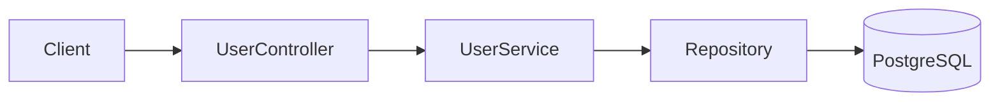

# title
RESTful API and CRUD Best Practices

# description
Hands-on building of standards-compliant RESTful APIs in NestJS with full HTTP verbs (GET, POST, PUT, PATCH, DELETE), status code mapping, and seed data.

# body

## 1. Opening

"The API has 5 CRUD endpoints — but why does one team use `POST` for every action while another separates `PUT` and `PATCH`?" — a **Senior Engineer** asks during an API design review. A **Mid-level Developer** answers: "I use `POST` for both create and update for convenience." The answer shows awareness of deployment speed, but misses depth on **REST semantics**: wrong verb usage causes clients to misunderstand idempotency, cache proxies stop working, and the API is no longer self-descriptive — issues that only surface when multiple teams consume it.

This lesson runs through two consecutive tracks:
- **Part 2.1**: **hands-on**, synchronized with the GitHub repository; the **stack** is **NestJS** + **PostgreSQL** (Docker), with **five verification flows** corresponding to `POST`, `GET`, `PUT`, `PATCH`, `DELETE`.
- **Part 2.2**: **theory** clarifying **REST constraints**, **HTTP verb mapping**, **status codes**, and typical **edge cases** such as **idempotency**, **nested resources**, and **PUT vs PATCH**.

## 2. Core concepts

The lesson structure follows **practice-led theory**. First, learners clone the source, start **PostgreSQL** via **Docker Compose**, run **NestJS** via `nest start --watch`, and call APIs to observe each verb operating with correct status codes. Then the **theory** section systematizes **core concepts**, **architecture models**, and analyzes in-depth **edge cases** — mapping directly to what was observed in **part 2.1**.

### 2.1. Hands-on

#### 2.1.1. Prepare source code and environment

Goal: clone the demo source and run **NestJS** + **PostgreSQL** to observe full CRUD on the **User** domain (`GET`, `POST`, `PUT`, `PATCH`, `DELETE`) with correct status code mapping.

Source: [StarCi-Academy/fullstack-mastery-module-3-rest-api-development-documentation](https://github.com/StarCi-Academy/fullstack-mastery-module-3-rest-api-development-documentation) on GitHub — lesson directory: [`0-restful-api-crud-best-practices`](https://github.com/StarCi-Academy/fullstack-mastery-module-3-rest-api-development-documentation/tree/main/0-restful-api-crud-best-practices).

```bash
# Step 1: Clone the repository locally
git clone https://github.com/StarCi-Academy/fullstack-mastery-module-3-rest-api-development-documentation.git

# Step 2: Navigate to the lesson directory
cd fullstack-mastery-module-3-rest-api-development-documentation/0-restful-api-crud-best-practices
```

#### 2.1.2. Architecture / components (stack + flow)

- **PostgreSQL (Docker):** stores the `users` table.
- **UserController:** full REST endpoints: `POST /users/seed`, `GET /users`, `GET /users/:id`, `POST /users`, `PUT /users/:id`, `PATCH /users/:id`, `DELETE /users/:id`.
- **UserService:** CRUD via **TypeORM Repository** + faker seed.
- **UserEntity:** entity with `id` (string, app-assigned), `name`, `email`.

| Component | File | Role |
| --- | --- | --- |
| **PostgreSQL** | `.docker/compose.yaml` | Stores users table |
| **UserController** | `src/modules/user/user.controller.ts` | REST endpoints |
| **UserService** | `src/modules/user/user.service.ts` | CRUD + seed logic |
| **UserEntity** | `src/modules/user/user.entity.ts` | TypeORM entity |



Figure 1: RESTful API CRUD flow.

#### 2.1.3. Prerequisites and startup

##### 2.1.3.1. Prerequisites

- **Node.js** LTS (recommended ≥ 18).
- **npm** or **pnpm**.
- **NestJS CLI**: `npm i -g @nestjs/cli`.
- **Docker Desktop** (or Docker Engine) + `docker compose`.
- **Windows:** API commands use **`Invoke-RestMethod`** (PowerShell). See parallel **`curl`** for macOS / Linux.

##### 2.1.3.2. Start

```bash
docker compose -f .docker/compose.yaml up -d

# Step 1: Install dependencies
npm install

# Step 2: Start in watch mode
nest start --watch
```

After the command above: app listens on **`http://localhost:3000`**.

#### 2.1.4. Verification

**5 flows** below verify full CRUD: **(1)** Seed + GET all; **(2)** POST create; **(3)** PUT update; **(4)** PATCH partial; **(5)** DELETE.

##### 2.1.4.1. Flow 1 — Seed and read list

- Step 1: seed sample user.

  ```bash
  # Windows (PowerShell)
  Invoke-RestMethod -Uri http://localhost:3000/users/seed -Method Post

  # macOS / Linux
  curl -s -X POST http://localhost:3000/users/seed
  ```

  Response (HTTP 201): returns seeded user.

- Step 2: read all.

  ```bash
  # Windows (PowerShell)
  Invoke-RestMethod -Uri http://localhost:3000/users

  # macOS / Linux
  curl -s http://localhost:3000/users
  ```

  Response (HTTP 200): array of users.

##### 2.1.4.2. Flow 2 — Create new user (POST)

  ```bash
  # Windows (PowerShell)
  Invoke-RestMethod -Uri http://localhost:3000/users -Method Post -ContentType "application/json" -Body '{"name":"Bob","email":"bob@test.com"}'

  # macOS / Linux
  curl -s -X POST http://localhost:3000/users \
    -H "Content-Type: application/json" \
    -d '{"name":"Bob","email":"bob@test.com"}'
  ```

  Response (HTTP 201): `{ "id": "<short>", "name": "Bob", "email": "bob@test.com" }`.

##### 2.1.4.3. Flow 3 — Full update (PUT)

  ```bash
  # Windows (PowerShell)
  Invoke-RestMethod -Uri http://localhost:3000/users/<id> -Method Put -ContentType "application/json" -Body '{"name":"Bob Updated","email":"bob2@test.com"}'

  # macOS / Linux
  curl -s -X PUT http://localhost:3000/users/<id> \
    -H "Content-Type: application/json" \
    -d '{"name":"Bob Updated","email":"bob2@test.com"}'
  ```

  Response (HTTP 200): updated user.

*PUT replaces the entire resource — missing fields fall back to previous values (service logic).*

##### 2.1.4.4. Flow 4 — Partial update (PATCH)

  ```bash
  # Windows (PowerShell)
  Invoke-RestMethod -Uri http://localhost:3000/users/<id> -Method Patch -ContentType "application/json" -Body '{"name":"Bob Patched"}'

  # macOS / Linux
  curl -s -X PATCH http://localhost:3000/users/<id> \
    -H "Content-Type: application/json" \
    -d '{"name":"Bob Patched"}'
  ```

  Response (HTTP 200): only `name` changed, `email` preserved.

##### 2.1.4.5. Flow 5 — Delete (DELETE)

  ```bash
  # Windows (PowerShell)
  Invoke-RestMethod -Uri http://localhost:3000/users/<id> -Method Delete

  # macOS / Linux
  curl -s -X DELETE http://localhost:3000/users/<id>
  ```

  Response (HTTP 204): no content.

*If all responses match the formats above:*

- *HTTP verb mapping correct — each verb has distinct semantics (POST = create, PUT = replace, PATCH = partial, DELETE = remove).*
- *Status codes accurate — 201 for create, 200 for read/update, 204 for delete, 404 for not found.*

#### 2.1.5. Cleanup

When you are done, tear down to free resources.

```bash
# Step 1: Stop the running server
# Windows / macOS / Linux
Ctrl + C

# Step 2: Close Docker (if the lesson uses Docker)
docker compose -f .docker/compose.yaml down -v
```

#### 2.1.6. Further reading

- **REST Architectural Constraints:** 6 REST constraints: client-server, stateless, cacheable, uniform interface, layered, code-on-demand. ([Fielding Dissertation](https://www.ics.uci.edu/~fielding/pubs/dissertation/rest_arch_style.htm))
- **HTTP Methods:** GET, POST, PUT, PATCH, DELETE — semantics and idempotency. ([MDN Web Docs](https://developer.mozilla.org/en-US/docs/Web/HTTP/Methods))
- **HTTP Status Codes:** 2xx success, 4xx client error, 5xx server error. ([MDN Web Docs](https://developer.mozilla.org/en-US/docs/Web/HTTP/Status))
- **NestJS Controllers:** Routing, request handling, and parameter decorators. ([NestJS Docs](https://docs.nestjs.com/controllers))

### 2.2. Theory — REST Constraints and HTTP Verb Mapping

#### 2.2.1. HTTP Verb → CRUD Mapping

| Verb | Action | Idempotent? | Status Code |
| --- | --- | --- | --- |
| `GET` | Read | ✅ Yes | 200 |
| `POST` | Create | ❌ No | 201 |
| `PUT` | Replace | ✅ Yes | 200 |
| `PATCH` | Partial update | ❌ No | 200 |
| `DELETE` | Delete | ✅ Yes | 204 |

#### 2.2.2. PUT vs PATCH

- **PUT:** replaces the entire resource. Client must send all fields. Idempotent.
- **PATCH:** updates only sent fields. Not idempotent (result depends on current state).

#### 2.2.3. URL Design Best Practices

- Use **plural nouns**: `/users`, `/products` — not `/getUsers`.
- Limit to **2 levels** of nesting: `/users/:id/orders` — not `/users/:id/orders/:id/items/:id`.
- Use **query params** for filtering/sorting: `/users?role=admin&sort=name`.

#### 2.2.4. Edge cases to internalize

- **Wrong verb for action:** Using `POST` for read or `GET` for mutation → violates REST semantics. **Fix:** follow standard HTTP verb mapping.
- **Deep nested resources:** 3+ level URLs → hard to maintain. **Fix:** limit to 2 levels, use query params for filtering.
- **Missing idempotency:** Client retry causes duplicate operations. **Fix:** implement idempotency key for non-idempotent operations.
- **Inconsistent status codes:** Returning 200 for everything. **Fix:** use proper 201, 204, 400, 404, 409.

## 3. Wrap-up

### 3.1. Common interview questions

- **Question 1:** What's the difference between PUT and PATCH?
  - What interviewers want: idempotency and scope of update.
  - Sample short answer: PUT replaces the entire resource (idempotent), PATCH updates only sent fields.

- **Question 2:** When to return 201 vs 200?
  - What interviewers want: status code semantics reasoning.
  - Sample short answer: 201 when a new resource is created (POST), 200 for successful read or update.

- **Question 3:** Should API endpoints use nouns or verbs?
  - What interviewers want: REST convention awareness.
  - Sample short answer: Plural nouns (`/users`), HTTP verbs replace action names.

# references
## 0
### alias
MDN - HTTP Methods
### url
https://developer.mozilla.org/en-US/docs/Web/HTTP/Methods
## 1
### alias
NestJS Documentation - Controllers
### url
https://docs.nestjs.com/controllers
## 2
### alias
MDN - HTTP Status Codes
### url
https://developer.mozilla.org/en-US/docs/Web/HTTP/Status

# minutesRead
18
