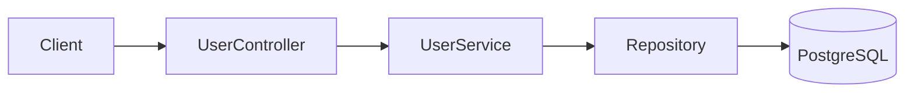

# title
RESTful API và CRUD Best Practices

# description
Thực hành xây dựng RESTful API đúng chuẩn trong NestJS với đầy đủ HTTP verbs (GET, POST, PUT, PATCH, DELETE), status code mapping, và seed data.

# body

## 1. Lời mở đầu

"API có 5 endpoint CRUD — nhưng vì sao có team dùng `POST` cho mọi action, có team lại tách `PUT` và `PATCH`?" — một **Senior Engineer** hỏi khi review API design. Một **Mid-level Developer** trả lời: "Em dùng `POST` cho create và update luôn cho tiện." Câu trả lời cho thấy nhận thức về tốc độ triển khai, nhưng vẫn thiếu chiều sâu về **REST semantics**: dùng sai verb dẫn đến client hiểu nhầm idempotency, cache proxy không hoạt động, và API không tự mô tả (self-descriptive) — vấn đề chỉ lộ ra khi nhiều team cùng consume.

Bài này dẫn qua hai mạch liên tiếp:
- **Phần 2.1**: **thực hành** đồng bộ với repository trên GitHub; **stack** gồm **NestJS** + **PostgreSQL** (Docker), kèm **năm luồng** kiểm thử tương ứng `POST`, `GET`, `PUT`, `PATCH`, `DELETE`.
- **Phần 2.2**: **lý thuyết** làm rõ bản chất **REST constraints**, **HTTP verb mapping**, **status code**, và các **edge case** điển hình như **idempotency**, **nested resources**, **PUT vs PATCH**.

## 2. Các khái niệm cốt lõi

Cấu trúc bài học áp dụng phương pháp **Thực hành dẫn dắt Lý thuyết**. Khởi đầu, học viên sẽ trực tiếp clone source, khởi động **PostgreSQL** bằng **Docker Compose**, chạy **NestJS** bằng `nest start --watch` và gọi API để quan sát từng verb hoạt động với đúng status code. Tiếp theo, **phần lý thuyết** sẽ hệ thống hóa **các khái niệm cốt lõi**, **mô hình kiến trúc** và phân tích các **edge cases** chuyên sâu — giúp đối chiếu và củng cố trực tiếp những kết quả vừa thực nghiệm tại **phần 2.1**.

### 2.1. Thực hành

#### 2.1.1. Chuẩn bị source code và môi trường

Mục đích: clone source demo và chạy **NestJS** + **PostgreSQL** để quan sát full CRUD trên domain **User** (`GET`, `POST`, `PUT`, `PATCH`, `DELETE`) với đúng status code mapping.

Source: [StarCi-Academy/fullstack-mastery-module-3-rest-api-development-documentation](https://github.com/StarCi-Academy/fullstack-mastery-module-3-rest-api-development-documentation) trên GitHub — thư mục bài học: [`0-restful-api-crud-best-practices`](https://github.com/StarCi-Academy/fullstack-mastery-module-3-rest-api-development-documentation/tree/main/0-restful-api-crud-best-practices).

```bash
# Bước 1: Clone repository về máy local
git clone https://github.com/StarCi-Academy/fullstack-mastery-module-3-rest-api-development-documentation.git

# Bước 2: Di chuyển vào đúng thư mục bài học
cd fullstack-mastery-module-3-rest-api-development-documentation/0-restful-api-crud-best-practices
```

#### 2.1.2. Kiến trúc/thành phần (stack + luồng)

- **PostgreSQL (Docker):** lưu bảng `users`.
- **UserController:** REST endpoints đầy đủ: `POST /users/seed`, `GET /users`, `GET /users/:id`, `POST /users`, `PUT /users/:id`, `PATCH /users/:id`, `DELETE /users/:id`.
- **UserService:** nghiệp vụ CRUD qua **TypeORM Repository** + faker seed.
- **UserEntity:** entity với `id` (string, app-assigned), `name`, `email`.

| Thành phần | File | Vai trò |
| --- | --- | --- |
| **PostgreSQL** | `.docker/compose.yaml` | Lưu trữ bảng users |
| **UserController** | `src/modules/user/user.controller.ts` | REST endpoints |
| **UserService** | `src/modules/user/user.service.ts` | CRUD + seed logic |
| **UserEntity** | `src/modules/user/user.entity.ts` | TypeORM entity |



Hình 1: Luồng CRUD RESTful API.

#### 2.1.3. Chuẩn bị & khởi chạy

##### 2.1.3.1. Điều kiện cần trước

- **Node.js** LTS (khuyến nghị ≥ 18).
- **npm** hoặc **pnpm**.
- **NestJS CLI**: `npm i -g @nestjs/cli`.
- **Docker Desktop** (hoặc Docker Engine) + `docker compose`.
- **Windows:** các lệnh API dùng **`Invoke-RestMethod`** (PowerShell). Xem song song **`curl`** cho macOS / Linux.

##### 2.1.3.2. Khởi động

```bash
docker compose -f .docker/compose.yaml up -d

# Bước 1: Cài dependency
npm install

# Bước 2: Khởi chạy ở chế độ watch
nest start --watch
```

Sau lệnh trên: app lắng nghe tại **`http://localhost:3000`**.

#### 2.1.4. Kiểm thử

**5 luồng** dưới đây kiểm chứng full CRUD: **(1)** Seed + GET all; **(2)** POST create; **(3)** PUT update; **(4)** PATCH partial update; **(5)** DELETE.

##### 2.1.4.1. Luồng 1 — Seed và đọc danh sách

- Bước 1: seed user mẫu.

  ```bash
  # Windows (PowerShell)
  Invoke-RestMethod -Uri http://localhost:3000/users/seed -Method Post

  # macOS / Linux
  curl -s -X POST http://localhost:3000/users/seed
  ```

  Response (HTTP 201): trả user vừa seed.

- Bước 2: đọc tất cả.

  ```bash
  # Windows (PowerShell)
  Invoke-RestMethod -Uri http://localhost:3000/users

  # macOS / Linux
  curl -s http://localhost:3000/users
  ```

  Response (HTTP 200): mảng users.

##### 2.1.4.2. Luồng 2 — Tạo user mới (POST)

  ```bash
  # Windows (PowerShell)
  Invoke-RestMethod -Uri http://localhost:3000/users -Method Post -ContentType "application/json" -Body '{"name":"Bob","email":"bob@test.com"}'

  # macOS / Linux
  curl -s -X POST http://localhost:3000/users \
    -H "Content-Type: application/json" \
    -d '{"name":"Bob","email":"bob@test.com"}'
  ```

  Response (HTTP 201): `{ "id": "<short>", "name": "Bob", "email": "bob@test.com" }`.

##### 2.1.4.3. Luồng 3 — Cập nhật toàn bộ (PUT)

  ```bash
  # Windows (PowerShell)
  Invoke-RestMethod -Uri http://localhost:3000/users/<id> -Method Put -ContentType "application/json" -Body '{"name":"Bob Updated","email":"bob2@test.com"}'

  # macOS / Linux
  curl -s -X PUT http://localhost:3000/users/<id> \
    -H "Content-Type: application/json" \
    -d '{"name":"Bob Updated","email":"bob2@test.com"}'
  ```

  Response (HTTP 200): user đã cập nhật.

*PUT ghi đè toàn bộ — nếu thiếu field, giá trị cũ được giữ lại (fallback logic trong service).*

##### 2.1.4.4. Luồng 4 — Cập nhật một phần (PATCH)

  ```bash
  # Windows (PowerShell)
  Invoke-RestMethod -Uri http://localhost:3000/users/<id> -Method Patch -ContentType "application/json" -Body '{"name":"Bob Patched"}'

  # macOS / Linux
  curl -s -X PATCH http://localhost:3000/users/<id> \
    -H "Content-Type: application/json" \
    -d '{"name":"Bob Patched"}'
  ```

  Response (HTTP 200): chỉ field `name` thay đổi, `email` giữ nguyên.

##### 2.1.4.5. Luồng 5 — Xóa (DELETE)

  ```bash
  # Windows (PowerShell)
  Invoke-RestMethod -Uri http://localhost:3000/users/<id> -Method Delete

  # macOS / Linux
  curl -s -X DELETE http://localhost:3000/users/<id>
  ```

  Response (HTTP 204): no content.

*Kết luận: Nếu tất cả response khớp format trên, hệ thống xác nhận:*

- *HTTP verb mapping đúng — mỗi verb có semantics riêng (POST = create, PUT = replace, PATCH = partial, DELETE = remove).*
- *Status code chính xác — 201 cho create, 200 cho read/update, 204 cho delete, 404 cho not found.*

#### 2.1.5. Dọn tài nguyên

Sau khi kết thúc bài, bạn có thể dọn tài nguyên để tiết kiệm bộ nhớ.

```bash
# Bước 1: Dừng server đang chạy
# Windows / macOS / Linux
Ctrl + C

# Bước 2: Đóng Docker (nếu bài học có dùng Docker)
docker compose -f .docker/compose.yaml down -v
```

#### 2.1.6. Đọc thêm

- **REST Architectural Constraints:** 6 ràng buộc của REST: client-server, stateless, cacheable, uniform interface, layered, code-on-demand. ([Fielding Dissertation](https://www.ics.uci.edu/~fielding/pubs/dissertation/rest_arch_style.htm))
- **HTTP Methods:** GET, POST, PUT, PATCH, DELETE — semantics và idempotency. ([MDN Web Docs](https://developer.mozilla.org/en-US/docs/Web/HTTP/Methods))
- **HTTP Status Codes:** 2xx success, 4xx client error, 5xx server error. ([MDN Web Docs](https://developer.mozilla.org/en-US/docs/Web/HTTP/Status))
- **NestJS Controllers:** Routing, request handling, và parameter decorators. ([NestJS Docs](https://docs.nestjs.com/controllers))

### 2.2. Lý thuyết — REST Constraints và HTTP Verb Mapping

#### 2.2.1. HTTP Verb → CRUD Mapping

| Verb | Action | Idempotent? | Status Code |
| --- | --- | --- | --- |
| `GET` | Đọc (Read) | ✅ Có | 200 |
| `POST` | Tạo (Create) | ❌ Không | 201 |
| `PUT` | Ghi đè (Replace) | ✅ Có | 200 |
| `PATCH` | Cập nhật một phần | ❌ Không | 200 |
| `DELETE` | Xóa (Delete) | ✅ Có | 204 |

#### 2.2.2. PUT vs PATCH

- **PUT:** ghi đè toàn bộ resource. Client phải gửi đầy đủ field. Idempotent.
- **PATCH:** chỉ cập nhật field được gửi. Không idempotent (kết quả phụ thuộc state hiện tại).

#### 2.2.3. URL Design Best Practices

- Dùng **danh từ số nhiều**: `/users`, `/products` — không dùng `/getUsers`.
- Giới hạn **2 level nesting**: `/users/:id/orders` — không `/users/:id/orders/:id/items/:id`.
- Dùng **query params** cho filter/sort: `/users?role=admin&sort=name`.

#### 2.2.4. Các trường hợp biên (edge cases) cần lưu ý

- **Verb sai cho action:** Dùng `POST` cho read hoặc `GET` cho mutation → vi phạm REST semantics. **Giải pháp:** tuân thủ HTTP verb mapping chuẩn.
- **Nested resource quá sâu:** URL 3+ level → khó maintain. **Giải pháp:** giới hạn 2 level nesting, dùng query param cho filter.
- **Missing idempotency:** Client retry gây duplicate operation. **Giải pháp:** implement idempotency key cho non-idempotent operations.
- **Status code không nhất quán:** Trả 200 cho mọi case. **Giải pháp:** dùng đúng 201, 204, 400, 404, 409.

## 3. Tổng kết

### 3.1. Các câu hỏi dễ bị phỏng vấn

- **Câu hỏi 1:** PUT và PATCH khác nhau thế nào?
  - Ý interviewer muốn nghe: idempotency và scope of update.
  - Trả lời mẫu (ngắn): PUT ghi đè toàn bộ resource (idempotent), PATCH chỉ cập nhật field được gửi.

- **Câu hỏi 2:** Khi nào trả 201 vs 200?
  - Ý interviewer muốn nghe: tư duy status code theo semantics.
  - Trả lời mẫu (ngắn): 201 khi resource mới được tạo (POST), 200 khi read hoặc update thành công.

- **Câu hỏi 3:** API endpoint nên dùng danh từ hay động từ?
  - Ý interviewer muốn nghe: REST convention.
  - Trả lời mẫu (ngắn): Danh từ số nhiều (`/users`), HTTP verb thay thế cho action.

# references
## 0
### alias
MDN - HTTP Methods
### url
https://developer.mozilla.org/en-US/docs/Web/HTTP/Methods
## 1
### alias
NestJS Documentation - Controllers
### url
https://docs.nestjs.com/controllers
## 2
### alias
MDN - HTTP Status Codes
### url
https://developer.mozilla.org/en-US/docs/Web/HTTP/Status

# minutesRead
18
