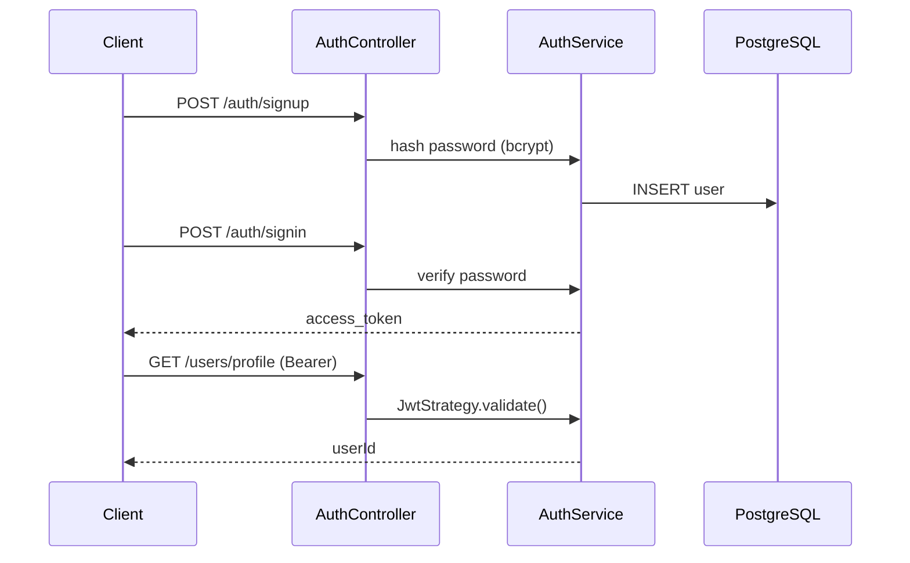

# title
JWT Authentication Flow in NestJS

# description
Hands-on building signup, signin, and route protection using JWT (JSON Web Token) with Passport in NestJS.

# body

## 1. Opening

"Every API call hits the database to check the session — why does the system slow down as users scale?" — a **Senior Engineer** asks during an auth layer review. A **Mid-level Developer** answers: "I store sessions in Redis." The answer shows awareness of session-based auth, but misses depth on **stateless authentication**: JWT allows servers to verify requests without database lookups — but without understanding **signature**, **expiration**, and **secret management**, the system will have serious security vulnerabilities.

This lesson runs through two consecutive tracks:
- **Part 2.1**: **hands-on**; the **stack** is **NestJS** + **PostgreSQL** (Docker), with **three verification flows** (signup, signin, protected route).
- **Part 2.2**: **theory** clarifying **JWT**, **Passport strategy**, **bcrypt**, and **edge cases** like **token theft**, **secret rotation**, and **brute force**.

## 2. Core concepts

The lesson structure follows **practice-led theory**. First, learners clone the source, start **PostgreSQL** via **Docker Compose**, run **NestJS** via `nest start --watch`, and call APIs to observe the JWT flow end-to-end. Then the **theory** section analyzes JWT architecture, Passport, and **edge cases**.

### 2.1. Hands-on

#### 2.1.1. Prepare source code and environment

Source: [StarCi-Academy/fullstack-mastery-module-4-authentication-authorization-jwt-rbac](https://github.com/StarCi-Academy/fullstack-mastery-module-4-authentication-authorization-jwt-rbac) on GitHub — lesson directory: [`0-jwt-authentication-flow`](https://github.com/StarCi-Academy/fullstack-mastery-module-4-authentication-authorization-jwt-rbac/tree/main/0-jwt-authentication-flow).

```bash
git clone https://github.com/StarCi-Academy/fullstack-mastery-module-4-authentication-authorization-jwt-rbac.git
cd fullstack-mastery-module-4-authentication-authorization-jwt-rbac/0-jwt-authentication-flow
```

#### 2.1.2. Architecture / components (stack + flow)

| Component | File | Role |
| --- | --- | --- |
| **PostgreSQL** | `.docker/compose.yaml` | Stores users |
| **AuthController** | `src/modules/auth/auth.controller.ts` | `POST /auth/signup`, `POST /auth/signin` |
| **AuthService** | `src/modules/auth/auth.service.ts` | Hash password (bcrypt), issue JWT |
| **JwtStrategy** | `src/modules/auth/jwt.strategy.ts` | Verify Bearer token, attach `req.user` |
| **JwtAuthGuard** | `src/modules/auth/jwt-auth.guard.ts` | Protect routes |
| **UserController** | `src/modules/user/user.controller.ts` | `GET /users/profile` (protected) |



#### 2.1.3. Prerequisites and startup

##### 2.1.3.1. Prerequisites

- **Node.js** LTS, **npm**, **NestJS CLI**, **Docker Desktop**.
- **Windows:** API commands use **`Invoke-RestMethod`** (PowerShell). See parallel **`curl`** for macOS / Linux.

##### 2.1.3.2. Start

```bash
# Step 1: Start infrastructure
docker compose -f .docker/compose.yaml up -d

# Step 2: Install dependencies
npm install

# Step 3: Start in watch mode
nest start --watch
```

#### 2.1.4. Verification

##### 2.1.4.1. Flow 1 — Signup

  ```bash
  # Windows (PowerShell)
  Invoke-RestMethod -Uri http://localhost:3000/auth/signup -Method Post -ContentType "application/json" -Body '{"email":"test@demo.com","password":"secret123"}'

  # macOS / Linux
  curl -s -X POST http://localhost:3000/auth/signup -H "Content-Type: application/json" -d '{"email":"test@demo.com","password":"secret123"}'
  ```

  Response (HTTP 201): `{ "message": "Created" }`.

##### 2.1.4.2. Flow 2 — Signin and receive JWT

  ```bash
  # Windows (PowerShell)
  $res = Invoke-RestMethod -Uri http://localhost:3000/auth/signin -Method Post -ContentType "application/json" -Body '{"email":"test@demo.com","password":"secret123"}'
  $res.access_token

  # macOS / Linux
  curl -s -X POST http://localhost:3000/auth/signin -H "Content-Type: application/json" -d '{"email":"test@demo.com","password":"secret123"}'
  ```

  Response (HTTP 200): `{ "access_token": "<JWT>" }`.

##### 2.1.4.3. Flow 3 — Access protected route

  ```bash
  # Windows (PowerShell)
  Invoke-RestMethod -Uri http://localhost:3000/users/profile -Headers @{ Authorization = "Bearer $($res.access_token)" }

  # macOS / Linux
  curl -s http://localhost:3000/users/profile -H "Authorization: Bearer <JWT>"
  ```

  Response (HTTP 200): `{ "message": "You have accessed a protected area!", "user": { "userId": 1 } }`.

  Try calling without token → HTTP 401 Unauthorized.

*If the responses match the format above:*

- *Stateless auth — server verifies JWT signature without database lookup.*
- *bcrypt hash — password never stored as plaintext.*
- *JwtAuthGuard — route only accessible with valid Bearer token.*

#### 2.1.5. Cleanup

```bash
docker compose -f .docker/compose.yaml down -v
```

#### 2.1.6. Further reading

- **JWT Introduction:** Header.Payload.Signature structure. ([jwt.io](https://jwt.io/introduction))
- **NestJS Authentication:** Passport + JWT strategy. ([NestJS Docs](https://docs.nestjs.com/security/authentication))
- **bcrypt:** Adaptive password hashing. ([npm bcrypt](https://www.npmjs.com/package/bcrypt))

### 2.2. Theory — JWT, Passport, bcrypt

#### 2.2.1. JWT Structure

```
Header.Payload.Signature
```

- **Header:** algorithm + type (`HS256`, `JWT`).
- **Payload:** claims (`sub`, `iat`, `exp`).
- **Signature:** `HMAC-SHA256(base64(header) + "." + base64(payload), secret)`.

#### 2.2.2. Stateless vs Stateful Auth

| Stateless (JWT) | Stateful (Session) |
| --- | --- |
| Token contains claims, no DB lookup | Session ID → DB lookup per request |
| Easy horizontal scaling | Needs shared session store |
| Cannot revoke (except blocklist) | Revoke by deleting session |

#### 2.2.3. Edge cases to internalize

- **Token theft:** Stolen JWT → attacker accesses all routes. **Fix:** short expiry + refresh token + HTTPS only.
- **Secret rotation:** Changing JWT_SECRET → all existing tokens invalid. **Fix:** support multiple secrets (old + new) during transition.
- **Brute force signin:** No rate limiting → attacker tries passwords. **Fix:** implement rate limiting (throttle).
- **Password stored plaintext:** No hashing → data breach exposes passwords. **Fix:** always use bcrypt/argon2.

## 3. Wrap-up

### 3.1. Common interview questions

- **Question 1:** Where should JWT be stored on the client?
  - Sample answer: HttpOnly cookie (XSS protection) or memory (SPA). Avoid localStorage due to XSS vulnerability.

- **Question 2:** How to revoke an issued JWT?
  - Sample answer: JWT is stateless, can't be revoked directly. Use blocklist or short expiry + refresh token.

- **Question 3:** Why use bcrypt instead of SHA-256 for password hashing?
  - Sample answer: bcrypt has adaptive cost factor, better brute force resistance than plain SHA-256.

# references
## 0
### alias
JWT Introduction
### url
https://jwt.io/introduction
## 1
### alias
NestJS Authentication
### url
https://docs.nestjs.com/security/authentication

# minutesRead
18
