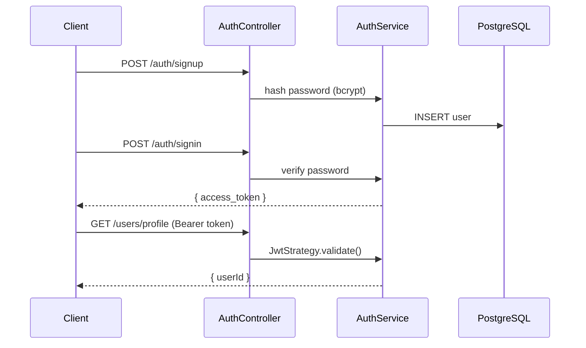

# title
Luồng xác thực JWT trong NestJS

# description
Thực hành xây dựng luồng đăng ký, đăng nhập và bảo vệ route bằng JWT (JSON Web Token) với Passport trong NestJS.

# body

## 1. Lời mở đầu

"API nào cũng phải gọi database kiểm tra session — vì sao hệ thống chậm dần khi user tăng?" — một **Senior Engineer** hỏi khi review auth layer. Một **Mid-level Developer** trả lời: "Em dùng session lưu trên Redis." Câu trả lời cho thấy nhận thức về session-based auth, nhưng vẫn thiếu chiều sâu về **stateless authentication**: JWT cho phép server xác thực request mà không cần database lookup mỗi lần — nhưng nếu không hiểu cơ chế **signature**, **expiration**, **secret management**, hệ thống sẽ có lỗ hổng bảo mật nghiêm trọng.

Bài này dẫn qua hai mạch liên tiếp:
- **Phần 2.1**: **thực hành**; **stack** gồm **NestJS** + **PostgreSQL** (Docker), kèm **ba luồng** kiểm thử (signup, signin, protected route).
- **Phần 2.2**: **lý thuyết** làm rõ bản chất **JWT**, **Passport strategy**, **bcrypt**, và các **edge case** như **token theft**, **secret rotation**, **brute force**.

## 2. Các khái niệm cốt lõi

Cấu trúc bài học áp dụng phương pháp **Thực hành dẫn dắt Lý thuyết**. Khởi đầu, học viên clone source, khởi động **PostgreSQL** bằng **Docker Compose**, chạy **NestJS** bằng `nest start --watch` và gọi API để quan sát luồng JWT end-to-end. Tiếp theo, **phần lý thuyết** phân tích kiến trúc JWT, Passport, và các **edge cases**.

### 2.1. Thực hành

#### 2.1.1. Chuẩn bị source code và môi trường

Source: [StarCi-Academy/fullstack-mastery-module-4-authentication-authorization-jwt-rbac](https://github.com/StarCi-Academy/fullstack-mastery-module-4-authentication-authorization-jwt-rbac) trên GitHub — thư mục bài học: [`0-jwt-authentication-flow`](https://github.com/StarCi-Academy/fullstack-mastery-module-4-authentication-authorization-jwt-rbac/tree/main/0-jwt-authentication-flow).

```bash
git clone https://github.com/StarCi-Academy/fullstack-mastery-module-4-authentication-authorization-jwt-rbac.git
cd fullstack-mastery-module-4-authentication-authorization-jwt-rbac/0-jwt-authentication-flow
```

#### 2.1.2. Kiến trúc/thành phần (stack + luồng)

| Thành phần | File | Vai trò |
| --- | --- | --- |
| **PostgreSQL** | `.docker/compose.yaml` | Lưu trữ users |
| **AuthController** | `src/modules/auth/auth.controller.ts` | `POST /auth/signup`, `POST /auth/signin` |
| **AuthService** | `src/modules/auth/auth.service.ts` | Hash password (bcrypt), issue JWT |
| **JwtStrategy** | `src/modules/auth/jwt.strategy.ts` | Verify Bearer token, attach `req.user` |
| **JwtAuthGuard** | `src/modules/auth/jwt-auth.guard.ts` | Protect routes |
| **UserController** | `src/modules/user/user.controller.ts` | `GET /users/profile` (protected) |



#### 2.1.3. Chuẩn bị & khởi chạy

##### 2.1.3.1. Điều kiện cần trước

- **Node.js** LTS, **npm**, **NestJS CLI**, **Docker Desktop**.
- **Windows:** các lệnh API dùng **`Invoke-RestMethod`** (PowerShell). Xem song song **`curl`** cho macOS / Linux.

##### 2.1.3.2. Khởi động

```bash
# Bước 1: Khởi động infrastructure
docker compose -f .docker/compose.yaml up -d

# Bước 2: Cài dependency
npm install

# Bước 3: Khởi chạy ở chế độ watch
nest start --watch
```

#### 2.1.4. Kiểm thử

##### 2.1.4.1. Luồng 1 — Đăng ký

  ```bash
  # Windows (PowerShell)
  Invoke-RestMethod -Uri http://localhost:3000/auth/signup -Method Post -ContentType "application/json" -Body '{"email":"test@demo.com","password":"secret123"}'

  # macOS / Linux
  curl -s -X POST http://localhost:3000/auth/signup -H "Content-Type: application/json" -d '{"email":"test@demo.com","password":"secret123"}'
  ```

  Response (HTTP 201): `{ "message": "Created" }`.

##### 2.1.4.2. Luồng 2 — Đăng nhập và nhận JWT

  ```bash
  # Windows (PowerShell)
  $res = Invoke-RestMethod -Uri http://localhost:3000/auth/signin -Method Post -ContentType "application/json" -Body '{"email":"test@demo.com","password":"secret123"}'
  $res.access_token

  # macOS / Linux
  curl -s -X POST http://localhost:3000/auth/signin -H "Content-Type: application/json" -d '{"email":"test@demo.com","password":"secret123"}'
  ```

  Response (HTTP 200): `{ "access_token": "<JWT>" }`.

##### 2.1.4.3. Luồng 3 — Truy cập protected route

  ```bash
  # Windows (PowerShell)
  Invoke-RestMethod -Uri http://localhost:3000/users/profile -Headers @{ Authorization = "Bearer $($res.access_token)" }

  # macOS / Linux
  curl -s http://localhost:3000/users/profile -H "Authorization: Bearer <JWT>"
  ```

  Response (HTTP 200): `{ "message": "You have accessed a protected area!", "user": { "userId": 1 } }`.

  Thử gọi không có token → HTTP 401 Unauthorized.

*Kết luận:*

- *Stateless auth — server verify JWT signature mà không cần database lookup.*
- *bcrypt hash — password không lưu plaintext.*
- *JwtAuthGuard — route chỉ accessible khi Bearer token hợp lệ.*

#### 2.1.5. Dọn tài nguyên

Sau khi kết thúc bài, bạn có thể dọn tài nguyên để tiết kiệm bộ nhớ.

```bash
# Bước 1: Dừng server đang chạy
# Windows / macOS / Linux
Ctrl + C

# Bước 2: Đóng Docker (nếu bài học có dùng Docker)
docker compose -f .docker/compose.yaml down -v
```

#### 2.1.6. Đọc thêm

- **JWT Introduction:** Cấu trúc Header.Payload.Signature. ([jwt.io](https://jwt.io/introduction))
- **NestJS Authentication:** Passport + JWT strategy. ([NestJS Docs](https://docs.nestjs.com/security/authentication))
- **bcrypt:** Adaptive password hashing. ([npm bcrypt](https://www.npmjs.com/package/bcrypt))

### 2.2. Lý thuyết — JWT, Passport, bcrypt

#### 2.2.1. JWT Structure

```
Header.Payload.Signature
```

- **Header:** algorithm + type (`HS256`, `JWT`).
- **Payload:** claims (`sub`, `iat`, `exp`).
- **Signature:** `HMAC-SHA256(base64(header) + "." + base64(payload), secret)`.

#### 2.2.2. Stateless vs Stateful Auth

| Stateless (JWT) | Stateful (Session) |
| --- | --- |
| Token chứa claims, server không cần DB | Session ID → DB lookup mỗi request |
| Horizontal scaling dễ | Cần shared session store |
| Không revoke được (trừ blocklist) | Revoke bằng xóa session |

#### 2.2.3. Các trường hợp biên (edge cases) cần lưu ý

- **Token theft:** JWT bị steal → attacker access mọi route. **Giải pháp:** short expiry + refresh token + HTTPS only.
- **Secret rotation:** Đổi JWT_SECRET → tất cả token cũ invalid. **Giải pháp:** support multiple secrets (old + new) trong transition.
- **Brute force signin:** Không rate limit → attacker thử password. **Giải pháp:** implement rate limiting (throttle).
- **Password stored plaintext:** Không hash → data breach lộ password. **Giải pháp:** luôn dùng bcrypt/argon2.

## 3. Tổng kết

### 3.1. Các câu hỏi dễ bị phỏng vấn

- **Câu hỏi 1:** JWT lưu ở đâu trên client?
  - Trả lời mẫu: HttpOnly cookie (chống XSS) hoặc memory (SPA). Tránh localStorage vì dễ bị XSS attack.

- **Câu hỏi 2:** Làm sao revoke JWT đã phát?
  - Trả lời mẫu: JWT stateless nên không revoke trực tiếp. Dùng blocklist hoặc short expiry + refresh token.

- **Câu hỏi 3:** Vì sao dùng bcrypt thay vì SHA-256 để hash password?
  - Trả lời mẫu: bcrypt có adaptive cost factor, chống brute force tốt hơn SHA-256 thuần.

# references
## 0
### alias
JWT Introduction
### url
https://jwt.io/introduction
## 1
### alias
NestJS Authentication
### url
https://docs.nestjs.com/security/authentication

# minutesRead
18
