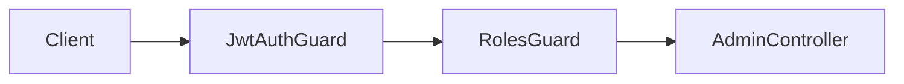
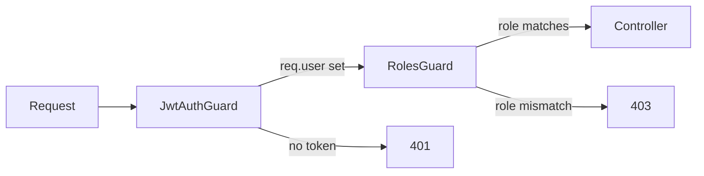

# title
RBAC and Guards in NestJS

# description
Hands-on role-based access control (RBAC) with custom @Roles decorator and RolesGuard in NestJS.

# body

## 1. Opening

"The user is logged in but can still access the admin dashboard — why?" — a **Senior Engineer** asks during a security review. A **Mid-level Developer** answers: "I only check if they're logged in, haven't added authorization." The answer shows awareness of **Authentication** (identity), but lacks **Authorization** (permissions): login only proves *who you are*, authorization decides *what you can do*. Without separating these layers → every authenticated user accesses every resource.

This lesson runs through two tracks:
- **Part 2.1**: **hands-on**; **stack** is **NestJS** + **PostgreSQL** (Docker), with **two flows** (user accessing admin → 403; admin accessing → 200).
- **Part 2.2**: **theory** clarifying **RBAC**, **Guard chain**, **@Roles decorator**, and **edge cases**.

## 2. Core concepts

The lesson structure follows **practice-led theory**. First, learners clone the source, start **PostgreSQL** via **Docker Compose**, run **NestJS** via `nest start --watch`, and call APIs to observe the guard chain in action. Then the **theory** section analyzes RBAC, guard ordering, and **edge cases**.

### 2.1. Hands-on

#### 2.1.1. Prepare source code and environment

Source: [StarCi-Academy/fullstack-mastery-module-4-authentication-authorization-jwt-rbac](https://github.com/StarCi-Academy/fullstack-mastery-module-4-authentication-authorization-jwt-rbac) on GitHub — lesson directory: [`2-rbac-and-guards`](https://github.com/StarCi-Academy/fullstack-mastery-module-4-authentication-authorization-jwt-rbac/tree/main/2-rbac-and-guards).

```bash
# Step 1: Clone the repository to local machine
git clone https://github.com/StarCi-Academy/fullstack-mastery-module-4-authentication-authorization-jwt-rbac.git

# Step 2: Navigate to the correct lesson directory
cd fullstack-mastery-module-4-authentication-authorization-jwt-rbac/2-rbac-and-guards
```

#### 2.1.2. Architecture / components

| Component | File | Role |
| --- | --- | --- |
| **PostgreSQL** | `.docker/compose.yaml` | Stores users (with role) |
| **Role enum** | `src/common/role.enum.ts` | `ADMIN`, `USER` |
| **@Roles** | `src/common/decorators/roles.decorator.ts` | Attaches role metadata to routes |
| **RolesGuard** | `src/common/guards/roles.guard.ts` | Compares JWT role vs @Roles |
| **AdminController** | `src/modules/admin/admin.controller.ts` | `GET /admin/dashboard` (admin only) |
| **JwtAuthGuard** | `src/modules/auth/jwt-auth.guard.ts` | AuthN layer |



#### 2.1.3. Prerequisites and startup

##### 2.1.3.1. Prerequisites

- **Node.js** LTS, **npm**, **NestJS CLI**, **Docker Desktop**.
- **Windows:** API commands use **`Invoke-RestMethod`** (PowerShell). See parallel **`curl`** for macOS / Linux.

> **Note:** The repo ships with env defaults via **ConfigModule**; you do not need to create or edit **.env** when running the system. Only modify this file if you want to run the service with custom ports/credentials.

##### 2.1.3.2. Start

```bash
# Step 1: Start infrastructure
docker compose -f .docker/compose.yaml up -d

# Step 2: Install dependencies
npm install

# Step 3: Start in watch mode
nest start --watch
```

#### 2.1.4. Verification

##### 2.1.4.1. Flow 1 — User role accesses admin → 403

  ```bash
  # Windows (PowerShell)
  Invoke-RestMethod -Uri http://localhost:3000/auth/signup -Method Post -ContentType "application/json" -Body '{"email":"user@demo.com","password":"secret123"}'
  $userRes = Invoke-RestMethod -Uri http://localhost:3000/auth/signin -Method Post -ContentType "application/json" -Body '{"email":"user@demo.com","password":"secret123"}'
  Invoke-RestMethod -Uri http://localhost:3000/admin/dashboard -Headers @{ Authorization = "Bearer $($userRes.access_token)" }

  # macOS / Linux
  curl -s -X POST http://localhost:3000/auth/signup -H "Content-Type: application/json" -d '{"email":"user@demo.com","password":"secret123"}'
  TOKEN=$(curl -s -X POST http://localhost:3000/auth/signin -H "Content-Type: application/json" -d '{"email":"user@demo.com","password":"secret123"}' | jq -r '.access_token')
  curl -s http://localhost:3000/admin/dashboard -H "Authorization: Bearer $TOKEN"
  ```

  Response (HTTP 403): `{ "message": "Forbidden resource" }`.

##### 2.1.4.2. Flow 2 — Admin role accesses → 200

  ```bash
  # Windows (PowerShell)
  Invoke-RestMethod -Uri http://localhost:3000/auth/signup -Method Post -ContentType "application/json" -Body '{"email":"admin@demo.com","password":"secret123","role":"admin"}'
  $adminRes = Invoke-RestMethod -Uri http://localhost:3000/auth/signin -Method Post -ContentType "application/json" -Body '{"email":"admin@demo.com","password":"secret123"}'
  Invoke-RestMethod -Uri http://localhost:3000/admin/dashboard -Headers @{ Authorization = "Bearer $($adminRes.access_token)" }

  # macOS / Linux
  curl -s -X POST http://localhost:3000/auth/signup -H "Content-Type: application/json" -d '{"email":"admin@demo.com","password":"secret123","role":"admin"}'
  TOKEN=$(curl -s -X POST http://localhost:3000/auth/signin -H "Content-Type: application/json" -d '{"email":"admin@demo.com","password":"secret123"}' | jq -r '.access_token')
  curl -s http://localhost:3000/admin/dashboard -H "Authorization: Bearer $TOKEN"
  ```

  Response (HTTP 200): `{ "message": "Welcome Admin to the restricted area!", "stats": { "users": 100, "orders": 15 } }`.

*If the responses match:*

- *Guard chain works — JwtAuthGuard authenticates → RolesGuard authorizes.*
- *@Roles(Role.ADMIN) — only admin-role users pass.*

#### 2.1.5. Cleanup

When you are done, tear down to free resources.

```bash
# Step 1: Stop the running server
# Windows / macOS / Linux
Ctrl + C

# Step 2: Close Docker (if the lesson uses Docker)
docker compose -f .docker/compose.yaml down -v
```

#### 2.1.6. Further reading

- **NestJS Authorization:** Guards and RBAC. ([NestJS Docs](https://docs.nestjs.com/security/authorization))
- **OWASP Access Control:** Best practices. ([OWASP](https://owasp.org/www-community/Access_Control))

### 2.2. Theory — RBAC and Guard Chain

#### 2.2.1. Authentication vs Authorization

| Authentication (AuthN) | Authorization (AuthZ) |
| --- | --- |
| Who are you? | What can you do? |
| JwtAuthGuard | RolesGuard |
| 401 Unauthorized | 403 Forbidden |

#### 2.2.2. Guard Execution Order



#### 2.2.3. Edge cases to internalize

- **Wrong guard order:** RolesGuard runs before JwtAuthGuard → `req.user` undefined. **Fix:** always place JwtAuthGuard before RolesGuard.
- **Outdated role in JWT:** User downgraded but old JWT still has admin. **Fix:** short expiry or DB check in RolesGuard.
- **Missing @Roles:** Forgot decorator → route open to all authenticated users. **Fix:** default deny policy.
- **Enum drift:** Role enum not synced between frontend/backend. **Fix:** use shared constants or API contract.

## 3. Wrap-up

### 3.1. Common interview questions

- **Question 1:** What's the difference between Authentication and Authorization?
  - Sample answer: AuthN verifies identity (401), AuthZ checks access rights (403).

- **Question 2:** How does RBAC differ from ABAC?
  - Sample answer: RBAC is role-based (admin/user); ABAC is attribute-based (department, time, location).

- **Question 3:** Does guard chain order matter?
  - Sample answer: Very much. AuthN guard must run before AuthZ guard to populate `req.user`.

# references
## 0
### alias
NestJS Authorization
### url
https://docs.nestjs.com/security/authorization
## 1
### alias
OWASP Access Control
### url
https://owasp.org/www-community/Access_Control

# minutesRead
16
