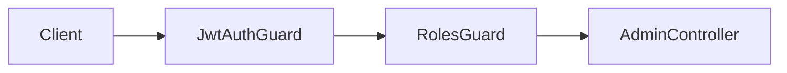
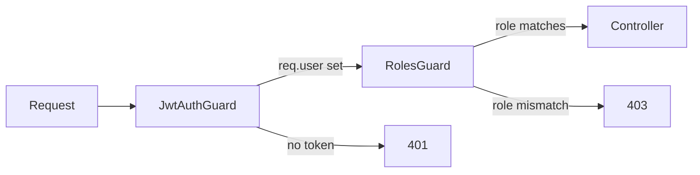

# title
RBAC và Guards trong NestJS

# description
Thực hành phân quyền theo vai trò (Role-Based Access Control) với custom decorator @Roles và RolesGuard trong NestJS.

# body

## 1. Lời mở đầu

"User đã đăng nhập nhưng vì sao vẫn truy cập được admin dashboard?" — một **Senior Engineer** hỏi khi review security. Một **Mid-level Developer** trả lời: "Em chỉ check đăng nhập, chưa phân quyền." Câu trả lời cho thấy nhận thức về **Authentication** (xác thực), nhưng thiếu **Authorization** (phân quyền): đăng nhập chỉ chứng minh *bạn là ai*, còn phân quyền quyết định *bạn được làm gì*. Không tách biệt hai lớp này → mọi user authenticated đều access được mọi resource.

Bài này dẫn qua hai mạch liên tiếp:
- **Phần 2.1**: **thực hành**; **stack** gồm **NestJS** + **PostgreSQL** (Docker), kèm **hai luồng** (user truy cập admin route → 403; admin truy cập → 200).
- **Phần 2.2**: **lý thuyết** làm rõ **RBAC**, **Guard chain**, **@Roles decorator**, và các **edge case**.

## 2. Các khái niệm cốt lõi

Cấu trúc bài học áp dụng phương pháp **Thực hành dẫn dắt Lý thuyết**. Khởi đầu, học viên clone source, khởi động **PostgreSQL** bằng **Docker Compose**, chạy **NestJS** bằng `nest start --watch` và gọi API để quan sát guard chain phân quyền. Tiếp theo, **phần lý thuyết** phân tích RBAC, guard ordering và các **edge cases**.

### 2.1. Thực hành

#### 2.1.1. Chuẩn bị source code và môi trường

Source: [StarCi-Academy/fullstack-mastery-module-4-authentication-authorization-jwt-rbac](https://github.com/StarCi-Academy/fullstack-mastery-module-4-authentication-authorization-jwt-rbac) — thư mục: [`2-rbac-and-guards`](https://github.com/StarCi-Academy/fullstack-mastery-module-4-authentication-authorization-jwt-rbac/tree/main/2-rbac-and-guards).

```bash
git clone https://github.com/StarCi-Academy/fullstack-mastery-module-4-authentication-authorization-jwt-rbac.git
cd fullstack-mastery-module-4-authentication-authorization-jwt-rbac/2-rbac-and-guards
```

#### 2.1.2. Kiến trúc/thành phần (stack + luồng)

| Thành phần | File | Vai trò |
| --- | --- | --- |
| **PostgreSQL** | `.docker/compose.yaml` | Lưu trữ users (có role) |
| **Role enum** | `src/common/role.enum.ts` | `ADMIN`, `USER` |
| **@Roles** | `src/common/decorators/roles.decorator.ts` | Gắn metadata role vào route |
| **RolesGuard** | `src/common/guards/roles.guard.ts` | So sánh JWT role vs @Roles |
| **AdminController** | `src/modules/admin/admin.controller.ts` | `GET /admin/dashboard` (admin only) |
| **JwtAuthGuard** | `src/modules/auth/jwt-auth.guard.ts` | AuthN layer |



#### 2.1.3. Chuẩn bị & khởi chạy

##### 2.1.3.1. Điều kiện cần trước

- **Node.js** LTS, **npm**, **NestJS CLI**, **Docker Desktop**.
- **Windows:** các lệnh API dùng **`Invoke-RestMethod`** (PowerShell). Xem song song **`curl`** cho macOS / Linux.

##### 2.1.3.2. Khởi động

```bash
# Bước 1: Khởi động infrastructure
docker compose -f .docker/compose.yaml up -d

# Bước 2: Cài dependency
npm install

# Bước 3: Khởi chạy ở chế độ watch
nest start --watch
```

#### 2.1.4. Kiểm thử

##### 2.1.4.1. Luồng 1 — User role truy cập admin → 403

  ```bash
  # Windows (PowerShell)
  # Đăng ký user thường
  Invoke-RestMethod -Uri http://localhost:3000/auth/signup -Method Post -ContentType "application/json" -Body '{"email":"user@demo.com","password":"secret123"}'
  $userRes = Invoke-RestMethod -Uri http://localhost:3000/auth/signin -Method Post -ContentType "application/json" -Body '{"email":"user@demo.com","password":"secret123"}'
  # Truy cập admin dashboard với user token
  Invoke-RestMethod -Uri http://localhost:3000/admin/dashboard -Headers @{ Authorization = "Bearer $($userRes.access_token)" }

  # macOS / Linux
  curl -s -X POST http://localhost:3000/auth/signup -H "Content-Type: application/json" -d '{"email":"user@demo.com","password":"secret123"}'
  TOKEN=$(curl -s -X POST http://localhost:3000/auth/signin -H "Content-Type: application/json" -d '{"email":"user@demo.com","password":"secret123"}' | jq -r '.access_token')
  curl -s http://localhost:3000/admin/dashboard -H "Authorization: Bearer $TOKEN"
  ```

  Response (HTTP 403): `{ "message": "Forbidden resource" }`.

##### 2.1.4.2. Luồng 2 — Admin role truy cập → 200

  ```bash
  # Windows (PowerShell)
  # Đăng ký admin (giả sử signup cho phép chọn role trong demo)
  Invoke-RestMethod -Uri http://localhost:3000/auth/signup -Method Post -ContentType "application/json" -Body '{"email":"admin@demo.com","password":"secret123","role":"admin"}'
  $adminRes = Invoke-RestMethod -Uri http://localhost:3000/auth/signin -Method Post -ContentType "application/json" -Body '{"email":"admin@demo.com","password":"secret123"}'
  Invoke-RestMethod -Uri http://localhost:3000/admin/dashboard -Headers @{ Authorization = "Bearer $($adminRes.access_token)" }

  # macOS / Linux
  curl -s -X POST http://localhost:3000/auth/signup -H "Content-Type: application/json" -d '{"email":"admin@demo.com","password":"secret123","role":"admin"}'
  TOKEN=$(curl -s -X POST http://localhost:3000/auth/signin -H "Content-Type: application/json" -d '{"email":"admin@demo.com","password":"secret123"}' | jq -r '.access_token')
  curl -s http://localhost:3000/admin/dashboard -H "Authorization: Bearer $TOKEN"
  ```

  Response (HTTP 200): `{ "message": "Welcome Admin to the restricted area!", "stats": { "users": 100, "orders": 15 } }`.

*Kết luận:*

- *Guard chain hoạt động — JwtAuthGuard xác thực → RolesGuard phân quyền.*
- *@Roles(Role.ADMIN) — chỉ user có role admin mới pass.*

#### 2.1.5. Dọn tài nguyên

```bash
docker compose -f .docker/compose.yaml down -v
```

#### 2.1.6. Đọc thêm

- **NestJS Authorization:** Guards and RBAC. ([NestJS Docs](https://docs.nestjs.com/security/authorization))
- **OWASP Access Control:** Best practices. ([OWASP](https://owasp.org/www-community/Access_Control))

### 2.2. Lý thuyết — RBAC và Guard Chain

#### 2.2.1. Authentication vs Authorization

| Authentication (AuthN) | Authorization (AuthZ) |
| --- | --- |
| Bạn là ai? | Bạn được làm gì? |
| JwtAuthGuard | RolesGuard |
| 401 Unauthorized | 403 Forbidden |

#### 2.2.2. Guard Execution Order



#### 2.2.3. Các trường hợp biên (edge cases) cần lưu ý

- **Guard order sai:** RolesGuard chạy trước JwtAuthGuard → `req.user` undefined. **Giải pháp:** luôn đặt JwtAuthGuard trước RolesGuard.
- **Role trong JWT outdated:** User bị downgrade role nhưng JWT cũ vẫn có admin. **Giải pháp:** short expiry hoặc check DB trong RolesGuard.
- **Missing @Roles:** Quên gắn decorator → route open cho mọi authenticated user. **Giải pháp:** default deny policy.
- **Enum drift:** Role enum không sync giữa frontend/backend. **Giải pháp:** dùng shared constant hoặc API contract.

## 3. Tổng kết

### 3.1. Các câu hỏi dễ bị phỏng vấn

- **Câu hỏi 1:** Authentication và Authorization khác nhau thế nào?
  - Trả lời mẫu: AuthN xác minh danh tính (401), AuthZ kiểm tra quyền truy cập (403).

- **Câu hỏi 2:** RBAC khác ABAC thế nào?
  - Trả lời mẫu: RBAC dựa trên vai trò (admin/user); ABAC dựa trên thuộc tính (department, time, location).

- **Câu hỏi 3:** Guard chain order có quan trọng không?
  - Trả lời mẫu: Rất quan trọng. AuthN guard phải chạy trước AuthZ guard để có `req.user`.

# references
## 0
### alias
NestJS Authorization
### url
https://docs.nestjs.com/security/authorization
## 1
### alias
OWASP Access Control
### url
https://owasp.org/www-community/Access_Control

# minutesRead
16
