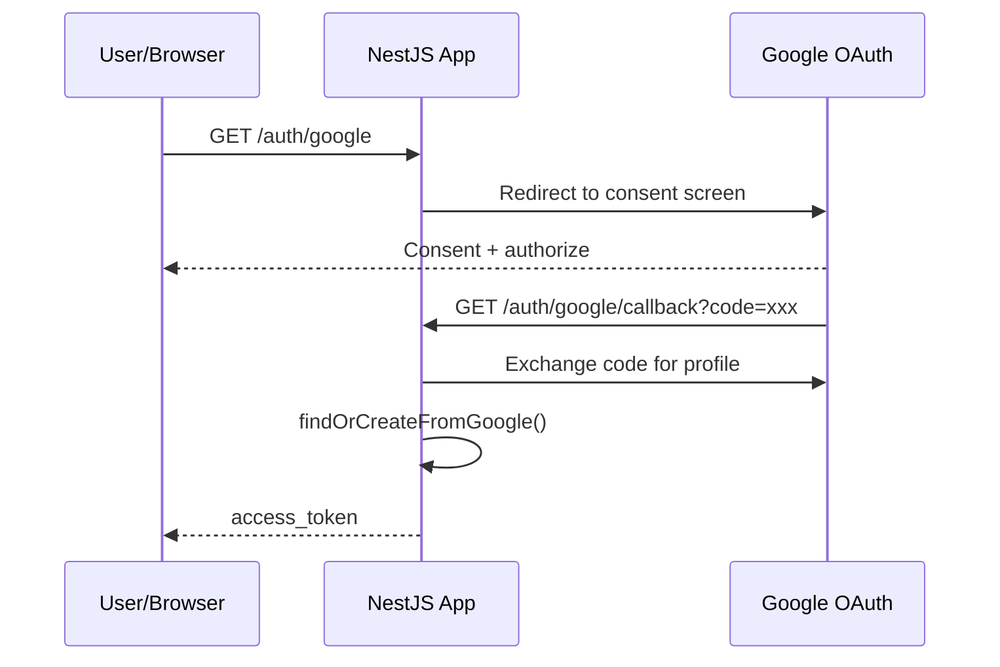

# title
OAuth2 Google Login

# description
Hands-on integration of Google OAuth2 login with Passport in NestJS, from redirect flow to issuing JWT after successful authentication.

# body

## 1. Opening

"Users want to login with Google — should I build a form that takes Google credentials?" — a **Senior Engineer** asks during auth UX review. A **Mid-level Developer** answers: "I'll call Google API directly." The answer shows awareness of social login, but misses depth on **OAuth2 protocol**: handling credentials directly violates security best practices — **OAuth2 Authorization Code flow** delegates authentication to Google, the app only receives the profile after user consent, never seeing the password.

This lesson runs through two tracks:
- **Part 2.1**: **hands-on**; **stack** is **NestJS** + **PostgreSQL** (Docker), with the redirect → callback → JWT flow.
- **Part 2.2**: **theory** clarifying **OAuth2 flow**, **Passport Google strategy**, and **edge cases**.

## 2. Core concepts

The lesson structure follows **practice-led theory**. First, learners clone the source, start **PostgreSQL** via **Docker Compose**, run **NestJS** via `nest start --watch`, and open the browser to observe the OAuth2 redirect flow. Then the **theory** section analyzes the Authorization Code flow and **edge cases**.

### 2.1. Hands-on

#### 2.1.1. Prepare source code and environment

Source: [StarCi-Academy/fullstack-mastery-module-4-authentication-authorization-jwt-rbac](https://github.com/StarCi-Academy/fullstack-mastery-module-4-authentication-authorization-jwt-rbac) on GitHub — lesson directory: [`3-oauth2-google-login`](https://github.com/StarCi-Academy/fullstack-mastery-module-4-authentication-authorization-jwt-rbac/tree/main/3-oauth2-google-login).

```bash
git clone https://github.com/StarCi-Academy/fullstack-mastery-module-4-authentication-authorization-jwt-rbac.git
cd fullstack-mastery-module-4-authentication-authorization-jwt-rbac/3-oauth2-google-login
```

#### 2.1.2. Architecture / components

| Component | File | Role |
| --- | --- | --- |
| **PostgreSQL** | `.docker/compose.yaml` | Stores users |
| **GoogleStrategy** | `src/modules/auth/google.strategy.ts` | Passport Google OAuth2 |
| **AuthController** | `src/modules/auth/auth.controller.ts` | `GET /auth/google`, `GET /auth/google/callback` |
| **AuthService** | `src/modules/auth/auth.service.ts` | findOrCreate + issue JWT |



#### 2.1.3. Prerequisites and startup

##### 2.1.3.1. Prerequisites

- **Node.js** LTS, **npm**, **NestJS CLI**, **Docker Desktop**.
- **Google Cloud Console:** create OAuth 2.0 Client ID, set callback URL `http://localhost:3000/auth/google/callback`.
- Set environment variables: `GOOGLE_CLIENT_ID`, `GOOGLE_CLIENT_SECRET`, `GOOGLE_CALLBACK_URL`.
- **Windows:** API commands use **`Invoke-RestMethod`** (PowerShell). See parallel **`curl`** for macOS / Linux.

##### 2.1.3.2. Start

```bash
# Step 1: Start infrastructure
docker compose -f .docker/compose.yaml up -d

# Step 2: Install dependencies
npm install

# Step 3: Start in watch mode
nest start --watch
```

#### 2.1.4. Verification

##### 2.1.4.1. Flow 1 — OAuth2 redirect flow

- Step 1: open browser at **`http://localhost:3000/auth/google`**.
- Step 2: Google displays consent screen → select account → authorize.
- Step 3: Google redirects to **`/auth/google/callback`** → app returns JWT.

  Response JSON: `{ "access_token": "<JWT>" }`.

  Or verify via terminal:

  ```bash
  # Windows (PowerShell)
  # OAuth2 redirect flow requires browser, not Invoke-RestMethod for redirect step
  # After obtaining token, test protected route:
  Invoke-RestMethod -Uri http://localhost:3000/users/profile -Headers @{ Authorization = "Bearer <JWT>" }

  # macOS / Linux
  curl -s http://localhost:3000/users/profile -H "Authorization: Bearer <JWT>"
  ```

*If the response matches:*

- *Passport Google strategy — delegates authentication to Google, app never sees password.*
- *findOrCreateFromGoogle — upserts user by googleId, prevents duplicates.*

#### 2.1.5. Cleanup

When you are done, tear down to free resources.

```bash
# Step 1: Stop the running server
# Windows / macOS / Linux
Ctrl + C

# Step 2: Close Docker (if the lesson uses Docker)
docker compose -f .docker/compose.yaml down -v
```

#### 2.1.6. Further reading

- **OAuth 2.0 Simplified:** Authorization Code flow explained. ([OAuth.com](https://www.oauth.com/oauth2-servers/server-side-apps/authorization-code/))
- **Google OAuth2:** Setting up credentials on Cloud Console. ([Google Docs](https://developers.google.com/identity/protocols/oauth2))
- **NestJS + Passport:** Social login strategy. ([NestJS Docs](https://docs.nestjs.com/security/authentication))

### 2.2. Theory — OAuth2 Authorization Code Flow

#### 2.2.1. OAuth2 Roles

| Role | Description |
| --- | --- |
| **Resource Owner** | User (consent) |
| **Client** | NestJS App |
| **Authorization Server** | Google OAuth |
| **Resource Server** | Google API (profile) |

#### 2.2.2. Authorization Code Flow

1. App redirects user → Google consent screen.
2. User authorizes → Google redirects to callback URL with `code`.
3. App exchanges `code` → `access_token` + `profile`.
4. App upserts user → issues local JWT.

#### 2.2.3. Edge cases to internalize

- **Callback URL mismatch:** Google rejects if callback URL doesn't match config. **Fix:** ensure URL matches exactly between Cloud Console and code.
- **No email on Google profile:** Google account without email. **Fix:** throw UnauthorizedException, require account with email.
- **CSRF on callback:** Attacker forges callback request. **Fix:** use `state` parameter for verification.
- **Over-scoped token:** Requesting too many permissions. **Fix:** only request necessary scopes (`email`, `profile`).

## 3. Wrap-up

### 3.1. Common interview questions

- **Question 1:** How does Authorization Code flow differ from Implicit flow?
  - Sample answer: Authorization Code has a code exchange step (server-side), more secure. Implicit returns token directly via URL fragment (deprecated).

- **Question 2:** Why not store Google access token long-term?
  - Sample answer: Google access tokens have broad scope; issue short-lived local JWTs for your app instead.

- **Question 3:** What problem does the findOrCreate pattern solve?
  - Sample answer: Prevents duplicate users on 2nd+ Google login; upserts based on googleId.

# references
## 0
### alias
Google OAuth2 Documentation
### url
https://developers.google.com/identity/protocols/oauth2
## 1
### alias
NestJS Authentication
### url
https://docs.nestjs.com/security/authentication

# minutesRead
16
