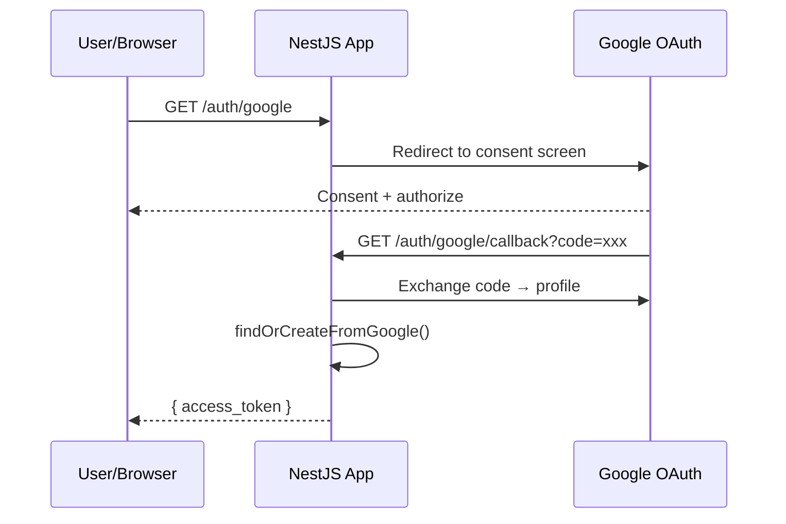

# title
OAuth2 Google Login

# description
Thực hành tích hợp đăng nhập Google OAuth2 với Passport trong NestJS, từ redirect flow đến issue JWT sau khi xác thực thành công.

# body

## 1. Lời mở đầu

"User muốn đăng nhập bằng Google — em tự xây form nhập Google credentials?" — một **Senior Engineer** hỏi khi review auth UX. Một **Mid-level Developer** trả lời: "Em sẽ gọi Google API trực tiếp." Câu trả lời cho thấy nhận thức về social login, nhưng vẫn thiếu chiều sâu về **OAuth2 protocol**: tự handle credentials vi phạm security best practices — **OAuth2 Authorization Code flow** delegate authentication cho Google, app chỉ nhận profile sau khi user consent, không bao giờ thấy password.

Bài này dẫn qua hai mạch liên tiếp:
- **Phần 2.1**: **thực hành**; **stack** gồm **NestJS** + **PostgreSQL** (Docker), kèm **luồng** redirect → callback → JWT.
- **Phần 2.2**: **lý thuyết** làm rõ bản chất **OAuth2 flow**, **Passport Google strategy**, và các **edge case**.

## 2. Các khái niệm cốt lõi

Cấu trúc bài học áp dụng phương pháp **Thực hành dẫn dắt Lý thuyết**. Khởi đầu, học viên clone source, khởi động **PostgreSQL** bằng **Docker Compose**, chạy **NestJS** bằng `nest start --watch` và mở trình duyệt để quan sát OAuth2 redirect flow. Tiếp theo, **phần lý thuyết** phân tích Authorization Code flow và các **edge cases**.

### 2.1. Thực hành

#### 2.1.1. Chuẩn bị source code và môi trường

Source: [StarCi-Academy/fullstack-mastery-module-4-authentication-authorization-jwt-rbac](https://github.com/StarCi-Academy/fullstack-mastery-module-4-authentication-authorization-jwt-rbac) trên GitHub — thư mục bài học: [`3-oauth2-google-login`](https://github.com/StarCi-Academy/fullstack-mastery-module-4-authentication-authorization-jwt-rbac/tree/main/3-oauth2-google-login).

```bash
git clone https://github.com/StarCi-Academy/fullstack-mastery-module-4-authentication-authorization-jwt-rbac.git
cd fullstack-mastery-module-4-authentication-authorization-jwt-rbac/3-oauth2-google-login
```

#### 2.1.2. Kiến trúc/thành phần (stack + luồng)

| Thành phần | File | Vai trò |
| --- | --- | --- |
| **PostgreSQL** | `.docker/compose.yaml` | Lưu trữ users |
| **GoogleStrategy** | `src/modules/auth/google.strategy.ts` | Passport Google OAuth2 |
| **AuthController** | `src/modules/auth/auth.controller.ts` | `GET /auth/google`, `GET /auth/google/callback` |
| **AuthService** | `src/modules/auth/auth.service.ts` | findOrCreate + issue JWT |



#### 2.1.3. Chuẩn bị & khởi chạy

##### 2.1.3.1. Điều kiện cần trước

- **Node.js** LTS, **npm**, **NestJS CLI**, **Docker Desktop**.
- **Google Cloud Console:** tạo OAuth 2.0 Client ID, set callback URL `http://localhost:3000/auth/google/callback`.
- Set biến môi trường: `GOOGLE_CLIENT_ID`, `GOOGLE_CLIENT_SECRET`, `GOOGLE_CALLBACK_URL`.
- **Windows:** các lệnh API dùng **`Invoke-RestMethod`** (PowerShell). Xem song song **`curl`** cho macOS / Linux.

##### 2.1.3.2. Khởi động

```bash
# Bước 1: Khởi động infrastructure
docker compose -f .docker/compose.yaml up -d

# Bước 2: Cài dependency
npm install

# Bước 3: Khởi chạy ở chế độ watch
nest start --watch
```

#### 2.1.4. Kiểm thử

##### 2.1.4.1. Luồng 1 — OAuth2 redirect flow

- Bước 1: mở trình duyệt tại **`http://localhost:3000/auth/google`**.
- Bước 2: Google hiển thị consent screen → chọn account → authorize.
- Bước 3: Google redirect về **`/auth/google/callback`** → app trả JWT.

  Response JSON: `{ "access_token": "<JWT>" }`.

  Hoặc kiểm tra qua terminal:

  ```bash
  # Windows (PowerShell)
  # OAuth2 redirect flow cần trình duyệt, không dùng Invoke-RestMethod cho bước redirect
  # Sau khi có token, test protected route:
  Invoke-RestMethod -Uri http://localhost:3000/users/profile -Headers @{ Authorization = "Bearer <JWT>" }

  # macOS / Linux
  curl -s http://localhost:3000/users/profile -H "Authorization: Bearer <JWT>"
  ```

*Kết luận:*

- *Passport Google strategy — delegate authentication cho Google, app không thấy password.*
- *findOrCreateFromGoogle — upsert user dựa trên googleId, tránh duplicate.*

#### 2.1.5. Dọn tài nguyên

Sau khi kết thúc bài, bạn có thể dọn tài nguyên để tiết kiệm bộ nhớ.

```bash
# Bước 1: Dừng server đang chạy
# Windows / macOS / Linux
Ctrl + C

# Bước 2: Đóng Docker (nếu bài học có dùng Docker)
docker compose -f .docker/compose.yaml down -v
```

#### 2.1.6. Đọc thêm

- **OAuth 2.0 Simplified:** Authorization Code flow giải thích dễ hiểu. ([OAuth.com](https://www.oauth.com/oauth2-servers/server-side-apps/authorization-code/))
- **Google OAuth2:** Setup credentials trên Cloud Console. ([Google Docs](https://developers.google.com/identity/protocols/oauth2))
- **NestJS + Passport:** Social login strategy. ([NestJS Docs](https://docs.nestjs.com/security/authentication))

### 2.2. Lý thuyết — OAuth2 Authorization Code Flow

#### 2.2.1. OAuth2 Roles

| Role | Description |
| --- | --- |
| **Resource Owner** | User (consent) |
| **Client** | NestJS App |
| **Authorization Server** | Google OAuth |
| **Resource Server** | Google API (profile) |

#### 2.2.2. Authorization Code Flow

1. App redirect user → Google consent screen.
2. User authorize → Google redirect về callback URL kèm `code`.
3. App exchange `code` → `access_token` + `profile`.
4. App upsert user → issue local JWT.

#### 2.2.3. Các trường hợp biên (edge cases) cần lưu ý

- **Callback URL mismatch:** Google reject nếu callback URL không match config. **Giải pháp:** đảm bảo URL khớp chính xác giữa Cloud Console và code.
- **Email không có trên Google profile:** Account Google không có email. **Giải pháp:** throw UnauthorizedException, yêu cầu account có email.
- **CSRF trên callback:** Attacker giả callback request. **Giải pháp:** dùng `state` parameter để verify.
- **Token scope quá rộng:** Request quá nhiều permission. **Giải pháp:** chỉ request scope cần thiết (`email`, `profile`).

## 3. Tổng kết

### 3.1. Các câu hỏi dễ bị phỏng vấn

- **Câu hỏi 1:** OAuth2 Authorization Code flow khác Implicit flow thế nào?
  - Trả lời mẫu: Authorization Code có `code` exchange step (server-side), an toàn hơn. Implicit trả token trực tiếp qua URL fragment (deprecated).

- **Câu hỏi 2:** Vì sao không nên lưu Google access token lâu dài?
  - Trả lời mẫu: Google access token có scope rộng; nên issue local JWT ngắn hạn cho app riêng.

- **Câu hỏi 3:** findOrCreate pattern giải quyết vấn đề gì?
  - Trả lời mẫu: Tránh duplicate user khi đăng nhập Google lần 2+; upsert dựa trên googleId.

# references
## 0
### alias
Google OAuth2 Documentation
### url
https://developers.google.com/identity/protocols/oauth2
## 1
### alias
NestJS Authentication
### url
https://docs.nestjs.com/security/authentication

# minutesRead
16
