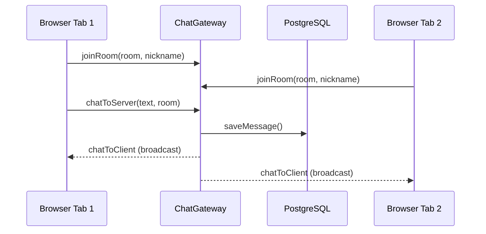

# title
Socket.IO Realtime Chat

# description
Hands-on building a realtime chat system with Socket.IO and NestJS, persisting messages to PostgreSQL, and partitioning chat rooms.

# body

## 1. Opening

"Users send messages but have to refresh the page to see them — how do we deliver messages instantly?" — a **Senior Engineer** asks during a chat feature review. A **Mid-level Developer** answers: "I'll poll the API every 2 seconds." The answer shows awareness of realtime, but misses depth on **full-duplex communication**: polling creates unnecessary HTTP overhead — **WebSocket** opens a persistent connection, enabling the server to push events to clients instantly without re-requesting.

This lesson runs through two tracks:
- **Part 2.1**: **hands-on**; **stack** is **NestJS** + **PostgreSQL** (Docker) + **Socket.IO**, tested via the **HTML client** (`.clients/index.html`) with **two flows** (join room + send message).
- **Part 2.2**: **theory** clarifying **WebSocket**, **Socket.IO rooms**, **event-driven architecture**, and **edge cases**.

## 2. Core concepts

The lesson structure follows **practice-led theory**. First, learners clone the source, start **PostgreSQL** via **Docker Compose**, run **NestJS** via `nest start --watch`, and open the **HTML client** on **two browser tabs** to observe realtime chat through Socket.IO rooms. Then the **theory** section analyzes the WebSocket protocol, room partitioning, and **edge cases**.

### 2.1. Hands-on

#### 2.1.1. Prepare source code and environment

Source: [StarCi-Academy/fullstack-mastery-module-5-websocket-and-realtime-communication](https://github.com/StarCi-Academy/fullstack-mastery-module-5-websocket-and-realtime-communication) on GitHub — lesson directory: [`0-socketio-realtime-chat`](https://github.com/StarCi-Academy/fullstack-mastery-module-5-websocket-and-realtime-communication/tree/main/0-socketio-realtime-chat).

```bash
# Step 1: Clone the repository to local machine
git clone https://github.com/StarCi-Academy/fullstack-mastery-module-5-websocket-and-realtime-communication.git

# Step 2: Navigate to the correct lesson directory
cd fullstack-mastery-module-5-websocket-and-realtime-communication/0-socketio-realtime-chat
```

#### 2.1.2. Architecture / components (stack + flow)

| Component | File | Role |
| --- | --- | --- |
| **HTML Client** | `.clients/index.html` | UI chat, connects via Socket.IO |
| **PostgreSQL** | `.docker/compose.yaml` | Stores messages |
| **ChatGateway** | `src/modules/chat/chat.gateway.ts` | `joinRoom`, `chatToServer`, broadcast `chatToClient` |
| **ChatService** | `src/modules/chat/chat.service.ts` | Persists messages to DB |
| **ChatMessage** | `src/modules/chat/entities/chat-message.entity.ts` | TypeORM entity |



#### 2.1.3. Prerequisites and startup

##### 2.1.3.1. Prerequisites

- **Node.js** LTS, **npm**, **NestJS CLI**, **Docker Desktop**.
- **VS Code** with the **[Live Server](https://marketplace.visualstudio.com/items?itemName=ritwickdey.LiveServer)** extension installed (to serve the HTML client).
- A modern browser (Chrome, Firefox, Edge) with **two tabs**.

> **Note:** The repo ships with env defaults via **ConfigModule**; you do not need to create or edit **.env** when running the system. Only modify this file if you want to run the service with custom ports/credentials.

##### 2.1.3.2. Start

```bash
# Step 1: Start PostgreSQL
docker compose -f .docker/compose.yaml up -d

# Step 2: Install dependencies
npm install

# Step 3: Start in watch mode
nest start --watch
```

After `nest start --watch`, open `.clients/index.html` in VS Code, right-click the file and select **"Open with Live Server"**. The client auto-connects to `http://localhost:3000`.

#### 2.1.4. Verification (UI Client)

Open the file `.clients/index.html` in **two browser tabs** — each tab simulates one user. All operations are performed on the UI.

##### 2.1.4.1. Flow 1 — Join Room and Send Messages

**Tab 1 — User A joins room:**
1. Field **"Your Nickname"**: type `Alice`.
2. Field **"Room Name"**: type `general`.
3. Click **"Join Room"**.

The lobby disappears. The chat screen shows header **Room: general** and **You are Alice**. The input field is focused and ready.

**Tab 2 — User B joins the same room:**
1. Open a second tab, load `index.html` again (right-click → **"Open with Live Server"** in VS Code).
2. Field **"Your Nickname"**: type `Bob`. Field **"Room Name"**: type `general`.
3. Click **"Join Room"**.

On **Tab 1**: a green system message appears — `Bob joined the room.` This confirms the `roomToClient` event with `kind: "join"` was broadcast by the server.

**Behind the scenes — `ChatGateway.handleJoinRoom()`:** the server calls `client.join(room)` to add the socket to the Socket.IO room, then emits `roomToClient` to all other clients in the room via `client.to(room).emit()`.

**Tab 1 — Alice sends a message:**
1. Type `Hello Bob!` in the message input.
2. Click **"Send"** (or press **Enter**).

On **Tab 1** (Alice): the message appears on the **right** side (dark blue bubble — "mine"), with a timestamp below.

On **Tab 2** (Bob): the message appears on the **left** side (grey bubble — "other"), with the sender name `Alice` shown above the text.

**Behind the scenes — `ChatGateway.handleChatToServer()`:** the server validates the payload via `ValidationPipe`, calls `ChatService.saveMessage()` to persist the message in PostgreSQL, then broadcasts `chatToClient` to all clients in the room via `this.server.to(room).emit()`.

##### 2.1.4.2. Flow 2 — Room Isolation and Disconnect

**Tab 3 — different room:**
1. Open a third tab, enter nickname `Charlie`, room `private-room`.
2. Click **"Join Room"**, then send a message.

On **Tab 1** and **Tab 2** (room `general`): **no message from Charlie** appears. This confirms Socket.IO rooms partition broadcast scope correctly.

**Tab 2 — Bob leaves:**
1. Click **"Leave Room"** on Tab 2.

On **Tab 1** (Alice): an orange system message appears — `Bob left the room.` This confirms `handleDisconnect()` emits a `roomToClient` event with `kind: "leave"`.

*If the UI behavior matches:*

- *Socket.IO room — messages only broadcast within the same room.*
- *Persistence — all messages saved to PostgreSQL via ChatService (verify by reconnecting — messages persist across sessions).*
- *Disconnect events — server notifies remaining room members when a client leaves.*

#### 2.1.5. Cleanup

When you are done, tear down to free resources.

```bash
# Step 1: Stop the running server
# Windows / macOS / Linux
Ctrl + C

# Step 2: Close Docker (if the lesson uses Docker)
docker compose -f .docker/compose.yaml down -v
```

#### 2.1.6. Further reading

- **Socket.IO:** Event-driven realtime framework. ([Socket.IO Docs](https://socket.io/docs/v4/))
- **NestJS WebSockets:** Gateway + Socket.IO adapter. ([NestJS Docs](https://docs.nestjs.com/websockets/gateways))
- **WebSocket Protocol:** RFC 6455. ([RFC 6455](https://datatracker.ietf.org/doc/html/rfc6455))

### 2.2. Theory — WebSocket and Socket.IO

#### 2.2.1. HTTP Polling vs WebSocket

| HTTP Polling | WebSocket |
| --- | --- |
| Client polls continuously | Server pushes instantly |
| HTTP header overhead per request | 1 persistent connection |
| Latency = polling interval | Latency ≈ 0 |

#### 2.2.2. Socket.IO Rooms

- **Room** = logical namespace — server `join(room)` → `to(room).emit()` only sends to clients in the room.
- **Default room:** each socket has its own room = `socket.id`.

#### 2.2.3. Edge cases to internalize

- **Client disconnect without cleanup:** Socket leaves room but doesn't notify. **Fix:** handle `handleDisconnect` → emit leave event.
- **Non-existent room:** Joining a room that doesn't exist. **Fix:** Socket.IO auto-creates rooms on join — no pre-creation needed.
- **Message ordering:** Multiple clients send simultaneously. **Fix:** store `createdAt` in DB, sort by timestamp.
- **Broadcast storm:** Large room → many emits. **Fix:** pagination or throttle events.

## 3. Wrap-up

### 3.1. Common interview questions

- **Question 1:** How does WebSocket differ from HTTP request/response?
  - Sample answer: WebSocket is full-duplex persistent connection; HTTP is half-duplex request/response.

- **Question 2:** What are Socket.IO rooms used for?
  - Sample answer: Partition broadcast scope — only send events to clients within the same room.

- **Question 3:** Should chat messages be persisted to a database?
  - Sample answer: Yes. WebSocket is just transport — if server restarts, messages are lost. DB ensures persistence.

# references
## 0
### alias
Socket.IO Documentation
### url
https://socket.io/docs/v4/
## 1
### alias
NestJS WebSockets
### url
https://docs.nestjs.com/websockets/gateways

# minutesRead
18
