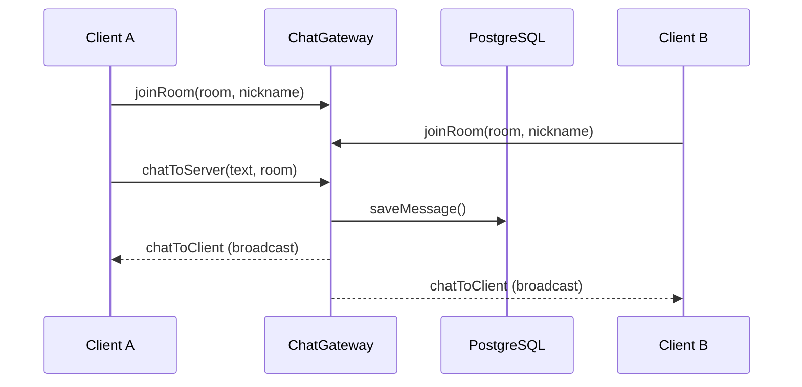

# title
Socket.IO Realtime Chat

# description
Thực hành xây dựng hệ thống chat realtime với Socket.IO và NestJS, lưu trữ tin nhắn vào PostgreSQL, phân chia phòng chat bằng room.

# body

## 1. Lời mở đầu

"User gửi tin nhắn nhưng phải refresh trang mới thấy — làm sao để nhận tin tức thì?" — một **Senior Engineer** hỏi khi review chat feature. Một **Mid-level Developer** trả lời: "Em sẽ poll API mỗi 2 giây." Câu trả lời cho thấy nhận thức về realtime, nhưng vẫn thiếu chiều sâu về **full-duplex communication**: polling tạo overhead HTTP không cần thiết — **WebSocket** mở kết nối persistent, server push event tới client tức thì mà không cần client hỏi lại.

Bài này dẫn qua hai mạch liên tiếp:
- **Phần 2.1**: **thực hành**; **stack** gồm **NestJS** + **PostgreSQL** (Docker) + **Socket.IO**, kèm **hai luồng** kiểm thử (joinRoom + chatToServer).
- **Phần 2.2**: **lý thuyết** làm rõ bản chất **WebSocket**, **Socket.IO rooms**, **event-driven architecture**, và các **edge case**.

## 2. Các khái niệm cốt lõi

Cấu trúc bài học áp dụng phương pháp **Thực hành dẫn dắt Lý thuyết**. Khởi đầu, học viên clone source, khởi động **PostgreSQL** bằng **Docker Compose**, chạy **NestJS** bằng `nest start --watch` và kết nối WebSocket để quan sát realtime chat qua Socket.IO rooms. Tiếp theo, **phần lý thuyết** phân tích WebSocket protocol, room partitioning và các **edge cases**.

### 2.1. Thực hành

#### 2.1.1. Chuẩn bị source code và môi trường

Source: [StarCi-Academy/fullstack-mastery-module-5-websocket-and-realtime-communication](https://github.com/StarCi-Academy/fullstack-mastery-module-5-websocket-and-realtime-communication) trên GitHub — thư mục bài học: [`0-socketio-realtime-chat`](https://github.com/StarCi-Academy/fullstack-mastery-module-5-websocket-and-realtime-communication/tree/main/0-socketio-realtime-chat).

```bash
# Bước 1: Clone repository về máy local
git clone https://github.com/StarCi-Academy/fullstack-mastery-module-5-websocket-and-realtime-communication.git

# Bước 2: Di chuyển vào đúng thư mục bài học
cd fullstack-mastery-module-5-websocket-and-realtime-communication/0-socketio-realtime-chat
```

#### 2.1.2. Kiến trúc/thành phần (stack + luồng)

| Thành phần | File | Vai trò |
| --- | --- | --- |
| **PostgreSQL** | `.docker/compose.yaml` | Lưu trữ tin nhắn |
| **ChatGateway** | `src/modules/chat/chat.gateway.ts` | `joinRoom`, `chatToServer`, broadcast `chatToClient` |
| **ChatService** | `src/modules/chat/chat.service.ts` | Persist message vào DB |
| **ChatMessage** | `src/modules/chat/entities/chat-message.entity.ts` | TypeORM entity |



#### 2.1.3. Chuẩn bị & khởi chạy

##### 2.1.3.1. Điều kiện cần trước

- **Node.js** LTS, **npm**, **NestJS CLI**, **Docker Desktop**.
- **Windows:** các lệnh API dùng **`Invoke-RestMethod`** (PowerShell). Xem song song **`curl`** cho macOS / Linux.

##### 2.1.3.2. Khởi động

```bash
# Bước 1: Khởi động PostgreSQL
docker compose -f .docker/compose.yaml up -d

# Bước 2: Cài dependency
npm install

# Bước 3: Khởi chạy ở chế độ watch
nest start --watch
```

#### 2.1.4. Kiểm thử

WebSocket không dùng `curl`/`Invoke-RestMethod` trực tiếp. Dùng **2 tab trình duyệt** mở file `index.html` (nếu có) hoặc dùng **wscat**:

##### 2.1.4.1. Luồng 1 — joinRoom + chatToServer (wscat)

  ```bash
  # Windows (PowerShell) — cài wscat
  npm install -g wscat

  # Terminal 1: Client A
  wscat -c ws://localhost:3000
  > {"event":"joinRoom","data":{"room":"general","nickname":"Alice"}}

  # Terminal 2: Client B
  wscat -c ws://localhost:3000
  > {"event":"joinRoom","data":{"room":"general","nickname":"Bob"}}

  # Client A gửi tin
  > {"event":"chatToServer","data":{"text":"Hello from Alice!","room":"general"}}
  ```

  Client B nhận event `chatToClient`: `{ "nickname": "Alice", "text": "Hello from Alice!", "room": "general", ... }`.

##### 2.1.4.2. Luồng 2 — Kiểm tra persistence

  ```bash
  # Windows (PowerShell)
  Invoke-RestMethod -Uri http://localhost:3000/chat/messages

  # macOS / Linux
  curl -s http://localhost:3000/chat/messages
  ```

  Response: mảng tin nhắn đã lưu trong PostgreSQL.

*Kết luận:*

- *Socket.IO room — tin nhắn chỉ broadcast trong cùng room.*
- *Persistence — mọi tin nhắn được lưu PostgreSQL qua ChatService.*

#### 2.1.5. Dọn tài nguyên

Sau khi kết thúc bài, bạn có thể dọn tài nguyên để tiết kiệm bộ nhớ.

```bash
# Bước 1: Dừng server đang chạy
# Windows / macOS / Linux
Ctrl + C

# Bước 2: Đóng Docker (nếu bài học có dùng Docker)
docker compose -f .docker/compose.yaml down -v
```

#### 2.1.6. Đọc thêm

- **Socket.IO:** Event-driven realtime framework. ([Socket.IO Docs](https://socket.io/docs/v4/))
- **NestJS WebSockets:** Gateway + Socket.IO adapter. ([NestJS Docs](https://docs.nestjs.com/websockets/gateways))
- **WebSocket Protocol:** RFC 6455. ([RFC 6455](https://datatracker.ietf.org/doc/html/rfc6455))

### 2.2. Lý thuyết — WebSocket và Socket.IO

#### 2.2.1. HTTP Polling vs WebSocket

| HTTP Polling | WebSocket |
| --- | --- |
| Client hỏi liên tục | Server push tức thì |
| Overhead HTTP header mỗi request | 1 kết nối persistent |
| Latency = polling interval | Latency ≈ 0 |

#### 2.2.2. Socket.IO Rooms

- **Room** = namespace logic — server `join(room)` → `to(room).emit()` chỉ gửi cho client trong room.
- **Default room:** mỗi socket có room riêng = `socket.id`.

#### 2.2.3. Các trường hợp biên (edge cases) cần lưu ý

- **Client disconnect không cleanup:** Socket rời room nhưng không notify. **Giải pháp:** handle `handleDisconnect` → emit leave event.
- **Room không tồn tại:** Join room chưa có. **Giải pháp:** Socket.IO tự tạo room khi join — không cần tạo trước.
- **Message ordering:** Nhiều client gửi cùng lúc. **Giải pháp:** lưu `createdAt` trong DB, sort theo timestamp.
- **Broadcast storm:** Room lớn → nhiều emit. **Giải pháp:** pagination hoặc throttle events.

## 3. Tổng kết

### 3.1. Các câu hỏi dễ bị phỏng vấn

- **Câu hỏi 1:** WebSocket khác HTTP request/response thế nào?
  - Trả lời mẫu: WebSocket là full-duplex persistent connection; HTTP là half-duplex request/response.

- **Câu hỏi 2:** Socket.IO room dùng để làm gì?
  - Trả lời mẫu: Phân chia broadcast scope — chỉ gửi event cho client trong cùng room.

- **Câu hỏi 3:** Có cần lưu tin nhắn vào database không?
  - Trả lời mẫu: Có. WebSocket chỉ là transport — nếu server restart, tin nhắn mất. DB đảm bảo persistence.

# references
## 0
### alias
Socket.IO Documentation
### url
https://socket.io/docs/v4/
## 1
### alias
NestJS WebSockets
### url
https://docs.nestjs.com/websockets/gateways

# minutesRead
18
