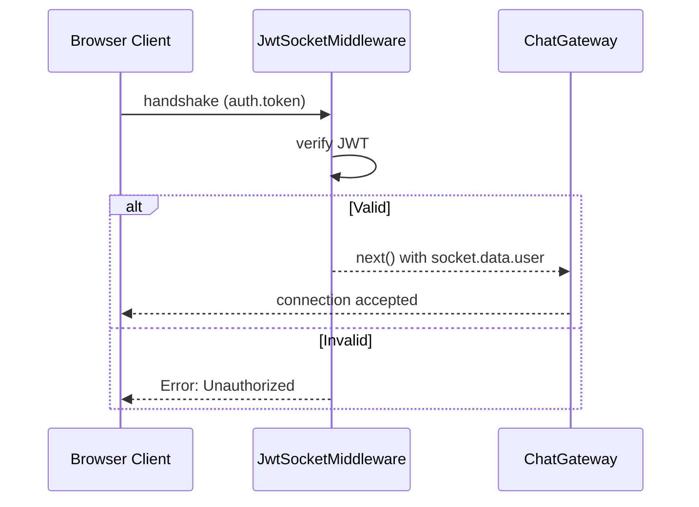

# title
Socket.IO Security with JWT

# description
Hands-on integrating JWT authentication into WebSocket handshake via custom middleware in NestJS, ensuring only logged-in users can connect.

# body

## 1. Opening

"Chat works well — but anyone can connect without logging in?" — a **Senior Engineer** asks during security review. A **Mid-level Developer** answers: "I'll check the token in every message handler." The answer shows awareness of auth, but misses depth on **connection-level security**: checking tokens per message → repeated overhead — **JWT middleware** on handshake rejects the connection upfront if the token is invalid.

This lesson runs through two tracks:
- **Part 2.1**: **hands-on**; **stack** is **NestJS** + **PostgreSQL** (Docker) + **Socket.IO** + **JWT**, tested via the **HTML client** (`.clients/index.html`) with **two flows** (register/login → connect with token; connect without token → reject).
- **Part 2.2**: **theory** clarifying **JWT Socket middleware**, **token extraction**, and **edge cases**.

## 2. Core concepts

The lesson structure follows **practice-led theory**. First, learners clone the source, start **PostgreSQL** via **Docker Compose**, run **NestJS** via `nest start --watch`, and open the **HTML client** to register/login, obtain a JWT, then connect via WebSocket with the token to observe connection-level auth. Then the **theory** section analyzes JWT Socket middleware and **edge cases**.

### 2.1. Hands-on

#### 2.1.1. Prepare source code and environment

Source: [StarCi-Academy/fullstack-mastery-module-5-websocket-and-realtime-communication](https://github.com/StarCi-Academy/fullstack-mastery-module-5-websocket-and-realtime-communication) on GitHub — lesson directory: [`1-socketio-security-jwt`](https://github.com/StarCi-Academy/fullstack-mastery-module-5-websocket-and-realtime-communication/tree/main/1-socketio-security-jwt).

```bash
# Step 1: Clone the repository to local machine
git clone https://github.com/StarCi-Academy/fullstack-mastery-module-5-websocket-and-realtime-communication.git

# Step 2: Navigate to the correct lesson directory
cd fullstack-mastery-module-5-websocket-and-realtime-communication/1-socketio-security-jwt
```

#### 2.1.2. Architecture / components

| Component | File | Role |
| --- | --- | --- |
| **HTML Client** | `.clients/index.html` | Auth UI + Chat UI, connects via Socket.IO |
| **PostgreSQL** | `.docker/compose.yaml` | Stores users |
| **AuthController** | `src/modules/auth/auth.controller.ts` | register, login → JWT |
| **JwtSocketMiddleware** | `src/modules/chat/jwt-socket.middleware.ts` | Verifies token on handshake |
| **ChatGateway** | `src/modules/chat/chat.gateway.ts` | afterInit → registers middleware |



#### 2.1.3. Prerequisites and startup

##### 2.1.3.1. Prerequisites

- **Node.js** LTS, **npm**, **NestJS CLI**, **Docker Desktop**.
- **VS Code** with the **[Live Server](https://marketplace.visualstudio.com/items?itemName=ritwickdey.LiveServer)** extension installed (to serve the HTML client).
- A modern browser (Chrome, Firefox, Edge) with **two tabs**.

> **Note:** The repo ships with env defaults via **ConfigModule**; you do not need to create or edit **.env** when running the system. Only modify this file if you want to run the service with custom ports/credentials.

##### 2.1.3.2. Start

```bash
# Step 1: Start PostgreSQL
docker compose -f .docker/compose.yaml up -d

# Step 2: Install dependencies
npm install

# Step 3: Start in watch mode
nest start --watch
```

After `nest start --watch`, open `.clients/index.html` in VS Code, right-click the file and select **"Open with Live Server"**. The status indicator initially shows **"Not connected"**.

#### 2.1.4. Verification (UI Client)

Open the file `.clients/index.html` via **Live Server** in **two browser tabs** — each tab simulates one user. All operations are performed on the UI.

##### 2.1.4.1. Flow 1 — Connect without token → Reject

**Tab 1 — No login, click Connect:**
1. Without filling in any credentials, click the **"Connect"** button.

The status dot turns **red**. Status text displays: `Error: <auth error message>`. The **"Join Room"** button remains **disabled** — no chat access without authentication.

**Behind the scenes — `JwtSocketMiddleware`:** the middleware runs on every Socket.IO handshake via `server.use()`. It extracts `socket.handshake.auth.token`, verifies it with `JwtService.verify()`. If the token is missing or invalid, it calls `next(new Error(...))` which immediately rejects the connection.

##### 2.1.4.2. Flow 2 — Register, Login, and Chat

**Tab 1 — Register a new account:**
1. Click the **"Register"** tab in the Authentication section.
2. Field **"Username"**: type `alice`. Field **"Password"**: type `secret123`.
3. Click **"Create Account"**.

Alert: `Registration successful!`. The **Access Token (JWT)** textarea auto-fills with a JWT string. The status dot turns **green**, text: `Connected: <socket-id>`. The **"Join Room"** button becomes **enabled**.

**Behind the scenes — `AuthService.register()`:** the server hashes the password with `bcrypt`, saves the user to PostgreSQL, then signs a JWT containing `{ sub: userId, username }` and returns it as `access_token`. The client then auto-connects a Socket.IO instance with `auth: { token }`.

**Tab 1 — Alice joins a room:**
1. Field **"Room Name"**: keep default `general` or type any room name.
2. Click **"Join Room"**.

The lobby disappears. The chat screen shows header **Room: general** and **You are alice**. A system message appears confirming the room join.

**Tab 2 — Register Bob and join the same room:**
1. Open a second tab (right-click `index.html` → **"Open with Live Server"**).
2. Register tab → Username: `bob`, Password: `secret123` → **"Create Account"**.
3. Wait for green dot → Room: `general` → **"Join Room"**.

Tab 2 enters the chat screen as **bob**.

**Tab 1 — Alice sends a message:**
1. Type `Hello bob, secure chat works!` in the message input.
2. Click **"Send"** (or press **Enter**).

On **Tab 1** (alice): message appears on the **right** (dark blue bubble — "mine").

On **Tab 2** (bob): message appears on the **left** (grey bubble — "other"), with sender name `alice` shown above. The username is extracted from the JWT on the server side — the client never sends it directly.

**Behind the scenes — `ChatGateway.handleChat()`:** the server reads `client.data.user.username` (set by the middleware during handshake), builds the payload with the trusted identity, and broadcasts `chatToClient` to all clients in the room via `this.server.to(room).emit()`.

**Tab 2 — Bob replies:**
1. Type `Hi alice!`, click **"Send"**.

Tab 2: message on the right (mine). Tab 1: message on the left (other) with sender `bob`.

**Tab 2 — Leave room:**
1. Click **"Leave Room"**. The page reloads back to the lobby.

*If the UI behavior matches:*

- *Connection-level auth — JWT verified on handshake, not per message.*
- *socket.data.user — identity attached once by middleware, used throughout socket lifetime.*
- *Unauthenticated connections rejected immediately with red status indicator.*

#### 2.1.5. Cleanup

When you are done, tear down to free resources.

```bash
# Step 1: Stop the running server
# Windows / macOS / Linux
Ctrl + C

# Step 2: Close Docker (if the lesson uses Docker)
docker compose -f .docker/compose.yaml down -v
```

#### 2.1.6. Further reading

- **Socket.IO Middlewares:** Custom middleware on handshake. ([Socket.IO Docs](https://socket.io/docs/v4/middlewares/))
- **NestJS WebSockets:** Gateway lifecycle. ([NestJS Docs](https://docs.nestjs.com/websockets/gateways))

### 2.2. Theory — JWT Socket Middleware

#### 2.2.1. Token Extraction Priority

| Location | Usage | When |
| --- | --- | --- |
| `handshake.auth.token` | Browser SDK `io(url, { auth: { token } })` | Most common |
| `headers.authorization` | Node client / curl | Server-side |
| `query.token` | URL query string | Fallback |

#### 2.2.2. Edge cases to internalize

- **Token expired mid-session:** JWT expires but socket stays connected. **Fix:** periodic re-auth or server-side token refresh event.
- **Missing token location:** Client sends token in wrong place. **Fix:** extract from multiple sources (auth > header > query).
- **Replay attack:** Old token reused. **Fix:** short expiry + jti claim.
- **CORS + WebSocket:** Browser blocks cross-origin WS. **Fix:** configure `cors: { origin: true }` in gateway.

## 3. Wrap-up

### 3.1. Common interview questions

- **Question 1:** Why verify JWT on handshake instead of per message?
  - Sample answer: Handshake occurs once; per-message verification creates unnecessary overhead.

- **Question 2:** Token expired but socket still connected — how to handle?
  - Sample answer: Server emits event requesting re-auth; or disconnect + reconnect.

- **Question 3:** Does WebSocket need CORS?
  - Sample answer: Yes. Browsers enforce same-origin policy for WebSocket upgrade requests.

# references
## 0
### alias
Socket.IO Middlewares
### url
https://socket.io/docs/v4/middlewares/
## 1
### alias
NestJS WebSockets
### url
https://docs.nestjs.com/websockets/gateways

# minutesRead
16
