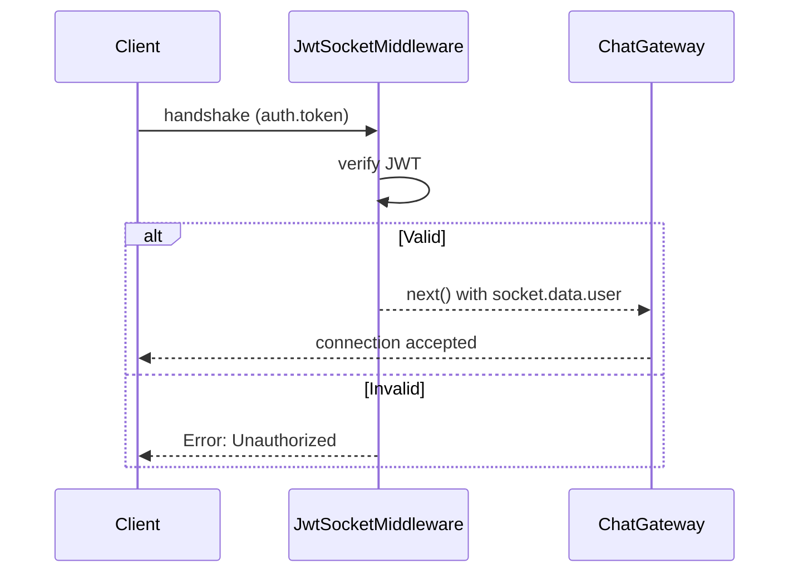

# title
Socket.IO Security with JWT

# description
Hands-on integrating JWT authentication into WebSocket handshake via custom middleware in NestJS, ensuring only logged-in users can connect.

# body

## 1. Opening

"Chat works well — but anyone can connect without logging in?" — a **Senior Engineer** asks during security review. A **Mid-level Developer** answers: "I'll check the token in every message handler." The answer shows awareness of auth, but misses depth on **connection-level security**: checking tokens per message → repeated overhead — **JWT middleware** on handshake rejects the connection upfront if the token is invalid.

This lesson runs through two tracks:
- **Part 2.1**: **hands-on**; **stack** is **NestJS** + **PostgreSQL** (Docker) + **Socket.IO** + **JWT**, with **two flows** (register/login → connect with token; connect without token → reject).
- **Part 2.2**: **theory** clarifying **JWT Socket middleware**, **token extraction**, and **edge cases**.

## 2. Core concepts

The lesson structure follows **practice-led theory**. First, learners clone the source, start **PostgreSQL** via **Docker Compose**, run **NestJS** via `nest start --watch`, register/login to obtain a JWT, then connect via WebSocket with the token to observe connection-level auth. Then the **theory** section analyzes JWT Socket middleware and **edge cases**.

### 2.1. Hands-on

#### 2.1.1. Prepare source code and environment

Source: [StarCi-Academy/fullstack-mastery-module-5-websocket-and-realtime-communication](https://github.com/StarCi-Academy/fullstack-mastery-module-5-websocket-and-realtime-communication) on GitHub — lesson directory: [`1-socketio-security-jwt`](https://github.com/StarCi-Academy/fullstack-mastery-module-5-websocket-and-realtime-communication/tree/main/1-socketio-security-jwt).

```bash
# Step 1: Clone the repository locally
git clone https://github.com/StarCi-Academy/fullstack-mastery-module-5-websocket-and-realtime-communication.git

# Step 2: Navigate to the lesson directory
cd fullstack-mastery-module-5-websocket-and-realtime-communication/1-socketio-security-jwt
```

#### 2.1.2. Architecture / components

| Component | File | Role |
| --- | --- | --- |
| **PostgreSQL** | `.docker/compose.yaml` | Stores users |
| **AuthController** | `src/modules/auth/auth.controller.ts` | register, login → JWT |
| **JwtSocketMiddleware** | `src/modules/chat/jwt-socket.middleware.ts` | Verifies token on handshake |
| **ChatGateway** | `src/modules/chat/chat.gateway.ts` | afterInit → registers middleware |



#### 2.1.3. Prerequisites and startup

##### 2.1.3.1. Prerequisites

- **Node.js** LTS, **npm**, **NestJS CLI**, **Docker Desktop**.
- **Windows:** API commands use **`Invoke-RestMethod`** (PowerShell). See parallel **`curl`** for macOS / Linux.

##### 2.1.3.2. Start

```bash
# Step 1: Start PostgreSQL
docker compose -f .docker/compose.yaml up -d

# Step 2: Install dependencies
npm install

# Step 3: Start in watch mode
nest start --watch
```

#### 2.1.4. Verification

##### 2.1.4.1. Flow 1 — Register + Login + Connect with token

  ```bash
  # Windows (PowerShell)
  Invoke-RestMethod -Uri http://localhost:3000/auth/register -Method Post -ContentType "application/json" -Body '{"username":"alice","password":"secret123"}'
  $res = Invoke-RestMethod -Uri http://localhost:3000/auth/login -Method Post -ContentType "application/json" -Body '{"username":"alice","password":"secret123"}'
  $res.access_token

  # macOS / Linux
  curl -s -X POST http://localhost:3000/auth/register -H "Content-Type: application/json" -d '{"username":"alice","password":"secret123"}'
  curl -s -X POST http://localhost:3000/auth/login -H "Content-Type: application/json" -d '{"username":"alice","password":"secret123"}'
  ```

  Response: `{ "access_token": "<JWT>" }`.

  Connect WebSocket with token:

  ```bash
  wscat -c "ws://localhost:3000?token=<JWT>"
  ```

  Connection accepted → terminal log shows successful auth.

##### 2.1.4.2. Flow 2 — Connect without token → Reject

  ```bash
  wscat -c ws://localhost:3000
  ```

  Connection rejected: `error: Unauthorized: invalid token`.

*If the responses match:*

- *Connection-level auth — JWT verified on handshake, not per message.*
- *socket.data.user — identity attached once, used throughout lifetime.*

#### 2.1.5. Cleanup

When you are done, tear down to free resources.

```bash
# Step 1: Stop the running server
# Windows / macOS / Linux
Ctrl + C

# Step 2: Close Docker (if the lesson uses Docker)
docker compose -f .docker/compose.yaml down -v
```

#### 2.1.6. Further reading

- **Socket.IO Middlewares:** Custom middleware on handshake. ([Socket.IO Docs](https://socket.io/docs/v4/middlewares/))
- **NestJS WebSockets:** Gateway lifecycle. ([NestJS Docs](https://docs.nestjs.com/websockets/gateways))

### 2.2. Theory — JWT Socket Middleware

#### 2.2.1. Token Extraction Priority

| Location | Usage | When |
| --- | --- | --- |
| `handshake.auth.token` | Browser SDK `io(url, { auth: { token } })` | Most common |
| `headers.authorization` | Node client / curl | Server-side |
| `query.token` | URL query string | Fallback |

#### 2.2.2. Edge cases to internalize

- **Token expired mid-session:** JWT expires but socket stays connected. **Fix:** periodic re-auth or server-side token refresh event.
- **Missing token location:** Client sends token in wrong place. **Fix:** extract from multiple sources (auth > header > query).
- **Replay attack:** Old token reused. **Fix:** short expiry + jti claim.
- **CORS + WebSocket:** Browser blocks cross-origin WS. **Fix:** configure `cors: { origin: true }` in gateway.

## 3. Wrap-up

### 3.1. Common interview questions

- **Question 1:** Why verify JWT on handshake instead of per message?
  - Sample answer: Handshake occurs once; per-message verification creates unnecessary overhead.

- **Question 2:** Token expired but socket still connected — how to handle?
  - Sample answer: Server emits event requesting re-auth; or disconnect + reconnect.

- **Question 3:** Does WebSocket need CORS?
  - Sample answer: Yes. Browsers enforce same-origin policy for WebSocket upgrade requests.

# references
## 0
### alias
Socket.IO Middlewares
### url
https://socket.io/docs/v4/middlewares/
## 1
### alias
NestJS WebSockets
### url
https://docs.nestjs.com/websockets/gateways

# minutesRead
16
