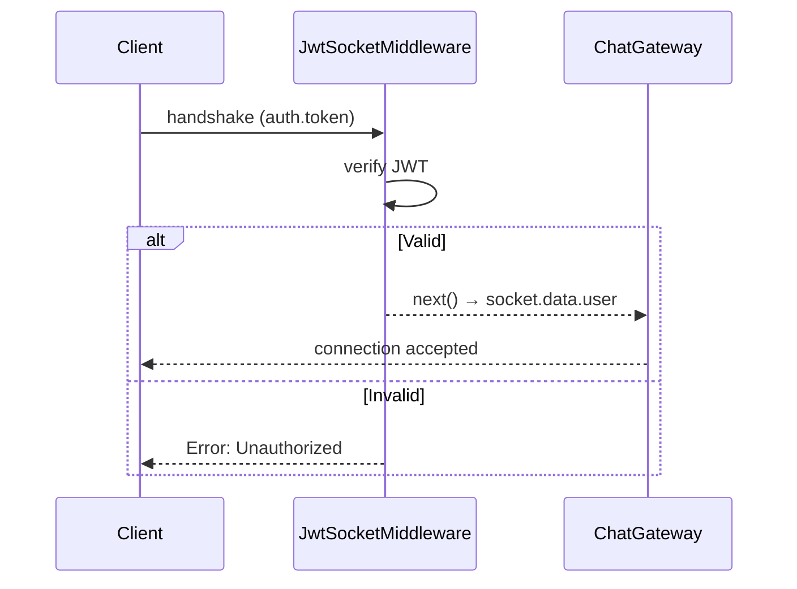

# title
Bảo mật Socket.IO với JWT

# description
Thực hành tích hợp xác thực JWT vào WebSocket handshake bằng custom middleware trong NestJS, đảm bảo chỉ user đã đăng nhập mới kết nối được.

# body

## 1. Lời mở đầu

"Chat hoạt động tốt — nhưng ai cũng kết nối được mà không cần đăng nhập?" — một **Senior Engineer** hỏi khi review security. Một **Mid-level Developer** trả lời: "Em sẽ check token trong mỗi message handler." Câu trả lời cho thấy nhận thức về auth, nhưng vẫn thiếu chiều sâu về **connection-level security**: check token mỗi message → overhead lặp lại — **JWT middleware** trên handshake reject kết nối ngay từ đầu nếu token không hợp lệ.

Bài này dẫn qua hai mạch liên tiếp:
- **Phần 2.1**: **thực hành**; **stack** gồm **NestJS** + **PostgreSQL** (Docker) + **Socket.IO** + **JWT**, kèm **hai luồng** (register/login → connect với token; connect không token → reject).
- **Phần 2.2**: **lý thuyết** làm rõ **JWT Socket middleware**, **token extraction**, và các **edge case**.

## 2. Các khái niệm cốt lõi

Cấu trúc bài học áp dụng phương pháp **Thực hành dẫn dắt Lý thuyết**. Khởi đầu, học viên clone source, khởi động **PostgreSQL** bằng **Docker Compose**, chạy **NestJS** bằng `nest start --watch`, đăng ký/đăng nhập lấy JWT rồi kết nối WebSocket với token để quan sát connection-level auth. Tiếp theo, **phần lý thuyết** phân tích JWT Socket middleware và các **edge cases**.

### 2.1. Thực hành

#### 2.1.1. Chuẩn bị source code và môi trường

Source: [StarCi-Academy/fullstack-mastery-module-5-websocket-and-realtime-communication](https://github.com/StarCi-Academy/fullstack-mastery-module-5-websocket-and-realtime-communication) — thư mục: [`1-socketio-security-jwt`](https://github.com/StarCi-Academy/fullstack-mastery-module-5-websocket-and-realtime-communication/tree/main/1-socketio-security-jwt).

```bash
# Bước 1: Clone repository về máy local
git clone https://github.com/StarCi-Academy/fullstack-mastery-module-5-websocket-and-realtime-communication.git

# Bước 2: Di chuyển vào đúng thư mục bài học
cd fullstack-mastery-module-5-websocket-and-realtime-communication/1-socketio-security-jwt
```

#### 2.1.2. Kiến trúc/thành phần (stack + luồng)

| Thành phần | File | Vai trò |
| --- | --- | --- |
| **PostgreSQL** | `.docker/compose.yaml` | Lưu trữ users |
| **AuthController** | `src/modules/auth/auth.controller.ts` | register, login → JWT |
| **JwtSocketMiddleware** | `src/modules/chat/jwt-socket.middleware.ts` | Verify token trên handshake |
| **ChatGateway** | `src/modules/chat/chat.gateway.ts` | afterInit → register middleware |



#### 2.1.3. Chuẩn bị & khởi chạy

##### 2.1.3.1. Điều kiện cần trước

- **Node.js** LTS, **npm**, **NestJS CLI**, **Docker Desktop**.
- **Windows:** các lệnh API dùng **`Invoke-RestMethod`** (PowerShell). Xem song song **`curl`** cho macOS / Linux.

##### 2.1.3.2. Khởi động

```bash
# Bước 1: Khởi động PostgreSQL
docker compose -f .docker/compose.yaml up -d

# Bước 2: Cài dependency
npm install

# Bước 3: Khởi chạy ở chế độ watch
nest start --watch
```

#### 2.1.4. Kiểm thử

##### 2.1.4.1. Luồng 1 — Register + Login + Connect với token

  ```bash
  # Windows (PowerShell)
  Invoke-RestMethod -Uri http://localhost:3000/auth/register -Method Post -ContentType "application/json" -Body '{"username":"alice","password":"secret123"}'
  $res = Invoke-RestMethod -Uri http://localhost:3000/auth/login -Method Post -ContentType "application/json" -Body '{"username":"alice","password":"secret123"}'
  $res.access_token

  # macOS / Linux
  curl -s -X POST http://localhost:3000/auth/register -H "Content-Type: application/json" -d '{"username":"alice","password":"secret123"}'
  curl -s -X POST http://localhost:3000/auth/login -H "Content-Type: application/json" -d '{"username":"alice","password":"secret123"}'
  ```

  Response: `{ "access_token": "<JWT>" }`.

  Kết nối WebSocket với token:

  ```bash
  wscat -c "ws://localhost:3000?token=<JWT>"
  ```

  Kết nối thành công → terminal log hiển thị `Client kết nối thành công`.

##### 2.1.4.2. Luồng 2 — Connect không token → Reject

  ```bash
  wscat -c ws://localhost:3000
  ```

  Kết nối bị từ chối: `error: Unauthorized: invalid token`.

*Kết luận:*

- *Connection-level auth — JWT verify trên handshake, không phải mỗi message.*
- *socket.data.user — identity attach 1 lần, dùng xuyên suốt lifetime.*

#### 2.1.5. Dọn tài nguyên

```bash
docker compose -f .docker/compose.yaml down -v
```

#### 2.1.6. Đọc thêm

- **Socket.IO Middlewares:** Custom middleware trên handshake. ([Socket.IO Docs](https://socket.io/docs/v4/middlewares/))
- **NestJS WebSockets:** Gateway lifecycle. ([NestJS Docs](https://docs.nestjs.com/websockets/gateways))

### 2.2. Lý thuyết — JWT Socket Middleware

#### 2.2.1. Token Extraction Priority

| Vị trí | Cách dùng | Khi nào |
| --- | --- | --- |
| `handshake.auth.token` | Browser SDK `io(url, { auth: { token } })` | Phổ biến nhất |
| `headers.authorization` | Node client / curl | Server-side |
| `query.token` | URL query string | Fallback |

#### 2.2.2. Các trường hợp biên (edge cases) cần lưu ý

- **Token expired giữa session:** JWT hết hạn nhưng socket vẫn connected. **Giải pháp:** periodic re-auth hoặc server-side token refresh event.
- **Missing token location:** Client gửi token sai vị trí. **Giải pháp:** extract từ nhiều source (auth > header > query).
- **Replay attack:** Token cũ bị reuse. **Giải pháp:** short expiry + jti claim.
- **CORS + WebSocket:** Browser block cross-origin WS. **Giải pháp:** configure `cors: { origin: true }` trong gateway.

## 3. Tổng kết

### 3.1. Các câu hỏi dễ bị phỏng vấn

- **Câu hỏi 1:** Vì sao verify JWT trên handshake thay vì mỗi message?
  - Trả lời mẫu: Handshake chỉ xảy ra 1 lần; verify mỗi message tạo overhead không cần thiết.

- **Câu hỏi 2:** Token expired nhưng socket vẫn connected — xử lý thế nào?
  - Trả lời mẫu: Server emit event yêu cầu client re-auth; hoặc disconnect + reconnect.

- **Câu hỏi 3:** WebSocket có cần CORS không?
  - Trả lời mẫu: Có. Browser enforces same-origin cho WebSocket upgrade request.

# references
## 0
### alias
Socket.IO Middlewares
### url
https://socket.io/docs/v4/middlewares/
## 1
### alias
NestJS WebSockets
### url
https://docs.nestjs.com/websockets/gateways

# minutesRead
16
