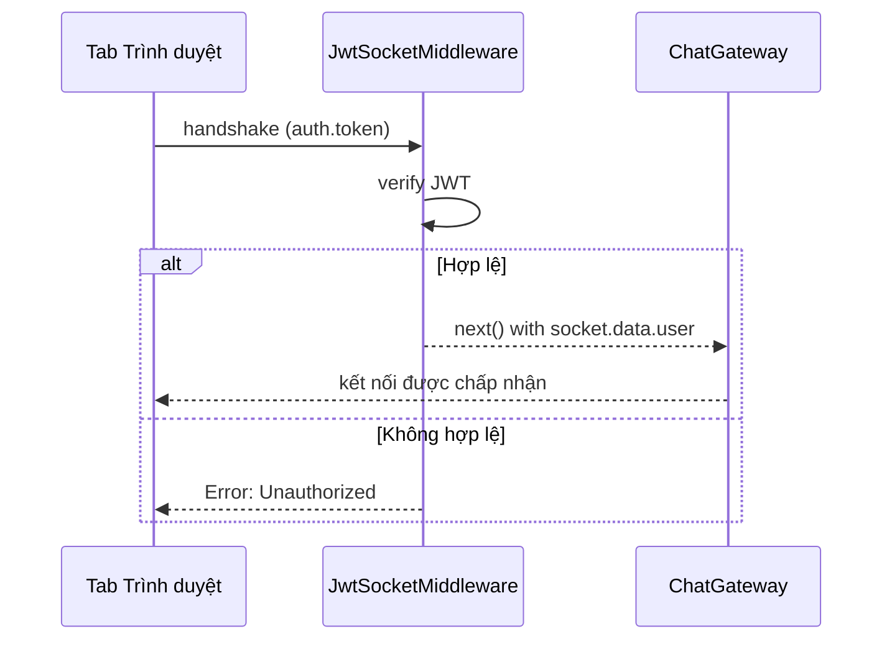

# title
Socket.IO Security với JWT

# description
Thực hành tích hợp xác thực JWT vào WebSocket handshake qua custom middleware trong NestJS, đảm bảo chỉ user đã đăng nhập mới kết nối được.

# body

## 1. Lời mở đầu

"Chat chạy tốt — nhưng ai cũng kết nối được mà không cần đăng nhập?" — một **Senior Engineer** hỏi khi review bảo mật. Một **Mid-level Developer** trả lời: "Em sẽ kiểm tra token trong mỗi message handler." Câu trả lời cho thấy nhận thức về auth, nhưng thiếu chiều sâu về **connection-level security**: kiểm tra token mỗi message → overhead lặp lại — **JWT middleware** trên handshake từ chối kết nối ngay nếu token không hợp lệ.

Bài này dẫn qua hai mạch liên tiếp:
- **Phần 2.1**: **thực hành**; **stack** gồm **NestJS** + **PostgreSQL** (Docker) + **Socket.IO** + **JWT**, kiểm thử qua **HTML client** (`.clients/index.html`) với **hai luồng** (register/login → kết nối có token; kết nối không token → từ chối).
- **Phần 2.2**: **lý thuyết** làm rõ **JWT Socket middleware**, **token extraction**, và các **edge case**.

## 2. Các khái niệm cốt lõi

Cấu trúc bài học áp dụng phương pháp **Thực hành dẫn dắt Lý thuyết**. Khởi đầu, học viên clone source, khởi động **PostgreSQL** bằng **Docker Compose**, chạy **NestJS** bằng `nest start --watch`, rồi mở **HTML client** để register/login lấy JWT, sau đó kết nối WebSocket có token để quan sát connection-level auth. Tiếp theo, **phần lý thuyết** phân tích JWT Socket middleware và các **edge cases**.

### 2.1. Thực hành

#### 2.1.1. Chuẩn bị source code và môi trường

Source: [StarCi-Academy/fullstack-mastery-module-5-websocket-and-realtime-communication](https://github.com/StarCi-Academy/fullstack-mastery-module-5-websocket-and-realtime-communication) trên GitHub — thư mục bài học: [`1-socketio-security-jwt`](https://github.com/StarCi-Academy/fullstack-mastery-module-5-websocket-and-realtime-communication/tree/main/1-socketio-security-jwt).

```bash
# Bước 1: Clone repository về máy local
git clone https://github.com/StarCi-Academy/fullstack-mastery-module-5-websocket-and-realtime-communication.git

# Bước 2: Di chuyển vào đúng thư mục bài học
cd fullstack-mastery-module-5-websocket-and-realtime-communication/1-socketio-security-jwt
```

#### 2.1.2. Kiến trúc/thành phần

| Thành phần | File | Vai trò |
| --- | --- | --- |
| **HTML Client** | `.clients/index.html` | Giao diện Auth + Chat, kết nối qua Socket.IO |
| **PostgreSQL** | `.docker/compose.yaml` | Lưu trữ users |
| **AuthController** | `src/modules/auth/auth.controller.ts` | register, login → JWT |
| **JwtSocketMiddleware** | `src/modules/chat/jwt-socket.middleware.ts` | Xác thực token tại handshake |
| **ChatGateway** | `src/modules/chat/chat.gateway.ts` | afterInit → đăng ký middleware |



#### 2.1.3. Chuẩn bị & khởi chạy

##### 2.1.3.1. Điều kiện cần trước

- **Node.js** LTS, **npm**, **NestJS CLI**, **Docker Desktop**.
- **VS Code** cài extension **[Live Server](https://marketplace.visualstudio.com/items?itemName=ritwickdey.LiveServer)** (để serve file HTML client).
- Trình duyệt hiện đại (Chrome, Firefox, Edge) với **hai tab**.

> **Lưu ý:** Repo đã ship env defaults qua **ConfigModule**; khi chạy hệ thống không cần tạo hay sửa **.env**. Chỉ chỉnh sửa file này khi bạn muốn chạy service với các port/credential khác mặc định.

##### 2.1.3.2. Khởi động

```bash
# Bước 1: Khởi động PostgreSQL
docker compose -f .docker/compose.yaml up -d

# Bước 2: Cài dependency
npm install

# Bước 3: Khởi chạy ở chế độ watch
nest start --watch
```

Sau khi `nest start --watch` chạy xong, mở file `.clients/index.html` trong VS Code, chuột phải vào file rồi chọn **"Open with Live Server"**. Thanh trạng thái ban đầu hiển thị **"Not connected"**.

#### 2.1.4. Kiểm thử (UI Client)

Mở file `.clients/index.html` qua **Live Server** trên **hai tab trình duyệt** — mỗi tab mô phỏng một user. Toàn bộ thao tác thực hiện trên giao diện.

##### 2.1.4.1. Luồng 1 — Kết nối không có token → Từ chối

**Tab 1 — Không đăng nhập, bấm Connect:**
1. Không điền thông tin gì, bấm nút **"Connect"**.

Chấm trạng thái chuyển **đỏ**. Text hiển thị: `Error: <thông báo lỗi auth>`. Nút **"Join Room"** vẫn bị **disabled** — không thể truy cập chat khi chưa xác thực.

**Phía backend — `JwtSocketMiddleware`:** middleware chạy trên mỗi Socket.IO handshake qua `server.use()`. Nó trích xuất `socket.handshake.auth.token`, xác thực bằng `JwtService.verify()`. Nếu token thiếu hoặc không hợp lệ, gọi `next(new Error(...))` từ chối kết nối ngay lập tức.

##### 2.1.4.2. Luồng 2 — Đăng ký, đăng nhập và Chat

**Tab 1 — Đăng ký tài khoản mới:**
1. Bấm tab **"Register"** trong mục Authentication.
2. Ô **"Username"**: gõ `alice`. Ô **"Password"**: gõ `secret123`.
3. Bấm **"Create Account"**.

Alert: `Registration successful!`. Ô **Access Token (JWT)** tự điền chuỗi JWT. Chấm trạng thái chuyển **xanh lá**, text: `Connected: <socket-id>`. Nút **"Join Room"** được **kích hoạt**.

**Phía backend — `AuthService.register()`:** server hash mật khẩu bằng `bcrypt`, lưu user vào PostgreSQL, sau đó ký JWT chứa `{ sub: userId, username }` và trả về dưới dạng `access_token`. Client tự động kết nối Socket.IO với `auth: { token }`.

**Tab 1 — Alice vào phòng:**
1. Ô **"Room Name"**: giữ mặc định `general` hoặc gõ tên phòng bất kỳ.
2. Bấm **"Join Room"**.

Lobby ẩn đi. Màn hình chat hiển thị header **Room: general** và **You are alice**. Thông báo hệ thống xác nhận đã vào phòng.

**Tab 2 — Đăng ký Bob và vào cùng phòng:**
1. Mở tab thứ hai (chuột phải `index.html` → **"Open with Live Server"**).
2. Tab Register → Username: `bob`, Password: `secret123` → **"Create Account"**.
3. Chờ chấm xanh → Room: `general` → **"Join Room"**.

Tab 2 vào màn hình chat với tên **bob**.

**Tab 1 — Alice gửi tin nhắn:**
1. Gõ `Hello bob, secure chat works!` vào ô nhập tin nhắn.
2. Bấm **"Send"** (hoặc nhấn **Enter**).

Ở **Tab 1** (alice): tin nhắn hiện bên **phải** (bubble xanh đậm — "mine").

Ở **Tab 2** (bob): tin nhắn hiện bên **trái** (bubble xám — "other"), phía trên có tên `alice`. Username được trích xuất từ JWT phía server — client không bao giờ tự gửi lên.

**Phía backend — `ChatGateway.handleChat()`:** server đọc `client.data.user.username` (được set bởi middleware lúc handshake), xây dựng payload với định danh tin cậy, rồi broadcast `chatToClient` tới mọi client trong phòng qua `this.server.to(room).emit()`.

**Tab 2 — Bob trả lời:**
1. Gõ `Hi alice!`, bấm **"Send"**.

Tab 2: tin nhắn bên phải (mine). Tab 1: tin nhắn bên trái (other) kèm tên `bob`.

**Tab 2 — Rời phòng:**
1. Bấm **"Leave Room"**. Trang reload về lobby.

*Kết luận:*

- *Connection-level auth — JWT được xác thực tại handshake, không phải mỗi message.*
- *socket.data.user — định danh gắn một lần bởi middleware, dùng xuyên suốt vòng đời socket.*
- *Kết nối không xác thực bị từ chối ngay lập tức với chấm trạng thái đỏ.*

#### 2.1.5. Dọn tài nguyên

Sau khi kết thúc bài, bạn có thể dọn tài nguyên để tiết kiệm bộ nhớ.

```bash
# Bước 1: Dừng server đang chạy
# Windows / macOS / Linux
Ctrl + C

# Bước 2: Đóng Docker (nếu bài học có dùng Docker)
docker compose -f .docker/compose.yaml down -v
```

#### 2.1.6. Đọc thêm

- **Socket.IO Middlewares:** Custom middleware trên handshake. ([Socket.IO Docs](https://socket.io/docs/v4/middlewares/))
- **NestJS WebSockets:** Gateway lifecycle. ([NestJS Docs](https://docs.nestjs.com/websockets/gateways))

### 2.2. Lý thuyết — JWT Socket Middleware

#### 2.2.1. Thứ tự ưu tiên trích xuất Token

| Vị trí | Cách dùng | Khi nào |
| --- | --- | --- |
| `handshake.auth.token` | Browser SDK `io(url, { auth: { token } })` | Phổ biến nhất |
| `headers.authorization` | Node client / curl | Server-side |
| `query.token` | URL query string | Fallback |

#### 2.2.2. Các trường hợp biên (edge cases) cần lưu ý

- **Token hết hạn giữa session:** JWT hết hạn nhưng socket vẫn kết nối. **Giải pháp:** re-auth định kỳ hoặc server emit event yêu cầu refresh token.
- **Token gửi sai vị trí:** Client gửi token ở chỗ không đúng. **Giải pháp:** trích xuất từ nhiều nguồn (auth > header > query).
- **Replay attack:** Token cũ bị tái sử dụng. **Giải pháp:** thời gian hết hạn ngắn + jti claim.
- **CORS + WebSocket:** Browser chặn cross-origin WS. **Giải pháp:** cấu hình `cors: { origin: true }` trong gateway.

## 3. Tổng kết

### 3.1. Các câu hỏi dễ bị phỏng vấn

- **Câu hỏi 1:** Tại sao xác thực JWT ở handshake thay vì mỗi message?
  - Trả lời mẫu: Handshake chỉ xảy ra một lần; xác thực mỗi message tạo overhead không cần thiết.

- **Câu hỏi 2:** Token hết hạn nhưng socket vẫn kết nối — xử lý thế nào?
  - Trả lời mẫu: Server emit event yêu cầu re-auth; hoặc disconnect + reconnect.

- **Câu hỏi 3:** WebSocket có cần CORS không?
  - Trả lời mẫu: Có. Browser áp dụng same-origin policy cho WebSocket upgrade requests.

# references
## 0
### alias
Socket.IO Middlewares
### url
https://socket.io/docs/v4/middlewares/
## 1
### alias
NestJS WebSockets
### url
https://docs.nestjs.com/websockets/gateways

# minutesRead
16
